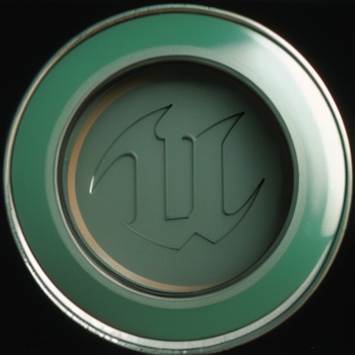

> The palest ink is better than the best memory

base 知识点，记录为主。

## Unreal Libraries

近期收藏的了一些 虚幻的代码开源库

- [Libraries Collection](../Tools/00.md)

## 专题笔记

#### Mass Entity
- [缓存行](./ECS/cacheline.md)
- [Mass Entity 基础](./ECS/Mass.md)
- [Mass Entity 中级](./ECS/Mass-Mid.md)
- [Mass Entity 高级](./ECS/Mass-Advanced.md)

#### PCG
- [PCG 节点](../PCG/04PCGNode.md)
- [PCG 基础](../PCG/00PCG_Base.md)
- [PCG 中级](../PCG/01PCG_Mid.md)
- [PCG 高级](../PCG/03PCG_Advanced.md)

## Code Snippet

- [blueprint Online](https://blueprintue.com/type/blueprint/) Blueprint Only
- [Code Snippet](https://dev.epicgames.com/community/unreal-engine/snippets) C++ and Blueprint

## Sites
- [《The Book of Shaders》](https://github.com/patriciogonzalezvivo/thebookofshaders) 
- [shader魔法卡片](https://github.com/patriciogonzalezvivo/PixelSpiritDeck) 
- [shader art](https://www.youtube.com/watch?v=f4s1h2YETNY)
- [shadertoy：找shader灵感](https://www.shadertoy.com/)
- [shadertoy 解读](https://zhuanlan.zhihu.com/p/542447481)
- [大钊虚幻整体架构解读：常去看看，加深理解](https://www.zhihu.com/column/insideue4)
- [UMG-Slate-Compendium](https://github.com/YawLighthouse/UMG-Slate-Compendium)
- [ue specifier 解读查漏补缺必备](https://github.com/fjz13/UnrealSpecifiers/)
- [GAS Document](https://github.com/tranek/GASDocumentatio)
- [slate UI 介绍](https://myslate.readthedocs.io/en/latest/index.html)

