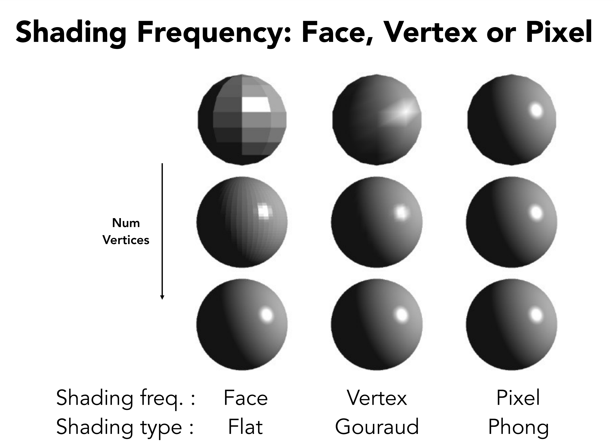
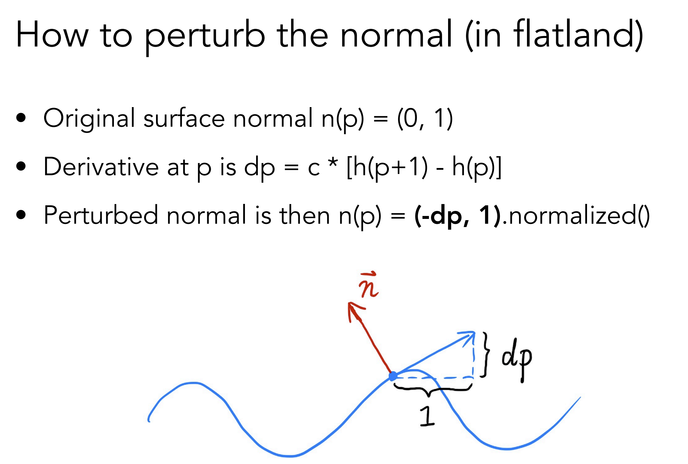
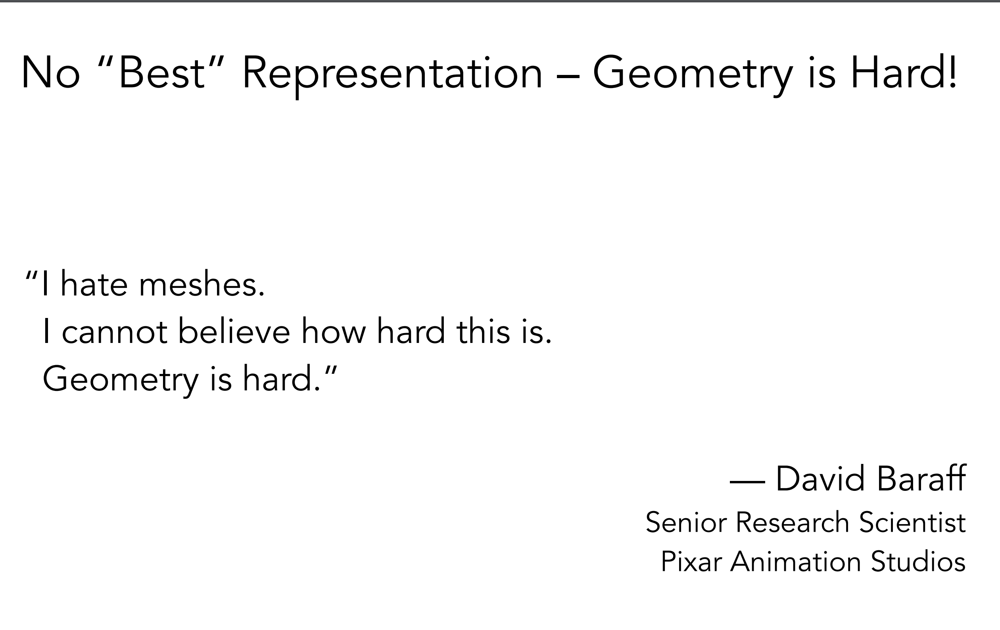
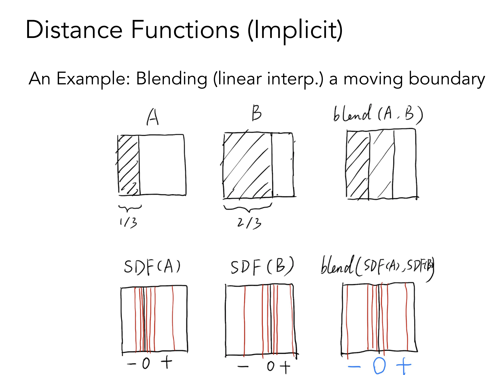
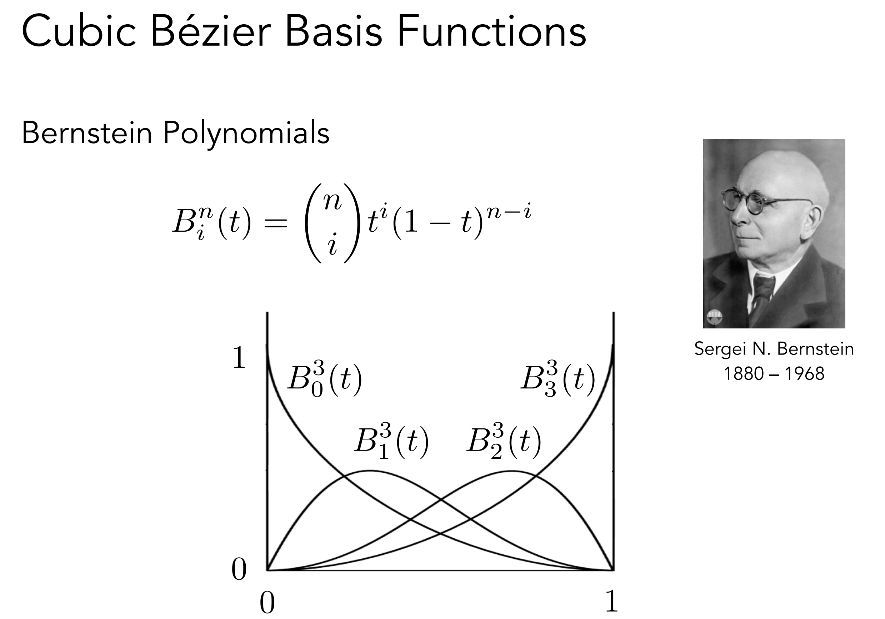
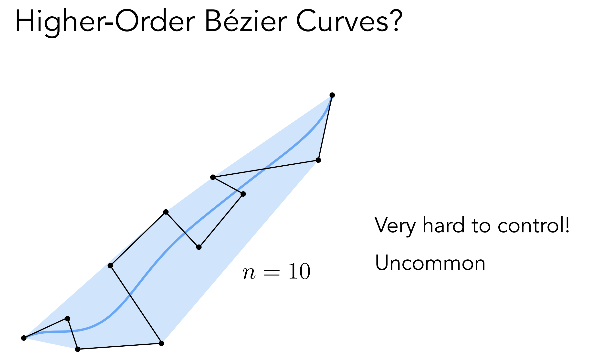

# 101 笔记

## Surface Shading (第十章开始)

https://sites.cs.ucsb.edu/~lingqi/teaching/resources/GAMES101_Lecture_07.pdf

### Z-buffer

{width=550px height=200px}

决定绘制的顺序

- Z-buffer 的思想来源于画家算法，用于处理不透明物体的遮挡问题
- Z-buffer 记录的是像素的深度，更近的会覆盖更远的，不存在排序，所以复杂度是 O(n)，本质只是记录最小（近）值
- Z-buffer 和绘制顺序无关

### Shading

着色的基本构成。

- Blinn-Phong Reflectance Model = Specular highlight（镜面高光）+ Diffuse reflection（漫反射）+ Ambient light（环境光）

- Shading 是模型自身的，是local的，不考虑影子这些不属于自身的！(shading ≠ shadow) 

- Lambertian Cosine Law 
  
- Lambertian reflection 模型认为漫反射和视角方向无关
  
- max(0,n·l) 是为了忽略负数
- I/r^2 能量守恒，辐射半径越远，球的表面积越大，根据面积公式可推理
  

- Blinn-Phong 模型中的高光计算源于Lambertian的模型。
- 高光使用半程向量计算，是为了简化计算量，是很聪明的方式
  
- 指数部分用于控制高光的锐利程度，通常取值范围在1-100之间，指数越高，即使较小的角度变化，过渡也越迅速
  

- Blinn-Phong Reflectance Model 结合了 Lambertian 模型，集大成者（h与视角有关）
    

- Shading 可以发生在 Vertex Shader（顶点着色器）和 Fragment Shader（片段着色器）:
   

### Shading Frequencies

着色频率，是指按面、顶点、像素。这里模型是纯色，所以这里的着色其实是指颜色的强度。

[https://sites.cs.ucsb.edu/~lingqi/teaching/resources/GAMES101_Lecture_08.pdf](https://sites.cs.ucsb.edu/~lingqi/teaching/resources/GAMES101_Lecture_08.pdf)

#### **1. Flat Shading**

Flat Shading（平面着色）是一种最简单的着色方法，给每个多边形（通常是三角形）分配一个统一的颜色(准确地说，是统一的光照强度乘以固有色，也就是diffuse)。

##### **特点：**
- **光照计算位置**：在每个多边形的一个点（通常是顶点或质心）进行光照计算。
- **插值方式**：不进行插值，整个多边形用相同的颜色。
- **效果**：
  - 每个多边形表现为一个独立的平面，边界明显，具有“低多边形”风格。
  - 表面看起来不够光滑，但计算速度快，适用于性能要求高的场景（如低分辨率的实时渲染）。
  
##### **优缺点：**

- **优点**：简单，计算量小，适合低细节的模型。
- **缺点**：效果生硬，难以表现曲面细节和平滑光照。

---

#### **2. Gouraud Shading**

Gouraud Shading（高洛德着色）是一种改进的着色方法，通过插值光照值来实现更平滑的效果。

##### **特点：**

- **光照计算位置**：在多边形的顶点处计算光照。
- **插值方式**：将顶点计算出的光照值（颜色）线性插值到整个多边形（如果高光附近存在多个顶点，就会出现多个高光）。
- **效果**：
  - 光滑过渡，避免了 Flat Shading 中的“硬边”效果。
  - 表现复杂曲面时有一定的能力，但高光区域可能会丢失细节（例如，可能高光只出现在顶点，而不会平滑扩展到中间区域）。

##### **优缺点：**

- **优点**：计算量适中，效果平滑，适合大多数实时渲染。
- **缺点**：无法很好表现高光等复杂光照细节。

#### **3. Phong Shading**

Phong Shading（冯氏着色）是一种更高级的着色方法，通过插值法线向量来计算像素级光照。

##### **特点：**

- **光照计算位置**：在每个像素（片段）计算光照。
- **插值方式**：先对顶点法线进行插值，再用插值后的法线计算每个像素的光照。
- **效果**：
  - 表面表现极为光滑，可以清晰地表现高光、阴影和其他复杂光照效果。
  - 是基于像素的光照计算方法，比 Gouraud Shading 更精确。

##### **优缺点：**

- **优点**：效果逼真，能精确表现高光、阴影和表面细节。
- **缺点**：计算量大，尤其在像素密度高的场景中。

需要注意的是，Phong Shading 是让上色的效果更加平滑，无法解决低模型边缘锯齿问题。解决这个问题是方法是基于法向插值的平滑着色(Smooth Shading)，后续会讲。

## 插值、高级纹理映射 

阅读材料：第 11 章（Texture Mapping）, 第 11.1、11.2 节

https://sites.cs.ucsb.edu/~lingqi/teaching/resources/GAMES101_Lecture_09.pdf

### 三角形的重心

 - 重心坐标系 不依赖世界坐标，它是针对三角形三个点的相对坐标。
 - 重心坐标系本质上是一种权重系统，定义了三角形顶点对任意三角形内部点的"贡献"。
 - 三角形的重心，相当于这个坐标系的"0点"，三个顶点的均值位置。
   

 - 利用重心坐标系，就可以进行对各种基于顶点的属性，进行顶点插值
     

### 纹理映射

- 纹理，认为纹素（texels）是纹理的最小单位， 之间的距离是1；256x256的纹理，就有256x256个纹素.
- 光栅化后，屏幕像素可能会被映射到纹素之间，总之肯定不会恰好对准到某个纹素的位置。
- 为了解决这个问题，需要在纹理和像素之间进行插值，就是纹理映射。
  
- Nearest:
  最近邻插值，取最接近的纹素的颜色，会导致明显的锯齿
- Bilinear:
  双线性插值，取最接近的两个纹素的颜色，可以避免锯齿，但是会导致边缘模糊。（做了3次插值） 
  
- Bicubic:
  双三次插值，取更多的纹素进行插值，效果更好，但是计算量更大。
  
### Texture Magnification

上述是纹理小，屏幕大的情况，连续的像素之间，可以利用纹素进行插值，来实现纹理的放大。
但是如果一个像素，覆盖了多个纹素，比如视角的远处，就会导致颜色错乱(Moire)。

- 可以通过超采样，来解决这个问题，但是计算量会更大，效果不明显。
- 假如一个像素覆盖了4个纹素，那么就用4个纹素的颜色平均值来代替。对非常远的物体，一个像素可能覆盖全部，比如256个，计算量会特别大。
- Mipmap被设计成预计算后存起来，仅增加1/3的显存占用。每层Mipmap的尺寸都是上一层的一半，直到最后一层，尺寸为1x1。。极限求和是1/3。
  
- 所以Mipmap是一种查询系统，查询用哪一层Mipping作为当前像素的均值。假如覆盖了2个纹素，这些纹素之间的距离是1，那就是用最外层，原始层，也就是第0层。
- 假如某个像素覆盖了很多纹素，这会在纹理上投影出一个大点P(覆盖了很多个纹素)，那么再取邻近像素的对应的纹素大点Q，（相邻可以是上下左右）获得两个点之间最大距离L，假如L是8,就代表信息量缩小了8倍，用log2(L) 就可以知道它要用第3层Mipmap来查询均值。
  
- 但还是会有锯齿问题，因为Log2(L) 的结果往往不是整数，这就需要 层与层之间进行插值。
- 这个插值叫做 Trilinear Interpolation(三线性插值) 或者 Trilinear filtering,能达成非常好的抗锯齿效果，但是计算量更大。
  

- 经过上面这些步骤，远处的位置，还是有模糊感，因为不同视角下，纹理缩小的方向是不同的，而Minimap的缩小方向是一致的，所以最终的结果就是模糊的。
   

- Anisotropic Filtering(各向异性过滤)可以部分解决这个问题。图中对角线就是普通的Mipmap. 特殊实现下还是有问题。
  

- EWA Filtering(Exponential Weighted Average过滤)是一种更好的方法，它可以在不同的方向上进行过滤，并且能够更好地平滑纹理。计算压力较大，暂时未讲原理。
   

## 几何 (基本表示方法)

https://sites.cs.ucsb.edu/~lingqi/teaching/resources/GAMES101_Lecture_10.pdf

### 环境光捕捉

- 环境光可以用 镜面球来捕捉，做成Spherical Environment Map
- 但Spherical Environment Map 被处理成为 方形后，上下边缘部分有严重的拉伸。
  
- 为了解决这个问题，需要用Cubemap来表示，就是在反射球套上一个正方体，这样就不会出现拉伸问题了。
    

### 法向贴图，置换贴图

**法向贴图可以在不增加实际几何的情况下，使用贴图来模拟更细节的表面法线，可以在低模基础上实现更平滑的光照效果，相比细分曲面，对性能影响较小**

- Bump Mapping，凹凸图，用高度来影响法向的计算。
- 法向计算：微分，获得向量，V(1,dp)的垂直变换就是 N(-dp,1)。3d同理。
  

- Displacement Mapping，纹理置换，修改顶点来影响模型的最终展示。好处是比Bump Mapping更加真实。
  
- Displacement Mapping 对高模的影响更加好。

- 还有 用于程序化计算的噪声图，预计算（烘焙）的环境光遮蔽图，3d体积渲染图。

### Geometry Representation

- 几何的表示，有显式和隐式的两种方式。
- 显式的表示，比如三角形，直接用三个顶点来表示。比如最常见的 Mesh。
- 隐式的表示，SDF，用一个函数来表示。
- 纹理映射，也是显示的表示，虽然看起来是函数，但值是预先记录在纹理里的，只是映射期间用了计算。（其实我觉得应该叫做半隐式的表示）
  

- 皮克斯高级研究人员，宣称很讨厌Meshs，它太难了。
    

- 布尔运算，是非常常见的隐式表示：
  

- SDF 对某些计算友好，比如混合（插值），还不占用磁盘空间，毕竟只是一个函数。图中对边界进行了插值。  
  

- Level Set, fractal (没有细说)
    
  

### wavefront OBJ 文件格式

OBJ是Wavefront科技开发的一种几何体图形文件格式。该格式最初是为动画工具Advanced Visualizer开发，现已开放，很多其它三维图形软件中都有使用。

-  v 是顶点，图里是正方体8个顶点
-  vt 是纹理坐标，顺序不能乱，后续面里会根据先后序号来引用。
-  vn 是法向量，图里是正方体，理论上应该是6个法向量，图里出现了8个是一种数据冗余。 
-  f 是面，由3点组成，每个点的格式：v1/vt1/vn1，没有纹理可以写成 v1//vn1
-  可知存在纹理时，每个顶点有映射在纹理里的平面坐标。然后通过三角坐标来采样三角形内每个像素的纹理。
-  更多未提及的格式参考 维基百科 [Wavefront OBJ](https://en.wikipedia.org/wiki/Wavefront_.obj_file)

### Bezier Curves

贝塞尔曲线

https://sites.cs.ucsb.edu/~lingqi/teaching/resources/GAMES101_Lecture_11.pdf

https://math.hws.edu/eck/cs424/notes2013/canvas/bezier.html

#### Curves

重点介绍了Bézier Curves，⻉塞尔曲线。最早基于de Casteljau Algorithm。各种贝塞尔曲线都 可以用 ** Bernstein Polynomials(伯恩斯坦多项式) ** 来表示，并推广到多维空间。

我的理解，de Casteljau Algorithm 是一种基于权重插值的算法。控制点代表曲线的权重（力），曲线上的每个点是所有控制点的加权平均。

- 三个控制点的例子（quadratic Bezier，二阶贝塞尔曲线）：
  

- 四个控制点的例子（cubic Bezier, 立方贝塞尔曲线））:
  

- quadratic Bezier 曲线的插值公式:
  
  - 有点像平方公式展开，令 1-t = x; (x + t)^2 = x^2 + 2xt + t^2 
  - t取任何值，基函数之和都是1, 所以这其实又回到了重心坐标（本质上是加权平均的一种几何扩展），基函数就是每个控制点的权重。
  - 所以，Bezier 曲线上的点都必然落在构成形状的顶点的凸包内。就像重心坐标系下，所有点都在三角形内一个道理。

- 用Bernstein Polynomials(伯恩斯坦多项式)表示Bezier曲线:
  
  - 基函数都是连续可导，所以Bezier函数 的加权平均也是连续可导的，结果必然是曲线。
  - 特殊值，t=0时和1时，分别是起始点和终点。此时求导，方向只和相邻的控制点有关，大小是阶数。

- Piecewise Bézier Curves（分段贝塞尔曲线）

  - 由于高阶贝塞尔曲线，比如n=10，由于每个点都贡献权重，牵一发而动全身
  - 分段贝塞尔曲线完美解决了这个问题
  - 对于分段立方贝塞尔曲线的连接处，如果切线法向在一个方向上，那么称为C0 Continuity(连续性)，大小也相同，称呼为C1连续。
    

- Spline Curves(样条曲线) 
  可控制的曲线，没细说。

- 贝塞尔曲面
  
  - 原理简化版：类比二次线性插值，任意t时，各个垂直方向的点作为该方向上的控制点。
     