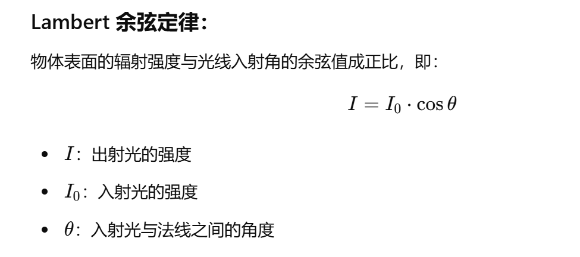
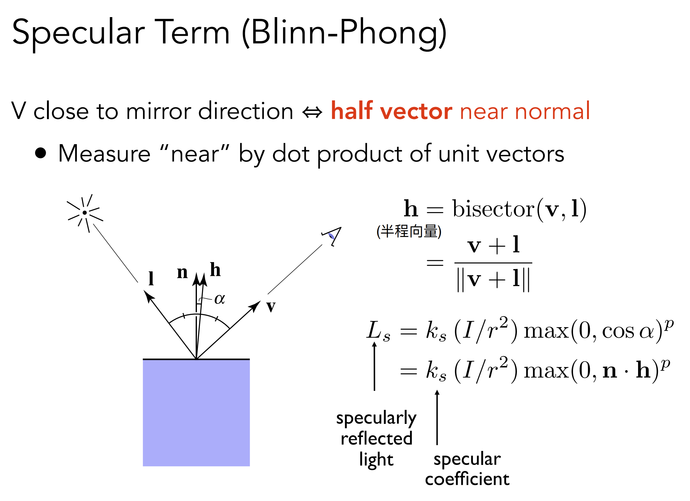
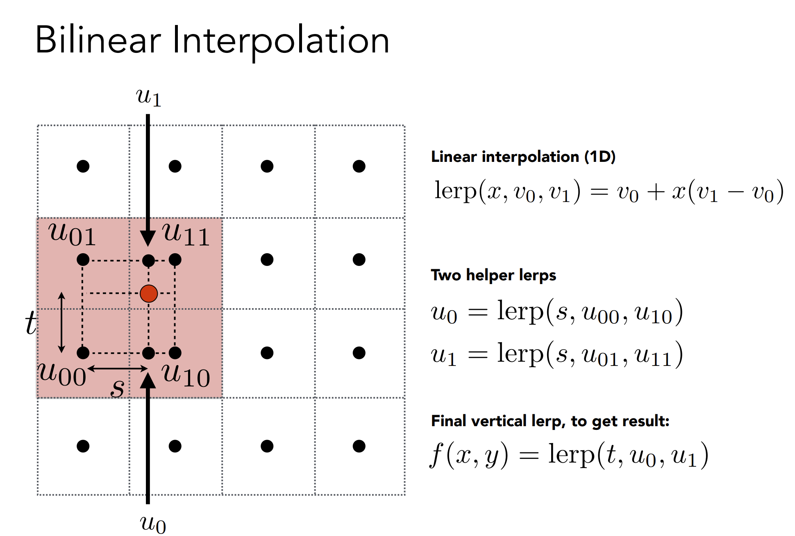
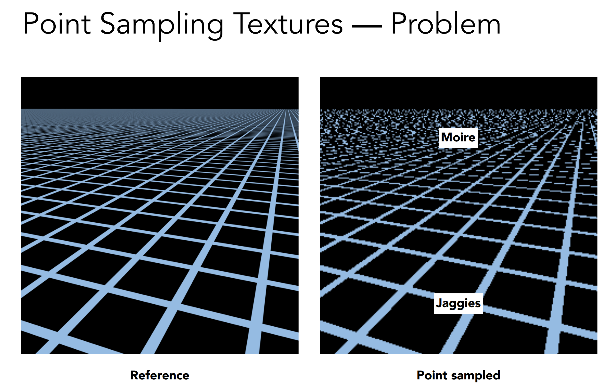
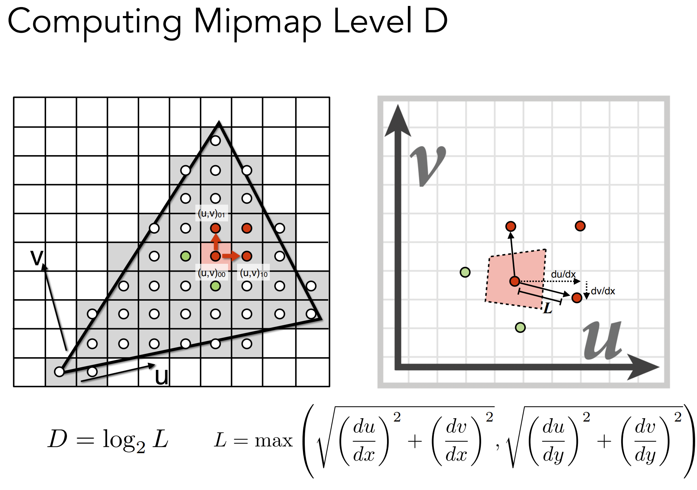
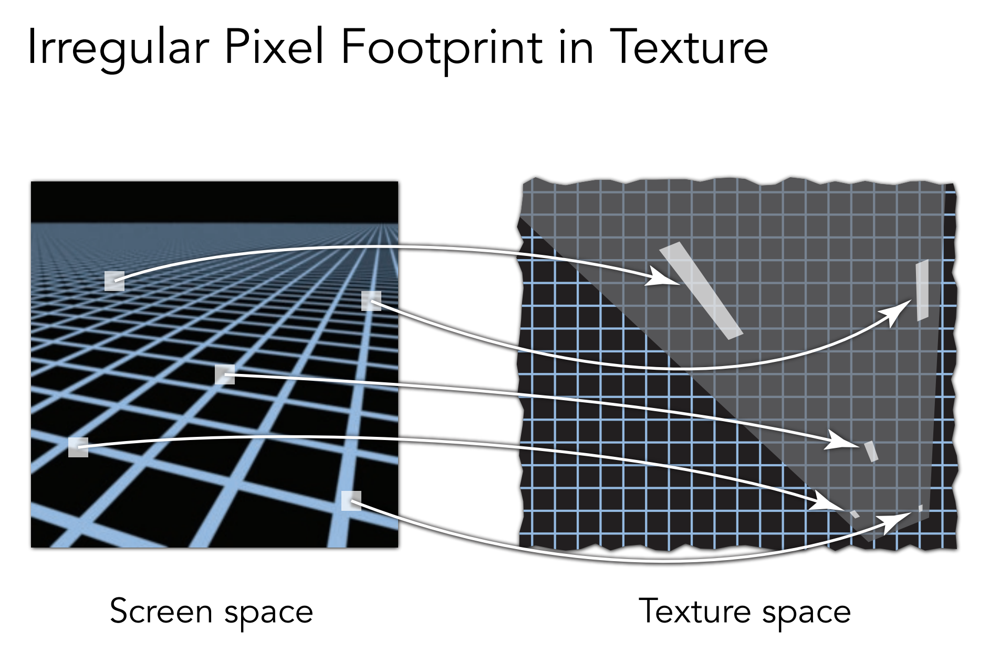

title: 101 notes
comments:false

101 笔记

# 第 10 章（Surface Shading）

https://sites.cs.ucsb.edu/~lingqi/teaching/resources/GAMES101_Lecture_07.pdf

### Z-buffer:

- Z-buffer 的思想来源于画家算法，用于处理不透明物体的遮挡问题
- Z-buffer 记录的是像素的深度，更近的会覆盖更远的，不存在排序，所以复杂度是 O(n)，本质只是记录最小（近）值
- Z-buffer 和绘制顺序无关

### Shading:

- Blinn-Phong Reflectance Model = Specular highlight（镜面高光）+ Diffuse reflection（漫反射）+ Ambient light（环境光）

- Shading 是模型自身的，是local的，不考虑影子这些不属于自身的！(shading ≠ shadow) 

- Lambertian Cosine Law 
  
- Lambertian reflection 模型认为漫反射和视角方向无关
  
- max(0,n·l) 是为了忽略负数
- I/r^2 能量守恒，辐射半径越远，球的表面积越大，根据面积公式可推理
  

- Blinn-Phong 模型中的高光计算源于Lambertian的模型。
- 高光使用半程向量计算，是为了简化计算量，是很聪明的方式
  
- 指数部分用于控制高光的锐利程度，通常取值范围在1-100之间，指数越高，即使较小的角度变化，过渡也越迅速
  

- Blinn-Phong Reflectance Model 结合了 Lambertian 模型，集大成者（h与视角有关）
    

- Shading 可以发生在 Vertex Shader（顶点着色器）和 Fragment Shader（片段着色器）:
   

## Shading Frequencies：

- Flat Shading 是最简单的，在 Vertex Shader 中完成，模型的面数越多，整体效果越精细
- Gouraud Shading 在 Flat Shading 的基础上增加了顶点插值，需要在 Fragment Shader 中进行插值计算，让过渡更平滑
- Phong Shading 在 Fragment Shader 中完成主要计算，由于是像素级，计算量较大

### **1. Flat Shading**
Flat Shading（平面着色）是一种最简单的着色方法，给每个多边形（通常是三角形）分配一个统一的颜色。
#### **特点：**
- **光照计算位置**：在每个多边形的一个点（通常是顶点或质心）进行光照计算。
- **插值方式**：不进行插值，整个多边形用相同的颜色。
- **效果**：
  - 每个多边形表现为一个独立的平面，边界明显，具有“低多边形”风格。
  - 表面看起来不够光滑，但计算速度快，适用于性能要求高的场景（如低分辨率的实时渲染）。
  
#### **优缺点：**
- **优点**：简单，计算量小，适合低细节的模型。
- **缺点**：效果生硬，难以表现曲面细节和平滑光照。

---

### **2. Gouraud Shading**
Gouraud Shading（高洛德着色）是一种改进的着色方法，通过插值光照值来实现更平滑的效果。
#### **特点：**
- **光照计算位置**：在多边形的顶点处计算光照。
- **插值方式**：将顶点计算出的光照值（颜色）线性插值到整个多边形。
- **效果**：
  - 光滑过渡，避免了 Flat Shading 中的“硬边”效果。
  - 表现复杂曲面时有一定的能力，但高光区域可能会丢失细节（例如，可能高光只出现在顶点，而不会平滑扩展到中间区域）。

#### **优缺点：**
- **优点**：计算量适中，效果平滑，适合大多数实时渲染。
- **缺点**：无法很好表现高光等复杂光照细节。

---

### **3. Phong Shading**
Phong Shading（冯氏着色）是一种更高级的着色方法，通过插值法线向量来计算像素级光照。
#### **特点：**
- **光照计算位置**：在每个像素（片段）计算光照。
- **插值方式**：先对顶点法线进行插值，再用插值后的法线计算每个像素的光照。
- **效果**：
  - 表面表现极为光滑，可以清晰地表现高光、阴影和其他复杂光照效果。
  - 是基于像素的光照计算方法，比 Gouraud Shading 更精确。

#### **优缺点：**
- **优点**：效果逼真，能精确表现高光、阴影和表面细节。
- **缺点**：计算量大，尤其在像素密度高的场景中。

---

### **对比总结**

| 特性                 | **Flat Shading**         | **Gouraud Shading**       | **Phong Shading**         |
|----------------------|--------------------------|---------------------------|---------------------------|
| **光照计算位置**     | 多边形的一个点          | 顶点                      | 每个像素                  |
| **插值方式**         | 无插值                  | 顶点颜色插值              | 法线插值                  |
| **效果**             | 表面分块，硬边明显      | 表面平滑，但高光可能缺失  | 表面极度平滑，光照逼真    |
| **计算量**           | 最低                    | 中等                      | 最高                      |
| **适用场景**         | 简单模型或性能优先      | 实时渲染，适用大多数场景  | 高质量图形渲染            |

---

### **应用场景**
- **Flat Shading**：适合低多边形风格、低端硬件或实时渲染需要时。
- **Gouraud Shading**：适合实时图形、游戏引擎的中低预算场景。
- **Phong Shading**：适合高品质渲染（如电影特效、静态场景渲染）或现代高性能 GPU 支持的场景。

# 着色（插值、高级纹理映射）  

阅读材料：第 11 章（Texture Mapping）, 第 11.1、11.2 节

 https://sites.cs.ucsb.edu/~lingqi/teaching/resources/GAMES101_Lecture_09.pdf

 ## 三角形的重心

 - 重心坐标系 不依赖世界坐标，它是针对三角形三个点的相对坐标。
 - 重心坐标系本质上是一种权重系统，定义了三角形顶点对任意三角形内部点的"贡献"。
 - 三角形的重心，相当于这个坐标系的"0点"，三个顶点的均值位置。
   

 - 利用重心坐标系，就可以进行对各种基于顶点的属性，进行顶点插值
     

## 纹理映射

- 纹理，认为纹素（texels）是纹理的最小单位， 之间的距离是1；256x256的纹理，就有256x256个纹素.
- 光栅化后，屏幕像素可能会被映射到纹素之间，总之肯定不会恰好对准到某个纹素的位置。
- 为了解决这个问题，需要在纹理和像素之间进行插值，就是纹理映射。
  
- Nearest:
  最近邻插值，取最接近的纹素的颜色，会导致明显的锯齿
- Bilinear:
  双线性插值，取最接近的两个纹素的颜色，可以避免锯齿，但是会导致边缘模糊。（做了3次插值） 
  
- Bicubic:
  双三次插值，取更多的纹素进行插值，效果更好，但是计算量更大。
  
## Texture Magnification

上述是纹理小，屏幕大的情况，连续的像素之间，可以利用纹素进行插值，来实现纹理的放大。
但是如果一个像素，覆盖了多个纹素，比如视角的远处，就会导致颜色错乱(Moire)。

- 可以通过超采样，来解决这个问题，但是计算量会更大，效果不明显。
- 假如一个像素覆盖了4个纹素，那么就用4个纹素的颜色平均值来代替。对非常远的物体，一个像素可能覆盖全部，比如256个，计算量会特别大。
- Mipmap被设计成预计算后存起来，仅增加1/3的显存占用。每层Mipmap的尺寸都是上一层的一半，直到最后一层，尺寸为1x1。。极限求和是1/3。
  
- 所以Mipmap是一种查询系统，查询用哪一层Mipping作为当前像素的均值。假如覆盖了2个纹素，这些纹素之间的距离是1，那就是用最外层，原始层，也就是第0层。
- 假如某个像素覆盖了很多纹素，这会在纹理上投影出一个大点P(覆盖了很多个纹素)，那么再取邻近像素的对应的纹素大点Q，（相邻可以是上下左右）获得两个点之间最大距离L，假如L是8,就代表信息量缩小了8倍，用log2(L) 就可以知道它要用第3层Mipmap来查询均值。
  
- 但还是会有锯齿问题，因为Log2(L) 的结果往往不是整数，这就需要 层与层之间进行插值。
- 这个插值叫做 Trilinear Interpolation(三线性插值) 或者 Trilinear filtering,能达成非常好的抗锯齿效果，但是计算量更大。
  

- 经过上面这些步骤，远处的位置，还是有模糊感，因为不同视角下，纹理缩小的方向是不同的，而Minimap的缩小方向是一致的，所以最终的结果就是模糊的。
   

- Anisotropic Filtering(各向异性过滤)可以部分解决这个问题。图中对角线就是普通的Mipmap. 特殊实现下还是有问题。
  

- EWA Filtering(Exponential Weighted Average过滤)是一种更好的方法，它可以在不同的方向上进行过滤，并且能够更好地平滑纹理。计算压力较大，暂时未讲原理。
    