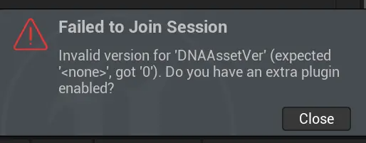
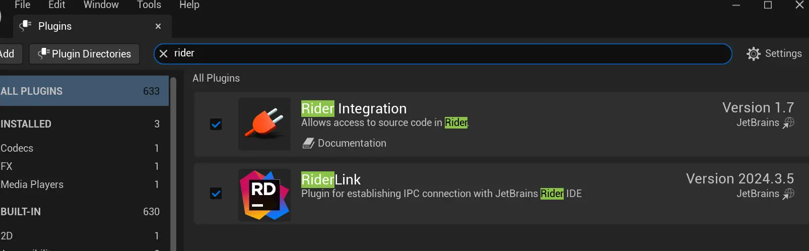
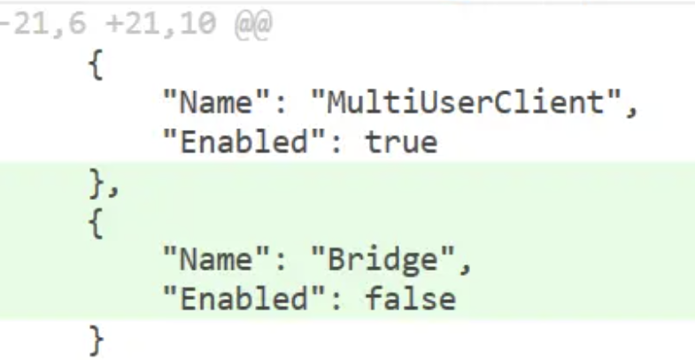
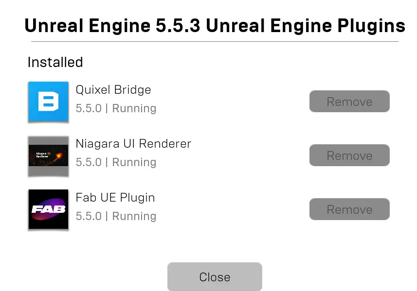

# 虚幻引擎编辑器各种bug操作记录

记录各种难缠的BUG以及解决过程


## Unable to use default cache graph

这是UE5.4之后的 新功能Zen Server导致的bug，有一定的触发概率，通常和电脑的代理程序冲突有关。 
```txt
0x00007ff95fa7b8a0 {UnrealEditor-DerivedDataCache.dll!DerivedData::Logging::Private::FStaticBasicLogRecord const `UE::DerivedData::FDerivedDataBackendGraph::FDerivedDataBackendGraph(void) __ptr64'[::E]::LOG_Static} {Format=0x00007ff95fa7b8c0þC þSL"Unable to use default cache graph '%s' because there are no %s nodes available.Add -DDC-ForceMemoryCache to the command line to bypass this if you need access to the editor settings to fix the cache configuration.", File=0x00007ff95fa7b5c0þC þS"C:\UnrealEngine\Engine\Source\Developer\DerivedDataCache\Private\DerivedDataBackends.cpp", Line=208, ...}
```

解决方法：
1. 重启代理
2. 重启UE
3. 如果还是不行，尝试手动启动\UnrealEngine\Engine\Binaries\Win64\zen.exe 
4. 还是不行，但又必须使用代理，尝试 -ddc=NoZenLocalFallback

```
UE_LOG(LogDerivedDataCache, Display,
					TEXT("%s: Readiness check failed. "
						"It will be deactivated until responsiveness improves. "
						"If this is consistent, consider disabling this cache store through "
						"the use of the '-ddc=NoZenLocalFallback' or '-ddc=InstalledNoZenLocalFallback' "
						"commandline arguments."),
					*GetName());
```

## MultiUserClient

文档： https://dev.epicgames.com/documentation/zh-cn/unreal-engine/multi-user-editing-overview-for-unreal-engine

使用建议：https://dev.epicgames.com/documentation/zh-cn/unreal-engine/getting-started-with-multi-user-editing-in-unreal-engine#6-%E5%85%B1%E5%90%8C%E5%B7%A5%E4%BD%9C

### BUG：多人协作工具无法加入Session

> `Invalid version for 'DNAAssetVer' (expected '<none>', got '0'). Do you have an extra plugin enabled?`

> --- UnrealEngine5.5.3

前几天和小伙伴尝试多人协作，首次使用UE就给了我们一个下马威，折腾了许久才解决，记录一下。

- 同一个项目，相同的UE版本，理论上plugin都是相同的，所以首先就排除掉了正确答案，开始对联机方式尝试怀疑。
- 由于使用了代理工具进行局域网联机，反复检查网络状态和相关配置，浪费了许多时间。
- 然后有同学他是通过rider启动，恍然大悟，是riderLink！Rider启动会和直接启动产生插件差异，fixed +1
  
- 但依然无法加入。继续找工具，在根源分析错误代码，发现错误源自于一个叫做“RigLogic”的插件，可是项目文件里明明没有设置启动这个插件，不同电脑之间居然有差异？尝试是UE里取消掉这个插件，生成的是这段代码：
  
- 恍然大悟，不同电脑UE之间，插件的版本是不同的。最新下载的版本（5.5.3）已经不默认配套Bridge插件了，默认是Fab，而手动升级UE的电脑，已经有这个插件。终于解决UE给我们的下马威！
  
  

## Blueprint

### 热加载后，actor component detail 界面空白
- reload该蓝图，尝试恢复。
- 已保存到硬盘的话，先复制一份备份。
- 然后随便重设一个父类，再改回来。
- 丢失的内容，去备份里一个一个找回来。

### 热加载后运行时蓝图出错不要接着改

- 即使改好了，容易保存到奇怪的东西，很难根除。
- 如果热加载后，蓝图出错或者运行时变量空，直接关闭编辑器重新编译运行是最佳选择。

## User Widget

### UI 蓝图不要直接重设父类
- 直接重设父类，会存在“野指针”，之前的控件变量会停留在变量栏里，占据位置。
- 如果保存（保存到硬盘）了，这些变量会一直无法删除。
- 同时也无法重命名，永久占用了这个名字。如果其他地方使用了这些变量，修改起来非常烦人。

 正确重设父类的步骤：
 
 - control-d 复制一份该UI蓝图备用
 - 进入要重设父类的UI蓝图，删除所有控件。
 - 此时，再重设父类
 - 去复制好的UI蓝图，把原来的控件粘贴到要重设父类的UI蓝图里。
 - 此时，就可以删除备用的UI蓝图了。

 已经存在“野指针”的解决方法：
 
 - 前提是有git备份, 没有git备份，就只能一步一步重写了。这里体现出做功能阶段性git commit的重要性。
 - 复制一份该蓝图，备用。
 - 在git里还原出错的蓝图，去编辑器点击reload 该蓝图，一切都会变回原来的版本。
 - 此时，删除全部控件，再执行
 - 在备份蓝图里，把新增的内容粘贴到该蓝图里。
 - 运行测试没保存的话，就保存到硬盘，建议立即对该文件进行git commit。


