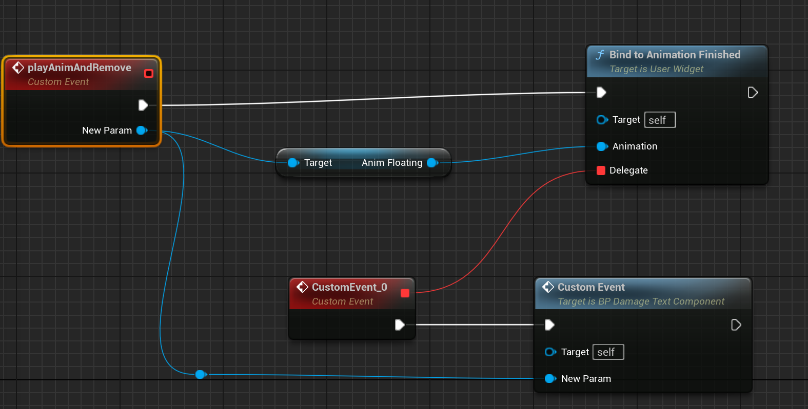

Title:  Blueprint Relevant
comments: true

不限于蓝图，C++也有。记录一下

## 蓝图陷阱

### Event的变量覆盖
当一个eventA 里面有延时节点的时候，要特别小心。如果延时节点要获取eventA 设置进来的参数，这个参数很可能被 多次调用的 eventA 覆盖，导致延时节点获得的值永远都是最新值。


多次调用时这里New Param 永远是最新值，旧的被覆盖，导致后续的节点获取的值出错。


这里也是错的，蓝图不是代码，没有像lambda那样 “捕获变量”，这里的New Param依旧会被新来的覆盖，对习惯代码的人来说非常反直觉。（这里还会导致多次bind的问题）


## Meta记录


### BlueprintInternalUseOnly
`meta = (BlueprintInternalUseOnly = "true")`
1. **防止直接创建蓝图节点**：`BlueprintInternalUseOnly` 标记防止引擎直接为这个函数创建蓝图节点，因为直接调用这个函数可能不会按预期工作。
2. **异步节点需求**：尽管函数需要被标记为 `BlueprintCallable` 以便被特殊的异步节点使用，但我们并不希望它被直接暴露给蓝图用户。这个标记告诉引擎跳过创建直接调用这个函数的蓝图节点。

### MustImplement
限制实现接口
``` cpp
UPROPERTY(EditAnywhere, Category = EntryLayout, meta=(MustImplement = "/Script/CommonUI.CommonBoundActionButtonInterface"))
	TSubclassOf<UCommonButtonBase> ActionButtonClass;

```
### DefaultToSelf
把self 设置为当前调用者
``` cpp
	UFUNCTION(BlueprintCallable, Category = "Ability|Tasks", meta = (DefaultToSelf = "TargetActor", BlueprintInternalUseOnly = "TRUE"))
	static UAbilityAsync_WaitAttributeChanged* WaitForAttributeChanged(AActor* TargetActor, FGameplayAttribute Attribute, bool OnlyTriggerOnce = false)

```
### EditCondition

可以用来隐藏feature，支持的时候，才显示。可以是上下文相关
```cpp
	/** 
	 *	The enhanced input action that is bound to this button. The common input manager will trigger this button to 
	 *	click if the action was pressed 
	 */
	UPROPERTY(EditAnywhere, BlueprintReadOnly, Category = Input, meta = (EditCondition = "CommonInput.CommonInputSettings.IsEnhancedInputSupportEnabled", EditConditionHides))
	TObjectPtr<UInputAction> TriggeringEnhancedInputAction;

    /** Press and Hold values used for Keyboard and Mouse, Gamepad and Touch, depending on the current input type */
	UPROPERTY(EditAnywhere, BlueprintReadOnly, Category = "Input|Hold", meta = (EditCondition="bRequiresHold", ExposeOnSpawn = true))
	TSubclassOf<UCommonUIHoldData> HoldData;
```

### Camp
限制数值, 其中UIMin UIMax 只是显示效果，不影响实际代码
``` cpp
	UPROPERTY(EditAnywhere, config, Category = "VisualLogger", meta = (ClampMin = "10", ClampMax = "1000", UIMin = "10", UIMax = "1000"))
	float DefaultCameraDistance;

```


## 属性标记（注解）

0. **`Transient`**
    - Transient是一个属性标记，用于指示特定变量不应被序列化或者保存到磁盘上。这意味着当你标记一个变量为Transient时，它的值不会在游戏保存时被保留，也不会在编辑器关闭和重新打开后被恢复。这个标记通常用于运行时的临时数据。
        ```cpp
        UPROPERTY(Transient)
        TObjectPtr<UMaterialInstanceDynamic> ProgressDynamicMaterial;
        ```

1. **`NonPIEDuplicateTransient`**：
   - 这个标记用于指示属性在非PIE（Play In Editor）场景中不应被复制。通常用于避免在编辑器模式下不必要的数据复制。
   
     ```cpp
     UPROPERTY(NonPIEDuplicateTransient)
     TObjectPtr<UMaterialInstanceDynamic> MyMaterial;
     ```

2. **`DuplicateTransient`**：
   - 属性在对象被复制时不会被复制。通常用于指示运行时的临时数据。
   
     ```cpp
     UPROPERTY(DuplicateTransient)
     TObjectPtr<UTexture> RuntimeTexture;
     ```

3. **`TextExportTransient`**：
   - 属性在文本导出过程中不会被导出。通常用于数据不需要在文本格式中保存的场景。
   
     ```cpp
     UPROPERTY(TextExportTransient)
     int32 TemporaryData;
     ```

4. **`SkipSerialization`**：
   - 完全跳过序列化过程，属性不会被序列化或反序列化。
   
     ```cpp
     UPROPERTY(SkipSerialization)
     FString SecretData;
     ```

5. **`AssetRegistrySearchable`**：
   - 属性会被添加到资产注册表中，允许通过资产注册表进行搜索。通常用于需要在内容浏览器中快速找到特定资产的场景。
   
     ```cpp
     UPROPERTY(AssetRegistrySearchable)
     FString AssetTag;
     ```