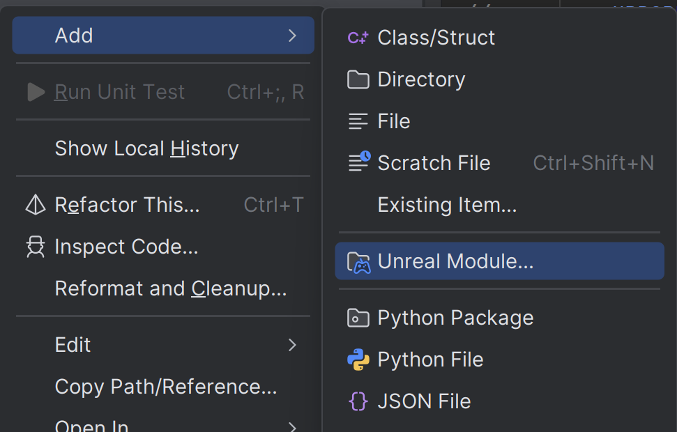

# Rider 使用笔记

### 调试技巧

断点判断当前进程是服务端还是客户端,不依赖UELog：

```sh
{,,UE4Editor-Engine.dll}::GPlayInEditorContextString
{,,UnrealEditor-Engine.dll}::GPlayInEditorContextString 
```


- 把`{,,UnrealEditor-Engine.dll}::GPlayInEditorContextString `添加到rider watch即可,以后每次能用。

- UE4用这个 `{,,UE4Editor-Engine.dll}::GPlayInEditorContextString`


### 调试 UCommandlet 命令行程序

- 命令配置： `-run=MyCommandlet`
- 等待调试: `-waitforattach`  
- [详细参考](../Debug.md)


### Rider plugin创建Module



右键源码目录，可以看到可以创建的Module。但是，对于Plugin的source目录，缺无法创建Module，需要手动创建。

也就是，如果plugin也想要实现多个Module，Rider并不支持，需要手动创建。


#### 手动创建Module注意事项

- **实现ModuleInterface,它是F开头的C++类**
  ```cpp
  class FMyModule : public IModuleInterface
  {
  public:
      virtual void StartupModule() override
      {
          // ...
      }
      virtual void ShutdownModule() override
      {
          // ...
      }
  };
  ```

- **如果是空实现，甚至不需要头文件，直接在cpp中实现**
  ```cpp
   #include "Modules/ModuleManager.h"
   IMPLEMENT_MODULE(FDefaultModuleImpl, YourModuleName);
  ```
- **暴露的API名字，要和Module的名字一致，不然会有`inconsistent dll linkage`错误**   
  ```cpp
  USTRUCT(BlueprintType)
  struct YourModuleName_API YourStruct
  {
      GENERATED_BODY()
  };
  ```  

::: tip
引擎的模块注册机制，知道哪个类实现了IModuleInterface，就会调用它的StartupModule和ShutdownModule方法。

IModuleInterface 是接口，所以简单module不需要头文件，可以直接在cpp中实现
:::


#### 依赖注意事项

创建模块的.cs文件的，要明确 public和private的依赖关系。

public会传递依赖给其他模块(自动依赖)，导致编译时间变长。

- **PublicDependencyModuleNames**
  - 当你的公共头文件（Public 文件夹下的 .h 文件）中包含了其他模块的头文件时
  - 当你的公共类/接口中使用了其他模块的类型时
  - 简单说：如果其他模块要使用你的模块，他们也需要这个依赖

- **PrivateDependencyModuleNames**
  - 当依赖只在实现文件（.cpp）或私有头文件（Private 文件夹）中使用
  - 当依赖只用于内部实现，不会暴露给其他模块
  - 简单说：其他模块使用你的模块时不需要知道这个依赖  

- **给Blueprint调用的Module 可以不需要依赖**
  - 不需要在游戏模块中依赖蓝图相关的模块，蓝图可以直接调用这些方法
  - 蓝图是函数方法，是UHT通过反射生成的
  - 除非你在C++里用到他们
