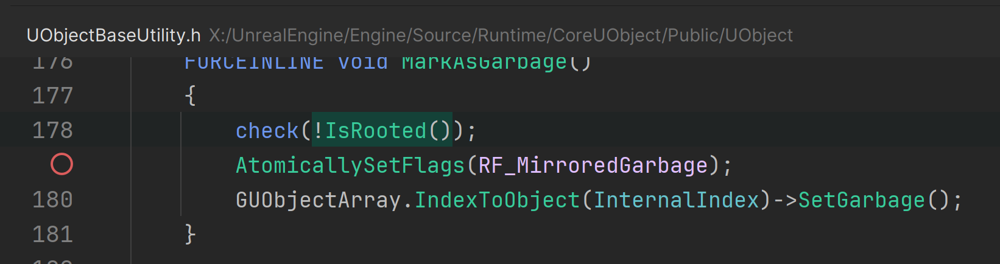
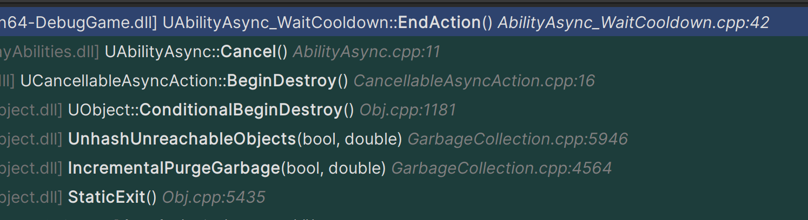
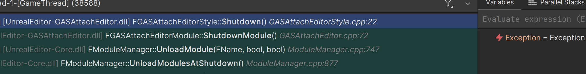

title: Rider调试记录
comments:true

如何调试UCommandlet命令行程序

---

## 起因

使用多语言支持工具的过程中，一直触发一个错误，但log非常简陋，无法定位到问题所在。

```sh
[2024.08.17-19.05.06:646][  0]LogGatherTextCommandlet: Display: Completed GatherTextStep3: GenerateTextLocalizationReportCommandlet in 0.00 seconds
[2024.08.17-19.05.06:647][  0]LogGatherTextCommandlet: Display: Completed all steps in 2.29 seconds
[2024.08.17-19.05.06:647][  0]LogGatherTextCommandlet: Display: GatherText completed with exit code 0
[2024.08.17-19.05.06:647][  0]LogInit: Display: Finished.
[2024.08.17-19.05.06:647][  0]LogInit: Display: 

Execution of commandlet took:  2.29 seconds
[2024.08.17-19.05.06:818][  0]LogOutputDevice: Warning: 

Script Stack (0 frames) :

[2024.08.17-19.05.06:823][  0]LogWindows: Error: appError called: Assertion failed: !IsRooted() [File:X:\UnrealEngine\Engine\Source\Runtime\CoreUObject\Public\UObject\UObjectBaseUtility.h] [Line: 178] 
```

大致如上，只说了!IsRooted() 这个方法报错，并没有说在哪里。

## 分析

全局搜索相关信息，发现两个线索：

- 报错发生在UObject的MakrASGarbage() 
  

- 以上log出自于GatherTextCommandlet 这样的命令行小程序
  

但无法调试MakrASGarbage，因为 多语言工具的GatherTextCommandlet 是一个独立进程，无法在Rider当前attach的编辑器里打断点。


直接修改源码加入log也不妥，这个方法是Uobject的，几乎会导致整个编辑器重新编译，（2700个文件重新编译）。不如找个方法直接打断点

搜索UCommandlet如何调试，发现了这个：[https://youtrack.jetbrains.com/issue/RIDER-89943](https://youtrack.jetbrains.com/issue/RIDER-89943)

大致就是Rider目前还没有快捷调试UCommandlet的功能，但还是可以通过附加 -waitforattach 来调试。

## 开始解决

先找到这个Commandlet 的使用说明：
```js
const FString UGatherTextCommandlet::UsageText
	(
	TEXT("GatherTextCommandlet usage...\r\n")
	TEXT("    <GameName> GatherTextCommandlet -Config=<path to config ini file> [-Preview -EnableSCC -DisableSCCSubmit -GatherType=<All | Source | Asset | Metadata>]\r\n")
	TEXT("    \r\n")
	TEXT("    <path to config ini file> Full path to the .ini config file that defines what gather steps the commandlet will run.\r\n")
	TEXT("    Preview\t Runs the commandlet and its child commandlets in preview. Some commandlets will not be executed in preview mode. Use this to dump all generated warnings without writing any files. Using this switch implies -DisableSCCSubmit\r\n")
	TEXT("    EnableSCC\t Enables revision control and allows the commandlet to check out files for editing.\r\n")
	TEXT("    DisableSCCSubmit\t Prevents the commandlet from submitting checked out files in revision control that have been edited.\r\n")
	TEXT("    GatherType\t Only performs a gather on the specified type of file (currently only works in preview mode). Source only runs commandlets that gather source files. Asset only runs commandlets that gather asset files. All runs commandlets that gather both source and asset files. Leaving this param out implies a gather type of All.")
	TEXT("Metadata only runs commandlets that gather metadata files. All runs commandlets that gather both source and asset files. Leaving this param out implies a gather type of All.\r\n")
	);
```  

多年的Android开发经验告诉我，可以在rider的Run configuration里增加一个配置:

把上面使用说明的命令行参数填进去。

打好断点，运行。
成功跳转到了报错的地方：

理论上，这里不可能在命令行模式得到执行，但实际上它执行了，我怀疑是CDO的自动销毁。
  

为了跳过这个错误，一种解决办法：

```cpp
if (!IsRooted())
    {
        MarkAsGarbage();
    }
```    

基本上，这样能解决。

## 还有高手

Assertion failed: IsValid()

解决了上面IsRooted()的问题，依然有别的错误，还好这题我会，之前遇到过。 


这是因为很多第三方插件没有判断 当前是否是命令行模式，只要是命令行模式里设计到UI相关的操作，一定会报错。

解决办法：找到所有涉及UI的插件，在载入和卸载时判断一下，如果是命令行模式，则不载入，也不卸载。

```cpp
void FGASAttachEditorModule::StartupModule()
{
	if (IsRunningCommandlet())
	{
		// 在命令行模式下，不生成菜单和SlateUI
		return;
	}
//

void FGASAttachEditorModule::ShutdownModule()
{
	if (IsRunningCommandlet())
	{
        //直接返回
		return;
	}

```

重新编译


终于正常了

