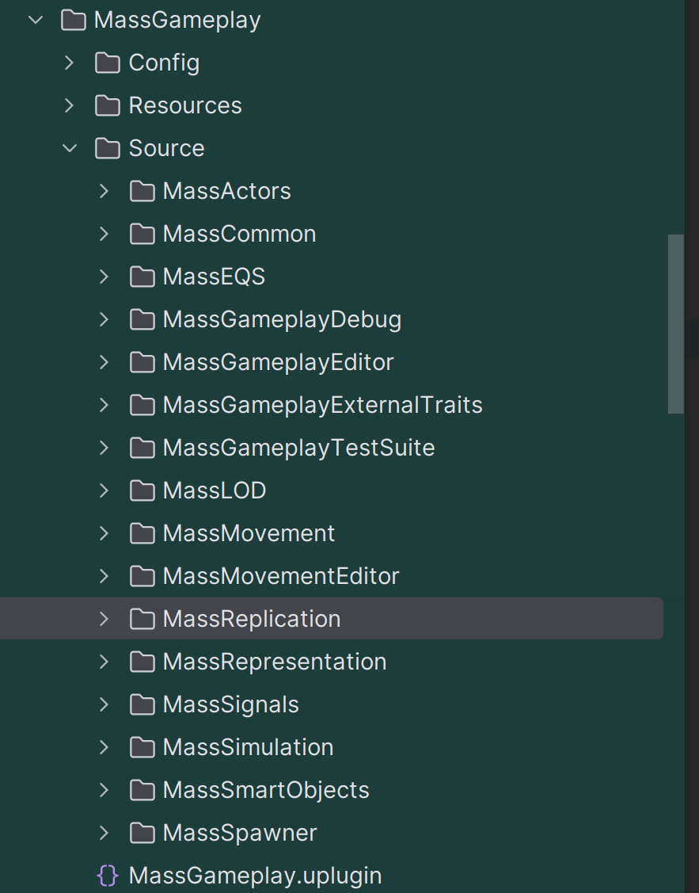

 # MassEntity 高级篇
 {width=320px}

（并非有多高级，主要是涉及实际应用场景，模块代码众多，如 MassGamePlay 的使用）

## MassGamePlay

路径：`UnrealEngine\Engine\Plugins\Runtime\MassGameplay`

| 模块名 | 描述 |
|--------|------|
| MassCommon | 基础片段，如`FTransformFragment` |
| MassMovement | 包含重要的`UMassApplyMovementProcessor`处理器，基于实体的速度和力进行移动 |
| MassRepresentation | 用于在世界中渲染实体的处理器和片段。通常使用ISMC进行渲染，也可以在用户指定的距离将实体替换为完整的Unreal actors |
| MassSpawner | 高度可配置的actor类型，可以在指定位置生成特定实体。内置两种选择位置的方式：一种使用Environmental Query System资产，另一种使用基于标签的ZoneGraph查询。Mass Spawner actor似乎主要用于一次性初始生成的对象，如NPC、树木等，而不是动态生成的对象（如投射物） |
| MassActors | UE5 actor框架和Mass之间的桥梁。一种将实体转换为"Agents"的片段类型，可以在两个方向（或双向）交换数据 |
| MassLOD | LOD处理器，可以管理不同类型的细节级别，从渲染到基于片段设置的不同速率的tick。目前用于可视化和复制 |
| MassReplication | Mass的复制支持！其他模块通过重写`UMassReplicatorBase`来复制内容。实体被赋予一个单独的Network ID用于网络传输，而不是EntityHandle |
| MassSignals | 允许实体之间发送命名信号的系统 |
| MassSmartObjects | 让实体可以"声明"SmartObjects以与之交互 |

### Traits

MassGameplay中，最重要的概念就是`Traits`

## Mass AI

一些系列AI功能的总称

（Mass AI和 Mass Crowd是两个模块， Mass Crowd 内部引入了 Mass AI 和 ）

| 插件名 | 描述 | 路径 |
|--------|------|------|
| ZoneGraph | 使用配置定义的车道来引导zonegraph路径的关卡内样条线和形状！主要用于Mass Crowd成员的移动，如人行道、道路等 |\UnrealEngine\Engine\Plugins\Runtime\ZoneGraph|
| StateTree | 一个可以与Mass配合使用的新型轻量级通用状态机。其中之一用于在示例中为锥形物体提供移动目标 |\UnrealEngine\Engine\Plugins\Runtime\StateTree|
| MassAI | 给Mass Entity 提供一系列 AI 功能 |UnrealEngine\Engine\Plugins\AI\MassAI|
| MassCrowd | 集大成者，包含了上面全部插件 |\UnrealEngine\Engine\Plugins\AI\MassCrowd|