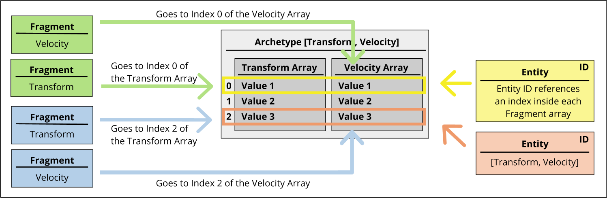
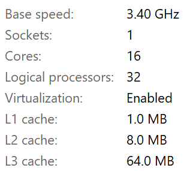
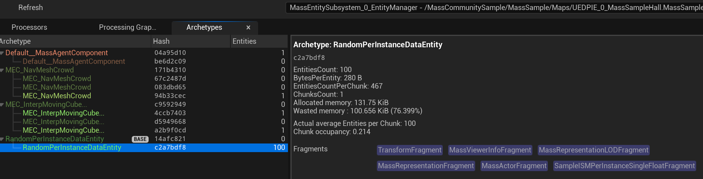
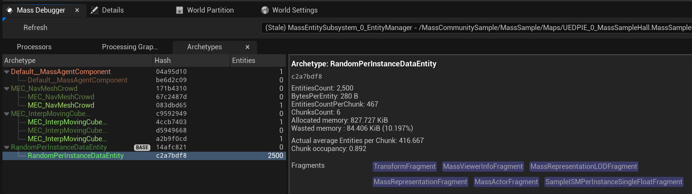
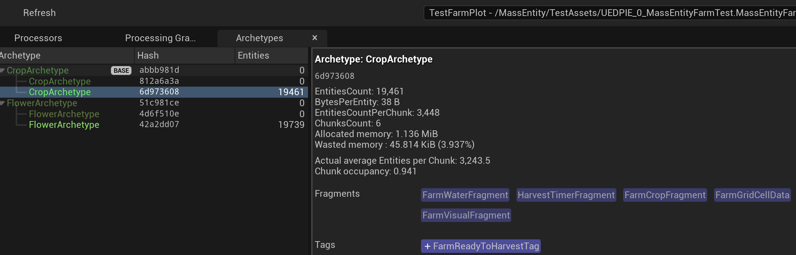
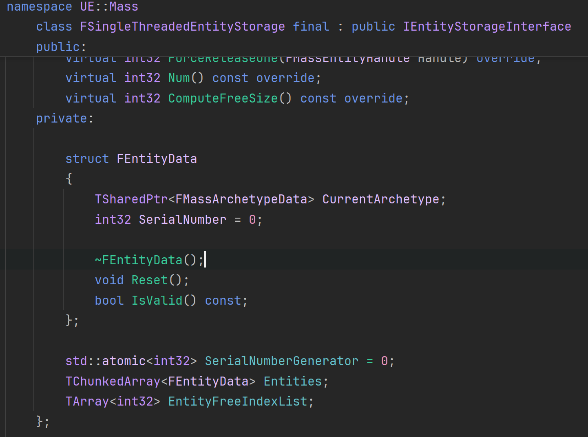

# MassEntity 中级篇

中级篇主要是对常用概念的梳理，细节使用等

## 常用概念

### Subsystem

#### 1. Subsystem 并行描述

**Subsystem需要告知Mass系统，它的并发特性。**

使用结构体模板TMassExternalSubsystemTraits来“特化” UMyWorldSubsystem：
```cpp
template<>
struct TMassExternalSubsystemTraits<UMyWorldSubsystem> final
{
    enum
    {
        ThreadSafeRead = true,  // 是否支持多线程读取
        ThreadSafeWrite = false, // 是否支持多线程写入
    };
};

```

因为在Mass中，Processors通常是并行执行的（利用多线程）。为了确保数据安全和避免竞争条件，Mass需要知道每个Processor会如何访问Subsystems（子系统）
- 让Mass系统知道该Subsystem可以在哪些线程上访问
- 帮助Mass系统计算处理器(Processor)和查询(Query)的依赖关系

完整例子：
```cpp
// 一个支持并行读取但不支持并行写入的Subsystem
class UMyWorldSubsystem : public UWorldSubsystem 
{
public:
    void Write(int32 InNumber)  // 写操作需要互斥访问
    {
        UE_MT_SCOPED_WRITE_ACCESS(AccessDetector);
        Number = InNumber;
    }

    int32 Read() const  // 读操作可以并行
    {
        UE_MT_SCOPED_READ_ACCESS(AccessDetector);
        return Number;
    }
};

// 为该Subsystem定义traits
template<>
struct TMassExternalSubsystemTraits<UMyWorldSubsystem> final
{
    enum
    {
        ThreadSafeRead = true,   // 允许并行读取
        ThreadSafeWrite = false, // 不允许并行写入
    };
};

```
:::details AccessDetector 宏
源码里提供很多AccessDetector宏，用来描述访问的互斥性。需要慢慢研究：
```cpp
#define UE_MT_DECLARE_RW_ACCESS_DETECTOR(AccessDetector) FRWAccessDetector AccessDetector;
#define UE_MT_DECLARE_RW_RECURSIVE_ACCESS_DETECTOR(AccessDetector) FRWRecursiveAccessDetector AccessDetector;
#define UE_MT_DECLARE_RW_FULLY_RECURSIVE_ACCESS_DETECTOR(AccessDetector) FRWFullyRecursiveAccessDetector AccessDetector;
#define UE_MT_DECLARE_MRSW_RECURSIVE_ACCESS_DETECTOR(AccessDetector) FMRSWRecursiveAccessDetector AccessDetector;

#define UE_MT_SCOPED_READ_ACCESS(AccessDetector) const FBaseScopedAccessDetector& PREPROCESSOR_JOIN(ScopedMTAccessDetector_,__LINE__) = MakeScopedReaderAccessDetector(AccessDetector);
#define UE_MT_SCOPED_WRITE_ACCESS(AccessDetector) const FBaseScopedAccessDetector& PREPROCESSOR_JOIN(ScopedMTAccessDetector_,__LINE__) = MakeScopedWriterAccessDetector(AccessDetector);

#define UE_MT_ACQUIRE_READ_ACCESS(AccessDetector) (AccessDetector).AcquireReadAccess();
#define UE_MT_RELEASE_READ_ACCESS(AccessDetector) (AccessDetector).ReleaseReadAccess();
#define UE_MT_ACQUIRE_WRITE_ACCESS(AccessDetector) (AccessDetector).AcquireWriteAccess();
#define UE_MT_RELEASE_WRITE_ACCESS(AccessDetector) (AccessDetector).ReleaseWriteAccess();

```
:::

:::tip 模板元编程
这种利用Traits来描述能力的写法，并非Mass特有。

UE内部有非常多类似的用法，如：
```cpp
template<>
struct TStructOpsTypeTraits<FHitResult> : public TStructOpsTypeTraitsBase2<FHitResult>
{
	enum
	{
		WithNetSerializer = true,
	};
};

```

另外，奇异递归模板也属于 元编程。详见 [奇异递归模板](../C++/CRTP.md)
:::

#### 2. Processors中Query自定义UWorldSubsystem

从UE 5.1开始，Mass增强了API，允许你在Processors中直接使用UWorldSubsystem。这提供了一种创建封装功能的强大方式，可以用来操作实体（Entities）或其他游戏逻辑。

简单地说，就是Query里允许查询相关的Subsystem，然后在Executor中使用Subsystem， 如修改 Subsystem中的变量。


```cpp
// MyProcessor.cpp
#include "MyProcessor.h"
#include "MyWorldSubsystem.h" // 包含你的Subsystem的头文件

UMyProcessor::UMyProcessor()
{
	bAutoRegisterWithProcessingPhases = true;
	ExecutionFlags = (int32)(EProcessorExecutionFlags::All);
    ProcessingPhase = EMassProcessingPhase::PrePhysics;
}

void UMyProcessor::ConfigureQueries()
{
	// 添加Subsystem要求
	MyEntityQuery.AddSubsystemRequirement<UMyWorldSubsystem>(EMassFragmentAccess::ReadWrite);
	MyEntityQuery.RegisterWithProcessor(*this);
    //ProcessorRequirements也需要添加
    ProcessorRequirements.AddSubsystemRequirement<UMyWorldSubsystem>(EMassFragmentAccess::ReadWrite);
}

void UMyProcessor::Execute(FMassEntityManager& EntityManager, FMassExecutionContext& Context)
{
    // UWorld* World = EntityManager.GetWorld(); //在lambda外获取world
	MyEntityQuery.ForEachEntityChunk(EntityManager, Context, [/*World*/](FMassExecutionContext& Context)
	{
		// 获取你的Subsystem
        // 在lambda里面, 使用Context.GetMutableSubsystemChecked, 无需传入World
		UMyWorldSubsystem* MySubsystem = Context.GetMutableSubsystemChecked<UMyWorldSubsystem>();

		// 使用你的Subsystem
		MySubsystem->Write(42);
		int32 Value = MySubsystem->Read();

		// ... 其他逻辑 ...
	});
}

```

注意：ProcessorRequirements也需要添加Subsystem, 否则会报错


### Fragment

Fragment在Mass Entity中是数据的基本单位，它们通过Deferred Command被组织到不同的Chunk中。以下是一个典型的Fragment示例：

```cpp
// 这是一个成员比较多的Fragment
USTRUCT(BlueprintType)
struct MASSCOMMUNITYSAMPLE_API FInterpLocationFragment : public FMassFragment
{
	GENERATED_BODY()

	UPROPERTY(EditAnywhere)
	FVector TargetLocation = FVector::ZeroVector; // Target location for interpolation

	UPROPERTY(EditAnywhere)
	FVector StartingLocation = FVector::ZeroVector; // Starting location for interpolation

	UPROPERTY(EditAnywhere)
	float Duration = 1.0f; // Duration of the interpolation

	bool bForwardDirection = true; // Flag to indicate the direction of interpolation

	float Time = 0.0f; // Current time of the interpolation
};
```

#### Fragment的组织方式

1. **基于Chunk的数据组织**
   - Fragment不是简单地组合，而是通过Deferred Command被分类并放入不同的Chunk中
   - 同类型的Fragment会被放在连续的内存块（Chunk）中，这样可以提高缓存命中率
   - Chunk的大小是固定的，这有助于内存管理和性能优化

2. **热数据处理**
   - 对于频繁一起访问的数据，建议放在同一个Fragment中
   - 这种方式可以减少Chunk之间的跨块访问，提高性能
   - 实际上是在"数据分离"和"访问局部性"之间找平衡

3. **Fragment的设计原则**
   - 根据数据的访问模式来设计Fragment
   - 高频交互的数据应该放在一起
   - 通过Deferred Command来管理Fragment的生命周期和组织方式

#### 使用示例

首先，放个Mass Sample的一个案例：
```cpp
// 这是一个成员比较多的Fragment
USTRUCT(BlueprintType)
struct MASSCOMMUNITYSAMPLE_API FInterpLocationFragment : public FMassFragment
{
	GENERATED_BODY()

	UPROPERTY(EditAnywhere)
	FVector TargetLocation = FVector::ZeroVector; // Target location for interpolation

	UPROPERTY(EditAnywhere)
	FVector StartingLocation = FVector::ZeroVector; // Starting location for interpolation

	UPROPERTY(EditAnywhere)
	float Duration = 1.0f; // Duration of the interpolation

	bool bForwardDirection = true; // Flag to indicate the direction of interpolation

	float Time = 0.0f; // Current time of the interpolation
};
// MovementProcessor执行

void UMSInterpMovementProcessor::Execute(FMassEntityManager& EntityManager, FMassExecutionContext& Context)
{
	EntityQuery.ForEachEntityChunk(EntityManager, Context, [&,this](FMassExecutionContext& Context)
	{
		const int32 QueryLength = Context.GetNumEntities();

		// Get mutable views of the required fragments.
		TArrayView<FInterpLocationFragment> InterpLocations = Context.GetMutableFragmentView<FInterpLocationFragment>();
		TArrayView<FTransformFragment> Transforms = Context.GetMutableFragmentView<FTransformFragment>();
		TConstArrayView<FOriginalTransformFragment> OriginalTransforms = Context.GetFragmentView<FOriginalTransformFragment>();

		for (int32 i = 0; i < QueryLength; ++i)
		{
			FInterpLocationFragment& InterpFragment = InterpLocations[i];
			FTransform& Transform = Transforms[i].GetMutableTransform();

			const float DeltaTime = Context.GetDeltaTimeSeconds();
			// Update interpolation time
			InterpFragment.Time = InterpFragment.Time+(DeltaTime/InterpFragment.Duration);
			
			// reverse direction and swap
			if (InterpFragment.Time > 1.0f)
			{
				InterpFragment.bForwardDirection = !InterpFragment.bForwardDirection;
				InterpFragment.Time = FMath::Abs(InterpFragment.Time-InterpFragment.Duration);
				Swap(InterpFragment.StartingLocation,InterpFragment.TargetLocation);
			}

			// Calculate new Location.
			auto NewLocation = FMath::Lerp<FVector>(
				InterpFragment.StartingLocation,
				InterpFragment.TargetLocation,
				InterpFragment.Time) + OriginalTransforms[i].Transform.GetLocation();
			
			// set new location
			Transform.SetLocation(NewLocation);
		}
	});
}
```
#### 如何分析内存布局

以FInterpLocationFragment为例，假如这就是Entity的全部，那么最大的成员类型是 `FVector` 16 bytes, 既总大小一定是16的倍数。这里把最大的成员类型放在前面，已是最优的内存布局。
- 因为后面的 Duration, bForwardDirection, Time 加起来都不够FVector的大，他们的排列顺序已经无关紧要。
- bForwardDirection 占用了一个字节，但后续的Time是4字节对齐，所以要填充3比特padding。
```sh
+----------------------------------------------+
| Offset 0 - 15    | TargetLocation (FVector)  | // 16 bytes
+----------------------------------------------+
| Offset 16 - 31   | StartingLocation (FVector)| // 16 bytes
+----------------------------------------------+
| Offset 32 - 35   | Duration (float)          | // 4 bytes
+----------------------------------------------+
| Offset 36        | bForwardDirection (bool)  | // 1 byte
+----------------------------------------------+
| Offset 37 - 39   | Padding (alignment)       | // 3 bytes
+----------------------------------------------+
| Offset 40 - 43   | Time (float)              | // 4 bytes
+----------------------------------------------+
| Offset 44 - 47   | Padding (for 16-byte alignment) | // 4 bytes
+----------------------------------------------+
Total size: ~48 bytes

```

#### 合理的Fragment刀法

上面这个例子与我印象中ECS倡导的SOA（Structure of Arrays）设计理念有所不同，它的结构更接近AOS（Array of Structures）布局。

```cpp
// AOS风格（案例方案）
struct FInterpLocationFragment {
    FVector A, B;  // 连续内存
    float FTime;
};

// SOA风格（理论最优）
struct FLocationA { TArray<FVector> Data; };
struct FLocationB { TArray<FVector> Data; };
struct FTime { TArray<float> Data; };
```

但仔细思考，Mass框架底层已经是SOA实现（Chunk内存布局），**因此Fragment内部的AOS设计不会破坏SOA优势**，反而是正确的选择

##### 热数据聚合
当多个字段在同一个Processor中连续访问且存在高频交互时，优先选择聚合，也就是都放在同一个`Archetype` 里面。

问题是：每个变量都切成一个`Fragment`再组合成原型，还是 把 “热数据” 都放进同一个`Fragment`里面再组合成原型？

我感觉实践上，后者会更常见。因为不用创建那么多的Fragment，实际上也不违反 组合优于继承。Archetype 之间最终还要继续排列组合。但理论上，切得更细，更容易后期调整逻辑（延迟命令切分实体），需要开发者对游戏逻辑的理解上有更多的“高瞻远瞩”。

##### 冷数据分离

假如有个FHealthFragment, 那么在游戏逻辑里Health的数据更新必然（大概率）和Location的数据更新不在同一个频道（频率）上。

两者之间，互为冷数据，是fragment拆分策略的最好选择。

例子：
```cpp
// 移动相关原型 (高频更新)，可在适当时机加入 状态相关的 fragment，entity会自动转移到新的Archetype创建的chunk里面）
FMassArchetypeHandle ArchetypeMovement = EntityManager.CreateArchetype({
    FTransformFragment::StaticStruct(), 
    FVelocityFragment::StaticStruct(),
});

// 状态相关原型 (低频更新) 
FMassArchetypeHandle ArchetypeStatus = EntityManager.CreateArchetype({
    FHealthFragment::StaticStruct(),
    FStatusEffectFragment::StaticStruct(),
});
```


##### 动态Fragment分配的实践案例

在实际游戏开发中，我们可能需要根据游戏状态动态地改变实体的组成。这里是一个具体的例子，展示如何高效地处理这种情况：

假设在一个游戏中，我们有大量的敌人实体，但只有靠近玩家的敌人才需要生命值系统。这种情况下，我们可以：

1. **基础移动原型**
```cpp
// 所有敌人的基础原型，只包含移动必需的数据
FMassArchetypeHandle ArchetypeMovement = EntityManager.CreateArchetype({
    FTransformFragment::StaticStruct(), 
    FVelocityFragment::StaticStruct(),
});
```

2. **动态添加生命值**
```cpp
void UProximityHealthProcessor::ConfigureQueries()
{
    // 查询基础移动实体，但不包含生命值的实体
    ProximityQuery.AddRequirement<FTransformFragment>(EMassFragmentAccess::ReadOnly);
    ProximityQuery.AddRequirement<FVelocityFragment>(EMassFragmentAccess::ReadOnly);
    // 确保不查询已经有生命值的实体
    ProximityQuery.AddRequirement<FHealthFragment>(EMassFragmentPresence::None);
    ProximityQuery.RegisterWithProcessor(*this);
}

void UProximityHealthProcessor::Execute(FMassEntityManager& EntityManager, FMassExecutionContext& Context)
{
    const FVector PlayerLocation = GetPlayerLocation(); // 获取玩家位置

    ProximityQuery.ForEachEntityChunk(EntityManager, Context, [&](FMassExecutionContext& Context)
    {
        auto TransformList = Context.GetFragmentView<FTransformFragment>();

        for (int32 EntityIndex = 0; EntityIndex < Context.GetNumEntities(); ++EntityIndex)
        {
            const FVector EntityLocation = TransformList[EntityIndex].GetTransform().GetLocation();
            
            // 检查是否在玩家附近
            if (FVector::Distance(EntityLocation, PlayerLocation) < ProximityThreshold)
            {
                FMassEntityHandle EntityHandle = Context.GetEntity(EntityIndex);
                // 动态添加生命值Fragment，这会自动将实体移动到新的Chunk
                Context.Defer().AddFragment<FHealthFragment>(EntityHandle);
            }
        }
    });
}
```

3. **死亡处理**
```cpp
void UDeathProcessor::ConfigureQueries()
{
    // 此查询中处理的所有实体都必须具有FHealthFragment
    DeclareDeathQuery.AddRequirement<FHealthFragment>(EMassFragmentAccess::ReadOnly, EMassFragmentPresence::All);
    // 此查询处理的实体不应具有FDead标签
    DeclareDeathQuery.AddTagRequirement<FDead>(EMassFragmentPresence::None);
    DeclareDeathQuery.RegisterWithProcessor(*this);
}

void UDeathProcessor::Execute(FMassEntityManager& EntityManager, FMassExecutionContext& Context)
{
    DeclareDeathQuery.ForEachEntityChunk(EntityManager, Context, [&](FMassExecutionContext& Context)
    {
        auto HealthList = Context.GetFragmentView<FHealthFragment>();

        for (int32 EntityIndex = 0; EntityIndex < Context.GetNumEntities(); ++EntityIndex)
        {
            if(HealthList[EntityIndex].Health <= 0.f)
            {
                FMassEntityHandle EntityHandle = Context.GetEntity(EntityIndex);
                Context.Defer().AddTag<FDead>(EntityHandle);
            }
        }
    });
}
```

这种设计的优势在于：
1. 基础移动数据在同一个Chunk中，提高缓存命中率
2. 只有靠近玩家的敌人才会被分配生命值，减少内存使用
3. 死亡实体会被自动移到单独的Chunk中，不会影响活着的实体的处理
4. 所有的数据变化都通过Deferred Command处理，保证了数据一致性

当实体通过`Context.Defer().AddFragment`添加新的Fragment时，Mass Entity系统会自动将实体从原来的Chunk移动到新的Chunk中，这个过程是原子的，实体的数据会被完整地转移，而不是复制。EntityHandle会继续保持有效，只是现在指向了新的Chunk中的位置。


##### Cache Miss
回到最开始的代码例子:

如果FInterpLocationFragment就是原型的全部， 而在 `ForEachEntityChunk` 中全部该切片全部变量都被“使用”,也就都是“热数据”。那么这个设计就是非常合理的。

理论上,FInterpLocationFragment也必须是该原型的全部构成，如果还有其他Fragment，由于 `Chunk`是根据`Archetype`分类的，那么在上面这个`ForEachEntityChunk`中，必然引入了没用上的变量，导致cache miss。

### SharedFragment
我的理解，用于不需要在每个Entity上都存储的数据，也就是不需要在`ForEachEntityChunk`中访问的数据。比如LOD的可见性检查的距离。
```cpp
USTRUCT()
struct FVisibilityDistanceSharedFragment : public FMassSharedFragment
{
	GENERATED_BODY()
	
	UPROPERTY()
	float Distance;
};
```

#### 添加SharedFragment
需要用到一些术语，记录一下。
一些术语：
- CRC：循环冗余校验
CRC是"循环冗余校验"（Cyclic Redundancy Check）的缩写，CRC是一种用于生成数据哈希值的算法。`UE::StructUtils::GetStructCrc32`函数计算给定结构体的CRC32哈希值，为Shared Fragment创建唯一标识符。

:::tip UE_DEPRECATED
旧版本GetOrCreateSharedFragment需要一个Hash值，5.5版本后，已经不需要。
```cpp
	template<typename T, typename... TArgs>
	UE_DEPRECATED(5.5, "This method will no longer be exposed. Use GetOrCreateSharedFragment instead.")
	const FSharedStruct& GetOrCreateSharedFragmentByHash(const uint32 Hash, TArgs&&... InArgs)
```    
:::

#####  普通 SharedFragment
一些操作记录
```cpp
/**
    * Returns or creates a shared struct associated to a given shared fragment set of values
    * identified internally by a CRC.
    * Use this overload when an instance of the desired shared fragment type is available and
    * that can be used directly to compute a CRC (i.e., UE::StructUtils::GetStructCrc32)
    *	e.g.
    */
    USTRUCT()
    struct FIntSharedFragment : public FMassSharedFragment
    {
    	GENERATED_BODY()
    
    	UPROPERTY()
    		int32 Value = 0;
    };
    
    FIntSharedFragment Fragment;
    Fragment.Value = 123;

    //没有指定 Entity，全局共享
    const FSharedStruct SharedStruct = EntityManager.GetOrCreateSharedFragment(Fragment);
    
    //带参数的版本，新版本内部自动计算CRC
    const FSharedStruct SharedStruct = EntityManager.GetOrCreateSharedFragment<FIntSharedFragment>(FConstStructView::Make(Params), Params);


    
```
##### ConstSharedFragment
比如ISMC引用，这种不会变化，就保存在ConstSharedFragment中, 可以提高性能。
```cpp
/**
    * Returns or creates a shared struct associated to a given shared fragment set of values
    * identified internally by a CRC.
    * Use this overload when values can be provided as constructor arguments for the desired const shared fragment type and
    * that can be used directly to compute a CRC (i.e., UE::StructUtils::GetStructCrc32)
    *	e.g.,
    */
USTRUCT()
struct FIntConstSharedFragment : public FMassConstSharedFragment
{
    GENERATED_BODY()

    FIntConstSharedFragment(const int32 InValue) : Value(InValue) {}
    
    UPROPERTY()
    int32 Value = 0;
};
//没有指定 Entity，全局共享
const FConstSharedStruct SharedStruct = EntityManager.GetOrCreateConstSharedFragment<FIntConstSharedFragment>(123);

//指定 Entity	 
const FConstSharedStruct& SharedFragmentStruct = FConstSharedStruct::Make(FIntSharedFragment);
FMassArchetypeSharedFragmentValues SharedValues;
SharedValues.AddConstSharedFragment(SharedFragmentStruct);

EntityManager.AddConstSharedFragmentToEntity(YourEntity, SharedFragmentStruct);
// 或者直接在创建的时候指定 （测试发现，指定了共享后，entity所在原型会移动到新的原型）
FMassEntityHandle Your_Entity = EntityManager.CreateEntity(Your_Archetype,SharedValues);


//获取 都要带Const,不然编译报错
//需要在AddConstSharedRequirement
EntityQuery.AddConstSharedRequirement<FIntSharedFragment>(EMassFragmentPresence::All);

//const定义的，只能用GetConstSharedFragment访问
EntityQuery.ForEachEntityChunk(EntityManager, Context, [this](FMassExecutionContext& Context)
{
    auto FIntSharedFragment = Context.GetConstSharedFragment<FIntSharedFragment>();
}

//或者使用`FMassCommandBuildEntityWithSharedFragments`在defer中加入
EntityManager.Defer().PushCommand<FMassCommandBuildEntityWithSharedFragments>(YourEntity, MoveTemp(SharedValues));
```

### Archetype

#### 原型的深意

原型这个词，非常容易带偏思维，容易误解成“类”，既对事物的抽象，实际上它是对数据运行逻辑的抽象。


如图，速度和位置，就是执行运动逻辑的最小数据集，每次遍历，都要计算这两个变量。不带入其他数据，遍历就是高效的。

综上，原型的真正意思是：**驱动特定逻辑所需的最小数据集合**

::: warning
>Processors can change an Entity's composition by adding or removing Fragments or Tags. However, changing the composition of an Entity while it is being processed would result in that Entity being moved from one Archetype to another.

Processors可以通过添加或删除Fragments或Tags来更改Entity的组成。但是，在处理Entity时更改其组成**会导致该Entity从一个原型移动到另一个原型**。

:::

#### 给原型命名

命名后的原型，对调试非常友好。
```cpp
	FMassArchetypeCreationParams ArchetypeCreationParamsCrop;
	ArchetypeCreationParamsCrop.DebugName = "CropArchetype";
	FMassArchetypeHandle CropArchetype = EntityManager.CreateArchetype(
		TArray<const UScriptStruct*>{
			FFarmWaterFragment::StaticStruct(),
			FFarmCropFragment::StaticStruct(),
		}, ArchetypeCreationParamsCrop);
```

### Chunk

Chunk是每次遍历的数据块单位，如`ForEachEntityChunk`, 每个Chunk都会执行该遍历来操作内部的全部Entity，且Chunk之间可并行运行，提高效率。

`Chunk-Base`的设计就是为了加速Mass Entity的效率。

#### Chunk 大小
默认配置是128KB
```cpp
UPROPERTY(EditDefaultsOnly, Category = Mass, config, AdvancedDisplay)
int32 ChunkMemorySize = 128 * 1024;// KBytes
// 设置默认配置
void UMassEntitySettings::PostInitProperties()
{
	Super::PostInitProperties();
	ChunkMemorySize = UE::Mass::SanitizeChunkMemorySize(ChunkMemorySize);
}
```

根据配置动态配置Chunk大小的一种写法，详情查阅 EditorDataStorage Plugin源码

```cpp
UE::Editor::DataStorage::TableHandle UEditorDataStorage::RegisterTable(TConstArrayView<const UScriptStruct*> ColumnList, const FName Name)
{
	using namespace UE::Editor::DataStorage;

	if (ActiveEditorEntityManager && !TableNameLookup.Contains(Name))
	{
		TableHandle Result = Tables.Num();
		FMassArchetypeCreationParams ArchetypeCreationParams;
		ArchetypeCreationParams.DebugName = Name;
		ArchetypeCreationParams.ChunkMemorySize = GetTableChunkSize(Name);
		Tables.Add(ActiveEditorEntityManager->CreateArchetype(ColumnList, ArchetypeCreationParams));
		if (Name.IsValid())
		{
			TableNameLookup.Add(Name, Result);
		}
		return Result;
	}
	return InvalidTableHandle;
}
```

::: tip EditorDataStorage Plugin
>A central extendable data storage for editors and their corresponding data with support for viewing and editing through a collection of widgets.

- 基于Mass Entity的插件，是一个可扩展的中央数据存储，用于编辑器及其相应的数据，并支持通过一组小部件进行查看和编辑。

:::

::: tip 为什么同原型的Chunk固定大小
数据连续性和缓存友好，典型的空间换时间
- 连续内存布局：固定大小的 chunk 能保证同一块内存里存放大量实体数据，这样数据在内存中是连续的。
- 缓存预取 **(Prefetch)**：CPU 在遍历连续内存时能更好地利用预取机制，大幅提高 L1/L2 缓存的命中率，降低内存延迟。
- SIMD 加速：连续的数据还便于利用 SIMD 指令做批量处理。
- 无动态判断：固定大小让迭代逻辑简单，无需在遍历过程中判断当前 chunk 的大小或者是否还有更多数据。
- 频繁分配：动态大小需要不断调整内存分配，可能引发频繁的分配和释放操作，这在高并发下会严重拖慢性能。
- 散乱内存：动态 chunk 可能导致实体数据分散在内存的不同区域，破坏了数据局部性，降低 CPU 预取效率。
- 额外判断：遍历时需要动态判断每个 chunk 实际存储了多少实体，代码逻辑更复杂，难以优化到极致。

**Chunk-Base的结构易操作且高效:**
> 当删除掉其中一个Entity时，内部的其他Entity并不会移动，所以这个Entity会在Chunk中空出来，这时如果再Add新的Entity会复用这个空出来的内存，当删除掉Chunk中所有Entity时，Chunk的内存会自动释放掉。整个数据结构实现，相当于是TSparseArray和TChunkedArray的结合，因为UE没有自带这种泛型容器，所以这里就单独实现了。
:::

#### Chunk和CPU缓存
我的电脑16核心，L1总大小1MB，L2总大小8MB:


也就是，每个核心分配到64KB。
```sh
每个核心的L1缓存分配：
- L1 指令缓存 (L1i): 32KB
- L1 数据缓存 (L1d): 32KB
总计每核心：64KB

16个核心总共：1MB L1缓存
```

也就是，每个核心能用于装载数据的实际大小只有32KB， 明显小于虚幻默认chunk大小128KB。执行一次chunk遍历，L1至少要加载4次数据。

但这并不会影响性能(不至于需要担心)：
- 数据会在L2/L3 预载（Prefetch）。
- 数据在 Chunk 中是连续存储 的，这有助于 CPU 进行顺序读取和预取，大幅减少随机访问的开销
- 每个核心都在处理自己那部分 Chunk

- L1 缓存放不下整个 Chunk 并不意味着性能一定很差；现代 CPU 通过多级缓存和预取机制，依然能让 Chunk-based 的数据访问获得可观的效率。
- 关键在于：把实体数据打包在一起（Data-Oriented 设计），迭代时尽量线性访问，这样才能充分利用缓存局部性。

#### Chunk 造成的浪费

Chunk 就像一辆高速列车，满载率非常重要，如果经常装不满就会造成内存浪费。

乘客就是entity，如果每次处理的entity都是带着大包小包的大胖子，吞吐量就会大大下降，为了最大化吞吐量，entity要尽可能设计得小而美。

使用Mass Debugger 可以查看到Chunk的内存浪费以及entity大小等信息，如图所示:
- entity数量太少，大量内存浪费：
 
- entity本身太大（280B），一个chunk 只能装下467个。
 
- entity体积适中，一次遍历就是3000多个，非常高效：
 


### Entity 
前面说了，Chunk是一辆座位非常多的列车，乘客就是entity，如果每次寻找乘客的时候都要遍历整个列车逐个排查，乘务员得跑断腿，效率低下。

FMassEntityHandle 是一个指向Chunk内存中实体数据的指针，它的作用就相当于一本小册子记录了实体的位置，找人只需要遍历小册子就可以了，不需要跑遍整个列车。

#### FEntityData
它的真身在这里，`FEntityData`:
{width=50%}

之所以还要一个序列号，是为了区分 新老entities

```cpp
// 数组块，默认大小是 16384 = 16 * 1024，既 16KB，因为大部分CPU的L1d缓存大小是16kb的倍数。
/** An array that uses multiple allocations to avoid allocation failure due to fragmentation. */
template<typename InElementType, uint32 TargetBytesPerChunk = 16384, typename AllocatorType = FDefaultAllocator >
class TChunkedArray
```

> SerialNumber，作用就是某个Index上的Entity被删除后，再创建个新的Entity，如果原来Index指向的EntityData和EntityHandle序列号不匹配，就可以明确EntityHandle指向的是老的Entity而不是新的，这样就避免了只用Index标记Entity导致的冲突问题。-- quabqi

```cpp
struct FEntityData
{
	TSharedPtr<FMassArchetypeData> CurrentArchetype; // 指向Chunk内存中的位置
	int32 SerialNumber = 0;
	
	~FEntityData();
	void Reset();
	bool IsValid() const;
};
```

#### FMassEntityHandle
是留给调用者的寻址存根
```cpp
// 返回给调用者时，才变成了FMassEntityHandle
for (int32 EntityIndex = StartingIndex; EntityIndex < Entities.Num(); ++EntityIndex)
{
	Entities[EntityIndex].SerialNumber = SerialNumber;
	OutEntityHandles[CurrentEntityHandleIndex++] = { EntityIndex, SerialNumber };
}
```


### Processor

Mass Entity Processor是Mass框架中处理实体的核心组件。它通过组合多个用户定义的查询（queries）来计算和处理实体。

(也就是说，一个Processor可以包含多个Query)


#### 基本特性

1. **自动注册机制**
   - 所有继承自UMassProcessor的类都会自动注册到Mass系统
   - 默认添加到`EMassProcessingPhase::PrePhsysics`处理阶段

2. **处理阶段**
   处理器可以配置在不同的处理阶段执行，对应不同的`ETickingGroup`：

   | 处理阶段 | 对应TickingGroup | 说明 |
   |----------|-----------------|------|
   | PrePhysics | TG_PrePhysics | 物理模拟开始前执行 |
   | StartPhysics | TG_StartPhysics | 开始物理模拟的特殊阶段 |
   | DuringPhysics | TG_DuringPhysics | 与物理模拟并行执行 |
   | EndPhysics | TG_EndPhysics | 结束物理模拟的特殊阶段 |
   | PostPhysics | TG_PostPhysics | 刚体和布料模拟后执行 |
   | FrameEnd | TG_LastDemotable | 帧末尾的兜底阶段 |

#### 配置选项

在处理器的构造函数中，可以配置以下内容：

1. **注册控制**
   ```cpp
   bAutoRegisterWithProcessingPhases = true;  // 是否自动注册到处理阶段
   ```

2. **处理阶段设置**
   ```cpp
   ProcessingPhase = EMassProcessingPhase::PrePhysics;  // 设置处理阶段
   ```

3. **执行顺序控制**
   ```cpp
   // 使用内置的移动处理器组
   ExecutionOrder.ExecuteInGroup = UE::Mass::ProcessorGroupNames::Movement;
   // 设置在指定处理器之后执行
   ExecutionOrder.ExecuteAfter.Add(TEXT("MSMovementProcessor"));
   ```

4. **执行环境控制**
   ```cpp
   // 设置在哪些环境下执行（客户端/服务器/单机）
   ExecutionFlags = (int32)(EProcessorExecutionFlags::Client | EProcessorExecutionFlags::Standalone);
   ```

5. **线程控制**
   ```cpp
   bRequiresGameThreadExecution = true;  // 是否需要在游戏主线程执行
   ```

来看一个例子：

```cpp
UMyProcessor::UMyProcessor()
{
	// 这个处理器只需存在就会自动注册到Mass！这是所有处理器的默认行为。
	bAutoRegisterWithProcessingPhases = true;
	// 显式设置处理阶段
	ProcessingPhase = EMassProcessingPhase::PrePhysics;
	// 使用内置的移动处理器组
	ExecutionOrder.ExecuteInGroup = UE::Mass::ProcessorGroupNames::Movement;
	// 你还可以定义其他需要在此处理器之前或之后运行的处理器
	ExecutionOrder.ExecuteAfter.Add(TEXT("MSMovementProcessor"));
	// 仅在客户端和独立模式下执行
	ExecutionFlags = (int32)(EProcessorExecutionFlags::Client | EProcessorExecutionFlags::Standalone);
	// 此处理器不应多线程化,既运行在主线程里
	bRequiresGameThreadExecution = true;
}

```

####  基于依赖图的多线程

1. **依赖图（Dependency Graph）**
   - Mass系统会根据处理器的执行规则创建依赖图
   - 确保处理器按正确的顺序执行
   - 例如：移动处理器需要在其他处理器之前执行

2. **多线程支持**
   - 默认情况下所有处理器都支持多线程
   - 可以通过设置`bRequiresGameThreadExecution = true`强制在主线程执行
   - 需要注意线程安全问题

3. **扩展性**
   - Mass提供了多个基础处理器类型供继承和扩展
   - 例如：可视化处理器和LOD处理器


:::warning 注意
基于处理器依赖图的 Per-Processor 多线程处理，必须开启`mass.FullyParallel 1`
:::

##### 依赖图多线程图解：
```sh
处理器依赖图示例：

InputProcessor (或者Actor Tick)
     ↓
MovementProcessor   →   CollisionProcessor
     ↓                    ↓
AnimationProcessor      PhysicsProcessor
     ↓                    ↓
RenderProcessor     ←   EffectsProcessor

```
RenderProcessor 需要等待前面的处理器完成

#### 基于`ParallelForEachEntityChunk`的多线程
在`ParallelForEachEntityChunk`中，引擎会使用[TaskGraph](../LLM-analyze/TaskSystem_TaskGraph.md)来动态分配任务，动态平衡工作负载。

```cpp
// 假设有1000个chunks的处理场景
void ProcessEntities()
{
    const int32 TotalChunks = 1000;
    
    // 系统可能的处理方式：
    // 1. 检测系统资源（例如8个物理核心）
    // 2. 决定创建16-32个任务（而不是8个或1000个）
    // 3. 每个任务处理30-60个chunks
    // 4. 通过任务系统动态调度这些任务
    
    MyQuery.ParallelForEachEntityChunk(
        EntityManager,
        Context,
        [](FMassExecutionContext& Context)
        {
            // 处理当前任务分配的chunks
            // 每个任务实际处理的chunk数量是动态的
        }
    );
}
```


区别：
- ParallelForEachEntityChunk：在单个处理器内部，对实体的处理进行并行化
- Per-Processor threading：在处理器层面进行并行化，多个处理器可以同时执行

:::warning 注意
基于`ParallelForEachEntityChunk`的多线程处理，必须开启`mass.AllowQueryParallelFor`
:::

##### `ParallelForEachEntityChunk`图解

```sh
1000个Chunks的处理流程：

[Chunks Array] (1000 chunks)
       ↓
[Task Graph System]
       ↓
动态创建任务
       ↓
╔════════════════════════════╗
║ Thread Pool                ║
║ ┌─────┐ ┌─────┐ ┌─────┐    ║
║ │Task1│ │Task2│ │Task3│    ║
║ └─────┘ └─────┘ └─────┘    ║
║       ...more...           ║
╚════════════════════════════╝

```

### 创建Entity 

在Mass中创建Entity有两种主要方式：原始方式（Raw）和延迟方式（Deferred）。通常推荐使用延迟方式，因为它更符合Mass的设计理念。

#### 1. 原始方式（Raw）

这种方式直接操作EntityManager，主要用于演示或特殊场景：

1. **创建Archetype**
   ```cpp
   // 创建包含指定Fragment的Archetype
   FMassArchetype Archetype = EntityManager->CreateArchetype({
       FTransformFragment::StaticStruct(),
       FMassVelocityFragment::StaticStruct()
   });
   ```

2. **创建Entity**
   ```cpp
   // 使用Archetype创建Entity
   FMassEntityHandle NewEntity = EntityManager->CreateEntity(Archetype);

   // 批量生成100个敌人
   TArray<FMassEntityHandle> Enemies;
   EntityManager->BatchCreateEntities(Archetype, 100, Enemies);
   ```

3. **修改Entity**
   ```cpp
   // 添加Tag
   EntityManager->AddTagToEntity(NewEntity, FMSGravityTag::StaticStruct());
   
   // 添加Fragment
   EntityManager->AddFragmentToEntity(NewEntity, FSampleColorFragment::StaticStruct());
   
   // 修改Fragment数据
   EntityManager->GetFragmentDataChecked<FMassVelocityFragment>(NewEntity).Value = FMath::VRand() * 100.0f;
   EntityManager->GetFragmentDataChecked<FSampleColorFragment>(NewEntity).Color = FColor::Blue;

   ```
:::tip 调试技巧
在编辑器中使用 `mass.PrintEntityFragments 1` 命令可以查看Entity的Fragment信息。
:::

#### 2. 延迟方式（Deferred Command）

这是推荐的创建和修改Entity的方式，它通过命令队列来处理操作：


1. **预留Entity**
   ```cpp
   // 预留Entity句柄，防止被其他处理器占用
   FMassEntityHandle ReservedEntity = EntityManager->ReserveEntity();
   ```

2. **创建Entity的不同方式**
   ```cpp
   // 方式1：基础创建
   EntityManager->Defer().PushCommand<FMassCommandBuildEntity>(
       ReservedEntity,
       MyColorFragment
   );

   // 方式2：创建并添加多个Fragment
   EntityManager->Defer().PushCommand<FMassCommandAddFragmentInstances>(
       ReservedEntity,
       MyColorFragment,
       MyTransformFragment
   );

   // 方式3：创建带共享Fragment的Entity
   FMSExampleSharedFragment SharedFragment;
   SharedFragment.SomeKindaOfData = FMath::Rand() * 10000.0f;
   
   // 获取或创建共享Fragment
   const FConstSharedStruct& SharedFragmentStruct = 
       EntityManager->GetOrCreateConstSharedFragment(SharedFragment);
   
   FMassArchetypeSharedFragmentValues SharedValues;
   SharedValues.AddConstSharedFragment(SharedFragmentStruct);

   EntityManager->Defer().PushCommand<FMassCommandBuildEntityWithSharedFragments>(
       ReservedEntity, 
       MoveTemp(SharedValues), 
       MyTransformFragment, 
       MyColorFragment
   );
   ```
:::tip FMassCommandBuildEntityWithSharedFragments 命令
`FMassCommandBuildEntityWithSharedFragments` 是Mass系统中的Command之一

**使用场景**
   - 当需要创建带有共享Fragment的Entity时使用
   - 支持同时添加多个普通Fragment和共享Fragment
```cpp
template<typename TSharedFragmentValues, typename... TOthers>
struct FMassCommandBuildEntityWithSharedFragments : public FMassBatchedCommand
```
:::

3. **刷新命令**
   ```cpp
   // 需要立即执行时，可以手动刷新命令（通常不需要）
   if (!EntityManager->IsProcessing())
   {
       EntityManager->FlushCommands();
   }
   ```

### Query

Processor可以定义多个FMassEntityQuery，并且应该重写ConfigureQueries以向处理器头文件中定义的不同的查询添加规则：

一个例子，可以看到有两种查询配置：`EMassFragmentPresence` 和 `EMassFragmentAccess`
```cpp
void UMyProcessor::ConfigureQueries()
{
    //各种类查询的写法
	MyQuery.AddTagRequirement<FMoverTag>(EMassFragmentPresence::All);
	MyQuery.AddRequirement<FHitLocationFragment>(EMassFragmentAccess::ReadOnly, EMassFragmentPresence::Optional);
	MyQuery.AddSubsystemRequirement<UMassDebuggerSubsystem>(EMassFragmentAccess::ReadWrite);
    // 把Query注册到Processor的生命周期里
	MyQuery.RegisterWithProcessor(*this);

	ProcessorRequirements.AddSubsystemRequirement<UMassDebuggerSubsystem>(EMassFragmentAccess::ReadWrite);
}

```
#### 访问要求（EMassFragmentAccess）

查询可以为Fragment和Subsystems定义读/写访问要求：

| `EMassFragmentAccess` | 描述                                                              |
| --------------------- | ----------------------------------------------------------------- |
| `None`                | 不需要绑定。                                                          |
| `ReadOnly`            | 我们想读取Fragment/Subsystem的数据。                                  |
| `ReadWrite`           | 我们想读取和写入Fragment/Subsystem的数据。                                |

*    `FMassFragment`使用`AddRequirement`来添加对Fragment的访问和存在要求。
*   `FMassSharedFragment`使用`AddSharedRequirement`。
*    `UWorldSubsystem`使用`AddSubsystemRequirement`。

```cpp
void UMyProcessor::ConfigureQueries()
{
	// 实体必须具有FTransformFragment，并且我们正在读取和写入它 (EMassFragmentAccess::ReadWrite)
	MyQuery.AddRequirement<FTransformFragment>(EMassFragmentAccess::ReadWrite);
		
	// 实体必须具有FMassForceFragment，并且我们只读取它 (EMassFragmentAccess::ReadOnly)
	MyQuery.AddRequirement<FMassForceFragment>(EMassFragmentAccess::ReadOnly);

	// 实体必须具有一个可以读取和写入的公共FClockSharedFragment
	MyQuery.AddSharedRequirement<FClockSharedFragment>(EMassFragmentAccess::ReadWrite);

	// 实体必须具有一个可以读取和写入的UMassDebuggerSubsystem
	MyQuery.AddSubsystemRequirement<UMassDebuggerSubsystem>(EMassFragmentAccess::ReadWrite);

	// 使用UMyProcessor注册查询
	MyQuery.RegisterWithProcessor(*this);
}

```

`ForEachEntityChunk`可以使用以下函数根据访问要求访问`ReadOnly`或`ReadWrite`数据：

| `EMassFragmentAccess` | 类型             | 函数                        | 描述                                                                                       |
| --------------------- | ---------------- | --------------------------- | ------------------------------------------------------------------------------------------ |
| `ReadOnly`            | Fragment         | `GetFragmentView`           | 返回一个只读的`TConstArrayView`，其中包含我们的`ReadOnly` Fragment的数据。                   |
| `ReadWrite`           | Fragment         | `GetMutableFragmentView`    | 返回一个可写的`TArrayView`，其中包含我们的`ReadWrite` Fragment的数据。                      |
| `ReadOnly`            | Shared Fragment  | `GetConstSharedFragment`    | 返回对我们的只读共享Fragment的常量引用。                                                     |
| `ReadWrite`           | Shared Fragment  | `GetMutableSharedFragment`  | 返回对我们的可写共享Fragment的引用。                                                       |
| `ReadOnly`            | Subsystem        | `GetSubsystemChecked`       | 返回对我们的World Subsystem的只读常量引用。                                                    |
| `ReadWrite`           | Subsystem        | `GetMutableSubsystemChecked` | 返回对我们的可写共享World Subsystem的引用。                                                   |

示例如下：

```c++
MyQuery.ForEachEntityChunk(EntityManager, Context, [this, World = EntityManager.GetWorld()](FMassExecutionContext& Context)
{
	UMassDebuggerSubsystem& Debugger = Context.GetMutableSubsystemChecked<UMassDebuggerSubsystem>(World);

	const auto TransformList = Context.GetFragmentView<FTransformFragment>();
	const auto ForceList = Context.GetMutableFragmentView<FMassForceFragment>();

	for (int32 EntityIndex = 0; EntityIndex < Context.GetNumEntities(); ++EntityIndex)
	{
		FTransform& TransformToChange = TransformList[EntityIndex].GetMutableTransform();
		const FVector DeltaForce = Context.GetDeltaTimeSeconds() * ForceList[EntityIndex].Value;
		TransformToChange.AddToTranslation(DeltaForce);
		Debugger.AddShape(EMassEntityDebugShape::Box, TransformToChange.GetLocation(), 10.f);
	}
});

```

**注意：** Tag没有访问要求，因为它们不包含数据。

#### 存在要求（EMassFragmentPresence）

**核心概念:**

查询可以为Fragment和Tag定义存在要求：

| `EMassFragmentPresence` | 描述                                                                                                 |
| ----------------------- | --------------------------------------------------------------------------------------------------- |
| `All`                   | 所有必需的Fragment/Tag必须存在。默认的存在要求。                                                       |
| `Any`                   | 至少有一个标记为Any的Fragment/Tag必须存在。                                                             |
| `None`                  | 不能存在任何必需的Fragment/Tag。                                                                     |
| `Optional`              | 如果Fragment/Tag存在，我们将使用它，但它不需要存在。                                                     |

##### Tag中的存在要求

要向Tag添加存在规则，请使用`AddTagRequirement`。

```c++
void UMyProcessor::ConfigureQueries()
{
	// 在考虑迭代实体时，可以包含指定的Tag (可选)
	MyQuery.AddTagRequirement<FOptionalTag>(EMassFragmentPresence::Optional);
	// 实体必须至少具有FHorseTag或FSheepTag， any 意味着至少有一个
	MyQuery.AddTagRequirement<FHorseTag>(EMassFragmentPresence::Any);
	MyQuery.AddTagRequirement<FSheepTag>(EMassFragmentPresence::Any);
	MyQuery.RegisterWithProcessor(*this);
}

```
`ForEachChunk`可以使用`DoesArchetypeHaveTag`来确定当前原型是否包含该Tag：

```c++
MyQuery.ForEachEntityChunk(EntityManager, Context, [](FMassExecutionContext& Context)
{
	if(Context.DoesArchetypeHaveTag<FOptionalTag>())
	{
		// 我确实有FOptionalTag标签！
	}

	// 与标记为Any的Tag相同
	if(Context.DoesArchetypeHaveTag<FHorseTag>())
	{
		// 我确实有FHorseTag标签！
	}
	if(Context.DoesArchetypeHaveTag<FSheepTag>())
	{
		// 我确实有FSheepTag标签！
	}
});
```

##### Fragment中的存在要求

Fragment和Shared Fragment可以通过`AddRequirement`和`AddSharedRequirement`中的附加`EMassFragmentPresence`参数分别定义存在规则。

```c++
void UMyProcessor::ConfigureQueries()
{
	// 在迭代实体时，可以有的Fragment
	MyQuery.AddRequirement<FMyOptionalFragment>(EMassFragmentAccess::ReadWrite, EMassFragmentPresence::Optional);
	// 实体必须至少具有FHorseFragment或FSheepFragment
	MyQuery.AddRequirement<FHorseFragment>(EMassFragmentAccess::ReadWrite, EMassFragmentPresence::Any);
	MyQuery.AddRequirement<FSheepFragment>(EMassFragmentAccess::ReadWrite, EMassFragmentPresence::Any);
	MyQuery.RegisterWithProcessor(*this);
}

```

`ForEachChunk`可以使用`Optional`/`Any` Fragment的`TArrayView`的长度来确定当前块在访问之前是否包含该Fragment：

```c++
MyQuery.ForEachEntityChunk(EntityManager, Context, [](FMassExecutionContext& Context)
{
	const auto OptionalFragmentList = Context.GetMutableFragmentView<FMyOptionalFragment>();
	const auto HorseFragmentList = Context.GetMutableFragmentView<FHorseFragment>();	
	const auto SheepFragmentList = Context.GetMutableFragmentView<FSheepFragment>();
	for (int32 i = 0; i < Context.GetNumEntities(); ++i)
	{
		// 如果OptionalFragmentList不为空，则表示当前块中存在可选Fragment数组
		if(OptionalFragmentList.Num() > 0)
		{
			// 现在我们知道可以安全地进行计算了
			OptionalFragmentList[i].DoOptionalStuff();
		}

		// 与标记为Any的Fragment相同
		if(HorseFragmentList.Num() > 0)
		{
			HorseFragmentList[i].DoHorseStuff();
		}
		if(SheepFragmentList.Num() > 0)
		{
			SheepFragmentList[i].DoSheepStuff();
		}		
	}
});
```

### Deferred Command

（上面提到过Derfer方法，但是没有说明如何使用，这里是一种应用场景）

（初级篇的农场例子，也是演示了`Context.Defer().AddTag`的使用，那个例子更详细）

在`ForEachEntityChunk`中，我们可以访问当前的执行上下文。`FMassExecutionContext`使我们能够获取实体数据并改变其组成。以下代码将`FDead`标签添加到任何具有`Health`变量小于或等于0的`FHealthFragment`的实体，同时，正如我们在`ConfigureQueries`中定义的那样，在添加`FDead`标签后，该实体将不再被考虑进行迭代（`EMassFragmentPresence::None`）：

**查询“非死”个体，标记生命值低于0的个体为死亡：**
```c++
void UDeathProcessor::ConfigureQueries()
{
	// 此查询中处理的所有实体都必须具有FHealthFragment Fragment
	DeclareDeathQuery.AddRequirement<FHealthFragment>(EMassFragmentAccess::ReadOnly, EMassFragmentPresence::All);
	// 此查询处理的实体不应具有FDead标签，因为此查询会添加FDead标签
	DeclareDeathQuery.AddTagRequirement<FDead>(EMassFragmentPresence::None);
	DeclareDeathQuery.RegisterWithProcessor(*this);
}

void UDeathProcessor::Execute(FMassEntityManager& EntityManager, FMassExecutionContext& Context)
{
	DeclareDeathQuery.ForEachEntityChunk(EntityManager, Context, [&,this](FMassExecutionContext& Context)
	{
		auto HealthList = Context.GetFragmentView<FHealthFragment>();

		for (int32 EntityIndex = 0; EntityIndex < Context.GetNumEntities(); ++EntityIndex)
		{
			if(HealthList[EntityIndex].Health <= 0.f)
			{
				// 在刷新延迟命令时向此实体添加标签
				FMassEntityHandle EntityHandle = Context.GetEntity(EntityIndex);
				Context.Defer().AddTag<FDead>(EntityHandle);
			}
		}
	});
}
```

为了延迟实体修改，我们需要获取我们希望修改的实体的句柄（`FMassEntityHandle`），这可以通过`FMassExecutionContext`上下文获得。可以通过两种不同的方法访问它:

| 单复数   | 代码                                                   |
| -------- | ------------------------------------------------------ |
| 单数     | `FMassEntityHandle EntityHandle = Context.GetEntity(EntityIndex);` |
| 复数     | `auto EntityHandleArray = Context.GetEntities();`      |

有了执行上下文和Handle，我们可以延迟修改实体了。
Fragments:

```cpp
Context.Defer().AddFragment<FMyFragment>(EntityHandle);
Context.Defer().RemoveFragment<FMyFragment>(EntityHandle);
```

Tags:

```cpp
Context.Defer().AddTag<FMyTag>(EntityHandle);
Context.Defer().RemoveTag<FMyTag>(EntityHandle);
Context.Defer().SwapTags<FOldTag, FNewTag>(EntityHandle);
```

销毁实体：

```cpp
Context.Defer().DestroyEntity(EntityHandle);
Context.Defer().DestroyEntities(EntityHandleArray);
```


#### 高级修改操作

（前面的CreateEntity也有一些例子，这里再补充一些）

##### `FMassCommandAddFragmentInstances`

延迟向现有实体添加新的Fragment数据。

在下面的示例中，我们使用HitResult数据修改`FHitResultFragment`，并使用新颜色修改`FSampleColorFragment` Fragment，并将它们添加（或如果已存在则设置）到现有实体。

```c++
FHitResultFragment HitResultFragment;
FSampleColorFragment ColorFragment = FSampleColorFragment(Color);

// 在现有实体上设置Fragment数据
EntityManager->Defer().PushCommand<FMassCommandAddFragmentInstances>(Entity, ColorFragment, HitResultFragment);

// 它也可以添加单个Fragment实例，并且应该安全地设置现有Fragment上的数据
EntityManager->Defer().PushCommand<FMassCommandAddFragmentInstances>(Entity, SomeOtherFragment);
```

##### `FMassCommandBuildEntity`

延迟创建实体并向其添加带有数据的Fragment列表。

```c++
FTransformFragment MyTransformFragment;
MyTransformFragment.SetTransform(FTransform::Identity);

// 我们构建一个新实体并一步添加数据！
EntityManager->Defer().PushCommand<FMassCommandBuildEntity>(ReserverdEntity, MyTransformFragment, SomeOtherFragment);
));
```

###### `FMassCommandBuildEntityWithSharedFragments`

类似于`FMassCommandBuildEntity`，但它需要一个`FMassArchetypeSharedFragmentValues`结构来设置实体上的共享Fragment值。这需要一些额外的工作来查找或创建共享Fragment。

```c++
FMassArchetypeSharedFragmentValues SharedFragmentValues;
// 这也是Trait用来创建其共享Fragment信息的方式
FConstSharedStruct& SharedFragment = EntityManager->GetOrCreateConstSharedFragment(MySharedFragment);
SharedFragmentValues.AddConstSharedFragment(SharedFragment);

// 这里需要MoveTemp...
EntityManager->Defer().PushCommand<FMassCommandBuildEntityWithSharedFragments>(EntityHandle, MoveTemp(SharedFragmentValues), TransformFragment, AnotherFragmentEtc);
```

##### `FMassDeferredSetCommand`

延迟执行作为参数传入的`TFunction` lambda表达式。它对于执行其他命令未涵盖的Mass相关操作非常有用。这是处理Actor修改的一种智能方法，因为[这些通常需要在主线程上进行](https://vkguide.dev/docs/extra-chapter/multithreading/#ways-of-using-multithreading-in-game-engines)。

```cpp
EntityManager->Defer().PushCommand<FMassDeferredSetCommand>(
   [&](FMassEntityManager& Manager)
  {
      	// 这会在刷新延迟命令时运行
      	MyActor.DoGameThreadWork();
      	// 常规的Mass Manager调用也可以在这里进行。例如：
  	EntityManager.BuildEntity(ReservedEntity, InstanceStructs, EntityTemplate.GetSharedFragmentValues());
  });
```

**注意：** `TFunction` lambda表达式确实有一个`FMassEntityManager&`作为函数参数，你应该在每个使用此命令的lambda表达式中包含它。

所谓`FMassDeferredCreateCommand`、`FMassDeferredSetCommand`等类似命名的类型都经过模板化以设置特定的`EMassCommandOperationType`:

```c++
using FMassDeferredCreateCommand = FMassDeferredCommand<EMassCommandOperationType::Create>;
using FMassDeferredAddCommand = FMassDeferredCommand<EMassCommandOperationType::Add>;
using FMassDeferredRemoveCommand = FMassDeferredCommand<EMassCommandOperationType::Remove>;
using FMassDeferredChangeCompositionCommand = FMassDeferredCommand<EMassCommandOperationType::ChangeComposition>;
using FMassDeferredSetCommand = FMassDeferredCommand<EMassCommandOperationType::Set>;
using FMassDeferredDestroyCommand = FMassDeferredCommand<EMassCommandOperationType::Destroy>;
```

这些旨在将延迟命令组织成不同的操作类型。例如：我们希望在更改实体上的Fragment之前创建实体！
以下是它们以及在刷新命令时按顺序执行的操作：

| 操作            |                                                |
| --------------- | ---------------------------------------------- |
| `Create`          | 创建新实体。                                     |
| `Add`             | 添加Fragment/Tag。                              |
| `Remove`          | 移除Fragment/Tag。                              |
| `ChangeComposition` | 添加和移除Tag/Fragment。                          |
| `Set`             | 更改Fragment数据（也添加Fragment）。                |
| `None`            | 默认值，始终最后执行。                           |


## References
- [Mass社区Sample](https://github.com/Megafunk/MassSample/)
- [官网文档](https://dev.epicgames.com/documentation/en-us/unreal-engine/overview-of-mass-entity-in-unreal-engine)