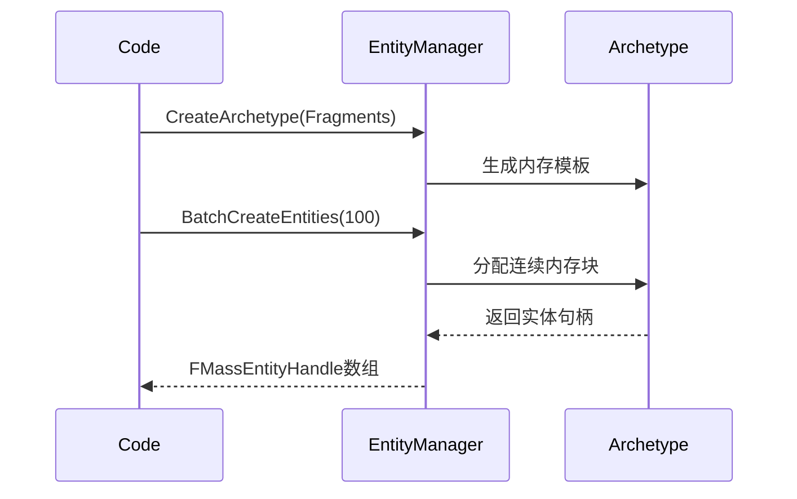
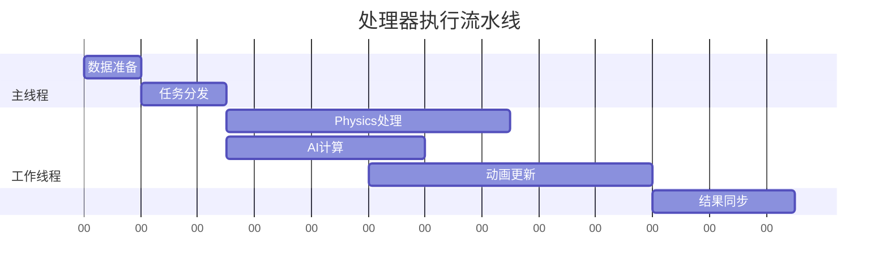

# MassEntity 入门

(只针对源码里的MassEntity模块，不包括MassGamePlay的内容，比如UMassEntityTraitBase)

:::tip
这里参考了quabqi大佬的[UE5的MASS框架-2](https://zhuanlan.zhihu.com/p/446937133)文章，需要注意几点：
- MassEntity 这个主模块，目前已经不是Plugin，在5.5已经在正式在源码的Runtime文件夹里。
- 最新的UE5版本，大部分api使用FMassEntityManager来调用，而不是直接用UMassEntitySubsystem了。

:::

## 一、快速上手
### 极简Mass示例
```cpp
// 定义两个基础组件
USTRUCT()
struct FHealthFragment : public FMassFragment {
    GENERATED_BODY()
    float Value = 100.0f;
};

USTRUCT()
struct FEnemyTag : public FMassTag {
    GENERATED_BODY()
};

// 创建并操作实体
void CreateEnemies(UWorld* World) {
    // 获取实体系统
    UMassEntitySubsystem* System = World->GetSubsystem<UMassEntitySubsystem>();
    FMassEntityManager& Manager = System->GetMutableEntityManager();
    
    // 创建包含健康值和敌人标签的原型
    const FMassArchetypeHandle Archetype = Manager.CreateArchetype({
        FHealthFragment::StaticStruct(),
        FEnemyTag::StaticStruct()
    });
    
    // 批量生成100个敌人
    TArray<FMassEntityHandle> Enemies;
    Manager.BatchCreateEntities(Archetype, 100, Enemies);
    
    // 修改第一个敌人的生命值
    FHealthFragment* Health = Manager.GetFragmentDataPtr<FHealthFragment>(Enemies[0]);
    Health->Value = 150.0f;
}
```
这个简单案例已经介绍了MassEntity的基本用法：
- 定义可复用的数据组件（Fragment）
- 创建标记型标签（Tag）
- 批量生成实体
- 访问实体数据

## 二、核心概念 

### 0. 原型（Archetype）
原型就好比对象的类型，用于创建实体。不同之处是，这里的原型是为了更好地规划“内存布局”。

为什么需要搞个工具来帮我们规划？

直接手动扣结构体，自己写个类记录各种sizeof，offset 不好吗？

因为手动定义原型的步骤非常繁琐，具体例子可以查看我的这篇记录：[UE5源码里的ECS](./ecs.md#ecs-anchor)

MassEntity的出现，封装了更加简单的操作，可以快速生成实体：

有了MassEntity，这个过程可以简化到:
```cpp
FMassArchetypeHandle Archetype = Manager.CreateArchetype({
    FHealthFragment::StaticStruct(),
    FEnemyTag::StaticStruct()
});
```


### 1. 为什么需要Fragment？

防止不了解，这里只是简单说说，更多详细内容可以看 [缓存行优化](./cacheline.md)

传统Actor组件模式：
```
[Entity1] → [Transform] [Mesh] [Health]...
[Entity2] → [Transform] [Physics] ...
```
内存分散 → 缓存命中率低

MassEntity的内存布局：
```
| Chunk1 | → [Health] ×50实体  
| Chunk2 | → [Health][Speed] ×50实体
```
连续内存 → SIMD优化友好

### 2. Tag的作用是过滤
```cpp
// 定义状态标签
USTRUCT() struct FDeadTag : public FMassTag {};
USTRUCT() struct FFlyingTag : public FMassTag {};

// 查询活着的飞行单位
Query.AddTagRequirement<FEnemyTag>(EMassFragmentPresence::All);
Query.AddTagRequirement<FDeadTag>(EMassFragmentPresence::None);
Query.AddTagRequirement<FFlyingTag>(EMassFragmentPresence::All);
```
Tag的优势：
- **低内存开销**：仅作为逻辑标记，保存在原型头部，不占用实体内存
- **快速筛选**：基于位掩码的比较，比数据比较快很多
- **组合查询**：灵活的过滤器组合，比如上面的敌人和死亡

### Fragment和Tag区别
| 特性         | Fragment          | Tag               |
|-------------|-------------------|-------------------|
| 数据存储      | 参与内存分配         | 无存储            |
| 查询条件      | 可读/写/比较       | 存在性检查         |
| 典型用途      | 位置/速度/生命值    | 状态标记/过滤器    |

### 3. 使用Processor封装Query
**初级写法（直接使用Query）：**
```cpp
void UpdateHealth() {
    FMassEntityQuery Query;
    Query.AddRequirement<FHealthFragment>(...);
    // 每次都要重新配置查询条件
    Query.ForEachEntityChunk(...);
}
```
问题：实际业务在用的时候，每次都要建立一个Query、不好维护、不好利用系统调度

**进阶方案（使用Processor）：**
```cpp
UCLASS()
class UHealthProcessor : public UMassProcessor {
protected:
    virtual void ConfigureQueries() override {
        Query.RegisterWithProcessor(*this);
        Query.AddRequirement<FHealthFragment>(...);
    }

    virtual void Execute(...) override {
        // 自动每帧执行
        Query.ForEachEntityChunk(...);
    }
};

//使用UE::Mass::Executor::Run来启动

UHealthProcessor* Processor = NewObject<UHealthProcessor>();
FMassProcessingContext ProcessingContext(EntityManager, /*DeltaSeconds=*/0.f);
UE::Mass::Executor::Run(*Processor, ProcessingContext);
```
封装的好处：
- **逻辑复用**：配置一次，全局生效
- **自动调度**：通过ExecutionOrder控制执行顺序
- **线程安全**：内置同步机制

## 三、架构原理深度图解
### 实体创建流程


### 处理器执行时序


## 四、性能优化
 
 
1. **内存布局调整**：
```cpp
// 将高频访问的Position和Velocity合并
Manager.CreateArchetype({ 
    FPositionFragment::StaticStruct(),
    FVelocityFragment::StaticStruct()
});
```
2. **查询条件优化**：
```cpp
Query.AddRequirement<FPositionFragment>(EMassFragmentAccess::ReadOnly)
     .AddChunkRequirement<FInstanceLODFragment>(EMassFragmentAccess::ReadOnly)
     .SetChunkFilter([](const FMassArchetypeChunk& Chunk) {
         return Chunk.GetNumEntities() > 32; // 仅处理大块数据
     });
```
3. **并行执行改造**：
```cpp
Query.ParallelForEachEntityChunk(..., [](...) {
    ParallelFor(NumEntities, [&](int32 Index) {
        // 并行处理每个实体
    });
});
```
 

## References

- [quabqi: UE5的MASS框架-1](https://zhuanlan.zhihu.com/p/441773595)
- [quabqi: UE5的MASS框架-2](https://zhuanlan.zhihu.com/p/446937133)
- [xianlongok: UE5 Mass 框架介绍](https://www.xianlongok.site/post/ea92a01c/)
