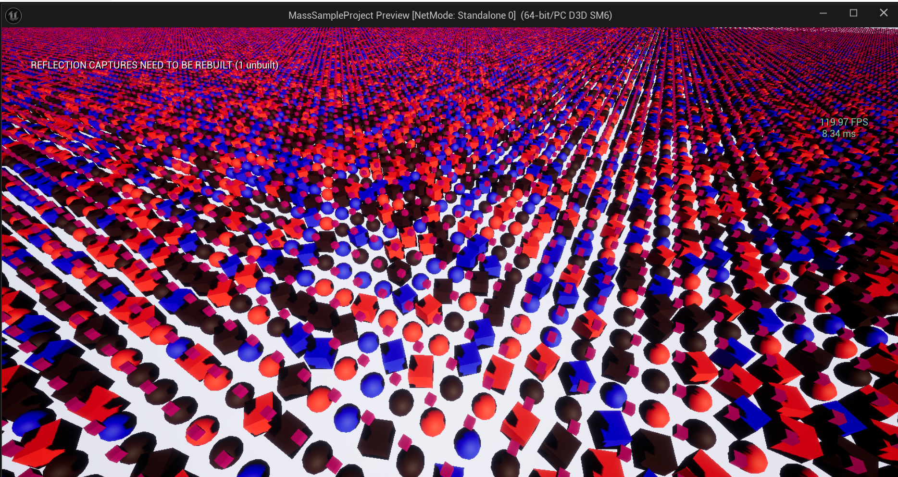
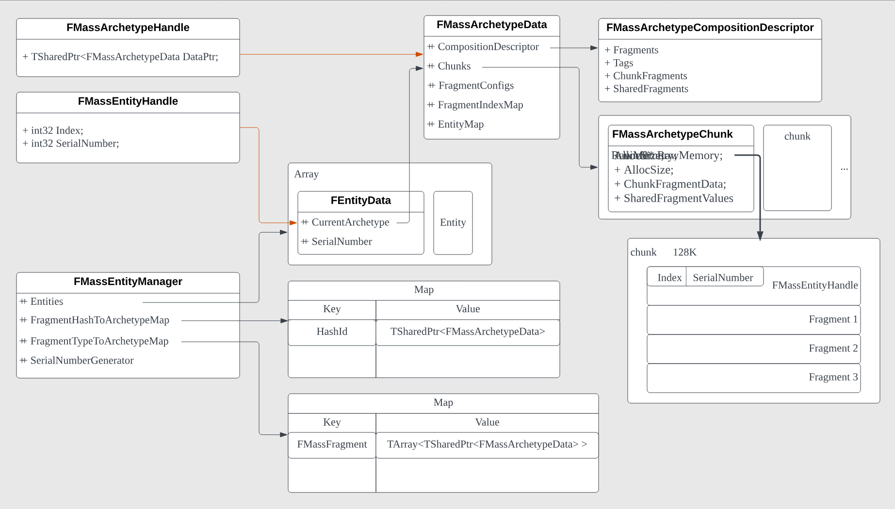
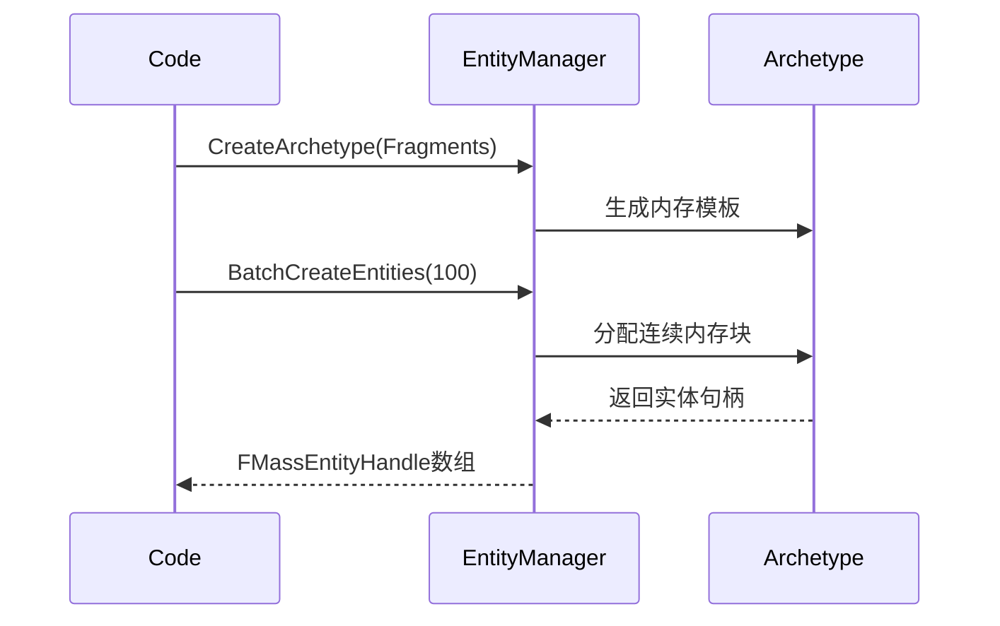
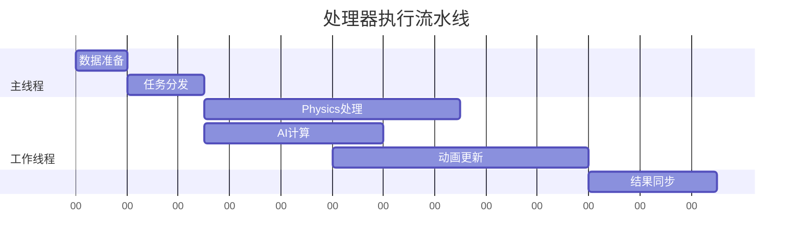
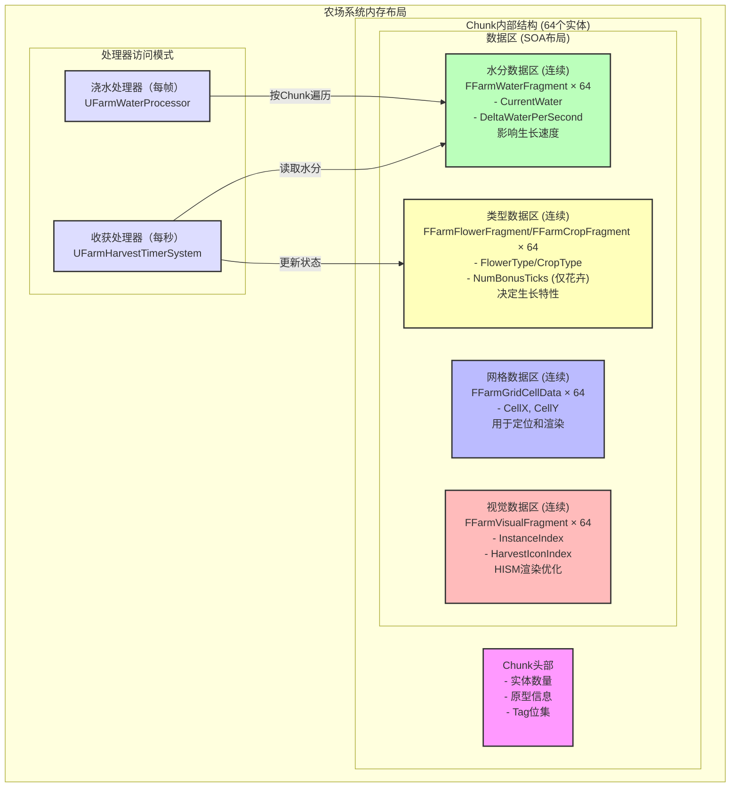
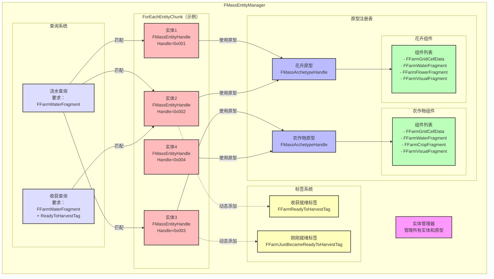
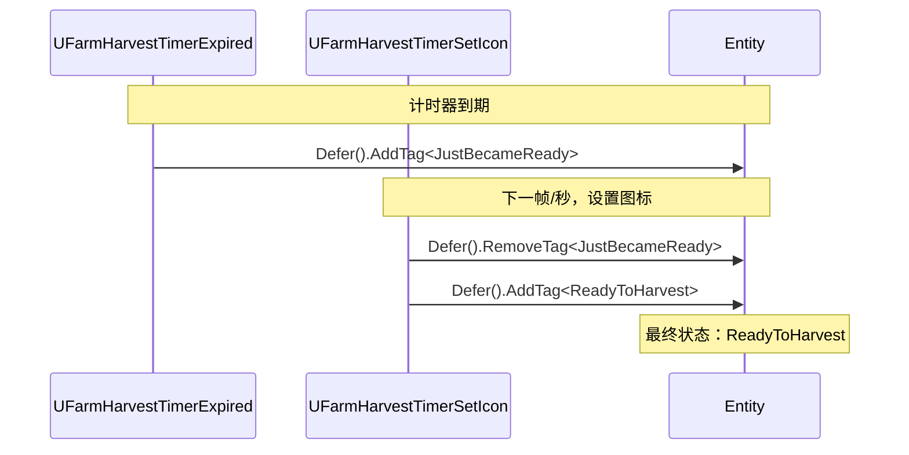

# MassEntity 入门



(只针对源码里的MassEntity模块，不包括MassGamePlay的内容，比如UMassEntityTraitBase)

:::tip
这里参考了quabqi大佬的[UE5的MASS框架-2](https://zhuanlan.zhihu.com/p/446937133)文章，需要注意几点：
- MassEntity 这个主模块，目前已经不是Plugin，在5.5已经在正式在源码的Runtime文件夹里。
- 最新的UE5版本，大部分api使用FMassEntityManager来调用，而不是直接用UMassEntitySubsystem了。
- MassEntity 模块虽然被标记为弃用（UE5.5），但官方的示例代码，依旧在这个弃用plugin里面，需要开启才能进行demo测试。
:::

## 一、快速上手

### 极简Mass示例

```cpp
// 定义两个基础组件
USTRUCT()
struct FHealthFragment : public FMassFragment {
    GENERATED_BODY()
    float Value = 100.0f;
};

USTRUCT()
struct FEnemyTag : public FMassTag {
    GENERATED_BODY()
};

// 创建并操作实体
void CreateEnemies(UWorld* World) {
    // 获取实体系统
    UMassEntitySubsystem* System = World->GetSubsystem<UMassEntitySubsystem>();
    FMassEntityManager& Manager = System->GetMutableEntityManager();
    
    // 创建包含健康值和敌人标签的原型
    const FMassArchetypeHandle Archetype = Manager.CreateArchetype({
        FHealthFragment::StaticStruct(),
        FEnemyTag::StaticStruct()
    });
    
    // 批量生成100个敌人
    TArray<FMassEntityHandle> Enemies;
    Manager.BatchCreateEntities(Archetype, 100, Enemies);
    
    // 修改第一个敌人的生命值
    FHealthFragment* Health = Manager.GetFragmentDataPtr<FHealthFragment>(Enemies[0]);
    Health->Value = 150.0f;
}
```

这个简单案例已经介绍了MassEntity的基本用法：

-   定义可复用的数据组件（Fragment）
-   创建标记型标签（Tag）
-   批量生成实体
-   访问实体数据

## 二、核心概念

### 0. 原型（Archetype）

原型就好比对象的类型，用于创建实体。不同之处是，这里的原型是为了更好地规划“内存布局”。

为什么需要搞个工具来帮我们规划？

直接手动扣结构体，自己写个类记录各种sizeof，offset 不好吗？

因为手动定义原型的步骤非常繁琐，具体例子可以查看我的这篇记录：[UE5源码里的ECS](./ecs.md#ecs-anchor)

MassEntity的出现，封装了更加简单的操作，可以快速生成实体：

有了MassEntity，这个过程可以简化到:

```cpp
// 有了 FMassArchetypeHandle （记住这个handle，要考） 就可以创建实体了
FMassArchetypeHandle Archetype = Manager.CreateArchetype({
    FHealthFragment::StaticStruct(),
    FEnemyTag::StaticStruct()
});


//批量：
TArray<FMassEntityHandle> Enemies;
Manager.BatchCreateEntities(Archetype, 100, Enemies);

//单个：
FMassEntityHandle NewItem = EntityManager.CreateEntity(Archetype);

```

布局示意图：

:::details 测试代码（UE5.5）
```cpp
 */
struct FMessTest
{
	FMassArchetypeHandle Archetype1;
	FMassArchetypeHandle Archetype2;
	FMassArchetypeHandle Archetype3;

	TArray<FMassEntityHandle> Entities;

	UMassEntitySubsystem* System;

	void Init(UWorld* InWorld)
	{
		System = NewObject<UMassEntitySubsystem>(InWorld);
		FMassEntityManager& EntityManager = System->GetMutableEntityManager();


		const UScriptStruct* FragmentTypes[] = { FFloatFragment::StaticStruct(), FInt32Fragment::StaticStruct() };

		// 创建原型 (Create Archetypes)
		// 可以这么理解,这里是动态定义结构体: Archetype1 是 float 类型的结构体, Archetype2 是 int32 类型的结构体, Archetype3 是 两个成员 float 和 int 组成的结构体
  
		
		Archetype1 = EntityManager.CreateArchetype({ FFloatFragment::StaticStruct()});
		Archetype2 = EntityManager.CreateArchetype({ FInt32Fragment::StaticStruct() });
		Archetype3 = EntityManager.CreateArchetype({
			FFloatFragment::StaticStruct(),
			FInt32Fragment::StaticStruct()
		});

		// 创建Entity (Create Entities)
		EntityManager.BatchCreateEntities(Archetype1, 100, Entities);
		EntityManager.BatchCreateEntities(Archetype2, 200, Entities);
		EntityManager.BatchCreateEntities(Archetype3, 150, Entities);
		
		// 给所有 Float 赋值 20 (Set all Float values to 20)
		FMassExecutionContext ExeContext = EntityManager.CreateExecutionContext(/*DeltaSeconds=*/0.f);
		FMassEntityQuery Query;
		Query.AddRequirement<FFloatFragment>(EMassFragmentAccess::ReadWrite);
		Query.ForEachEntityChunk(EntityManager, ExeContext, [](FMassExecutionContext& Context) -> void
		{
			int32 Num = Context.GetNumEntities(); // 250个 (250 entities)
			TArrayView<FFloatFragment> Floats = Context.GetMutableFragmentView<FFloatFragment>();
		
			for (int32 Index = 0; Index < Num; ++Index)
			{
				Floats[Index].Value = 20.f;
			}
		});

	}
};
```
:::
```sh
================================================================================
EntityManager
│
├── Archetypes (通过 CreateArchetype() 创建不同的内存布局原型)
│   │
│   ├── Archetype1 (FMassArchetypeHandle)
│   │   │
│   │   ├── SharedFragment (所有此Archetype下的Entity共享)
│   │   │   └── [SharedValue1][SharedValue2]...
│   │   │
│   │   └── Chunks (每个 Chunk 按 [float] 结构线性排列)
│   │       │
│   │       ├── Chunk1: 
│   │       │   ├── ChunkFragment: [ChunkValueA][ChunkValueB]...
│   │       │   └── [20.0][20.0][20.0]... (100个 float 值)
│   │       │
│   │       └── Chunk2:
│   │           ├── ChunkFragment: [ChunkValueC][ChunkValueD]...
│   │           └── ...
│   ├── Archetype2
│   │   │
│   │   ├── SharedFragment (所有此Archetype下的Entity共享)
│   │   │   └── ...
│   │   └── Chunks (每个 Chunk 按 [int32] 结构线性排列)
│   │       │
│   │       ├── Chunk1:
│   │       │   ├── ChunkFragment: [ChunkValueE]...
│   │       │   └── [0][0][0]... (200个 int32 初始值)
│   │       │
│   │       ├── Chunk2:
│   │       │      ├── ChunkFragment: ...
│   │       └── ...
│   └── Archetype3
│       │
│       ├── SharedFragment (所有此Archetype下的Entity共享)
│       │    └── ...
│       └── Chunks (每个 Chunk 按 [float + int32] 交错排列)
│           │
│           ├── Chunk1:
│           │    ├── ChunkFragment: [ChunkValueF]...
│           │    └── [20.0][0][20.0][0]... (150组 float+int32 pairs)
│           │
│           ├── Chunk2:
│           │   ├──  ChunkFragment: ...
│           └── ...
│
└── EntitiesHandle (通过 BatchCreateEntities() 创建的总实体列表)
    │
    └── 实体通过两个指针定位数据：
        Entity → Archetype → Chunk
                  │         │
                  │         └── 访问 ChunkFragment
                  │
                  └── 通过 SharedFragment 查找共享数据

================================================================================

``` 

借用Unity的图：


### 1. 为什么需要Fragment？

防止不了解，这里只是简单说说，更多详细内容可以看 [缓存行优化](./cacheline.md)

传统Actor组件模式：

```
[Entity1] → [Transform] [Mesh] [Health]...
[Entity2] → [Transform] [Physics] ...
```

内存分散 → 缓存命中率低

MassEntity的内存布局：

```
| Chunk1 | → [Health] ×50实体  
| Chunk2 | → [Health][Speed] ×50实体
```

连续内存 → SIMD优化友好

### 2. Tag的作用是过滤

```cpp
// 定义状态标签
USTRUCT() struct FDeadTag : public FMassTag {};
USTRUCT() struct FFlyingTag : public FMassTag {};

// 查询活着的飞行单位
Query.AddTagRequirement<FEnemyTag>(EMassFragmentPresence::All);
Query.AddTagRequirement<FDeadTag>(EMassFragmentPresence::None);
Query.AddTagRequirement<FFlyingTag>(EMassFragmentPresence::All);
```

Tag的优势：

-   **低内存开销**：仅作为逻辑标记，保存在原型头部，不占用实体内存
-   **快速筛选**：基于位掩码的比较，比数据比较快很多
-   **组合查询**：灵活的过滤器组合，比如上面的敌人和死亡

::: warning 注意
Tag 不同的Entity，虽然会用相同的“Base” Archetype，但实际上会被当做不同Archetype来处理, 也就是 `ForEachEntityChunk`时，处于不同的Chunk中。也就是如果某个entity多了一个tag，那么它的原型其实是变了，即使Base Archetype没有变化，系统会为它专门创建一个128kb的chunk来装载这一个entity。
:::

#### 2.1 Fragment和Tag区别

| 特性     | Fragment      | Tag           |
| --------- | ------------- | ------------- |
| 数据存储  | 参与内存分配  | 无存储        |
| 查询条件  | 可读/写/比较 | 存在性检查     |
| 典型用途  | 位置/速度/生命值 | 状态标记/过滤器 |

:::tip 关于SharedFragment和ChunkFragment

quabqi:

> 如果FMassFragment可以理解为Entity的成员变量，那FMassSharedFragment就可以理解为Entity的static成员变量，而FMassChunkFragment可以理解为每个Chunk的static成员变量

而Entity 存在于Chunk中。

:::

### 3. 使用Processor封装Query

**初级写法（直接使用Query）：**

```cpp
void UpdateHealth() {
    FMassEntityQuery Query;
    Query.AddRequirement<FHealthFragment>(...);
    // 每次都要重新配置查询条件
    Query.ForEachEntityChunk(...);
}
```

问题：实际业务在用的时候，每次都要建立一个Query、不好维护、不好利用系统调度

### 4. **进阶方案（使用Processor）：**

Processor就是把 Query 和 Execute 封装起来的“处理器”，也就是 ECS里的System。

#### 4.1 **普通Processor：**
```cpp
UCLASS()
class UHealthProcessor : public UMassProcessor {
protected:
    virtual void ConfigureQueries() override {
        Query.RegisterWithProcessor(*this);
        Query.AddRequirement<FHealthFragment>(...);
    }

    virtual void Execute(...) override {
        // 自动每帧执行
        Query.ForEachEntityChunk(...);
    }
};

//使用UE::Mass::Executor::Run来启动

UHealthProcessor* Processor = NewObject<UHealthProcessor>();
FMassProcessingContext ProcessingContext(EntityManager, /*DeltaSeconds=*/0.f);
UE::Mass::Executor::Run(*Processor, ProcessingContext);
```
#### 4.2 **Observer Processor:**
Observers（观察者）是一种特殊的Processor，人如其名，它们会在实体发生特定变化时被触发。

```cpp
UMSObserverOnAdd::UMSObserverOnAdd()
{
    // 配置观察类型：观察FOriginalTransformFragment 的Add操作
    ObservedType = FOriginalTransformFragment::StaticStruct();
    Operation = EMassObservedOperation::Add;
    ExecutionFlags = (int32)(EProcessorExecutionFlags::All);
}

void UMSObserverOnAdd::ConfigureQueries()
{
    // We still make a query here. You can add other things to query for besides the observed fragments 
    EntityQuery.AddRequirement<FSampleColorFragment>(EMassFragmentAccess::ReadWrite);
    EntityQuery.AddRequirement<FTransformFragment>(EMassFragmentAccess::ReadOnly);
    EntityQuery.RegisterWithProcessor(*this);

}

void UMSObserverOnAdd::Execute(FMassEntityManager& EntityManager, FMassExecutionContext& Context)
{
    EntityQuery.ForEachEntityChunk(EntityManager, Context, [&,this](FMassExecutionContext& Context)
    {
        auto OriginalTransforms = Context.GetMutableFragmentView<FOriginalTransformFragment>();
        auto Transforms = Context.GetFragmentView<FTransformFragment>();

        for (int32 EntityIndex = 0; EntityIndex < Context.GetNumEntities(); ++EntityIndex)
        {
            // 当实体添加了FOriginalTransformFragment时，自动从FTransformFragment中取出Transform设置到FOriginalTransformFragment
            // When an original transform is added, set it to our transform!
            OriginalTransforms[EntityIndex].Transform = Transforms[EntityIndex].GetTransform();			
        }
    });
}

```

封装的好处：

-   **逻辑复用**：配置一次，全局生效
-   **自动调度**：通过ExecutionOrder控制执行顺序
-   **线程安全**：内置同步机制

## 三、架构原理深度图解

架构图：

借用xianlongok大佬的图：


详情可以看他的的文章：https://www.xianlongok.site/post/ea92a01c/

### 实体创建流程



### 处理器执行时序



## 四、性能优化

1.  **内存布局调整**：

```cpp
// 将高频访问的Position和Velocity合并
Manager.CreateArchetype({ 
    FPositionFragment::StaticStruct(),
    FVelocityFragment::StaticStruct()
});
```

2.  **查询条件优化**：

```cpp
Query.AddRequirement<FPositionFragment>(EMassFragmentAccess::ReadOnly)
     .AddChunkRequirement<FInstanceLODFragment>(EMassFragmentAccess::ReadOnly)
     .SetChunkFilter([](const FMassArchetypeChunk& Chunk) {
         return Chunk.GetNumEntities() > 32; // 仅处理大块数据
     });
```

3.  **并行执行改造**：

```cpp
Query.ParallelForEachEntityChunk(..., [](...) {
    ParallelFor(NumEntities, [&](int32 Index) {
        // 并行处理每个实体
    });
});
```

## 五、UE5内置案例：农场系统

这个案例来自UE5源码中的测试用例，展示了如何使用MassEntity构建一个简单的农场系统。

首先设计一些会用到的Fragment 和 Processor  

### 1. 数据结构设计

设计fragment的时候，注意要将高频访问的成员合并到一起，冷热分离。

```cpp
// 1. 视觉相关数据
USTRUCT()
struct FFarmVisualDataRow : public FTableRowBase {
    GENERATED_BODY()
    UPROPERTY(EditAnywhere, Category=Farm)
    TObjectPtr<UStaticMesh> Mesh;
    UPROPERTY(EditAnywhere, Category=Farm)
    TObjectPtr<UMaterialInterface> MaterialOverride;
};

// 2. 状态标记
USTRUCT()
struct FFarmReadyToHarvestTag : public FMassTag {
    GENERATED_BODY()
};
// 刚进入Harvest状态的Tag
USTRUCT()
struct FFarmJustBecameReadyToHarvestTag : public FMassTag
{
	GENERATED_BODY()
};

// 3. 核心数据组件
USTRUCT()
struct FFarmGridCellData : public FMassFragment {
    GENERATED_BODY()
    uint16 CellX = 0;
    uint16 CellY = 0;
};

USTRUCT()
struct FFarmWaterFragment : public FMassFragment {
    GENERATED_BODY()
    float CurrentWater = 1.0f;
    float DeltaWaterPerSecond = -0.01f;
};

USTRUCT()
struct FFarmFlowerFragment : public FMassFragment {
    GENERATED_BODY()
    uint32 NumBonusTicks = 0;
    uint16 FlowerType = 0;
};

USTRUCT()
struct FFarmCropFragment : public FMassFragment
{
	GENERATED_BODY()

	uint16 CropType = 0;
};


USTRUCT()
struct FFarmVisualFragment : public FMassFragment
{
	GENERATED_BODY()

	int32 InstanceIndex = -1;
	int32 HarvestIconIndex = -1;
	uint16 VisualType = 0;
};

USTRUCT()
struct FHarvestTimerFragment : public FMassFragment
{
	GENERATED_BODY()

	uint32 NumSecondsLeft = 15;
};
```

### 2. 处理器实现

#### 2.1 基础处理器

```cpp
UCLASS(abstract)
class UFarmProcessorBase : public UMassProcessor {
    GENERATED_BODY()
protected:
    FMassEntityQuery EntityQuery;
};

// 构造函数中禁用自动注册，以手动控制执行
UFarmProcessorBase::UFarmProcessorBase() : EntityQuery(*this) {
    bAutoRegisterWithProcessingPhases = false;
}
```

#### 2.2 浇水处理器

```cpp
UCLASS()
class UFarmWaterProcessor : public UFarmProcessorBase {
    GENERATED_BODY()
public:
    virtual void ConfigureQueries() override {
        EntityQuery.AddRequirement<FFarmWaterFragment>(EMassFragmentAccess::ReadWrite);
    }

    virtual void Execute(FMassEntityManager& EntityManager, FMassExecutionContext& Context) override {
        EntityQuery.ForEachEntityChunk(EntityManager, Context, [this](FMassExecutionContext& Context) {
            const float DeltaTimeSeconds = Context.GetDeltaTimeSeconds();
            TArrayView<FFarmWaterFragment> WaterList = Context.GetMutableFragmentView<FFarmWaterFragment>();
            
            for (FFarmWaterFragment& WaterFragment : WaterList) {
                WaterFragment.CurrentWater = FMath::Clamp(
                    WaterFragment.CurrentWater + WaterFragment.DeltaWaterPerSecond * DeltaTimeSeconds, 
                    0.0f, 1.0f
                );
            }
        });
    }
};
```

#### 2.3 收获系统

```cpp
UCLASS()
class UFarmHarvestTimerSystem_Flowers : public UFarmProcessorBase {
    GENERATED_BODY()
public:
    virtual void ConfigureQueries() override {
        EntityQuery.AddRequirement<FHarvestTimerFragment>(EMassFragmentAccess::ReadWrite);
        EntityQuery.AddRequirement<FFarmWaterFragment>(EMassFragmentAccess::ReadOnly);
        EntityQuery.AddRequirement<FFarmFlowerFragment>(EMassFragmentAccess::ReadWrite);
    }

    virtual void Execute(FMassEntityManager& EntityManager, FMassExecutionContext& Context) override {
        EntityQuery.ForEachEntityChunk(EntityManager, Context, [this](FMassExecutionContext& Context) {
            const float WellWateredThreshold = 0.25f;
            TArrayView<FHarvestTimerFragment> TimerList = Context.GetMutableFragmentView<FHarvestTimerFragment>();
            TConstArrayView<FFarmWaterFragment> WaterList = Context.GetFragmentView<FFarmWaterFragment>();
            TArrayView<FFarmFlowerFragment> FlowerList = Context.GetMutableFragmentView<FFarmFlowerFragment>();

            for (int32 i = 0; i < Context.GetNumEntities(); ++i) {
                if (TimerList[i].NumSecondsLeft > 0) {
                    --TimerList[i].NumSecondsLeft;
                    // 水分充足时获得额外成长加成
                    if (WaterList[i].CurrentWater > WellWateredThreshold) {
                        ++FlowerList[i].NumBonusTicks;
                    }
                }
            }
        });
    }
};
```

### 3. 系统初始化和运行

然后用Actor来驱动Processor（源码简化版）
```cpp
void AMassEntityTestFarmPlot::BeginPlay() {
    Super::BeginPlay();
    
    // 1. 初始化实体管理器
    FMassEntityManager& EntityManager = SharedEntityManager.Get();
    EntityManager.Initialize();
    
    // 2. 注册处理器
    PerFrameSystems.Add(NewObject<UFarmWaterProcessor>(this));

	PerSecondSystems.Add(NewObject<UFarmHarvestTimerSystem_Flowers>(this));
	PerSecondSystems.Add(NewObject<UFarmHarvestTimerSystem_Crops>(this));
	
    
  
}

// 主循环
void AMassEntityTestFarmPlot::TickActor(float DeltaTime, enum ELevelTick TickType, FActorTickFunction& ThisTickFunction) {
    Super::TickActor(DeltaTime, TickType, ThisTickFunction);
    
    FMassEntityManager& EntityManager = SharedEntityManager.Get();
    
    // 每帧系统
    {
        FMassProcessingContext Context(EntityManager, DeltaTime);
        UE::Mass::Executor::RunProcessorsView(PerFrameSystems, Context);
    }
    
    // 每秒系统
    NextSecondTimer -= DeltaTime;
    while (NextSecondTimer < 0.0f) {
        FMassProcessingContext Context(EntityManager, 1.f);
        UE::Mass::Executor::RunProcessorsView(PerSecondSystems, Context);
        NextSecondTimer += 1.0f;
    }
}
```


用图来表示：





### 4. 数据驱动

经过上面的步骤，系统已经运行起来了，但是内存中还没任创建何实体，查不到结果System的遍历函数就不会执行。

案例里通过 `AddItemToGrid` 函数来创建实体。

Actor 的 `BeginPlay` 函数中 增加最后一步：
```cpp
// 3. 创建原型， 给原型命名方便调试
	FMassEntityManager& EntityManager = SharedEntityManager.Get();
	EntityManager.Initialize();
	EntityManager.SetDebugName("TestFarmPlot");
	FMassArchetypeCreationParams ArchetypeCreationParamsCrop;
	ArchetypeCreationParamsCrop.DebugName = "CropArchetype";

	FMassArchetypeCreationParams ArchetypeCreationParamsFlower;
	ArchetypeCreationParamsFlower.DebugName = "FlowerArchetype";

	FMassArchetypeHandle CropArchetype = EntityManager.CreateArchetype(
		TArray<const UScriptStruct*>{
			FFarmWaterFragment::StaticStruct(),
			FFarmCropFragment::StaticStruct(),
			FHarvestTimerFragment::StaticStruct(),
			FFarmVisualFragment::StaticStruct(),
			FFarmGridCellData::StaticStruct()
		}, ArchetypeCreationParamsCrop);
	FMassArchetypeHandle FlowerArchetype = EntityManager.CreateArchetype(
		TArray<const UScriptStruct*>{
			FFarmWaterFragment::StaticStruct(),
			FFarmFlowerFragment::StaticStruct(),
			FHarvestTimerFragment::StaticStruct(),
			FFarmVisualFragment::StaticStruct(),
			FFarmGridCellData::StaticStruct()
		}, ArchetypeCreationParamsFlower);

// 4. 创建实体
for (uint16 Y = 0; Y < GridHeight; ++Y) {
    for (uint16 X = 0; X < GridWidth; ++X) {
        const bool bSpawnCrop = FMath::FRand() < 0.5f;
        const uint16 VisualIndex = bSpawnCrop ? TestDataCropIndicies[FMath::RandRange(0, TestDataCropIndicies.Num() - 1)] : TestDataFlowerIndicies[FMath::RandRange(0, TestDataFlowerIndicies.Num() - 1)];

        AddItemToGrid(EntityManager, X, Y, 
            bSpawnCrop ? CropArchetype : FlowerArchetype, 
            VisualIndex);
    }
}
```

`AddItemToGrid` 函数是理解 MassEntity 如何与实际游戏对象（在这个例子中是植物）关联起来的关键。它不仅仅是创建实体，还将实体与视觉表现（网格位置、模型实例）联系起来。

**有了数据，Processor （系统） 就像水车注入了河水一样，开始运转，这就是 ECS 的 DataDriven**

```cpp
void AMassEntityTestFarmPlot::AddItemToGrid(FMassEntityManager& InEntityManager, uint16 X, uint16 Y, FMassArchetypeHandle Archetype, uint16 VisualIndex)
{
    // 1. 创建实体
    //    - 使用给定的原型（CropArchetype 或 FlowerArchetype）创建一个新的实体
    //    - 将新实体的句柄存储在 PlantedSquares 数组中，以便后续访问
	FMassEntityHandle NewItem = InEntityManager.CreateEntity(Archetype);
	PlantedSquares[X + Y * GridWidth] = NewItem;

    // 2. 设置初始 Fragment 数据
    //    - 设置 FFarmWaterFragment 的 DeltaWaterPerSecond（随机值，模拟不同植物的需水量）
    //    - 设置 FHarvestTimerFragment 的 NumSecondsLeft（随机值，模拟不同的生长周期）
	InEntityManager.GetFragmentDataChecked<FFarmWaterFragment>(NewItem).DeltaWaterPerSecond = FMath::FRandRange(-0.01f, -0.001f);
	InEntityManager.GetFragmentDataChecked<FHarvestTimerFragment>(NewItem).NumSecondsLeft = 5 + (FMath::Rand() % 100);

    // 3. 设置网格坐标
    //    - 创建 FFarmGridCellData 结构体，存储植物在网格中的 X、Y 坐标
    //    - 将此数据设置到实体的 FFarmGridCellData Fragment 中
	FFarmGridCellData GridCoords;
	GridCoords.CellX = X;
	GridCoords.CellY = Y;
	InEntityManager.GetFragmentDataChecked<FFarmGridCellData>(NewItem) = GridCoords;

    // 4. 创建视觉表现
    //    - 计算植物的实际位置（基于网格坐标和单元格大小）
    //    - 生成一个随机的旋转角度
    //    - 创建一个 FTransform，表示植物的位置、旋转和缩放
	const FVector MeshPosition(X*GridCellWidth, Y*GridCellHeight, 0.0f);
	const FRotator MeshRotation(0.0f, FMath::FRand()*360.0f, 0.0f);
	const FVector MeshScale(1.0f, 1.0f, 1.0f); //@TODO: plumb in scale param?
	const FTransform MeshTransform(MeshRotation, MeshPosition, MeshScale);

    // 5. 设置 FFarmVisualFragment
    //    - 获取/创建 FFarmVisualFragment
    //    - 设置 VisualType（用于选择正确的 UHierarchicalInstancedStaticMeshComponent）
    //    - 使用 AddInstance() 在选定的 HISMC 上添加一个新的实例，并将返回的索引存储在 InstanceIndex 中
	FFarmVisualFragment& VisualComp = InEntityManager.GetFragmentDataChecked<FFarmVisualFragment>(NewItem);
	VisualComp.VisualType = VisualIndex;
	VisualComp.InstanceIndex = VisualDataISMCs[VisualComp.VisualType]->AddInstance(MeshTransform);
}
```

*   **数据与表现分离：**  `FFarmVisualFragment`  中的  `InstanceIndex`  将实体与  `UHierarchicalInstancedStaticMeshComponent`  中的一个特定实例关联起来。这实现了数据（MassEntity 实体）与表现（HISMC 实例）的分离。
*   **统一原型构建：**  `AddItemToGrid`  使用传入的  `Archetype`  参数来创建实体。这意味着所有通过此函数创建的植物都将具有相同的组件结构，由  `Archetype`  定义。

### 5. 扩展业务逻辑

后续增加功能或处理逻辑，只需增加不同的 `Processor` 即可。官方案例里用到这两个：`UFarmHarvestTimerExpired` 和 `UFarmHarvestTimerSetIcon`

在Actor中，新增：
```cpp
// 加入 收获 Processor
PerSecondSystems.Add(NewObject<UFarmHarvestTimerExpired>(this));
// 加入图标动态配置 Processor
UFarmHarvestTimerSetIcon* IconSetter = NewObject<UFarmHarvestTimerSetIcon>(this);
IconSetter->HarvestIconISMC = HarvestIconISMC;
IconSetter->GridCellWidth = GridCellWidth;
IconSetter->GridCellHeight = GridCellHeight;
IconSetter->HarvestIconHeight = 200.0f;
IconSetter->HarvestIconScale = HarvestIconScale;
PerSecondSystems.Add(IconSetter);
```    

####  UFarmHarvestTimerExpired
收获处理器，处理自动倒计时：当拥有 FHarvestTimerFragment的Entity 倒计时结束时，添加 FFarmJustBecameReadyToHarvestTag 标签

这个用例还告诉我们，实际操作Tag时，要用延迟命令来执行。
```cpp
UCLASS()
class UFarmHarvestTimerExpired : public UFarmProcessorBase
{
	GENERATED_BODY()

	virtual void ConfigureQueries() override;
	virtual void Execute(FMassEntityManager& EntityManager, FMassExecutionContext& Context) override;
};
void UFarmHarvestTimerExpired::ConfigureQueries()
{
    // 1. 查找拥有 FHarvestTimerFragment 的实体，既可被收获的Entity （Flower，Crop）
	EntityQuery.AddRequirement<FHarvestTimerFragment>(EMassFragmentAccess::ReadOnly);
    // 2. 但不包括已经处于“可收获”状态的实体
    //    - 排除已经添加了 FFarmReadyToHarvestTag 的实体
    //    - 排除刚刚变为“可收获”状态的实体（避免重复处理）
	EntityQuery.AddTagRequirement<FFarmJustBecameReadyToHarvestTag>(EMassFragmentPresence::None);
	EntityQuery.AddTagRequirement<FFarmReadyToHarvestTag>(EMassFragmentPresence::None);
}

void UFarmHarvestTimerExpired::Execute(FMassEntityManager& EntityManager, FMassExecutionContext& Context)
{
	QUICK_SCOPE_CYCLE_COUNTER(UFarmHarvestTimerExpired_Run);

	EntityQuery.ForEachEntityChunk(EntityManager, Context, [this](FMassExecutionContext& Context) {
		const int32 NumEntities = Context.GetNumEntities();
		TConstArrayView<FHarvestTimerFragment> TimerList = Context.GetFragmentView<FHarvestTimerFragment>();

		for (int32 i = 0; i < NumEntities; ++i)
		{
            // 3. 检查是否到了收获时间
			if (TimerList[i].NumSecondsLeft == 0)
			{
                // 4. 使用 Defer() 和 AddTag() 添加 FFarmJustBecameReadyToHarvestTag 标签
                //    - 为什么使用 Defer()？
                //      - 避免在遍历过程中修改实体集合，确保数据一致性
                //      - 将修改操作延迟到安全时间点执行
                //    - 为什么是 FFarmJustBecameReadyToHarvestTag 而不是 FFarmReadyToHarvestTag？
                //      - 标记“刚刚”变为可收获状态，用于触发后续操作（如显示图标）
                //      - 后续处理器会将此标签替换为 FFarmReadyToHarvestTag
				Context.Defer().AddTag<FFarmJustBecameReadyToHarvestTag>(Context.GetEntity(i));
			}
		}
	});
}
```

**要点解读：**

*   **`Context.Defer().AddTag<FFarmJustBecameReadyToHarvestTag>(Context.GetEntity(i))` 的作用：**
    *   **延迟修改：**  `Defer()`  是 MassEntity 框架提供的一种机制，用于延迟对实体组件或标签的修改。在  `ForEachEntityChunk`  循环中直接修改实体可能会导致问题，因为循环可能正在迭代的同一个数据结构。`Defer()`  将这些修改操作排队，在当前  `ForEachEntityChunk`  循环结束后安全地执行。
    *   **添加标签：**  `AddTag<FFarmJustBecameReadyToHarvestTag>()`  表示给实体添加一个  `FFarmJustBecameReadyToHarvestTag`  类型的标签。这个标签是一个“标记”，表示植物刚刚成熟，可以收获。
    *   **获取实体：**  `Context.GetEntity(i)`  获取当前正在处理的实体的唯一标识符（`FMassEntityHandle`）。

:::tip xianlongok:
> 使用 Context.Defer ()，其实就是返回 FMassCommandBuffer 对象，通过该对象将需要的操作生成对应的操作指令，并压入 DeferredCommandBuffer，类似 UE 中渲染管线的实现。
:::

更多Defer()操作请参考[Mass Readme Defer](https://github.com/Megafunk/MassSample/blob/main/README.md#473-mutating-entities-with-defer)

:::details 一些常见的实体Defer()操作
Fragments:
```c++
Context.Defer().AddFragment<FMyFragment>(EntityHandle);
Context.Defer().RemoveFragment<FMyFragment>(EntityHandle);
```

Tags:
```c++
Context.Defer().AddTag<FMyTag>(EntityHandle);
Context.Defer().RemoveTag<FMyTag>(EntityHandle);
Context.Defer().SwapTags<FOldTag, FNewTag>(EntityHandle);
```
 
Destroying entities:
```c++
Context.Defer().DestroyEntity(EntityHandle);
Context.Defer().DestroyEntities(EntityHandleArray);
```
:::

####  UFarmHarvestTimerSetIcon

已成熟作物图标设置系统，这里有个巧妙构思，只处理 FFarmJustBecameReadyToHarvestTag 标签的实体，避免每秒循环的实体数量太大。

```cpp
UCLASS()
class UFarmHarvestTimerSetIcon : public UFarmProcessorBase
{
	GENERATED_BODY()

public:
	UPROPERTY()
	TObjectPtr<UHierarchicalInstancedStaticMeshComponent> HarvestIconISMC;

	float GridCellWidth;
	float GridCellHeight;
	float HarvestIconHeight;
	float HarvestIconScale;

protected:
	virtual void ConfigureQueries() override;
	virtual void Execute(FMassEntityManager& EntityManager, FMassExecutionContext& Context) override;
};
void UFarmHarvestTimerSetIcon::ConfigureQueries()
{
    // 1. 查找具有特定数据的实体：
    //    - 具有 FFarmGridCellData 组件（用于获取位置信息）
    //    - 具有 FFarmVisualFragment 组件（用于更新图标索引）
	EntityQuery.AddRequirement<FFarmGridCellData>(EMassFragmentAccess::ReadOnly);
	EntityQuery.AddRequirement<FFarmVisualFragment>(EMassFragmentAccess::ReadWrite);
    // 2. 仅处理刚刚变为“可收获”状态的实体
    //    - 要求实体具有 FFarmJustBecameReadyToHarvestTag 标签
	EntityQuery.AddTagRequirement<FFarmJustBecameReadyToHarvestTag>(EMassFragmentPresence::All);
}

void UFarmHarvestTimerSetIcon::Execute(FMassEntityManager& EntityManager, FMassExecutionContext& Context)
{
	if (HarvestIconISMC == nullptr)
	{
		return;
	}

	QUICK_SCOPE_CYCLE_COUNTER(SET_ICON_SET_ICON_SET_ICON);

	EntityQuery.ForEachEntityChunk(EntityManager, Context, [this](FMassExecutionContext& Context) {

		const int32 NumEntities = Context.GetNumEntities();
		TConstArrayView<FFarmGridCellData> GridCoordList = Context.GetFragmentView<FFarmGridCellData>();
		TArrayView<FFarmVisualFragment> VisualList = Context.GetMutableFragmentView<FFarmVisualFragment>();

		for (int32 i = 0; i < NumEntities; ++i)
		{
			const FFarmGridCellData& GridCells = GridCoordList[i];

            // 3. 计算图标位置和变换
			const FVector IconPosition(GridCells.CellX*GridCellWidth, GridCells.CellY*GridCellHeight, HarvestIconHeight);
			const FTransform IconTransform(FQuat::Identity, IconPosition, FVector(HarvestIconScale, HarvestIconScale, HarvestIconScale));

            // 4. 添加图标实例并更新索引
            //    - 使用 HarvestIconISMC（层级实例化静态网格体组件）添加图标
            //    - 将返回的实例索引存储在 FFarmVisualFragment 中，以便后续移除
			VisualList[i].HarvestIconIndex = HarvestIconISMC->AddInstance(IconTransform);

            // 5. 移除 FFarmJustBecameReadyToHarvestTag 标签
            //    - 表示已处理完“刚刚变为可收获”状态
			FMassEntityHandle ThisEntity = Context.GetEntity(i);
			Context.Defer().RemoveTag<FFarmJustBecameReadyToHarvestTag>(ThisEntity);
            // 6. 添加 FFarmReadyToHarvestTag 标签
            //    - 表示实体现在处于“可收获”状态，可以进行其他相关操作（如允许玩家交互）
			Context.Defer().AddTag<FFarmReadyToHarvestTag>(ThisEntity);
		}
	});
}
```
**添加和移除 Tag 的过程图示**




###  六、细节提炼

1. **状态管理**
   - 使用Tag来标记收获状态（FFarmReadyToHarvestTag）
   - 使用Fragment来存储动态数据（水分、计时器等）
   - 使用Defer()来延迟状态变更，避免遍历时修改

2. **性能优化**
   ```cpp
   // 1. 分离更新频率
   PerFrameSystems.Add(NewObject<UFarmWaterProcessor>());     // 每帧更新
   PerSecondSystems.Add(NewObject<UFarmHarvestTimerSystem>());// 每秒更新
   
   // 2. 批量处理
   EntityQuery.ForEachEntityChunk(...);  // 按Chunk处理而不是单个实体
   
   // 3. 视距剔除
   HISMC->SetCullDistances(VisualNearCullDistance, VisualFarCullDistance);
   ```

3. **可配置设计**
   ```cpp
   // 1. 数据驱动
   UPROPERTY(EditAnywhere, Category=Farm)
   TArray<FFarmVisualDataRow> VisualDataTable;
   
   // 2. 灵活的生长系统
   float WellWateredThreshold = 0.25f;  // 水分阈值
   float DeltaWaterPerSecond = -0.01f;  // 水分消耗速率
   ```

4. **交互系统**
   - 使用HISM（分层实例静态网格体）实现高效渲染
   - 支持动态添加/移除收获图标
   - 实现了基于水分的加速生长机制

## References

- [Mass社区Sample](https://github.com/Megafunk/MassSample/)
- [quabqi: UE5的MASS框架-1](https://zhuanlan.zhihu.com/p/441773595)
- [quabqi: UE5的MASS框架-2](https://zhuanlan.zhihu.com/p/446937133)
- [xianlongok: UE5 Mass 框架介绍](https://www.xianlongok.site/post/ea92a01c/)
