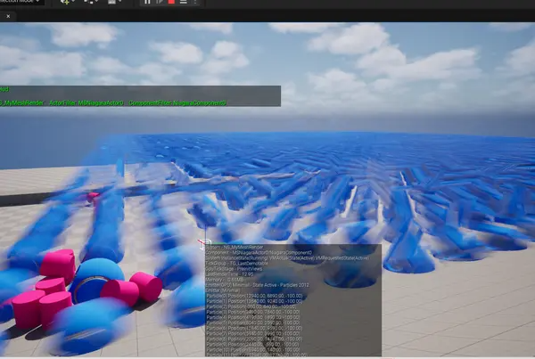
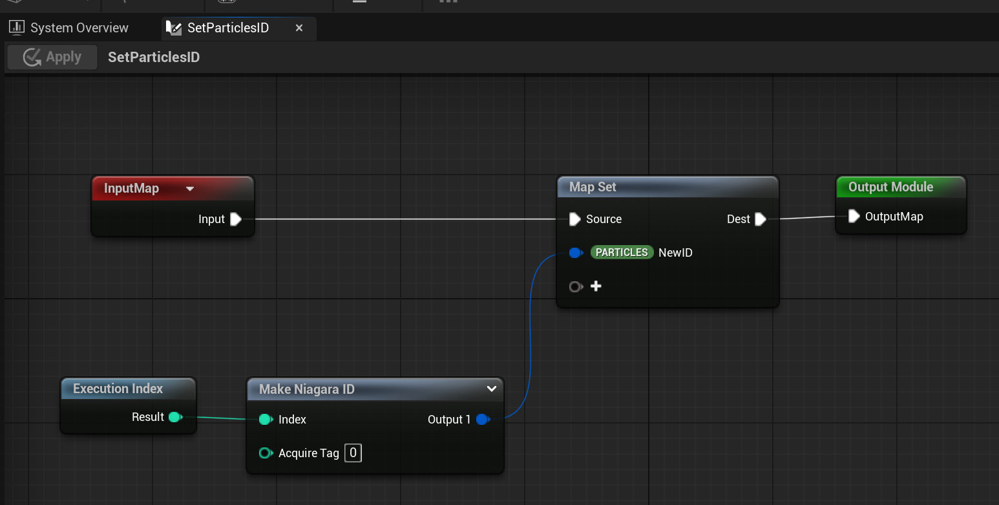
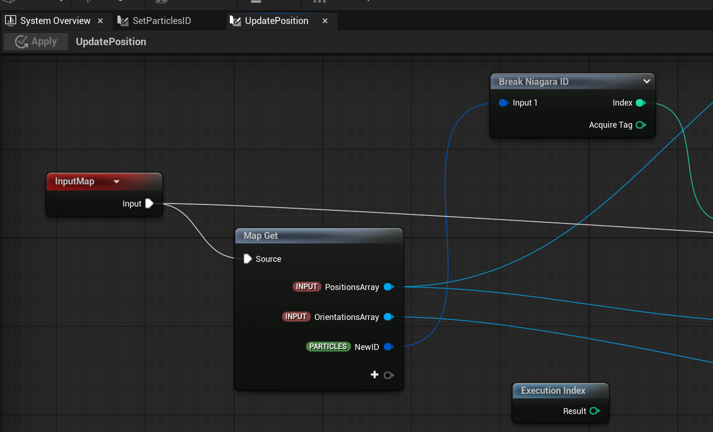
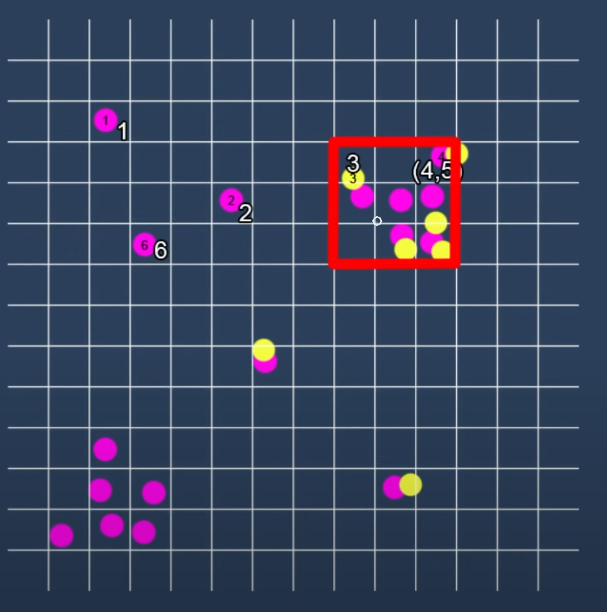
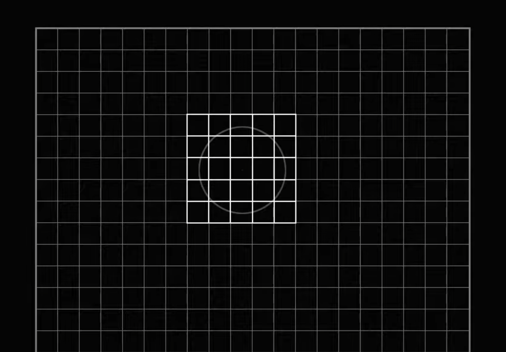
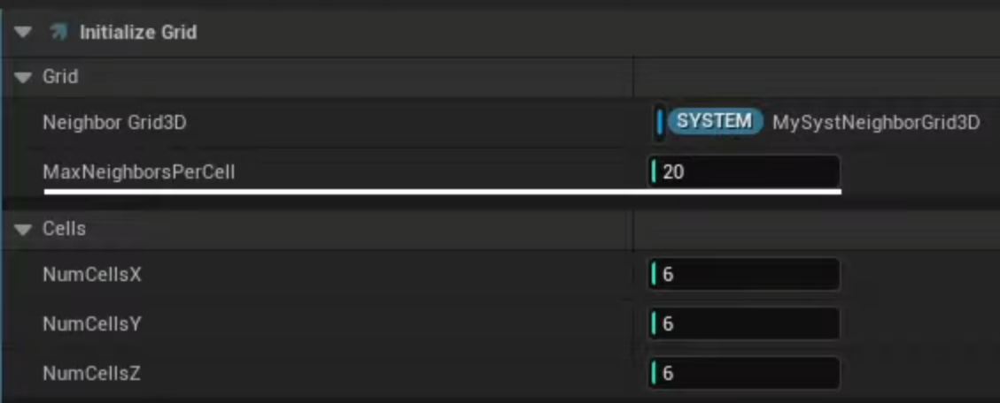

# Mass Entities 物理系统实现思路

MassSample 中的实现思路非常清晰，但MassSample是基于MassGamePlay的实现的，这里记录一下只使用MassEntity的情况下的实现思路，大致是一样的只有一点点小小的差别。

为什么需要Chaos，虽然Niagara 的粒子也能开启碰撞，但只能模拟点粒子，对物理刚体的模拟效果非常有限。

## MassSample 存在的一个BUG
如图，当entities数量超过64个时（不同配置的电脑不一致），Niagara渲染的Mesh会出现频繁的闪烁问题。这个问题导致我研究了好久，因为MassSample里面运行这个个项目是“没有BUG”的。
而自己的项目却有。

当在自己项目里面，使用相同配置的Niagara发射器却出现了疯狂闪烁问题。即使只是设置了一次数据，Niagara的GPU模拟依旧一直在闪烁。

逐个配置排查，最终发现MassSample的config里关闭了默认的运动模糊，手动把它打开，成功重现这个BUG：

`r.DefaultFeature.MotionBlur 1` 

但直接关闭运动模糊，并不算真正从根本上解决这个问题，依然能看到贴图在轻微闪烁，说明Niagara系统依然认为这些Mesh的位置在变化。

打开调试模式，确实能看到Niagara粒子的位置在变化，即使是更新了一个位置信息，这就说明 MassSample 给的发射器是有问题的。看了下issues，其他人也遇到过类似问题：
https://github.com/Megafunk/MassSample/issues/48

两者解决办法：
1. 改用CPU模拟
2. 死磕问题根源，解决GPU Niagara 下exec index 跳动

我选择了第二种，偶然发现的，不清楚有没有更加简洁的解决办法。

因为默认的NiagaraID无法设置，在粒子spawn阶段自己定义一个新的：
{width=70%}

在粒子的update阶段：使用自己的NiagaraID，弃用exec index：
{width=70%}

## Niagara的局限性
Niagara自碰撞的实现方式大概有两种，PBD 或者 RBD，PBD的密度约束方程适合任何物体，而RBD是对PBD的刚体实现，计算更加简单。UE5 ContentSample 自带一些 PBD 的实现。

{width=50%}

{width=50%}

{width=30%}

参考：
- https://zhuanlan.zhihu.com/p/48737753
- https://www.youtube.com/watch?v=wfWy08DbmYM

但这些实现都把碰撞简化成了小球体，对真正的刚体的模拟效果非常有限。尤其是一些长条形，质心不规则的物体，所以需要Chaos。

## Chaos 的局限

- Chaos 必须使用主线程来访问物理粒子，比如获取位置，设置休眠，销毁等。
- 大量Chaos粒子如果开始进入碰撞解算阶段，碰撞频繁时期性能会急剧下降。
- chaos 刚体的几何形状越复杂，计算量越大，性能最好是球体，其次是AABB盒体。(两者差别并不大)
- 自动休眠的物理粒子，测试发现是基于屏幕空间的，距离玩家越近越能获得解算权重。虽然性能好，但模拟效果差。比如天上的物体，开启了重力模拟，但就是不会掉下来。只要玩家视角注视着它们，才会逐个掉下来，还不是一整片。

## Mass 介入

一种大量物体炸开的场景：
- 这个瞬间，速度很快，玩家看不到穿模的问题，大量的实体直接使用Niagara的RBD来模拟，避免卡顿。
- 对于靠近（飞向）玩家的实体，转化为Chaos的刚体，获得相较精确的物理模拟。理论上维持300左右的AABB碰撞盒不会造成卡顿。

Mass做的就是动态地计算，哪些实体需要转化为Chaos的刚体，哪些实体需要转化为Niagara的粒子。这个更新频率不需要每帧都做，根据需要调整。

UE5最新的Niagara支持读取GPU的粒子数据，难点在于重新设置回去，数组长度变化导致粒子索引不对应的问题，会导致画面闪烁。

需要的处理器：
- Chaos观察者处理器：用于把需要转化的entities，初始化Chaos的Handle。参考MassSample
- Transform同步处理器：互相之间同步Transform， 比如chaos的transform同步给实体的ISM，或者Niagara粒子都行。（实测ISM的移动有些模糊，Niagara的粒子则没有这个问题，但ISM的性能更好一点点）
- 转化判断处理器：用于把Niagara粒子转化为Chaos刚体，或者反过来。
- 简化运动LOD处理器：可选，对于非常远的entities，用低频更新的Mass处理器直接计算位置。

## Subsystem
实现一个UMassPhysicsSubSystem，继承自`UMassSubsystemBase`。必须是这个，而不是`UMassEntitySubsystem`（这个应该是Editor专用的），否则会创建多个子系统，导致观测者会有多次回调。

- 使用它同一个管理全局的  `EntityManager`, `EntityManager = UE::Mass::Utils::GetEntityManagerChecked(*World).AsShared();`
- 缓存全局的基础原型`Archetype`, 用于配置chunkSize 

 ## Reference
 - [Mass社区Sample](https://github.com/Megafunk/MassSample/)
 