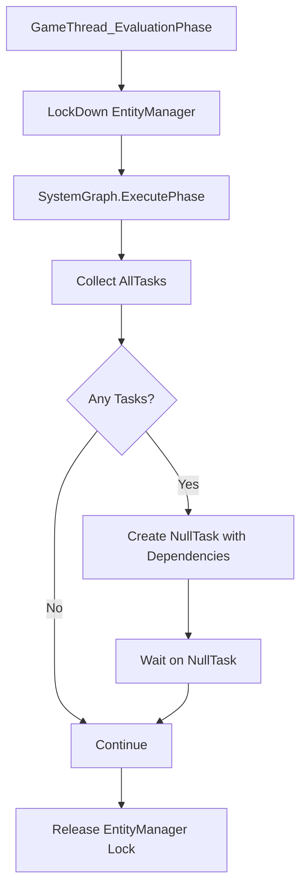

# ECS in UE5 Source Code

最近，研究UMG Widget 动画更新流程，发现 播放动画的UUMGSequencePlayer其实基于ECS架构来实现的，记录一下。

## 两种播放模式

- CVarUserWidgetUseParallelAnimation

```cpp
TAutoConsoleVariable<bool> CVarUserWidgetUseParallelAnimation(
	TEXT("Widget.UseParallelAnimation"),
	true,
	TEXT("Use multi-threaded evaluation for widget animations."),
	ECVF_Default
);
```

这个变量非常关键，它控制 UMG 动画 是不是使用多线程，默认是多线程的。

于是顺藤摸瓜，找到两处关键tick，他们都是源自于主线程（GameThread）。


- UUserWidget的NativeTick:
  
  `void UUserWidget::NativeTick(const FGeometry& MyGeometry, float InDeltaTime)`

- UUMGSequenceTickManager的init函数:
  
  `FDelegateHandle PreTickHandle = SlateApp.OnPreTick().AddUObject(this, &UUMGSequenceTickManager::TickWidgetAnimations);`

### 同步模式关键代码

```cpp
// 同步模式时候：

// TickWidgetAnimations 什么也不干，直接返回。
void UUMGSequenceTickManager::TickWidgetAnimations(float DeltaSeconds)
{
	if (!CVarUserWidgetUseParallelAnimation.GetValueOnGameThread())
	{
		return;
	}
    // ...

// 执行权交给UUserWidget的TickActionsAndAnimation来处理动画。     
void UUserWidget::NativeTick(const FGeometry& MyGeometry, float InDeltaTime)
{ 
    // ...
if (!CVarUserWidgetUseParallelAnimation.GetValueOnGameThread())
			{
				TickActionsAndAnimation(InDeltaTime);
				PostTickActionsAndAnimation(InDeltaTime);
			}
    // ...

// UserWidget 自己调用UUMGSequencePlayer来播放动画
void UUserWidget::TickActionsAndAnimation(float InDeltaTime)
{
    // ...
	for (int32 Index = 0; Index < ActiveSequencePlayers.Num(); Index++)
	{
		UUMGSequencePlayer* Player = ActiveSequencePlayers[Index];
		Player->Tick(InDeltaTime);
	}
}
```

### 并行模式关键代码

FMovieSceneEntitySystemRunner 是虚幻引擎中 Sequencer 模块的核心类，负责协调和管理电影场景（MovieScene）实体系统的更新与评估流程。

其中，Flush 方法的 时间预算控制（BudgetMs） 是一个关键性能优化机制，旨在防止单帧因处理大量实体更新而卡顿，同时支持跨帧增量处理复杂任务。
```cpp
//并行模式都在TickWidgetAnimations中处理。
void UUMGSequenceTickManager::TickWidgetAnimations(float DeltaSeconds)
{
     
    // ...
    // 最终还是会调用的UserWidget->TickActionsAndAnimation
    if (bTickAnimations && UserWidget->IsVisible())
				{
					UserWidget->TickActionsAndAnimation(DeltaSeconds);
					WidgetData.bActionsAndAnimationTicked = true;
				}

				// Assume this widget will no longer tick, until we're told otherwise by way of OnWidgetTicked
				WidgetData.bIsTicking = false;
    // ...

    //这里会调用FMovieSceneEntitySystemRunner::Flush
    ForceFlush();

}
```
在并行模式下，通过FMovieSceneEntitySystemRunner 实现了：

- 避免单帧过载：当场景中存在大量实体（如动画、特效）需要更新时，直接全量处理可能导致单帧耗时过长，引发帧率下降或卡顿。

- 增量处理（Incremental Processing）：将耗时操作分摊到多帧完成，确保每帧处理时间可控，维持引擎流畅运行。

- 实时响应性：优先处理高优先级任务（如玩家角色的关键动画），将低优先级任务延迟处理。

::: details 细节
**1. `Widget.UseParallelAnimation` 为 `false` 时 (同步模式)：**

   *   **调用时机：**  `UUserWidget::TickActionsAndAnimation` 直接在 `UUserWidget::NativeTick` 中被同步调用。 `UUserWidget::NativeTick` 是在游戏主线程上执行的 Slate Tick 函数。

   *   **执行方式：** `UUserWidget::TickActionsAndAnimation` 内部循环遍历 `ActiveSequencePlayers`，并直接调用每个 `UUMGSequencePlayer` 的 `Tick` 函数。 `UUMGSequencePlayer::Tick` 会执行动画的时间更新、范围检查和评估，最终会调用 `FMovieSceneEntitySystemRunner::Flush` 。但是，因为 `Widget.UseParallelAnimation` 为 `false`,  `FMovieSceneEntitySystemRunner::Flush` 只会在主线程中执行，不会涉及并行。
    *   **评估方式：**  动画的评估完全是同步的。这意味着 `UUMGSequencePlayer::Tick` 会执行完当前帧的所有评估工作，然后才会返回。所有的动画计算都发生在主线程。

   *   **控制流：** `UUserWidget` 自己控制动画的 Tick，以及动画的播放、暂停和停止。

   *   **总结：** 在这种模式下，动画的评估是完全串行的，发生在主线程，可能会阻塞主线程的运行。

**2. `Widget.UseParallelAnimation` 为 `true` 时 (并行模式)：**

   *   **调用时机：** `UUserWidget::TickActionsAndAnimation` 不再直接在 `UUserWidget::NativeTick` 中被调用。 取而代之的是：
       *   `UUserWidget::NativeTick`  仅仅将 `UUserWidget`  标记为 "需要Tick动画" (通过设置 `WidgetData->bIsTicking = true;`)
       *  `UUMGSequenceTickManager::TickWidgetAnimations` 会在 Slate 的 PreTick 中执行（也是主线程）。
       *  `UUMGSequenceTickManager::TickWidgetAnimations` 会遍历所有需要 Tick 的 Widget，并调用每个 Widget 的 `UUserWidget::TickActionsAndAnimation`。

   *   **执行方式：**  即使 `UUserWidget::TickActionsAndAnimation` 被调用，它的执行方式仍然非常关键。
        *   `UUMGSequencePlayer::Tick` 的逻辑仍然不变，但是，这次调用后 `FMovieSceneEntitySystemRunner::Flush` 并不会立即执行，而是会把所有的动画评估任务提交给 Runner 的队列。
        *   真正的动画评估会被推迟到 `FMovieSceneEntitySystemRunner::Flush` 中，而 `FMovieSceneEntitySystemRunner::Flush`  会使用 Task Graph 来进行并行处理。

   *   **评估方式：**  动画评估是异步的，并且有可能并行执行。 `UUMGSequencePlayer::Tick`  只是把需要做的事情告诉了 Runner，而实际的评估工作会在后台线程上执行。

   *   **控制流：**  `UUMGSequenceTickManager` 接管了动画 Tick 的控制，`UUserWidget` 不再直接负责动画的评估，而是把这个任务委托给了 TickManager。

   *   **总结：**  在这种模式下，动画的评估是异步的，有可能并行进行，从而减轻主线程的负担。
:::


为了更好地理解，可以把两种模式的流程简化为：

**同步模式 (`CVarUserWidgetUseParallelAnimation = false`):**

```
Game Thread:
    UUserWidget::NativeTick
        UUserWidget::TickActionsAndAnimation
            Loop (UUMGSequencePlayer):
                UUMGSequencePlayer::Tick
                    FMovieSceneEntitySystemRunner::QueueUpdate
                    FMovieSceneEntitySystemRunner::Flush (同步执行)
```

**并行模式 (`CVarUserWidgetUseParallelAnimation = true`):**

```
Game Thread:
    UUserWidget::NativeTick
         标记 UUserWidget 需要Tick动画

Game Thread (Slate PreTick):
    UUMGSequenceTickManager::TickWidgetAnimations
        Loop (UUserWidget):
             UUserWidget::TickActionsAndAnimation
                Loop (UUMGSequencePlayer):
                   UUMGSequencePlayer::Tick
                      FMovieSceneEntitySystemRunner::QueueUpdate

    FMovieSceneEntitySystemRunner::Flush (异步执行)
        多个线程并行执行评估任务
```

### FMovieSceneEntitySystemRunner 
它的内部的调用了TaskGraph来进行并行。

```cpp
// 大量使用了TaskGraph来进行任务调度，可以参考它的代码
FGraphEventArray AllTasks;
Linker->SystemGraph.ExecutePhase(..., AllTasks);

TGraphTask<FNullGraphTask>::CreateTask(&AllTasks, ...)
.ConstructAndDispatchWhenReady(...);
```

::: details SystemRunner GameThread_EvaluationPhase 节选
##### FMovieSceneEntitySystemRunner GameThread_EvaluationPhase 流程

:::    

## ECS 在 MovieScene 中的实现

### Entity（实体）系统：

- MovieSceneEntityManager 是核心管理器，负责实体的创建、销毁和管理
- 使用 **FMovieSceneEntityID** 作为实体的唯一标识符
- 实体的生命周期管理：AllocateEntity、FreeEntity、DestroyAllocation 等方法

```cpp
// FMovieSceneEntityID 只是一个唯一标识符，但实体的实际数据（包括它的组件数据）存储在哪里，还需要用 FEntityLocation 进行映射
FMovieSceneEntityID FEntityManager::AllocateEntity()
{
	CheckCanChangeStructure();

	const int32 NewEntityIndex = EntityLocations.Add(FEntityLocation()); // 添加一个新的位置记录

	return FMovieSceneEntityID::FromIndex(NewEntityIndex); // 返回对应的实体ID
}

// FEntityLocation 就像一个"地址簿"，记录了每个实体ID对应的实际存储位置
struct FEntityLocation
{
    uint16 AllocationIndex;              // 实体所在的内存块索引
    uint16 EntryIndexWithinAllocation;   // 实体在该内存块中的具体位置
    FMovieSceneEntityID ParentID;        // 父实体ID（用于层级关系）
}

// 真正代表实体的数据块（需要对齐后放进缓存行的那个）
struct FEntityAllocation
{
    uint32 UniqueID;                     // 唯一标识符
    uint16 NumComponents;                // 组件数量
    uint16 Size;                         // 当前使用的实体数量
    uint16 Capacity;                     // 总容量
    uint16 MaxCapacity;                  // 最大容量
    FComponentHeader* ComponentHeaders;   // 组件头数组
    FMovieSceneEntityID* EntityIDs;      // 实体ID数组
    uint8* ComponentData;                // 组件数据
};

// 初始化一个实体分配，一堆内存对齐工作
static FEntityAllocation* Initialize(const FEntityManager& EntityManager, const FComponentMask& EntityComponentMask, const FEntityAllocationInitializationInfo& InitInfo)
	{
		const FEntityAllocationWriteContext WriteContext(EntityManager);
		check(IsValidUint16(InitInfo.NumComponents));

		// Compute the size that we need: struct size + component headers array + entity IDs array.
		const SIZE_T RawStructSize = sizeof(FEntityAllocation);
		const SIZE_T TotalAllocationSize = RawStructSize + 
			alignof(FComponentHeader) + InitInfo.SizeofComponentHeaders + 
			alignof(FMovieSceneEntityID) + InitInfo.SizeofEntityIDs;

		// Allocate the structure.
		uint8* const AllocationStart = (uint8*)FMemory::Malloc(TotalAllocationSize);
		FEntityAllocation* const Allocation = new (AllocationStart) FEntityAllocation();

		// Initialize the structure.
		Allocation->UniqueID = InitInfo.AllocationID;
		Allocation->NumComponents = InitInfo.NumComponents;
		Allocation->Size = 0;
		Allocation->Capacity = InitInfo.InitialCapacity;
		Allocation->MaxCapacity = InitInfo.MaxCapacity;
		Allocation->SerialNumber = WriteContext.GetSystemSerial();
// 省略1000行代码...


```

映射关系：
(还是比较复杂了，并不是我想象中，EntityID 直接 对应 FEntityAllocation，多了一层索引层，更加合理)
```sh
FMovieSceneEntityID -> FEntityLocation -> FEntityAllocation
```
- **实体ID映射**：`FMovieSceneEntityID`到`FEntityAllocation`的映射实际通过两级索引：
  1. `EntityLocations`数组存储`FEntityLocation`
  2. `FEntityLocation::AllocationIndex`指向`EntityAllocations`稀疏数组

**FEntityAllocation的内存布局**

```sh
FEntityAllocation
├── ComponentHeaders[]           // 组件类型信息数组
├── EntityIDs[]                 // 实体ID数组
└── ComponentData              // 实际的组件数据
    ├── Component1[Capacity]   // 第一种组件的数据数组
    ├── Component2[Capacity]   // 第二种组件的数据数组
    └── Component3[Capacity]   // 第三种组件的数据数组

```

#### 原型 (Archetypes)
- 相同组件构成的实体会被分配到同一个 FEntityAllocation
- 当一个 FEntityAllocation 满了，会创建新的

```sh
// 实体类型A（有Position和Velocity组件）
FEntityAllocation_1
    - Entity1 {Position, Velocity}
    - Entity2 {Position, Velocity}
    - Entity3 {Position, Velocity}

// 实体类型B（有Position和Color组件）
FEntityAllocation_2
    - Entity4 {Position, Color}
    - Entity5 {Position, Color}

// 实体类型C（全部组件）
FEntityAllocation_3
    - Entity6 {Position, Velocity, Color}
    - Entity7 {Position, Velocity, Color}
```    
一些实现细节：
```cpp

class FEntityManager {
    // 存储多个EntityAllocation
    TSparseArray<FEntityAllocation*> EntityAllocations;
    
    // 每个Allocation的组件掩码（用于快速判断Allocation包含哪些组件）
    TArray<FComponentMask> EntityAllocationMasks;
};

struct FEntityAllocation {
    uint16 Size;        // 当前使用的实体数量
    uint16 Capacity;    // 总容量
    uint16 MaxCapacity; // 最大容量
    // ...
};

//当分配新实体时：
// 在 FEntityManager::AllocateEntity 中
if (Allocation->Size >= Allocation->Capacity) {
    // Allocation已满，需要创建新的或扩展现有的
    // 1. 如果 Size >= MaxCapacity，必须创建新的Allocation
    // 2. 如果 Size < MaxCapacity，可以选择扩展现有的
}
```
之所以有容量限制是：
- 内存管理的可预测性
- 避免过大的内存块
- 便于并行处理
- 更好的内存局部性

#### 印象中是SOA (Struct of Arrays) 布局：
看起来和传统的ECS有些不一样。

```cpp
// AOS方式
struct Entity {
    Component1 comp1[capacity];
    Component2 comp2[capacity];
    Component3 comp3[capacity];
};
 
```

#### UE的 SOA 实现：
UE实际采用"Chunk-based Archetype"模式，每个FEntityAllocation对应一个原型（Archetype），内部采用SOA，但不同原型之间独立

FEntityAllocation 就是Chunk-based 设计的：

```cpp
struct FEntityAllocation {
    uint16 Capacity;    // chunk的容量
    uint16 Size;        // 当前使用量
    uint8* ComponentData; // chunk的数据区，指向所有组件数据的起始位置
};

// 同一个chunk中的实体组件数据紧密排列
┌─────────────────────┐
│ Chunk (Allocation)  │
├─────────────────────┤
│ Position[1024]      │ <- 连续的1024个Position
│ Velocity[1024]      │ <- 连续的1024个Velocity
└─────────────────────┘

// 多种Archetype下的内存布局
Archetype A (Position, Velocity)
┌───────────────┐
│ Position[0..N]│
│ Velocity[0..N]│
└───────────────┘

Archetype B (Position, Color)
┌───────────────┐
│ Position[0..M]│
│ Color   [0..M]│
└───────────────┘

// Chunk 的扩容
static const uint16 MaxCapacity = 64;  // 默认最大容量
uint16 DefaultCapacity = 4;           // 默认初始容量

具体实现比较复杂，在：
FEntityAllocation* GrowAllocation(int32 AllocationIndex, int32 MinNumToGrowBy)
{
    // 1. 创建新的更大的Allocation
    // 2. 迁移数据
    // 3. 更新引用
}

// 数据迁移
// 两种迁移方式：
if (bOnlyTagComponentsChanged)
{
    // 1. 如果只改变了标签组件，直接"偷"原来的内存
    Dest = CreateEntityAllocation(NewComponentMask, Source->GetCapacity(), Source->GetMaxCapacity(), Source);
}
else
{
    // 2. 如果改变了数据组件，需要重新分配并复制
    Dest = CreateEntityAllocation(NewComponentMask, Source->GetCapacity(), Source->GetMaxCapacity());
    // ... 复制数据 ...
}
```

#### UE 的方式更加灵活

1. 指针的灵活性
```cpp
uint8* ComponentData = Header->GetValuePtr(0);
// 等价于但比数组更灵活：
Position positions[MAX_ENTITIES];
```
2. 访问方式：
```cpp
// 获取Entity2的Position组件(大佬操作就是不一样)
Position* pos = (Position*)(ComponentData + sizeof(Position) * 1);

// 获取所有Entity的Position组件（SIMD友好）
Position* allPositions = (Position*)ComponentData;
// 可以直接遍历allPositions[0]到allPositions[Size-1]
```
3. 内存对齐：
```cpp
// 每个组件类型之间有缓存行对齐
uint8 Alignment = FMath::Max<uint8>(PLATFORM_CACHE_LINE_SIZE, TypeInfo.Alignment);
ComponentDataPtr = Align(ComponentDataPtr, Alignment);
```

#### 最终的内存布局：
```sh
// 假设我们有3个实体，每个实体有3种组件
FEntityAllocation 内存布局（实际物理内存）：
│
├── FEntityAllocation结构体
│   ├── UniqueID
│   ├── NumComponents = 3
│   ├── Size = 3 (当前实体数量)
│   └── Capacity = 4 (最大实体数量)
│
├── ComponentHeaders[] (组件类型信息)
│   ├── Header1 {ComponentType=Position, Sizeof=12}
│   ├── Header2 {ComponentType=Velocity, Sizeof=12}
│   └── Header3 {ComponentType=Color, Sizeof=16}
│
├── EntityIDs[] (实体ID数组)
│   ├── EntityID[0] = 1
│   ├── EntityID[1] = 2
│   └── EntityID[2] = 3
│
└── ComponentData (uint8* 指向的内存块)
    │
    ├── Position组件数据块 (连续的12*4字节)
    │   ├── Entity1.Position {x=1, y=2, z=3}     // 偏移量 0
    │   ├── Entity2.Position {x=4, y=5, z=6}     // 偏移量 12
    │   ├── Entity3.Position {x=7, y=8, z=9}     // 偏移量 24
    │   └── [预留位置]                           // 偏移量 36 (为第4个实体预留)
    │   
    ├── [缓存行对齐填充]
    │   
    ├── Velocity组件数据块 (连续的12*4字节)
    │   ├── Entity1.Velocity {x=1, y=0, z=0}     // 偏移量 64
    │   ├── Entity2.Velocity {x=0, y=1, z=0}     // 偏移量 76
    │   ├── Entity3.Velocity {x=0, y=0, z=1}     // 偏移量 88
    │   └── [预留位置]                           // 偏移量 100
    │   
    ├── [缓存行对齐填充]
    │   
    └── Color组件数据块 (连续的16*4字节)
        ├── Entity1.Color {r=255, g=0, b=0, a=255}    // 偏移量 128
        ├── Entity2.Color {r=0, g=255, b=0, a=255}    // 偏移量 144
        ├── Entity3.Color {r=0, g=0, b=255, a=255}    // 偏移量 160
        └── [预留位置]                                // 偏移量 176

```

### Component（组件）系统：
- BuiltInComponentTypes 定义了内置组件类型
- MovieSceneComponentRegistry 负责组件的注册
- 组件操作：AddComponent、RemoveComponent、CopyComponent 等方法
- 使用 **FComponentMask** 来管理实体拥有的组件集合

```cpp
// 学习一下它的EnumHasAnyFlags的使用：
class FEntityManager {
    // 每个Allocation的组件掩码
    TArray<FComponentMask> EntityAllocationMasks;
};

// FComponentMask实际上是一个位图（bitmap）
struct FComponentMask {
    uint32 Bits[N];  // N是根据最大组件数决定的
};


//工作原理：


// 假设组件类型的定义
enum EComponentType {
    Position  = 0,   // 0000 0001
    Velocity  = 1,   // 0000 0010
    Color     = 2,   // 0000 0100
    Health    = 3    // 0000 1000
};

// Allocation A 包含 Position 和 Velocity
EntityAllocationMasks[A] = 0000 0011  // Position | Velocity

// Allocation B 包含 Position 和 Color
EntityAllocationMasks[B] = 0000 0101  // Position | Color

// 快速判断：
bool HasComponents = (EntityAllocationMasks[A] & RequiredComponents) == RequiredComponents;


//AddComponent的递归添加：


// 枚举定义（使用位标志）
enum class EEntityRecursion : uint8 {
    None     = 0,         // 0000 0000
    This     = 1 << 0,    // 0000 0001
    Children = 1 << 1,    // 0000 0010
    Both     = This | Children  // 0000 0011
};

void AddComponent(..., EEntityRecursion Recursion)
{
    // 检查是否包含"This"标志
    if (EnumHasAnyFlags(Recursion, EEntityRecursion::This))
    {
        // 给当前实体添加组件
        AddComponent(ThisEntityID, ComponentTypeID);
    }

    // 检查是否包含"Children"标志
    if (EnumHasAnyFlags(Recursion, EEntityRecursion::Children))
    {
        // 遍历所有子实体，也给它们添加组件
        IterateChildren_ParentFirst(ThisEntityID, [this, ComponentTypeID](FMovieSceneEntityID EntityID)
        {
            this->AddComponent(EntityID, ComponentTypeID);
        });
    }
}

// 使用示例：
// 1. 只给当前实体添加组件
AddComponent(entityID, componentID, EEntityRecursion::This);

// 2. 给当前实体及其所有子实体添加组件
AddComponent(entityID, componentID, EEntityRecursion::Both);

// 3. 只给子实体添加组件
AddComponent(entityID, componentID, EEntityRecursion::Children);
```

### System（系统）实现：
- MovieSceneEntitySystem 作为基础系统类
- MovieSceneEntitySystemLinker 负责系统之间的关联
- MovieSceneEntitySystemRunner 负责系统的运行时执行

### 内存管理和性能优化：
- 使用 FEntityAllocation 进行实体的内存分配
- 实现了内存池和对象池来优化性能
- 支持多线程评估（当实体数量超过阈值时）
