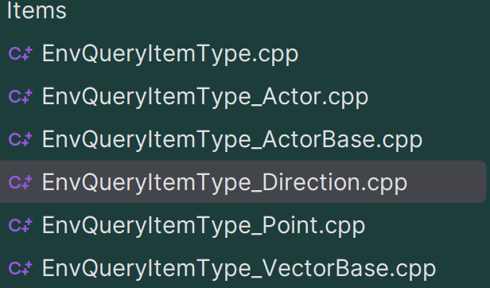
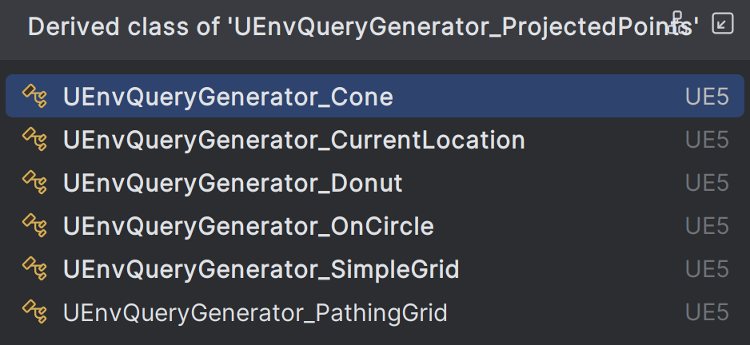
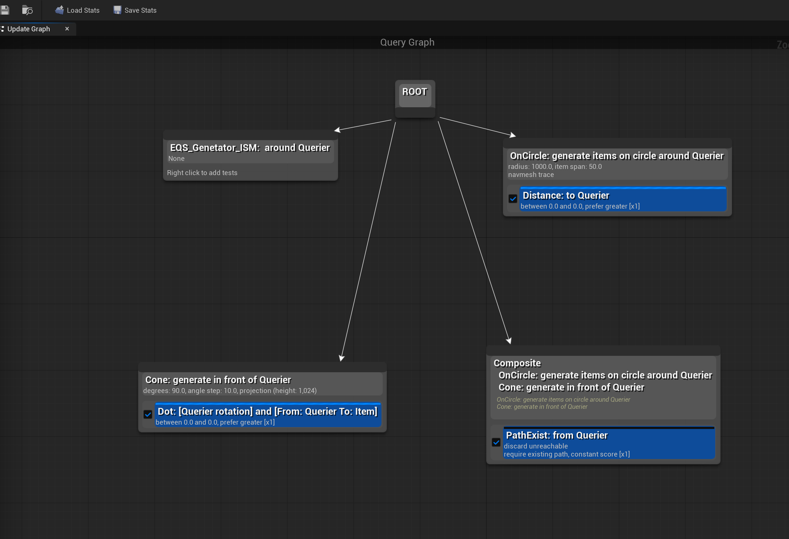
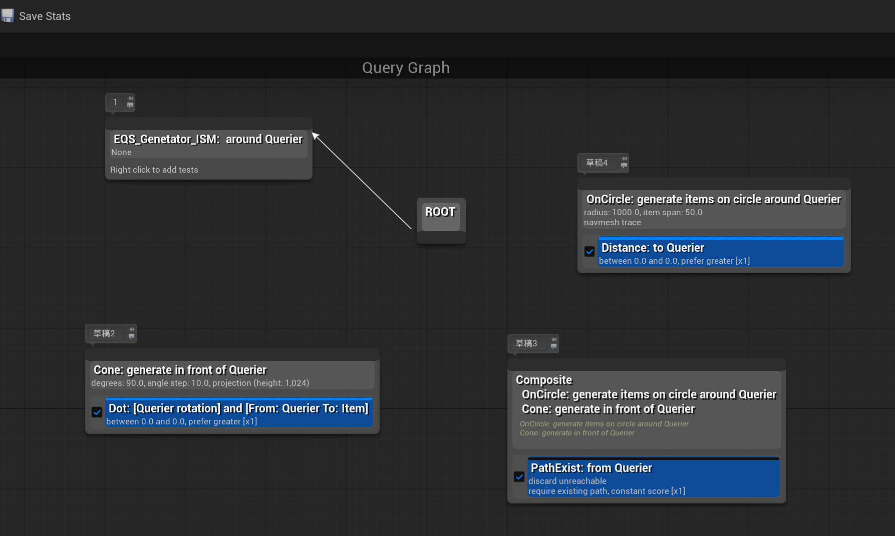

# EQS 问题记录

## EQS 运行逻辑
### 查询点的生成器
EQS Graph就是用来配置生成器的，提供了一系列的生成器节点，Circle，Cone, Donut 等。

### EQS 查询上下文提供者

蓝图里，继承`UEnvQueryContext_BlueprintBase`可以自定义查询上下文

它是根据实现函数来决定具体使用哪个上下文的：
```cpp
UEnvQueryContext_BlueprintBase::UEnvQueryContext_BlueprintBase(const FObjectInitializer& ObjectInitializer) 
	: Super(ObjectInitializer), CallMode(UEnvQueryContext_BlueprintBase::InvalidCallMode)
{
	UClass* StopAtClass = UEnvQueryContext_BlueprintBase::StaticClass();	
	bool bImplementsProvideSingleActor = DoesImplementBPFunction(GET_FUNCTION_NAME_CHECKED(UEnvQueryContext_BlueprintBase, ProvideSingleActor), this, StopAtClass);
	bool bImplementsProvideSingleLocation = DoesImplementBPFunction(GET_FUNCTION_NAME_CHECKED(UEnvQueryContext_BlueprintBase, ProvideSingleLocation), this, StopAtClass);
	bool bImplementsProvideActorSet = DoesImplementBPFunction(GET_FUNCTION_NAME_CHECKED(UEnvQueryContext_BlueprintBase, ProvideActorsSet), this, StopAtClass);
	bool bImplementsProvideLocationsSet = DoesImplementBPFunction(GET_FUNCTION_NAME_CHECKED(UEnvQueryContext_BlueprintBase, ProvideLocationsSet), this, StopAtClass);

	int32 ImplementationsCount = 0;
	if (bImplementsProvideSingleActor)
	{
		++ImplementationsCount;
		CallMode = SingleActor;
	}

	if (bImplementsProvideSingleLocation)
	{
		++ImplementationsCount;
		CallMode = SingleLocation;
	}

	if (bImplementsProvideActorSet)
	{
		++ImplementationsCount;
		CallMode = ActorSet;
	}

	if (bImplementsProvideLocationsSet)
	{
		++ImplementationsCount;
		CallMode = LocationSet;
	}
```

可以看出，如果都实现，那么CallMode最高优先级是`LocationSet`(其中的ImplementationsCount 没有任何作用)

最后根据CallMode转换成 `FEnvQueryContextData`，该数据的构造来自两个路径：
- `UEnvQueryItemType_Point::SetContextHelper(ContextData, ResultingLocation);`
- `UEnvQueryItemType_Actor::SetContextHelper(ContextData, ActorSet);`

`FEnvQueryContextData` 维护一个类型擦除的指针数组RawData，让它支持多种数据类型， 并且提供了一系列的GetValue/SetValue接口来访问这些数据：
{width=30%}

### EQS 各种Test
有了生成器，和上下文提供者，就可以配置各种Test了。比如距离测试：`UEnvQueryTest_Distance`，

运行逻辑：
```cpp
// Outer loop: Iterates through each "Item" generated by the generator.
// e.g., each of the 24 points on the circle.
for (FEnvQueryInstance::ItemIterator It(this, QueryInstance); It; ++It)
{
    // ...
    // Inner loop: Iterates through each location provided by the context.
    // e.g., the location of each actor you provided.
    for (int32 ContextIndex = 0; ContextIndex < ContextLocations.Num(); ContextIndex++)
    {
        // ...
        const float Distance = CalcDistance3D(ItemLocation, ContextLocations[ContextIndex]);
        It.SetScore(TestPurpose, FilterType, Distance, MinThresholdValue, MaxThresholdValue);
    }
}

```
- 外层循环 (ItemIterator): 这个循环遍历的是由 Generator (例如 EnvQueryGenerator_OnCircle) 生成的每一个查询项 (Item)。比如圆上的那24个点中的每一个点。It 这个迭代器代表着当前正在被测试的那个点。
- 内层循环 (ContextIndex): 这个循环遍历的是由 Context (例如自定义的上下文提供者) 提供的每一个目标。

可以看成，测试是支持多目标的。It的评分也是基于多目标的。会根据测试的参数进行比较和更新。

一些规则：
- Test Purpose:
    - Score Only: 只打分，不淘汰。
    - Filter Only: 只根据阈值 (threshold) 淘汰，不改变分数。
    - Score and Filter: 两者都做。

- Filter Type:
    - Minimum: 想要最小的值。当新的 Distance 小于当前记录的分数时，更新分数。
    - Maximum: 想要最大的值。当新的 Distance 大于当前记录的分数时，更新分数。
    - Range: 分数必须在 MinThreshold 和 MaxThreshold 之间才算有效。
    - Average: 将所有 Distance 加起来，最后取平均值。（这个模式在SetScore内部处理会更复杂，需要累加和计数）

### 总结
用一个例子来说明：
用Circle生成24个点，查询附近最近的3个Actor
*   **Generator**: `EnvQueryGenerator_OnCircle` 生成了24个点。我们称之为 `P1, P2, ... P24`。
*   **Context**: 自定义的`UEnvQueryContext_BlueprintBase` 提供了3个Actors。我们称之为 `ActorA, ActorB, ActorC`。
*   **Test**: `EnvQueryTest_Distance`。假设 `Test Purpose` 设置为 `Score Only`，`Filter Type` 设置为 `Minimum`。该配置，意为“找到离目标堆最近的点”。

当 `Context` 提供多个数据源时，距离测试的工作方式是：
**对于每一个由Generator生成的“备选位置”(Item)，它会计算此位置到所有Context提供的“目标”(e.g., Actors)的距离，并根据配置的 `Filter Type`（例如Minimum, Maximum, Average）将这些距离聚合成 (aggregate) 一个单一的、最终的分数。**


## EQS生成点的逻辑，和NavMesh的强关联的

```cpp
ProjectAndFilterNavPoints(NavLocations, QueryInstance);
StoreNavPoints(NavLocations, QueryInstance);
```
图里这些子类型，如`UEnvQueryGenerator_OnCircle`，必须基于NavMesh来做


如果游戏不是基于NavMesh做导航，图里这些的Generator全部没法用

## EQS的Graph

这个Graph有些迷惑，根本算不上Graph，几乎没有图该有的特征。

最应该加的功能，类似PCG的按D调试，它却没有。


只有一个作用，打草稿+注释，白线相当于enable，直观些。

## EQS生成器的蓝图子类存在悬垂指针 (Dangling Pointer)

该类型：
```cpp
UCLASS(Abstract, Blueprintable, MinimalAPI)
class UEnvQueryGenerator_BlueprintBase : public UEnvQueryGenerator
```

报错崩溃的位置：

```cpp
void FEnvQueryInstance::ExecuteOneStep(double TimeLimit)
{
	if (!Owner.IsValid())
	{
		MarkAsOwnerLost();
		return;
	}

	check(IsFinished() == false);

	if (!Options.IsValidIndex(OptionIndex))
	{
		NumValidItems = 0;
		FinalizeQuery();
		return;
	}

	SCOPE_CYCLE_COUNTER(STAT_AI_EQS_ExecuteOneStep);

	FEnvQueryOptionInstance& OptionItem = Options[OptionIndex];
	double StepStartTime = FPlatformTime::Seconds();

	const bool bDoingLastTest = (CurrentTest >= OptionItem.Tests.Num() - 1);
	bool bStepDone = true;
	bIsCurrentlyRunningAsync = false;
	CurrentStepTimeLimit = TimeLimit;
	//found a bug here, OptionItem.Generator is null
	 if (!IsValid(OptionItem.Generator))
	 {
		 // generator is null, just return
	 	UE_LOG(LogEQS, Warning, TEXT("Generator is null"));
	 	NumValidItems = 0;
	 	FinalizeQuery();
	 	return;
	 }

	if (CurrentTest < 0)
	{
		bool bRunGenerator = true;
#if USE_EQS_DEBUGGER
		int32 LastValidItems = 0;
#endif
		if (!OptionItem.Generator->IsCurrentlyRunningAsync())
		{
```

程序执行到if (!OptionItem.Generator->IsCurrentlyRunningAsync()) 出了报错崩溃。

编辑器里面，测试的时候有个一个旧实例为 Generator_A，
点击蓝图的“编译”按钮时，UE的后台执行了“热重载 (Hot Reload)” 或更准确地说是“蓝图类重建 (Blueprint Class Recompilation)”。然后，创建一个全新的UClass和新的实例 Generator_B。这个过程也叫"Re-instancing"（实例重构）。
但指针没有更新，FEnvQueryInstance 是一个普通的C++ struct，它并不知道蓝图发生了“身份替换”。它内部的 Generator 指针仍然指向 Generator_A 的内存地址，导致了内存访问冲突，编辑器崩溃。

最可疑的部分就是这个成员变量：
```cpp
private:
    /** this is valid and set only within GenerateItems call */
    mutable FEnvQueryInstance* CachedQueryInstance;

```
它是一个原始指针 (Raw Pointer): FEnvQueryInstance*。它不是 TObjectPtr 或其他智能指针，所以它无法被GC（垃圾回收）系统自动置空。FEnvQueryInstance 本身也不是一个 UObject，它只是一个普通的 struct，所以更谈不上GC管理.

它的生命周期注释非常重要: this is valid and set only within GenerateItems call。这句话是引擎开发者留下的警告，意思是：“这个指针只在 GenerateItems 函数执行期间有效。一旦函数返回，不要相信这个指针指向的任何东西！”


没啥比较好的解决办法，毕竟这个类是引擎内部，修改引擎源代码可能会导致兼容问题，并且修改就得以后都要关注这个类的更新。

我的解决办法是，一旦相关的蓝图之类发生了变化，就不要立马测试，不然编辑器会崩溃。可以先打开另一张地图专门测试这个EQS，这会强制UE重新实例化，解决悬垂指针的问题。

引擎的EQS代码太老了，遇到这种问题，正确的做法应该是用智能指针。

让C++代码对热重载更具抵抗力 (Making C++ More Resilient)
```cpp
// 旧的方式 (Old way, prone to dangling pointers)
UPROPERTY()
UEnvQueryGenerator* MyGenerator;

// 现代UE5的方式 (Modern UE5 way, much safer)
UPROPERTY()
TObjectPtr<UEnvQueryGenerator> MyGenerator;

```

`TObjectPtr` 是一个智能指针包装器 (smart pointer wrapper)，它能被垃圾回收系统 (Garbage Collection, GC) 感知。当它指向的 `UObject` 被销毁时，`TObjectPtr` 会**自动被置为 `nullptr`**！

这就意味着，如果 `FEnvQueryInstance` 内部使用的是 `TObjectPtr<UEnvQueryGenerator>`，那么在蓝图编译导致旧Generator被销毁后，这个指针会自动变空。下一次访问时，`IsValid()` 检查就会失败，程序会走你写的安全退出逻辑，而不是崩溃。