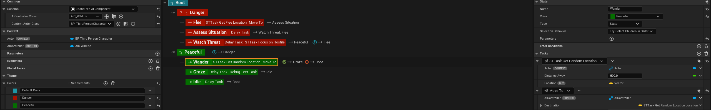
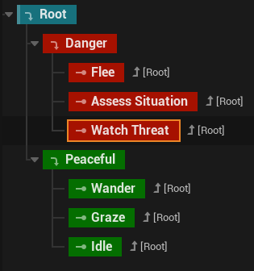
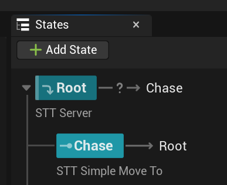
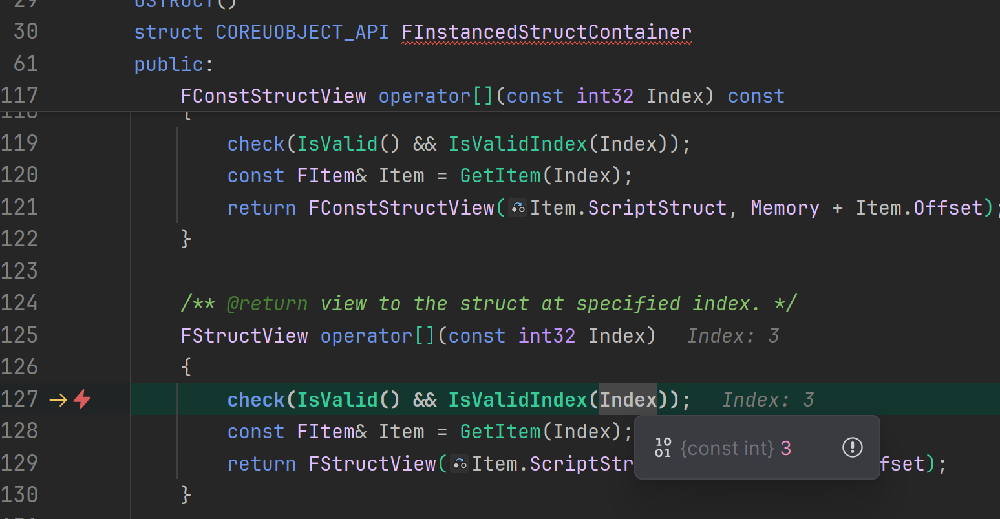
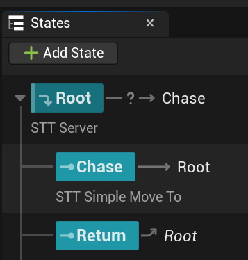

# StateTree 浅析

简单来说，StateTree 是一个增强版的状态机 (State Machine)。它的核心思想是：一个对象（比如一个 AI 角色）在任何时刻都只处于一个明确的状态 (State) 中。它通过定义一系列状态以及状态之间切换的条件 (Transition) 来驱动对象的行为。

它与行为树 (Behavior Tree) 的主要区别在于：

- 行为树：每一帧（或固定的时间间隔）都会从根节点开始遍历，寻找并执行合适的行为分支。它的逻辑是“每时每刻都在决策要做什么”。

- StateTree：一旦进入一个状态，它会持续停留在这个状态，只执行该状态内定义的任务 (Task)。它会不断检查“转换条件 (Transitions)”，只有当某个条件满足时，才会切换到新的状态。这种方式更加高效，因为不需要每一帧都评估整个逻辑树。

StateTree 不仅仅用于 AI，它可以用于管理任何需要清晰状态逻辑的对象，例如一个交互式门的开关状态、一个任务的流程状态等。

官方的学习资料：https://dev.epicgames.com/community/learning/tutorials/lwnR/unreal-engine-your-first-60-minutes-with-statetree


## My Understanding

### 默认状态模式

默认状态（选择）模式，也是就是`Try Select Children In Order`模式, 该模式是状态树最本质的设计哲学。文档里提到状态树的执行行为但没有指明特定模式的话，就是特指`Try Select Children In Order`模式。

#### 执行法则
状态树的执行，就是状态的选择过程，一旦进入了该状态，就会持续停留在这个状态，只执行该状态内定义的任务 (Task)。
默认状态树的选择过程类似于深度优先搜索（Depth-First Search），StateTree 会一直探索到第一个有效的叶子状态（leaf state）

Tasks的搜集过程，是从Root 到 当前激活的Leaf, 按顺序添加。执行时，也是按加入的顺序执行。伪代码如下：
```cpp
void Tick(float DeltaTime)
{
    for (auto& task : tasks)
    {
        task->Tick(DeltaTime);
    }
}

Tree.Tick(DeltaTime);
```
可以看到，Task是按顺序并排执行，既不是并发也不是串行。


#### 状态切换
状态都可以配置`Transitions`规则， 没有配置的，默认返回Root状态。

通常由两种情况可以触发状态切换：
1. Task 内部调用 `FinishTask` 主动触发状态切换
2. 外部通过`SendEvent`被动触发状态切换


理解 `first shared state`:
> 树只会退出到之前运行状态和正在转换到的状态之间的第一个共享状态（first shared state）

用文档中的例子说明：
```
- Root (根)
  - Peaceful (和平)
    - Wander (漫游)
    - Graze (吃草)
    - Idle (空闲)
  - Danger (危险)
    - Flee (逃跑)
    - Assess Situation (评估情况)
```

##### 场景一：在同一个分支内转换 (Transition within the same branch)

假设 AI **当前正在 `Wander` 状态**，现在它完成漫游，准备转换到 **`Graze` 状态**。

1.  **之前运行的状态路径 (Previously running state path):** `Root -> Peaceful -> Wander`
2.  **将要转换到的状态路径 (New state path):** `Root -> Peaceful -> Graze`

3.  **共享状态 (Shared States)?**
    这两个路径都经过了 `Root` 和 `Peaceful`。所以 `Root` 和 `Peaceful` 都是它们的共享状态。

4.  **“第一个”共享状态 (First Shared State)?**
    “第一个”指的是从下往上（从叶子节点往根节点）看，遇到的第一个共同的父状态。在这里，`Peaceful` 是 `Wander` 和 `Graze` 的直接父状态，所以 `Peaceful` 就是它们的“第一个共享状态”。

5.  **执行流程：**
    *   **退出 (Exit):** 规则是“退出到第一个共享状态为止”。这意味着，只有在第一个共享状态 `Peaceful` 下方的状态才需要退出。所以，只有 `Wander` 状态会执行 `ExitState`。
    *   **进入 (Enter):** 从第一个共享状态 `Peaceful` 开始，往下进入新的路径。所以，只有 `Graze` 状态会执行 `EnterState`。

    **结果:**
    *   `Wander` 状态退出。
    *   `Peaceful` 状态**保持激活**，它的任务（如果有的话）继续运行，不会被中断。
    *   `Graze` 状态进入。

    **`Peaceful` 状态的上下文被完整保留了。**

##### 场景二：在不同分支之间转换 (Transition between different branches)

假设**当前正在 `Wander` 状态**，但突然感知到了玩家，需要立即转换到 **`Flee` 状态**。

1.  **之前运行的状态路径:** `Root -> Peaceful -> Wander`
2.  **将要转换到的状态路径:** `Root -> Danger -> Flee`

3.  **“第一个”共享状态?**
    从 `Wander` 和 `Flee` 往上找，它们唯一的共同父状态是 `Root`。所以，`Root` 就是这里的“第一个共享状态”。

4.  **执行流程：**
    *   **退出 (Exit):** 规则是“退出到第一个共享状态 `Root` 为止”。所以，`Wander` 需要退出，然后它的父状态 `Peaceful` 也需要退出。
    *   **进入 (Enter):** 从第一个共享状态 `Root` 开始，往下进入新的路径。所以，`Danger` 需要进入，然后 `Flee` 需要进入。

    **结果:**
    *   `Wander` 状态退出。
    *   `Peaceful` 状态退出。
    *   `Root` 状态保持激活。
    *   `Danger` 状态进入。
    *   `Flee` 状态进入。


### 中间态模式
既`Try Enter`, 这种选择模式，允许状态不去到叶子节点，而是停留在"中间态", 子状态被忽略 。

默认模式下，一定要有一个可用的叶子状态，但实际开发过程中，经常会遇到没有可用的叶子状态，比如子状态的进入条件全部要依赖外部Event。此时`Try Enter`模式就很有用。

我们可以让中间态来运行对外部Event的监听，让中间态来决定如何切换到相应的子状态。

### 状态的类型
除了选择模式，状态还可以配置不同的类型：
*   **State**：树中使用的基本状态。
*   **Group**：不能有任何Task，但可以有子状态、进入条件和转换。主要用于组织和逻辑分组。
*   **Linked**：链接到 **相同** StateTree 资产内的子树状态（Subtree state），但执行会保留当前分支（branch）在层级结构中的状态。
*   **Linked Asset**：允许在当前树中运行另一个 StateTree 资产。这实现了 StateTree 的模块化（modularity）。
*   **Subtree**：一个可以从 `Linked` 状态链接到的状态，并且仍然可以有任务、子状态、条件和转换。

### StateTree 使用感悟
- `Try Select Children In Order`必须要有可用的叶子状态，当只有一个状态时，Root既是根，也是叶子，所以能够正常工作。但如果存在子状态，且没有可用的叶子状态（条件不满足），就会出错，无法进入任何状态。
- 自带的`DelayTask`, 理解成延迟并不合适，理解成`Timeout`更加准确；可以给状态配置这个`Timeout`，时间一到不管如何，都会切换到下一个状态。
- 叶子状态可以理解成“**动作**”，因为通常都很具体，而父状态（中间态）才是真正的“**状态**”
  

  如官方图，**Danger** 和 **Peaceful** 都是**状态**，**Wander**，**Flee**  和 **Graze** 等 都是**动作**。

- “中间态”负责维护上下文，如监听Event、管理该状态下的变量等，而“动作”则负责执行具体的行为。
- 当状态配置了Event相关Tag和Payload的前置需求时，你无法通过`Transition`来切换状态，因为`Transition`无法传递Event的Tag和Payload，这种状态只能依赖`SendEvent`来切换。
- **Transition**使用 `OnTick`定义规则时，不要切换到自身的子状态，否则会一直触发`OnTick`；最好是切换到兄弟状态。
- 修改Task 不要使用replace，改错了也不要使用撤回，非常容易触发不稳定的错误。直接删除新建一个Task是最好的选择。

# StateTree 问题记录


## 没有可用子状态时，父状态的Task也不执行

{width=50%}
如图，唯一可用的子状态配置了进入条件，既只能通过外部Event来触发。这种情况下，父状态的模式理论上应该使用`Try Enter`,但这个模式会触发Bug：
{width=40%}

解决方法：
1. 父状态改成`Try Select Children In Order`
2. 添加一个什么都不做的状态，让父状态有可用的子状态，这样父状态的Task就能正常执行了。
   {width=40%}
