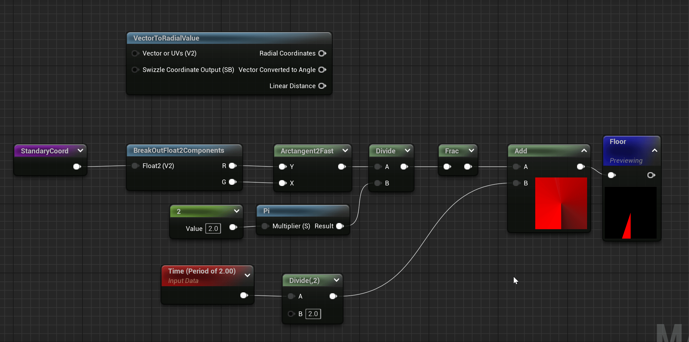

 Title:Material
comments:ture

Here are several ways to draw circles in the material function:

## Coordinate System
Choose your coordinate system based on preference.

### Simple Coordinate System
Simple and easy to use, with few nodes. The point (-1, -1) is in the top right corner, which may feel counterintuitive at first compared to what's shown in textbooks, but you'll get used to it.

### Standard Coordinate System
The standard coordinate system involves two additional steps: rotation and swapping the XY axes. Although it requires two more instructions, a good coordinate system aids in understanding.

## Drawing Circles

### Lerp One
Interpolate between 0 and -1 based on the distance field as a ratio.

### Subtract and Multiply
Values below 0.8 are negative, resulting in a fully black circle. Multiplication is used to control the edges, making them sharper as the value increases.

### RadialGradientExponential
This built-in function is not recommended for drawing regular circles as it involves a relatively high computational load. While the previous methods required 47 instructions, this one needs 51. It can generate a cotton candy-like circle.

The internal implementation is complex, and unless you specifically need this effect, it's not necessary to use it.

### SphereGradient
The built-in function SphereGradient creates a circular gradient similar to the image below. It uses the circle equation to achieve a smooth transition effect. It is still not recommended for drawing standard circles.

### smoothstep
Highly recommended for drawing the simplest circles. When max equals min, there's no need to handle gradient values, and the output values range purely from 0 to 1. It's worth mentioning that if you swap min and max, it will reverse. For consistent direction, it's better to use 1-x.

## Drawing Rings
Based on the above methods, drawing a large circle first and then a smaller one can create rings.

### Multiplication
Two circles, one positive and one negative. The overlapping area is positive, and rounding up the product.

### Dot Product
Dot product of two circles ranges from -1 to 1. The more similar the overlapping parts, the closer to 1.

### Subtraction
Using smoothstep produces pure 0s and 1s, which is excellent.

## Animation
Here, the animation is driven by periodic time.

The range of atan2 is $\left[ -\pi, \pi \right]$. Dividing by 2π and using frac for decimal values is explained here:

- Dividing by 2π narrows the range to $\left[ -0.5, 0.5 \right]$.
- frac handles negative numbers by using 1-x. For example, for -0.4, the decimal part is 0.4, and 1-0.4=0.6.
- As the frac operation continues to increase, it reaches 1, allowing a complete rotation.

### Simple Combination
