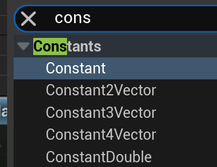
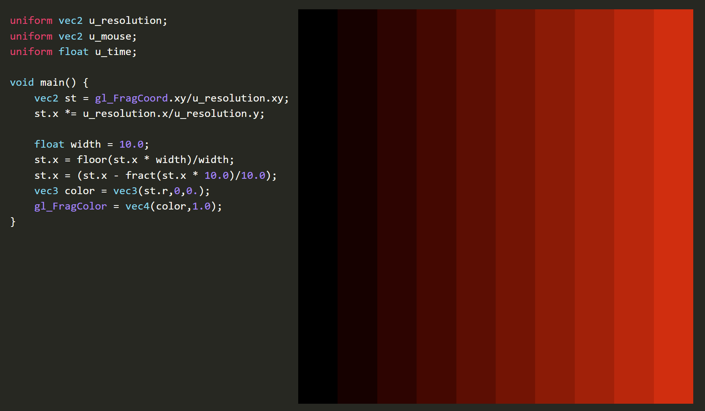

在线 shader编辑器（GLSL）

[https://thebookofshaders.com/edit.php](https://thebookofshaders.com/edit.php)

---

## Base 函数，节点

记录一下：
- glsl, hsls, 虚幻材质节点
- 以及基础用法

### 参数，类型

**glsl**：float， vec2, vec3 ,vec4 

```glsl
    // 创建一个基础颜色向量
    vec4 baseColor = vec4(1.0, 0.5, 0.2, 1.0);
    
    // 向量分量选择器示例
    vec3 rgb = baseColor.rgb;    // 获取RGB分量
    vec3 bgr = baseColor.bgr;    // 颜色通道重排序
    vec2 rg = baseColor.rg;      // 只获取红和绿通道
    float r = baseColor.r;       // 只获取红通道
```

**hlsl**: float, float2, float3, float3

对比之下， hlsl 的变量类型更加统一，有一种简洁的美。
```hlsl
    // 创建一个基础颜色向量
    float4 baseColor = float4(1.0, 0.5, 0.2, 1.0);
    
    // 向量分量选择器示例
    float3 rgb = baseColor.rgb;    // 获取RGB分量
    float3 bgr = baseColor.bgr;    // 颜色通道重排序
    float2 rg = baseColor.rg;      // 只获取红和绿通道
    float r = baseColor.r;         // 只获取红通道
    
    // 使用swizzling创建新的颜色
    float4 newColor = float4(baseColor.brg, 1.0); // 重排序RGB并保持alpha为1
    
    // 重复分量示例
    float3 grayScale = baseColor.rrr;
```

**unreal 材质 node**:

（坑挺多）

节点形式，虚幻定义了  常量 constant，还有标量scalar
一维常量 如果作为 参数，那么就叫做标量 scalar （怪怪的，又没人解释一下）


节点需要注意的地方：

- 常向量虽然有1-4维，但是转为参数，都是用4维参数代替。
  

- Parameter最顶部的白色节点，只有RGB。而 常量是正常的RGBA。需要RGBA需要自行构造。
  


操作通道：

- 对比上面两个文本语言，可视化的Node并不那么灵活。
- 向量分量选择器，Unreal 需要用到 Mask 节点实现
  
- swizzling 重排序RGB，内部也是用Mask 和 Append 实现，而且只有 XYZ -> YXZ
  
  


### Step

step既阶梯，阶梯函数，它的输出图像是一个突变的阶跃，在edge点处从0瞬间跳变到1,形成了一个类似台阶的形状。在图形学和信号处理领域中,这种函数也被称为"Heaviside step function"(亥维赛德阶跃函数)。

可能的返回值有：0，1，（1，1） ， （1，0），（1，0，1），（1，1，1，0） 都是有可能的。

作用： 把一些不规则 的值，通过判断临界值，统一成0和1; 
（所以把 step 作为 mix，lerp 的“通道”，能产生if else的效果）

其中一种实现如下：

```hlsl
float step(float edge, float x) {
    return x < edge ? 0.0 : 1.0;
}
```

第一个参数是临界值，第二个参数是测试值。

参考 glsl，step有很多重载。
```glsl
float step(float edge, float x)  
vec2 step(vec2 edge, vec2 x)  
vec3 step(vec3 edge, vec3 x)  
vec4 step(vec4 edge, vec4 x)

vec2 step(float edge, vec2 x)  
vec3 step(float edge, vec3 x)  
vec4 step(float edge, vec4 x)
```

向量版本会对每个分量分别进行比较。例如：

```hlsl
 
float2 edge = float2(0.3, 0.5);
float2 x = float2(0.4, 0.4);
float2 result = step(edge, x);
// result.x = step(0.3, 0.4) = 1.0  因为 0.4 > 0.3
// result.y = step(0.5, 0.4) = 0.0  因为 0.4 < 0.5
// 最终 result = (1.0, 0.0)
```

!!! info
    step是参数值都是标量或者向量时，左右参数值可以调转，获得相反的结果，相当于if。但定义上更倾向把右边的值作为变化的参数。
    
     `gl_FragColor = vec4(vec3(step(vec2(0.2,0.2), st),0),1.0);`
     测试结果：
     

     所以，可能的返回值有：0，1，（1，1） ， （1，0），（1，0，1），（1，1，1，0） 都是有可能的。

#### Step Example

step 用于区域选择：

```glsl
//对比的数是0.5，这里表示大于0.5的区域返回1
 vec3 color = vec3(step(0.5,st.x));
```

step 画圆, 这里固定的是右边的 半径，刚开始半径都是大于距离的，所以填充白色。返回一个白色的圆形
```hlsl
float GetCircle(float2 uv, float radius)
{
    float2 centered = uv - float2(0.5, 0.5);
    return step(length(centered), radius);
}
```    


SDF 填充，SDF 是 正数代表外部，0是边界，负数是内部。可以用1 - Step(SDF) 来给 sdf ”上色“

```glsl
float circleSDF(vec2 st) {
    return length(st-.5)*2.;
}

void main() {
    vec2 st = gl_FragCoord.xy/u_resolution.xy;
    st.x *= u_resolution.x/u_resolution.y;
    
    vec3 color = 1.0- step(0.5,vec3(circleSDF(st)));

    gl_FragColor = vec4(color, 1.0);
}
```

如果觉得 step 不够烧脑，可以试试step 两个输入都是函数的情况：

```glsl
float circleSDF(vec2 st) {
    return length(st-.5)*2.;
}

// 这里画出了椭圆​
void main() {
    vec2 st = gl_FragCoord.xy/u_resolution.xy;
    st.x *= u_resolution.x/u_resolution.y;
    //float edge = (0.+sin(2.0*u_time)/2.0);
    vec3 color = step(vec3(st,0.5), vec3(circleSDF(st)));
      // color = color.rrr +color.g + color.b;
    gl_FragColor = vec4(color, 1.0);
}

//解析，完成标准坐标系 和 标准SDF来分析

float circleSDF(vec2 st, float r) {
    return length(st) -r;
}

void main() {
    vec2 st = gl_FragCoord.xy/u_resolution.xy;
    vec2 cacheSt = st;
    st = (st-.5)*2.0;
    // float edge = abs(sin(0.8*u_time));
    // float edge = abs((fract(0.5*u_time)));
    float edge = 0.0;
    
    //内部是一个点的circle
    float circle =circleSDF(st,edge);
   
    
    vec3 color = step(vec3(cacheSt,0.0), vec3(circle));
      // color = color.rrr +color.g + color.b;
    
    
    //x坐标在0-1线性变化时的circle， 和 背景 [0-1]混合
    color = mix(vec3(cacheSt.r) , color.rrr, 1.0-color.rrr);
    
    // step半径0.5的圆用于调试用。半径固定为0.5的情况下，画出来的原始“circle位置”
    //cacheSt.r 和原始circle 坐标系不同，对于前者来说，从左往右单调递增，对于圆的半径来说，越靠近原点，距离就越小。
    // 当原始circle的半径是0.5，在坐标做垂直于x轴的切线。交点对于cacheSt.r来说是0.25; 从左一直往右，cacheSt.r是递增，而circle递减。
    // 一增一减，总有一个时刻两者相等，找出临界值。
    // 0.25 + a = 0.5 -a; a = 0.125
    // 也就是，对于cacheSt.r来说，当x=0.375，y=0.5 时，开始比 “circle”大。
    // 既在x=0.375这条直线上，y=0.5的位置，首次大于“circle”, y=0.4 或者 y=0.3 则还未达到。
    // 可以发现，当对比x值的时候，椭圆是x被放大了两倍。当对比Y轴值的时候，是一整列对比，用的是最小步进，Y轴的值没有放大。形成了椭圆
    
     
    color = mix(color, vec3(0.1,0.2,0.0), 0.25+step(0.5, 1.0- circle));
    gl_FragColor = vec4(color, 1.0);
}
```


---

### smoothstep

[smoothstep](https://thebookofshaders.com/glossary/?search=smoothstep) 是 step 函数的平滑版本，它创造了一个平滑的 S 形过渡而不是突变的阶跃。

```hlsl
float smoothstep(float edge0, float edge1, float x) {
    // 首先把 x 限制在 [0,1] 范围内
    float t = clamp((x - edge0) / (edge1 - edge0), 0.0, 1.0);
    // 应用平滑插值: 3t² - 2t³
    return t * t * (3.0 - 2.0 * t);
}
```

内部实现的3t² - 2t³ 是hermite 插值函数的一种，形成平滑S 形曲线。还有更加平滑但计算成本更大的6次函数版本：

六次多项式 6t⁵ - 15t⁴ + 10t³


!!! info
    边缘值的大小，会影响过渡的方向。正常是左边小于右边，是0到1的过渡，如果左边大于右边，则是1到0的过渡。


#### 渐变的应用

##### 柔和的画笔边缘

SDF 是 用正负区分里外的图形，


##### 两个smoothstep “错位相减”，就能形成边缘柔和的线条。


如上图，想要在x=0.5形成一条平行于Y轴竖线，深入解析：

 - 使用x 坐标作为自变量，根据smoothstep函数形成的颜色值,所以渐变是横向的，x越大，颜色白。y坐标被忽略，所以整个2D图像无数平行于X轴的线条堆叠起来的图形。
 - x= 0.5 是目标线段，想办法构造出它的左右边缘，设边缘宽度位 edge。
 - 左边缘就是0.5-edge，到 0.5；在这个宽度的范围内参数0到1的渐变，如上图，可用smoothstep构造，宽度非常小，在x=0.5的左边。
 - 右边缘则从x=0.5的右边开始，去到0.5+edge。也用smoothstep构造，图像上看比左边的“错开了”一个edge的宽度。
 - 两者相减, 大部分位置都是0-0 =0，或者1-1=0。所以渐变处的外围都是0，黑色。
 - x={0.5-edge, 0.5} 时，只取左边的渐变，因为右边的Smoothstep 此时返回值是0；
 - x={0.5, 0.5+edge} 时，左边已经都是最大值1，右边的smoothstep逐渐变化到1，相减的结果就是1逐渐变化到0.
 - 这就形成了以x=0.5为中线的左右镜像对称。

 


- 另外两个 smoothstep 相乘也能构造 直线

  

##### plot 绘制函数

利用 两个smoothstep相减能形成边缘柔和的线条的原理，可以绘制出函数图像。

代码：


```glsl
float plot(vec2 st, float pct){
  return  smoothstep( pct-0.02, pct, st.y) -
          smoothstep( pct, pct+0.02, st.y);
}

void main() {
    vec2 st = gl_FragCoord.xy/u_resolution;

    // Smooth interpolation between 0.1 and 0.9
    float y = smoothstep(0.1,0.9,st.x);

    vec3 color = vec3(y);

    float pct = plot(st,y);
    color = (1.0-pct)*color+pct*vec3(0.0,1.0,0.0);

    gl_FragColor = vec4(color,1.0);
}
```

解析：

- 构造一个函数：y=smoothstep(0.1,0.9,st.x), 它是一个从左到右逐渐变白的渐变函数。
- plot 内部是用到了y坐标，根据对两个smoothstep相减的理解，这是一个画平行于x轴的直线的函数，如果pct是固定值的话。
- plot(st,smoothstep(0.1,0.9,st.x)) 这种形式的复合函数，pct不再是固定值，而是一个函数f(x)。随着f(x)变化，点的位置跟着变化，于是画出了"f(x)".
- 具体一些来说，对任一函数f(x) =smoothstep(0.1,0.9,st.x),比如x=0时，就是图像的第一列，都用plot(st,f(0))来计算所有点的y坐标的返回值。


### Lerp / Mix

[mix](https://thebookofshaders.com/glossary/?search=mix)

Mix 的作用是把两个值 a 和 b 混合，返回一个值，这个值是 a 和 b 的线性插值。

#### mix的实际运用

- 图层叠加
  mix(原图,新颜色,新图层的通道)

- 配合step，当做if else
  ```glsl
  vec2 adjustAspectRatio(vec2 st) {
      // 当宽度小于高度时使用第一种计算方式
      vec2 ratioAdjusted1 = vec2(
          (st.x * u_resolution.x/u_resolution.y) - (u_resolution.x * 0.5 - u_resolution.y * 0.5)/u_resolution.y,
          st.y
      );
      
      // 当宽度大于高度时使用第二种计算方式
      vec2 ratioAdjusted2 = vec2(
          st.x,
          (st.y * u_resolution.y/u_resolution.x) - (u_resolution.y * 0.5 - u_resolution.x * 0.5)/u_resolution.x
      );
      
      // 根据分辨率的宽高比选择合适的调整方式
      return mix(
          ratioAdjusted1,
          ratioAdjusted2,
          step(u_resolution.x, u_resolution.y)
      );
  } 
   ```
### fract

取小数

#### 用例




### 多个SDF

SDF是在标准坐标系里 根据距离构建图形。如果 在贴图里构建“多个坐标系”，就能一次性画出多个SDF

#### 例子

```glsl
#ifdef GL_ES
precision mediump float;
#endif

uniform vec2 u_resolution;
uniform vec2 u_mouse;
uniform float u_time;


float flowerSDF(vec2 st, int N) {
         // 添加旋转
    float angle = u_time * 0.5; // 控制旋转速度
    mat2 rotation = mat2(
        cos(angle), -sin(angle),
        sin(angle), cos(angle)
    );
  
    st = st*2.-1.;
      st = rotation * st;
    float r = length(st)*2.;
    float a = atan(st.y,st.x);
    float v = float(N)*.5;
    return 1.-(abs(cos(a*v))*.5+.5)/r;
}


void main() { 
    float aspect = u_resolution.x/u_resolution.y;
    vec2 st = gl_FragCoord.xy/u_resolution.xy;
    
    float flowerSize = 3.0 + 1.0 * abs(sin(u_time*0.5));
    // 先进行基础变换，再处理宽高比
    vec2 st_flower = (st - 0.5) * flowerSize *2.0; 
 
    // 计算到最近角点的距离
    vec2 corner_dist = abs(abs(st_flower) - vec2(flowerSize));
      
    // 使用这个距离来画花，在这里处理宽高比
 
     vec2 local_st = (corner_dist / 0.5); 
     local_st.x *= aspect; // 修正宽高比  
          
    float  flower = flowerSDF(local_st, 5);  
    flower = 1.0 - smoothstep(0.0, 0.1, flower);
    
    // 背景颜色（保持拉伸） 
    vec2 st_background = st; 
    st_background.x *= aspect; 
    vec3 background_color = st.ggg;
    
    // 最终颜色
    vec3 final_color = mix( 
        background_color,
        vec3(1.000,0.271,0.619),
        flower
    );
    // 调试
    // final_color = vec3(corner_dist,0.0);
    gl_FragColor = vec4(final_color, 1.0);
}
```


