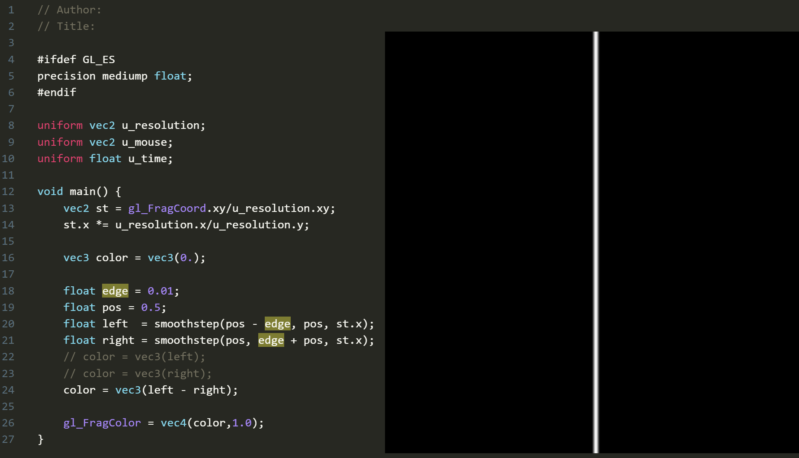

Title:Base Shader
comments:ture

---
在线 shader编辑器（GLSL）

[https://thebookofshaders.com/edit.php](https://thebookofshaders.com/edit.php)

---

### Step

step既阶梯，阶梯函数，它的输出图像是一个突变的阶跃，在edge点处从0瞬间跳变到1,形成了一个类似台阶的形状。在图形学和信号处理领域中,这种函数也被称为"Heaviside step function"(亥维赛德阶跃函数)。

可能的返回值有：0，1，（1，1） ， （1，0），（1，0，1），（1，1，1，0） 都是有可能的。

其中一种实现如下：

```hlsl
float step(float edge, float x) {
    return x < edge ? 0.0 : 1.0;
}
```

第一个参数是临界值，第二个参数是测试值。

参考 glsl，step有很多重载。
```glsl
float step(float edge, float x)  
vec2 step(vec2 edge, vec2 x)  
vec3 step(vec3 edge, vec3 x)  
vec4 step(vec4 edge, vec4 x)

vec2 step(float edge, vec2 x)  
vec3 step(float edge, vec3 x)  
vec4 step(float edge, vec4 x)
```

向量版本会对每个分量分别进行比较。例如：

```hlsl
 
float2 edge = float2(0.3, 0.5);
float2 x = float2(0.4, 0.4);
float2 result = step(edge, x);
// result.x = step(0.3, 0.4) = 1.0  因为 0.4 > 0.3
// result.y = step(0.5, 0.4) = 0.0  因为 0.4 < 0.5
// 最终 result = (1.0, 0.0)
```

!!! info
    step是参数值都是标量或者向量时，左右参数值可以调转，获得相反的结果，相当于if。但定义上更倾向把右边的值作为变化的参数。
    
     `gl_FragColor = vec4(vec3(step(vec2(0.2,0.2), st),0),1.0);`
     测试结果：
     

     所以，可能的返回值有：0，1，（1，1） ， （1，0），（1，0，1），（1，1，1，0） 都是有可能的。

#### Example

画圆
```hlsl
float GetCircle(float2 uv, float radius)
{
    float2 centered = uv - float2(0.5, 0.5);
    return step(length(centered), radius);
}
```    

---

### smoothstep
[smoothstep](https://thebookofshaders.com/glossary/?search=smoothstep) 是 step 函数的平滑版本，它创造了一个平滑的 S 形过渡而不是突变的阶跃。

```hlsl
float smoothstep(float edge0, float edge1, float x) {
    // 首先把 x 限制在 [0,1] 范围内
    float t = clamp((x - edge0) / (edge1 - edge0), 0.0, 1.0);
    // 应用平滑插值: 3t² - 2t³
    return t * t * (3.0 - 2.0 * t);
}
```

内部实现的3t² - 2t³ 是hermite 插值函数的一种，形成平滑S 形曲线。还有更加平滑但计算成本更大的6次函数版本：

六次多项式 6t⁵ - 15t⁴ + 10t³


!!! info
    边缘值的大小，会影响过渡的方向。正常是左边小于右边，是0到1的过渡，如果左边大于右边，则是1到0的过渡。


#### 渐变的应用

##### 两个smoothstep “错位相减”，就能形成边缘柔和的线条。


如上图，想要在x=0.5形成一条平行于Y轴竖线，深入解析：

 - 使用x 坐标作为自变量，根据smoothstep函数形成的颜色值,所以渐变是横向的，x越大，颜色白。y坐标被忽略，所以整个2D图像无数平行于X轴的线条堆叠起来的图形。
 - x= 0.5 是目标线段，想办法构造出它的左右边缘，设边缘宽度位 edge。
 - 左边缘就是0.5-edge，到 0.5；在这个宽度的范围内参数0到1的渐变，如上图，可用smoothstep构造，宽度非常小，在x=0.5的左边。
 - 右边缘则从x=0.5的右边开始，去到0.5+edge。也用smoothstep构造，图像上看比左边的“错开了”一个edge的宽度。
 - 两者相减, 大部分位置都是0-0 =0，或者1-1=0。所以渐变处的外围都是0，黑色。
 - x={0.5-edge, 0.5} 时，只取左边的渐变，因为右边的Smoothstep 此时返回值是0；
 - x={0.5, 0.5+edge} 时，左边已经都是最大值1，右边的smoothstep逐渐变化到1，相减的结果就是1逐渐变化到0.
 - 这就形成了以x=0.5为中线的左右镜像对称。

 


- 另外两个 smoothstep 相乘也能构造 直线

  

##### plot 绘制函数

利用 两个smoothstep相减能形成边缘柔和的线条的原理，可以绘制出函数图像。

代码：


```glsl
float plot(vec2 st, float pct){
  return  smoothstep( pct-0.02, pct, st.y) -
          smoothstep( pct, pct+0.02, st.y);
}

void main() {
    vec2 st = gl_FragCoord.xy/u_resolution;

    // Smooth interpolation between 0.1 and 0.9
    float y = smoothstep(0.1,0.9,st.x);

    vec3 color = vec3(y);

    float pct = plot(st,y);
    color = (1.0-pct)*color+pct*vec3(0.0,1.0,0.0);

    gl_FragColor = vec4(color,1.0);
}
```

解析：

- 构造一个函数：y=smoothstep(0.1,0.9,st.x), 它是一个从左到右逐渐变白的渐变函数。
- plot 内部是用到了y坐标，根据对两个smoothstep相减的理解，这是一个画平行于x轴的直线的函数，如果pct是固定值的话。
- plot(st,smoothstep(0.1,0.9,st.x)) 这种形式的复合函数，pct不再是固定值，而是一个函数f(x)。随着f(x)变化，点的位置跟着变化，于是画出了"f(x)".
- 具体一些来说，对任一函数f(x) =smoothstep(0.1,0.9,st.x),比如x=0时，就是图像的第一列，都用plot(st,f(0))来计算所有点的y坐标的返回值。


### Lerp / Mix

[mix](https://thebookofshaders.com/glossary/?search=mix)

