# PCG 基础篇：概念浅析

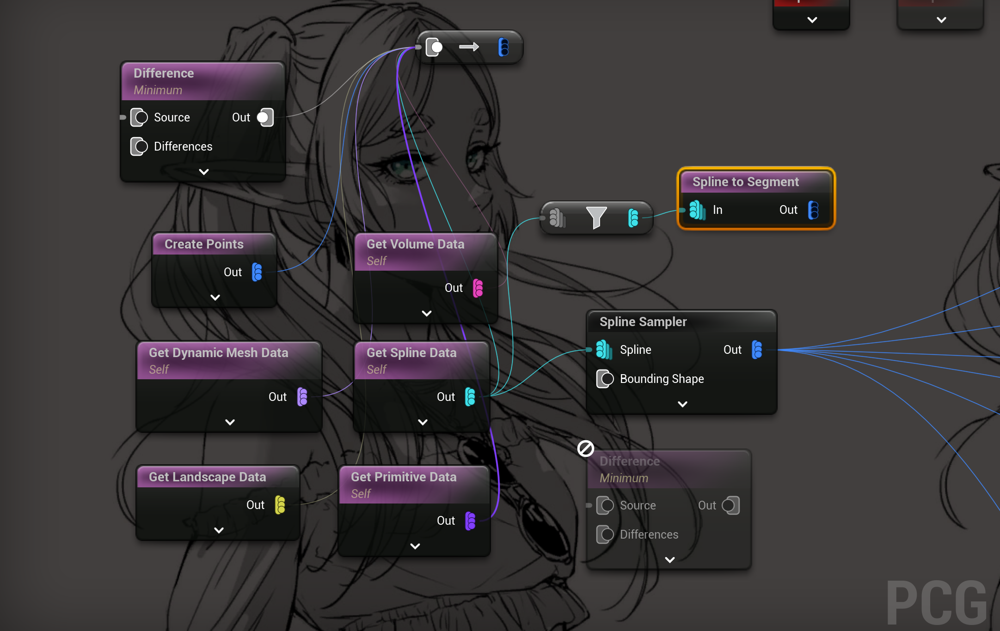

此前写过一篇[常用类浅析](./Old/UE5_4PCGWithCPP_zh.md)，但过于简单，写一篇细致一点的，重新温习一下。


## PCG节点的数据类型

根据官网说法，PCG框架中的数据分为以下几种类型：

- 空间数据 (Spatial Data)
- 组合数据 (Composite Data)
- 属性集 (Attribute Sets)

**空间数据有以下这些具体子类实现：**

:::details `UPCGSpatialData`常用子类：

空间数据包含二维(2D)或三维(3D)空间的引用，可以表示体积、高度场、样条线和点数据。

| 数据类型 | 描述 | 用途/特点 |
|---------|------|-----------|
| 体积 (UPCGVolumeData) | 表示3D形状的空间数据 | - 用于布尔集运算<br>- 使用Volume Sampler节点直接从关卡中采样 |
| 表面 (UPCGSurfaceData) | 表示2D数据的空间数据类型 | - 映射到XY平面的地形<br>- Surface Sampler节点在2D平面生成点并投影到3D形状 |
| 线条 (UPCGSplineData) | 表示Spline和Landscape Spline组件 | - 读取样条线的关键点、切线和点缩放<br>- Landscape Spline垂直投影，始终应用于表面<br>- 通过Get Spline Data和Spline Sampler节点引用 |
| 点 (UPCGPointData) | 表示3D空间中表面或体积的点集合 | - 具有相关边界，可表示不同维度形状<br>- 点大小决定形状表示精度<br>- 每个点有0-1的密度值<br>- 与密度值共同表示空间中的浮点函数 |

```sh
UPCGSpatialData (抽象基类)
├── UPCGPointData (点数据)
├── UPCGSplineData (样条线)
├── UPCGSurfaceData (表面)
├── UPCGVolumeData (体积)
└── UPCGCompositeData (复合数据)
    ├── UPCGUnionData (并集)
    ├── UPCGIntersectionData (交集)
    └── UPCGDifferenceData (差集)
```        
**这些派生类，有个共同的能力：可以转换为点数据（UPCGPointData）。**

:::

以上是官方文档关于PCG类型部分的全部文档了，非常简洁🫣非常虚幻🫣

---
### 蓝图表现
这里记录PCG Graph 中，展现上述类型的样子。（UE5.5）

#### 空间数据 (Spatial Data)

数据类型主要在节点的输入输出PIN上面体现

##### **点类型（UPCGPointData）**
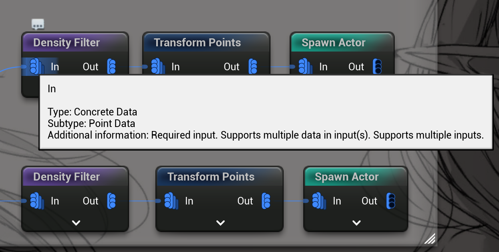{width=50%}
PCG中最常见的类型，最频繁交互的类型，如图，到处都是这种浅蓝色的连接点。

- 目录：Concrete ([分类细节:高级类型](#pcg类型-bitmask))
- 实际类型：Point
- 淡蓝色的连线来表示

##### 任意 Any
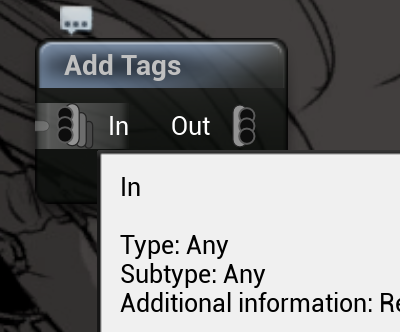{width=30%}
- 灰色是Any的类型的标识
- 根据输入，自动匹配输出类型：下图的RandomChoice节点会自动匹配输出类型
  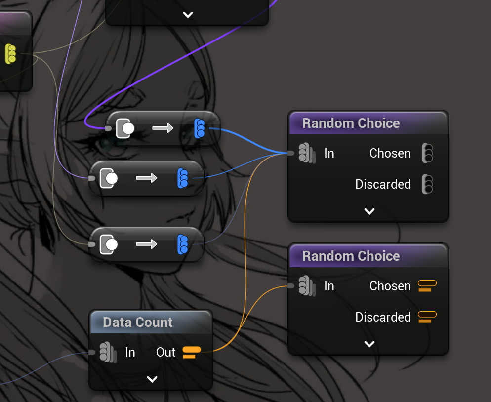{width=50%}

##### 具象类型（Concrete分类，点，样条，体积等）
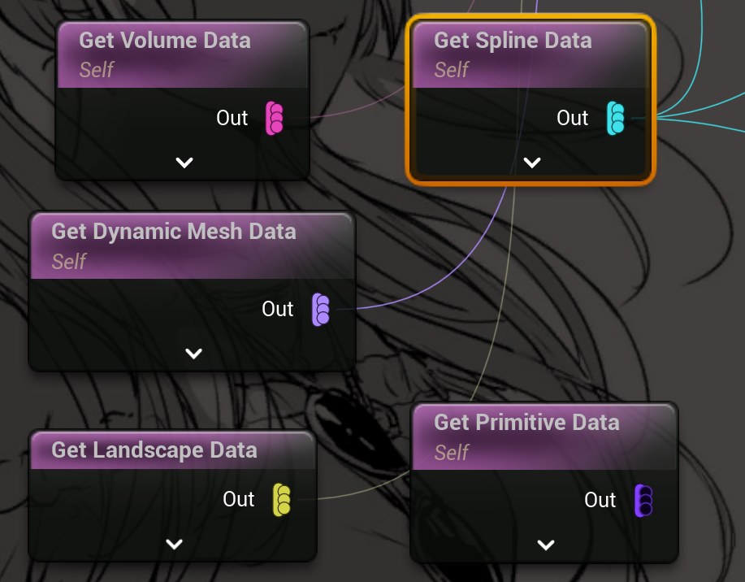{width=50%}
- 都能提供 自身的具体数据， 可以看到它们的输出图标都一样，都是一根竖线上的3个小点，只是颜色不同
- PIN的颜色代表不同类型的数据
- PIN上面的三个小点，代表它们输出是“一排数据”，或者说，有提供**具体子项**类型的能力。

##### Spatial Data，父类类型
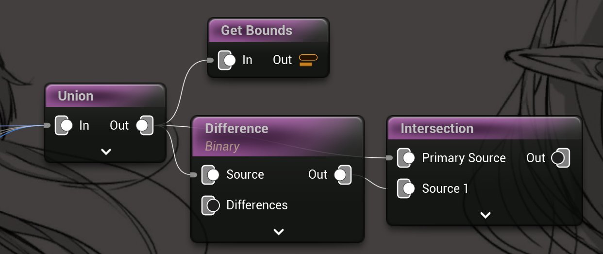{width=50%}
- PIN就会变成一个大矩形叠加一个小圆点
- 因为不针对特定的子类型，所以不会有颜色，只用黑白表示连接状态。
- 空间类型能够输出自己特化的“Point Data”列表（ToPoint ）

空间类型，调用 ToPoint 节点 即可获得点数据
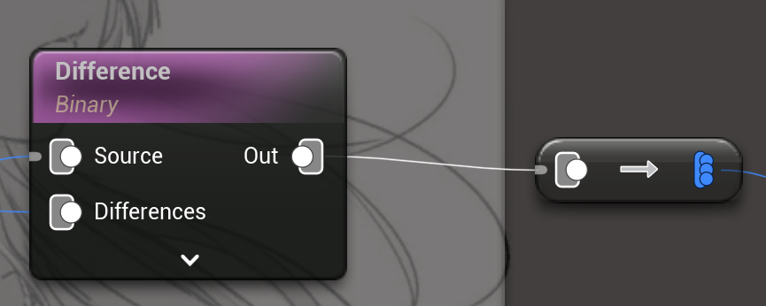{width=50%}

#### 复合数据 (Composite Data)

复合数据是集合运算的结果，例如并集、交集和差集。比如上图里的`Difference`节点的输出和输入。
针对Difference这类节点来说，它输出的数据类是`UPCGDifferenceData`,也是 `UPCGSpatialData` 的子类，所以可是使用`ToPoint`节点。
 

#### 属性集 (Attribute Sets)

属性集是上述所有类型共有的字段，因为 全部PCG数据类型的基类都是`UPCGData`。(如 `UPCGSpatialData` 也继承于它。)

属性集是以元数据(Metadata)形式存储，Metadata可以理解成一个Map表

可以通过`virtual UPCGMetadata* MutableMetadata() { return nullptr; }`访问它

##### 查看`输入/输出`的MetaData数据
选中节点，按A即可查看
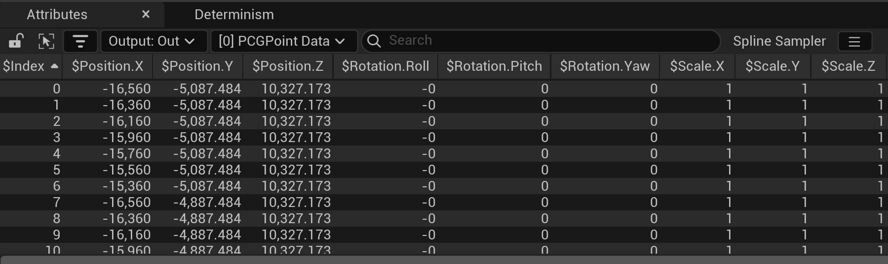{width=80%}

##### 修改属性集 MetaData
可以手动给输出数据，增加一些自定义属性
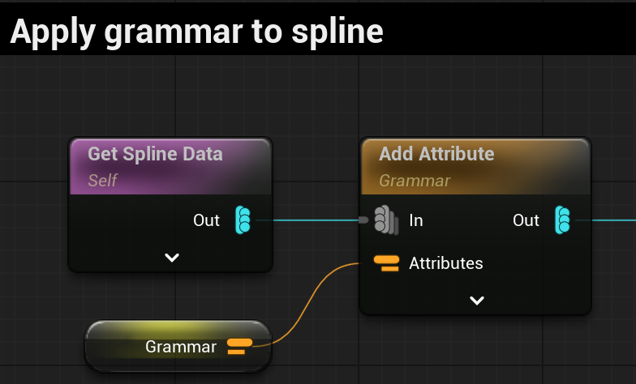{width=50%}
内部是使用了 UPCGParamData 传递参数到metadata

>参数数据（`UPCGParamData`）是一个特殊的数据类型，用于在PCG图中存储和传递执行参数。它直接继承自`UPCGData`，主要用于节点间的参数传递。
:::details 关键函数`PCGMetadataHelpers::CopyAllAttributes`
```cpp
// 把 属性添加给输入数据 
for (const FPCGTaggedData& SourceParamData : SourceParams)
{
    if (const UPCGParamData* ParamData = Cast<UPCGParamData>(SourceParamData.Data))
    {
        bSuccess &= PCGMetadataHelpers::CopyAllAttributes(ParamData, TargetData, Context);
    }
}
```
:::


### PCG基本操作

篇幅原因，写在这里[PCG基本操作](./04PCGNode.md#基础操作)

---

### C++ API

#### UPCGSpatialData
空间数据（`UPCGSpatialData`）是PCG框架中最基础的数据类型，它是所有具体空间数据的基类。具体子类可以实现采样，投影这些功能。
 
```cpp
// 基本空间数据类定义
UCLASS(Abstract, BlueprintType, ClassGroup = (Procedural))
class PCG_API UPCGSpatialData : public UPCGData
{
    // 获取数据维度
    virtual int GetDimension() const PURE_VIRTUAL(UPCGSpatialData::GetDimension, return 0;);

    // 获取边界
    virtual FBox GetBounds() const PURE_VIRTUAL(UPCGSpatialData::GetBounds, return FBox(EForceInit::ForceInit););

    // 计算位置密度
    virtual float GetDensityAtPosition(const FVector& InPosition) const;

    // 转换为点数据
    virtual const UPCGPointData* ToPointData(FPCGContext* Context) const;
}
```

1. **数据表示**
   - 所有空间数据都可以转换为点数据（带有元数据和变换）
   - 支持不同维度的数据（通过`GetDimension()`函数）

2. **空间属性**
   - 边界计算：`GetBounds()` - 获取包括密度衰减的完整边界
   - 严格边界：`GetStrictBounds()` - 获取密度始终为1的边界区域
   - 法线方向：`GetNormal()` - 获取表面法线或体积的投影轴

3. **数据操作**
   - 密度计算：`GetDensityAtPosition()` - 计算给定位置的密度
   - 点转换：`ToPointData()` - 将数据离散化为点
   - 点采样：`SamplePoint()` - 在查询位置采样旋转、缩放和其他属性

4. **空间运算**
   - 投影（Projection）：`ProjectOn()` - 将数据投影到其他数据上
   - 交集（Intersection）：`IntersectWith()` - 计算与其他数据的交集
   - 并集（Union）：`UnionWith()` - 计算与其他数据的并集
   - 差集（Difference）：`Subtract()` - 计算与其他数据的差集


 

#### UPCGPointData（点数据）

点数据（`UPCGPointData`）是最基本的具体数据类型，继承自`UPCGSpatialData`。它代表了空间中的离散点集合，每个点都可以包含位置、旋转、缩放等信息。
```cpp
// 点数据类定义
UCLASS(BlueprintType, ClassGroup = (Procedural))
class PCG_API UPCGPointData : public UPCGSpatialData
{
    // 基本操作
    virtual int GetDimension() const override { return 0; }
    virtual FBox GetBounds() const override;
    
    // 点操作
    void SetPoints(const TArray<FPCGPoint>& InPoints);
    FPCGPoint GetPoint(int32 Index);
    int32 GetNumPoints();
    bool IsEmpty();
}
```
1. **数据结构**
   - 使用`TArray<FPCGPoint>`存储点数据
   - 使用八叉树（Octree）进行空间索引
   - 支持点的元数据管理

2. **空间优化**
   - 实现了八叉树结构（`PointOctree`）用于空间查询优化
   - 每个叶节点最多存储16个元素
   - 树的最大深度为12层

3. **点操作**
   - 点的获取：`GetPoint()`
   - 点的设置：`SetPoints()`
   - 点的复制：`CopyPointsFrom()`
   - 支持从Actor初始化点：`InitializeFromActor()`

4. **数据查询**
   - 获取点数量：`GetNumPoints()`
   - 检查是否为空：`IsEmpty()`
   - 获取边界：`GetBounds()`
   - 支持点采样：`SamplePoint()`

5. **特殊功能**
   - 支持点数据的投影：`ProjectPoint()`
   - 支持元数据扁平化：`Flatten()`
   - 支持边界重计算：`RecomputeBounds()`

#### UPCGParamData（参数数据）

参数数据（`UPCGParamData`）是一个特殊的数据类型，用于在PCG图中存储和传递执行参数。它直接继承自`UPCGData`，主要用于节点间的参数传递。

```cpp
// 参数数据类定义
UCLASS(BlueprintType, ClassGroup = (Procedural), DisplayName = "PCGAttribute Set")
class PCG_API UPCGParamData : public UPCGData
{
    // 基本操作
    virtual EPCGDataType GetDataType() const override { return EPCGDataType::Param; }
    
    // 元数据操作
    virtual const UPCGMetadata* ConstMetadata() const override;
    virtual UPCGMetadata* MutableMetadata() override;
    
    // 参数查找和管理
    int64 FindMetadataKey(const FName& InName) const;
    int64 FindOrAddMetadataKey(const FName& InName);
    UPCGParamData* FilterParamsByName(FPCGContext* Context, const FName& InName) const;
    UPCGParamData* FilterParamsByKey(FPCGContext* Context, int64 InKey) const;
}
```

1. **基本功能**
   - 存储执行参数
   - 管理节点间的参数传递
   - 支持参数的过滤和查找

2. **数据管理**
   - 使用`TMap<FName, int64>`进行名称映射
   - 支持元数据的读写访问
   - 提供参数复制和过滤功能

3. **参数操作**
   - 按名称查找：`FindMetadataKey()`
   - 查找或添加：`FindOrAddMetadataKey()`
   - 按名称过滤：`FilterParamsByName()`
   - 按键值过滤：`FilterParamsByKey()`

4. **特殊特性**
   - 支持属性选择器缓存
   - 提供元数据的常量和可变访问
   - 支持参数数据的复制


## 自定义节点（C++）

### 类型配置

- 设置输入类型：
```cpp
// 配置多个输入Pin
TArray<FPCGPinProperties> InputPinProperties() const
{
    TArray<FPCGPinProperties> PinProperties;
    
    // Add required source pin
    FPCGPinProperties& PinPropertiesSource = 
        PinProperties.Emplace_GetRef(PCGDifferenceConstants::SourceLabel, 
                                   EPCGDataType::Spatial);
    PinPropertiesSource.SetRequiredPin();

    // Add optional differences pin
    FPCGPinProperties& PinPropertiesDifferences = 
        PinProperties.Emplace_GetRef(PCGDifferenceConstants::DifferencesLabel, 
                                   EPCGDataType::Spatial);

    return PinProperties;
}

// 支持多种类型输入
TArray<FPCGPinProperties> InputPinProperties() const
{
    TArray<FPCGPinProperties> PinProperties;
    // Support both point and param data
    PinProperties.Emplace_GetRef(PCGPinConstants::DefaultInputLabel, 
                               EPCGDataType::PointOrParam).SetRequiredPin();
    return PinProperties;
}
```


- 设置输出类型：
```cpp
// 多输出Pin配置
TArray<FPCGPinProperties> OutputPinProperties() const
{
    TArray<FPCGPinProperties> Properties;
    // Define multiple output pins for different purposes
    Properties.Emplace(PCGRandomChoiceSettingsTest::ChosenPointsLabel, 
                      EPCGDataType::Point);
    Properties.Emplace(PCGRandomChoiceSettingsTest::DiscardedPointsLabel, 
                      EPCGDataType::Point);
    Properties.Emplace(PCGRandomChoiceSettingsTest::ResultsLabel, 
                      EPCGDataType::Param);
    return Properties;
}
```

#### EPCGDataType

上面用到这个EPCGDataType 是一个位掩码枚举，使用位运算来组合不同的类型

:::details 点击查看EPCGDataType 详情
```cpp
UENUM(meta = (Bitflags))
enum class EPCGDataType : uint32
{
	None = 0 UMETA(Hidden),
	Point = 1 << 1,

	Spline = 1 << 2,
	LandscapeSpline = 1 << 3,
	PolyLine = Spline | LandscapeSpline UMETA(DisplayName = "Curve"),

	Landscape = 1 << 4,
	Texture = 1 << 5,
	RenderTarget = 1 << 6,
	BaseTexture = Texture | RenderTarget UMETA(Hidden),
	Surface = Landscape | BaseTexture,


	Volume = 1 << 7,
	Primitive = 1 << 8,
	DynamicMesh = 1 << 10,

	/** Simple concrete data. */
	Concrete = Point | PolyLine | Surface | Volume | Primitive | DynamicMesh,

	/** Boolean operations like union, difference, intersection. */
	Composite = 1 << 9 UMETA(Hidden),

	/** Combinations of concrete data and/or boolean operations. */
	Spatial = Composite | Concrete,

	Param = 1 << 27 UMETA(DisplayName = "Attribute Set"),

	// Combination of Param and Point, necessary for named-based serialization of enums.
	PointOrParam = Point | Param,

	Settings = 1 << 28 UMETA(Hidden),
	Other = 1 << 29,
	Any = (1 << 30) - 1
};
```
:::

#### PCG类型 bitmask
1. 基础
```cpp
None = 0           // 空类型
Point = 1 << 1     // 点类型，表示3D空间中的单个点
```
2. 样条线
```cpp
Spline = 1 << 2            // 样条曲线
LandscapeSpline = 1 << 3   // 地形样条曲线
PolyLine = Spline | LandscapeSpline  // 曲线（包含普通样条和地形样条）
```
3. 表面和纹理相关类型：
```cpp
Landscape = 1 << 4         // 地形
Texture = 1 << 5          // 纹理
RenderTarget = 1 << 6     // 渲染目标
BaseTexture = Texture | RenderTarget  // 基础纹理（包含纹理和渲染目标）
Surface = Landscape | BaseTexture     // 表面（包含地形和基础纹理）
```
4. 几何体
```cpp
Volume = 1 << 7           // 体积
Primitive = 1 << 8        // 图元
DynamicMesh = 1 << 10    // 动态网格
```
5. 高级类型
```cpp
Concrete = Point | PolyLine | Surface | Volume | Primitive | DynamicMesh  
// 具体数据类型，包含所有基本几何类型

Composite = 1 << 9        // 用于布尔运算（如并集、差集、交集）

Spatial = Composite | Concrete  
// 空间数据，包含具体几何数据和布尔运算结果

Param = 1 << 27          // 属性集
PointOrParam = Point | Param  // 点或属性集（用于基于名称的枚举序列化）

Settings = 1 << 28       // 设置
Other = 1 << 29         // 其他类型
Any = (1 << 30) - 1     // 任意类型（所有位都设为1）
```
::: details 使用bitmask
- 可以轻易判断包含的类型数据。
```sh
位置:    87654321
二进制:  11110010
         ↓↓↓↓↓↓↓↓
         │││││││└─ 0: None
         ││││││└── 1: Point
         │││││└─── 0: Spline
         ││││└──── 0: LandscapeSpline
         │││└───── 1: Landscape
         ││└────── 1: Texture
         │└─────── 1: RenderTarget
         └──────── 1: Volume
```
这个组合包含了 Point + Landscape + Texture + RenderTarget + Volume

- 要检查一个类型是否是 Concrete 类型，我们需要使用"与"运算符 `&`：
```cpp
bool isConcrete = (someType & Concrete) == someType;
```
:::


### 社区示例 NativeRandomChoice
这是一份来自社区的示例，用于随机选择一定数量或比例的点。

#### 节点设置类（Settings）

```cpp
UCLASS(BlueprintType)
class UPCGRandomChoiceTest : public UPCGSettings
{
    GENERATED_BODY()
public:
    // 节点基本信息
#if WITH_EDITOR
    virtual FName GetDefaultNodeName() const override { return FName(TEXT("NativeRandomChoice")); }
    virtual FText GetDefaultNodeTitle() const override { return NSLOCTEXT("PCGRandomChoiceSettings", "NodeTitle", "Native Random Choice"); }
    virtual FText GetNodeTooltipText() const override { return NSLOCTEXT("PCGRandomChoiceSettings", "NodeTooltip", "Split a point input in 2, randomly according to a ratio."); }
    virtual EPCGSettingsType GetType() const override { return EPCGSettingsType::Sampler; }
#endif

    // 输入输出Pin定义
    virtual TArray<FPCGPinProperties> InputPinProperties() const override { return Super::DefaultPointInputPinProperties(); }
    virtual TArray<FPCGPinProperties> OutputPinProperties() const override;
    
    // 节点设置参数
    UPROPERTY(BlueprintReadWrite, EditAnywhere, Category = "Settings", meta = (PCG_Overridable))
    bool bFixedMode = false;

    UPROPERTY(BlueprintReadWrite, EditAnywhere, Category = "Settings", meta = (PCG_Overridable, ClampMin = 0.0, ClampMax = 1.0, EditCondition = "!bFixedMode", EditConditionHides))
    float Ratio = 0.1f;

    UPROPERTY(BlueprintReadWrite, EditAnywhere, Category = "Settings", meta = (PCG_Overridable, ClampMin = 1, EditCondition = "bFixedMode", EditConditionHides))
    int32 FixedNumber = true;
};
```

#### 执行类（Element）

```cpp
class FPCGRandomChoiceTestElement : public IPCGElement
{
protected:
    virtual bool ExecuteInternal(FPCGContext* Context) const override;
};
```

#### 实现细节

1. **输出Pin定义**
```cpp
TArray<FPCGPinProperties> UPCGRandomChoiceTest::OutputPinProperties() const
{
    TArray<FPCGPinProperties> Properties;
    // 定义3个输出Pin：选中的点、未选中的点、结果参数
    Properties.Emplace(PCGRandomChoiceSettingsTest::ChosenPointsLabel, EPCGDataType::Point);
    Properties.Emplace(PCGRandomChoiceSettingsTest::DiscardedPointsLabel, EPCGDataType::Point);
    Properties.Emplace(PCGRandomChoiceSettingsTest::ResultsLabel, EPCGDataType::Param);
    return Properties;
}
```

2. **数据处理流程**
```cpp
bool FPCGRandomChoiceTestElement::ExecuteInternal(FPCGContext* Context) const
{
    check(Context);
    const UPCGRandomChoiceTest* Settings = Context->GetInputSettings<UPCGRandomChoiceTest>();
    check(Settings);
    //在上下文里获取该节点的用户配置
    TArray<FPCGTaggedData>& Outputs = Context->OutputData.TaggedData;

    //使用默认输入标签获取输入数据
    for (const FPCGTaggedData& Input : Context->InputData.GetInputsByPin(PCGPinConstants::DefaultInputLabel))
    {
        const UPCGPointData* PointData = Cast<UPCGPointData>(Input.Data);
        if (!PointData)
        {
            //输入不是点数据, 进入下一个
            PCGE_LOG(Error, GraphAndLog, LOCTEXT("InputNotPointData", "Input is not a point data"));
            continue;
        }

        const TArray<FPCGPoint>& InPoints = PointData->GetPoints();

        // 计算要保留的点数量
        int32 NumberOfElementsToKeep = 0;
        if (!Settings->bFixedMode)
        {
            float Ratio = FMath::Clamp(Settings->Ratio, 0.0f, 1.0f);
            NumberOfElementsToKeep = FMath::CeilToInt(Ratio * InPoints.Num());
        }
        else
        {
            NumberOfElementsToKeep = FMath::Clamp(Settings->FixedNumber, 1, InPoints.Num() - 1);
        }

        // 创建输出Pin：ChosenPoints 和 DiscardedPoints 
        UPCGPointData* ChosenPointsData = NewObject<UPCGPointData>();
        ChosenPointsData->InitializeFromData(PointData);
        TArray<FPCGPoint>& ChosenPoints = ChosenPointsData->GetMutablePoints();
        ChosenPoints.Reserve(NumberOfElementsToKeep);

        UPCGPointData* DiscardedPointsData = NewObject<UPCGPointData>();
        DiscardedPointsData->InitializeFromData(PointData);
        TArray<FPCGPoint>& DiscardedPoints = DiscardedPointsData->GetMutablePoints();
        DiscardedPoints.Reserve(InPoints.Num() - NumberOfElementsToKeep);

        // 随机选择点
        TArray<int32> Indexes;
        for (int32 i = 0; i < InPoints.Num(); i++)
        {
            Indexes.Add(i);
        }
        FMath::Shuffle(Indexes);

        // 分配点到不同输出
        for (int32 i = 0; i < NumberOfElementsToKeep; i++)
        {
            ChosenPoints.Add(InPoints[Indexes[i]]);
        }
        for (int32 i = NumberOfElementsToKeep; i < InPoints.Num(); i++)
        {
            DiscardedPoints.Add(InPoints[Indexes[i]]);
        }

        //添加到 Outputs Pin，注意：新创建的FPCGTaggedData是以Input为模板创建的。
        FPCGTaggedData& ChosenTaggedData = Outputs.Add_GetRef(Input);
        ChosenTaggedData.Data = ChosenPointsData;
        ChosenTaggedData.Pin = PCGRandomChoiceSettingsTest::ChosenPointsLabel;

        FPCGTaggedData& DiscardedTaggedData = Outputs.Add_GetRef(Input);
        DiscardedTaggedData.Data = DiscardedPointsData;
        DiscardedTaggedData.Pin = PCGRandomChoiceSettingsTest::DiscardedPointsLabel;

        // 添加一个ParamData作为结果输出, 也就是第三个参数
        UPCGParamData* ParamData = NewObject<UPCGParamData>();
        FPCGMetadataAttribute<int32>* Attribute = ParamData->Metadata->CreateAttribute<int32>(
            TEXT("ChosenPointsNum"), NumberOfElementsToKeep, true, true);
        Attribute->SetValue(ParamData->Metadata->AddEntry(), NumberOfElementsToKeep);

        FPCGTaggedData& ResultsTaggedData = Outputs.Add_GetRef(Input);
        ResultsTaggedData.Data = ParamData;
        ResultsTaggedData.Pin = PCGRandomChoiceSettingsTest::ResultsLabel;
    }

    return true;
}

```

### 官方示例

社区版非常简洁粗暴，浅显易懂。PCG在UE5.5里也实现了一个官方版，有种非常文绉绉的工业感

1. **更严谨的输入处理**
```cpp
// Support both point data and param data, using EPCGDataType::PointOrParam
TArray<FPCGPinProperties> UPCGRandomChoiceSettings::InputPinProperties() const
{
    TArray<FPCGPinProperties> PinProperties;
    // SetRequiredPin() marks this pin as mandatory
    PinProperties.Emplace_GetRef(PCGPinConstants::DefaultInputLabel, EPCGDataType::PointOrParam).SetRequiredPin();
    return PinProperties;
}
```

2. **独立的数据选择函数**
```cpp
namespace PCGRandomChoice
{
    // Specialized function for point data selection
    // Using TArrayView for efficient array passing without copying
    UPCGData* ChoosePointData(const UPCGData* InData, TArrayView<int32> InIndexes, FPCGContext* InContext)
    {
        const UPCGPointData* InPointData = CastChecked<const UPCGPointData>(InData);
        // Create new object in any thread context
        UPCGPointData* OutPointData = FPCGContext::NewObject_AnyThread<UPCGPointData>(InContext);
        OutPointData->InitializeFromData(InPointData);

        const TArray<FPCGPoint>& InPoints = InPointData->GetPoints();
        TArray<FPCGPoint>& OutPoints = OutPointData->GetMutablePoints();
        OutPoints.Reserve(InIndexes.Num());

        // Sort indexes to maintain stable output order
        // This ensures consistent results regardless of random selection
        Algo::Sort(InIndexes);
        for (int32 Index : InIndexes)
        {
            OutPoints.Add(InPoints[Index]);
        }
        return OutPointData;
    }

    // Specialized function for param data selection
    // Similar pattern but handles metadata entries instead of points
    UPCGData* ChooseParamData(const UPCGData* InData, TArrayView<int32> InIndexes, FPCGContext* InContext)
    {
        const UPCGParamData* InParamData = CastChecked<const UPCGParamData>(InData);
        UPCGParamData* OutParamData = FPCGContext::NewObject_AnyThread<UPCGParamData>(InContext);

        // Keep stable order for metadata entries
        Algo::Sort(InIndexes);
        // Transform indexes to metadata entry keys
        TArray<PCGMetadataEntryKey> SelectedEntries;
        Algo::Transform(InIndexes, SelectedEntries, [](int32 In) -> PCGMetadataEntryKey { return In; });
        // Initialize as a partial copy with only selected entries
        OutParamData->Metadata->InitializeAsCopy(InParamData->Metadata, &SelectedEntries);
        return OutParamData;
    }
}
```

3. **更高效的随机化算法**
```cpp
// Partial shuffle algorithm: only shuffle the elements we need
// This is more efficient than shuffling the entire array when we only need a small portion
for (int j = 0; j < NumOfElementsToKeep; ++j)
{
    // Only randomize within the remaining range
    const int RandomElement = RandStream.RandRange(j, NumElements - 1);
    if (RandomElement != j)
    {
        Swap(ShuffledIndexes[j], ShuffledIndexes[RandomElement]);
    }
}
```

4. **边界情况处理**
```cpp
if (NumOfElementsToKeep == 0)
{
    // Special case: no elements to keep
    // Forward original input to Discarded and create empty data for Chosen
    if (Settings->bOutputDiscardedEntries)
    {
        // Use input as template for discarded output
        FPCGTaggedData& DiscardedOutput = Outputs.Add_GetRef(CurrentInput);
        DiscardedOutput.Pin = PCGRandomChoiceConstants::DiscardedEntriesLabel;
    }

    // Create empty data for chosen output
    FPCGTaggedData& ChosenOutput = Outputs.Add_GetRef(CurrentInput);
    ChosenOutput.Data = ChooseFunc(CurrentInput.Data, {}, Context);
    ChosenOutput.Pin = PCGRandomChoiceConstants::ChosenEntriesLabel;
    continue;
}
else if (NumOfElementsToKeep == NumElements)
{
    // Special case: keep all elements
    // Forward original input to Chosen and create empty data for Discarded
    FPCGTaggedData& ChosenOutput = Outputs.Add_GetRef(CurrentInput);
    ChosenOutput.Pin = PCGRandomChoiceConstants::ChosenEntriesLabel;

    if (Settings->bOutputDiscardedEntries)
    {
        // Create empty data for discarded output
        FPCGTaggedData& DiscardedOutput = Outputs.Add_GetRef(CurrentInput);
        DiscardedOutput.Data = ChooseFunc(CurrentInput.Data, {}, Context);
        DiscardedOutput.Pin = PCGRandomChoiceConstants::DiscardedEntriesLabel;
    }
    continue;
}
```

## 节点分析

如图，Difference节点的连接点（Pin） 和其他节点很不一样，前面讨论过，这种类型的输入节点类型，是个UPCGSpatialData父类, 他处理数据的方式，值得探究。
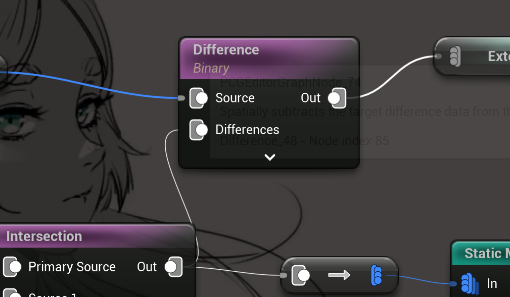{width=50%}
### Difference

Difference节点是PCG系统中的一个空间操作类型节点，其主要功能是从源数据中空间性地减去目标差异数据。它的特别之处在于对输入数据的处理方式：源数据支持多输入迭代，而差异数据会被自动合并（Union）后再进行减法操作。

带着问题来探究：
1. **他的输入数据没有针对直接子类，都是UPCGSpatialData，不同类型是如何整合处理？**

答：从源码中可以看到，Difference节点通过以下方式处理不同类型的空间数据：

- **类型检查和分发**：
```cpp
// 对非空间数据的处理
if (!SourceSpatialData)
{
    Outputs.Add(Source);  // 直接传递到输出
    continue;
}

// 记录数据类型信息，用于自动推断 源数据是否包含点数据
bHasPointsInSource |= SourceSpatialData->IsA<UPCGPointData>();
```

- **统一的数据接口**：通过`UPCGDifferenceData`类提供了统一的数据处理接口：
```cpp
void UPCGDifferenceData::Initialize(const UPCGSpatialData* InData)
{
    Source = InData;
    TargetActor = InData->TargetActor;
    Metadata->Initialize(Source->Metadata);
}
```

- **智能Union处理**：对于多个差异数据，会自动创建Union：
```cpp
if (!DifferencesUnion)
{
    DifferencesUnion = FPCGContext::NewObject_AnyThread<UPCGUnionData>(InContext);
    DifferencesUnion->AddData(Difference);
    DifferencesUnion->SetDensityFunction(PCGDifferenceDataUtils::ToUnionDensityFunction(DensityFunction));
    Difference = DifferencesUnion;
}
```
所以，它是把全部差异数据进行了合并，然后再进行差异操作。每个源数据都要进行对比。

2. **空间的差异操作，不同类型会有怎样的结果？比如点和体积的差异结果是什么？**

答：差异操作的结果取决于以下因素：

- **输出模式选择**：
```cpp
enum class EPCGDifferenceMode : uint8
{
    Inferred,    // 自动推断：根据输入数据类型自动选择合适的输出模式
    Continuous,  // 连续模式：保持数据的连续性，适合处理体积、密度等连续数据
    Discrete     // 离散模式：将结果转换为离散的点数据
};
```

- **输出模式自动推断**：
```cpp
// 根据输入数据类型自动决定输出类型，这段代码的意思是：
//如果使用自动推断模式且源数据和差异数据都包含点数据，则输出为点数据
if ((Settings->Mode == EPCGDifferenceMode::Inferred && 
    bHasPointsInSource && bHasPointsInDifferences))
{
    Output.Data = DifferenceData->ToPointData(Context);  // 转换为点数据
}
```

- **密度函数选择**：
```cpp
enum class EPCGDifferenceDensityFunction
{
    ClampedSubstraction,  // 限制减法：结果被限制在[0,1]范围内
    Binary,              // 二进制：完全移除重叠区域
    Minimum              // 最小值：取两个空间的最小密度值
};
```

- **边界检查优化**：
```cpp
// 如果差异数据与源数据没有重叠，直接跳过处理
if (!GetBounds().Intersect(InDifference->GetBounds()))
{
    return;
}
```

- **元数据处理**：
```cpp
// 可以选择是否处理元数据
bool bDiffMetadata = true;  // 默认处理元数据
bool bKeepZeroDensityPoints = false;  // 默认移除密度为0的点
```

具体的差异结果：
1. **点对点**：直接移除重叠点
2. **点对体积**：
   - Discrete模式：检查点是否在体积内，根据密度函数决定是否保留
   - Continuous模式：保持体积特性，输出可能包含密度信息
3. **体积对体积**：
   - Discrete模式：转换为点数据后进行处理
   - Continuous模式：计算空间密度差异，保持体积的连续性
4. **体积对点**：
   - Discrete模式：在点位置采样体积密度，根据密度函数决定结果
   - Continuous模式：保持体积特性，点的影响体现在密度变化上

 
## PGC 并行（C++）

上面的官方随机选择代码里，用到了：
```cpp
UPCGPointData* OutPointData = FPCGContext::NewObject_AnyThread<UPCGPointData>(InContext);
```
说明PCG是由多线程考虑的。

常见的并行处理，是使用引擎core里面的Aync方法 `ParallelFor`：
```cpp
// 使用并行处理来设置属性值
ParallelFor(AttributeCountInCurrentDispatch, [&](int32 WorkerIndex) {
    FPCGMetadataAttributeBase* Attribute = AttributesToSet[AttributeOffset + WorkerIndex];
    Attribute->SetValuesFromValueKeys(Values, false);
});
```
如图，调用的地方还挺多，但不是主要用法。
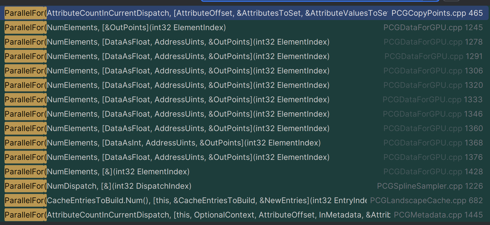

最主要的并行方法，是由PCGAsync来实现的:
- `\UnrealEngine\Engine\Plugins\PCG\Source\PCG\Private\Helpers\PCGAsync.cpp`


以下内容是AI分析（没时间细看了，凑合用吧）：
:::details PCG多线程支持

一个PCG节点是否可以多线程执行主要取决于以下几个因素：

`CanExecuteOnlyOnMainThread`函数：
- 如果节点没有重写这个函数，默认继承自IPCGElement的实现
- 如果节点重写了这个函数并返回true，则表示该节点必须在主线程上执行
- 如果返回false，则表示该节点可以在任何线程上执行

`NewObject_AnyThread`的使用：
- 如果节点在创建UObject时使用NewObject_AnyThread而不是普通的NewObject，说明它支持多线程执行
- 在PCGRandomChoice中，我们可以看到它使用了FPCGContext::NewObject_AnyThread来创建数据对象

#### 1. 并行处理的两个层次

PCG系统实现了两个层次的并行处理机制：
1. 节点级别的并行（通过ExecutionLoopMode）
2. 数据级别的并行（通过AsyncPointProcessing）

##### 1.1 节点级别并行（ExecutionLoopMode）

节点级别并行通过`EPCGElementExecutionLoopMode`枚举来控制：

```cpp
enum EPCGElementExecutionLoopMode : uint8
{
    NotALoop,              // 非循环操作
    SinglePrimaryPin,      // 在单个必需的输入引脚上循环
    MatchingPrimaryPins,   // 在多个必需的输入引脚上匹配索引循环
    // CartesianPins      // 在输入引脚上进行笛卡尔积循环（TODO）
};
```

**示例：PCGAttributeReduceElement**

```cpp
EPCGElementExecutionLoopMode FPCGAttributeReduceElement::ExecutionLoopMode(const UPCGSettings* InSettings) const
{
    const UPCGAttributeReduceSettings* Settings = Cast<const UPCGAttributeReduceSettings>(InSettings);
    return (!Settings || !Settings->bMergeOutputAttributes) ? 
        EPCGElementExecutionLoopMode::SinglePrimaryPin : 
        EPCGElementExecutionLoopMode::NotALoop;
}
```

这个例子展示了：
- 当`bMergeOutputAttributes`为false时，使用`SinglePrimaryPin`模式
- PCG系统可以对每个输入引脚的数据并行处理
- 每个输入数据可以独立计算其属性的归约（reduction）操作

##### 1.2 数据级别并行（AsyncPointProcessing）

数据级别并行通过`FPCGAsync::AsyncPointProcessing`函数实现。

从搜索结果可以看到，很多PCG节点都使用了AsyncPointProcessing：
- PCGCreatePoints：创建点云
- PCGDensityFilter：密度过滤
- PCGTransformPoints：点变换
- PCGSampleTexture：纹理采样
- PCGSelectPoints：点选择

**示例：PCGCreatePoints**

```cpp
FPCGAsync::AsyncPointProcessing(Context, PointsToLoopOn.Num(), OutputPoints, 
    [&PointsToLoopOn, &LocalTransform, CullingShape](int32 Index, FPCGPoint& OutPoint)
    {
        const FPCGPoint& InPoint = PointsToLoopOn[Index];
        OutPoint = InPoint;
        OutPoint.Transform *= LocalTransform;

        const int SeedFromPosition = UPCGBlueprintHelpers::ComputeSeedFromPosition(
            OutPoint.Transform.GetLocation());
        OutPoint.Seed = (InPoint.Seed == 0 ? 
            SeedFromPosition : 
            PCGHelpers::ComputeSeed(InPoint.Seed, SeedFromPosition));

        // 剔除体积外的点
        return !CullingShape || (CullingShape->GetDensityAtPosition(
            OutPoint.Transform.GetLocation()) > 0.0f);
    });
``` 
:::


## References
- [官网](https://dev.epicgames.com/documentation/en-us/unreal-engine/procedural-content-generation-framework-data-types-reference-in-unreal-engine#compositedata)