# PCG 中级篇：细节分析

## 点数据

### 太长不看：
点数据的属性，分为固有属性和计算属性，计算属性需要用美元符号进行访问。

- BoundsMin/Max：定义了一个轴对齐的边界框（Axis-Aligned Bounding Box, AABB）
- Extents：从中心点到边界框表面的距离（**半长度**）
- LocalCenter：边界框的中心点
- LocalSize：边界框的完整尺寸
- ScaledLocalSize：应用Transform的缩放后的边界框大小
- ScaledExtents：应用Transform的缩放后的半长度


### 固有属性
使用Create Points创建一个点,点击A查看到的全部属性，我称这些为固有属性
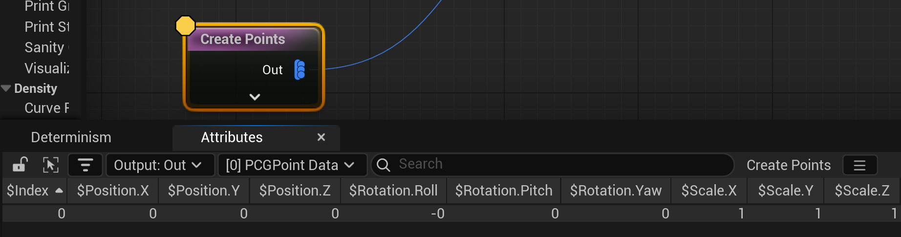{width=80%}
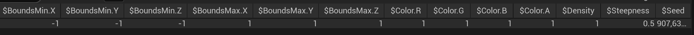{width=80%}
PCG Graph里点数据默认只有以上这些。

### 动态属性（计算属性）
调试时看到的只有上图这些属性，
但能访问的，其实不止上述这些固有属性。比如：
`ScaledLocalSize.X`
{width=70%}

动态属性（或者说‘计算属性’), 必须用`$` 来进行访问或者设置，如`$LocalSize`

对于 PointData类型来说，还有好几个"动态属性":

1. `Extents`（范围）
   - 类型：动态计算的属性
   - 计算方式：`(BoundsMax - BoundsMin) / 2.0`
   - 含义：边界框在每个轴向上的"半长度"，也可以说是从中心点到边界框表面的距离
   - 用途：与点的位置一起表示体积

2. `LocalCenter`（局部中心）
   - 类型：动态计算的属性
   - 计算方式：`(BoundsMax + BoundsMin) / 2.0`
   - 含义：边界框的中心点
   - 用途：表示点体积的中心位置

3. `LocalSize`（局部大小）
   - 类型：动态计算的属性
   - 计算方式：`BoundsMax - BoundsMin`
   - 含义：边界框在每个轴向上的完整长度
   - 用途：表示点的原始大小

4. `ScaledLocalSize`（缩放后的局部大小）
   - 类型：动态计算的属性
   - 计算方式：`GetLocalSize() * Transform.GetScale3D()`
   - 含义：应用Transform的缩放后的边界框大小
   - 用途：表示实际渲染或使用时的大小

5. `ScaledExtents`（缩放后的范围）
   - 类型：动态计算的属性 （比较特殊，蓝图不可以用表达式访问，C++可用，因为没有定义它的enum）
   - 计算方式：`GetExtents() * Transform.GetScale3D()`
   - 含义：应用Transform的缩放后的半长度
   - 用途：表示实际渲染或使用时的体积半长度 

### 自定义属性
上面的固有属性和动态属性，引擎都贴心的在编辑器做了个小按钮，可用通过点击添加：
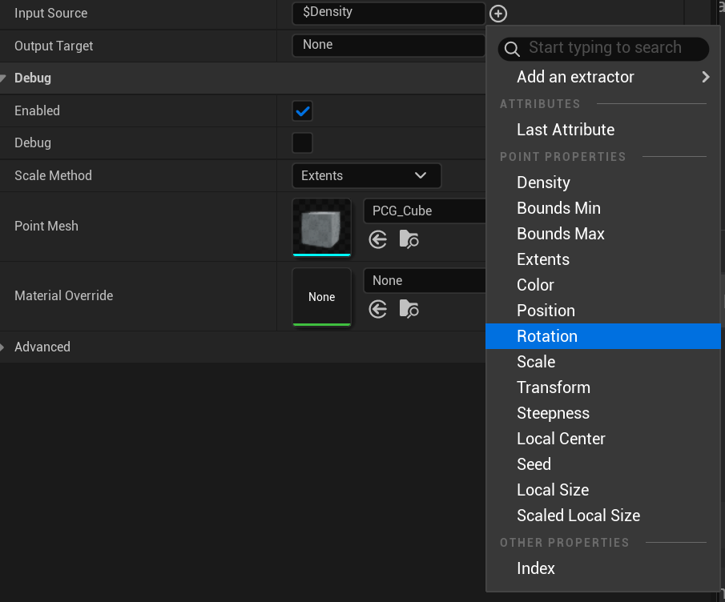{width=40%}
但是，自定义属性就没有这种待遇。

自定义属性的Color，不需要用美元符号获取：
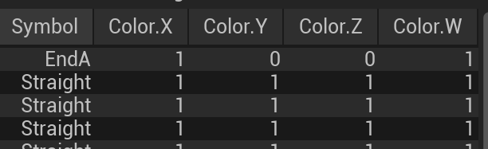{width=40%}

新增自定义属性：
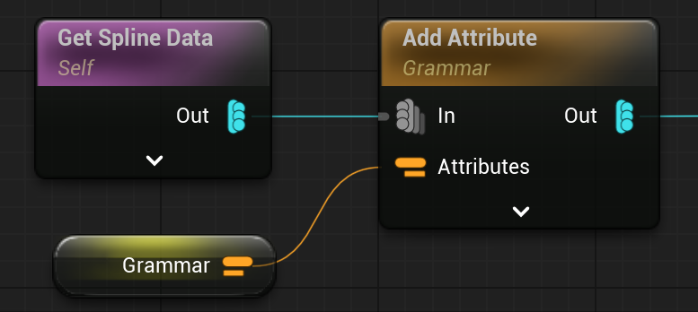{width=40%}

使用示例：
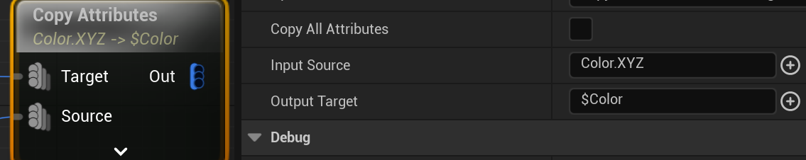{width=50%}

:::details 属性代码相关
### 属性关系

1. Extents 与 BoundsMin/Max 的关系
   ```cpp
   // Extents 是从 BoundsMin/Max 计算得出
   Extents = (BoundsMax - BoundsMin) / 2.0

   // 反过来，给定 Extents 和 Center，可以计算 BoundsMin/Max
   BoundsMin = Center - Extents
   BoundsMax = Center + Extents
   ```

2. 原始尺寸和缩放后尺寸的关系
   ```cpp
   // LocalSize 与 ScaledLocalSize 的关系
   ScaledLocalSize = LocalSize * Transform.Scale3D

   // Extents 与 ScaledExtents 的关系
   ScaledExtents = Extents * Transform.Scale3D
   ```
 :::

## Grammar浅析

目前主要作用于样条线，把样条线看成产生点的路径序列，而 Grammar 就是用来约束 点的分布。不同标记的点，可能有不同的size和生成频率，以此来控制点的分布规则。

### **形状语法（Grammar Syntax）** {#grammar-anchor}

 
有点类似基础的正则表达式用法。

#### **1. Tokens（标记）**
##### **基础元素**
- **Literal（字面量）**: **任何不包含空格的字符串**，例如 `Entrance, Corridor`
- **Sequence（序列）**: **按顺序排列的元素**，使用 **`[ ]`** 表示  
  **示例**: `[a, b, c]` → 必须按照 `a → b → c` 的顺序执行

##### **选择机制**
- **Stochastic choice（随机选择）**: **使用 `{ }` 选择其中一个元素**，每个元素出现的概率相等  
  **示例**: `{a, b, c}` → 可能是 `a`，也可能是 `b` 或 `c`
- **Priority choice（优先级选择）**: **使用 `< >`，按从左到右的优先级选择**  
  **示例**: `<a, b, c>` → `a` 优先，如果 `a` 不可用，则尝试 `b`，否则是 `c`
 

#### **2. Repetitions（重复规则，默认 1 次）**
#### **固定次数**
- `[a, b, c]3` → `a, b, c` 按顺序重复 3 次

#### **不确定次数**
- **`Zero or more（0 次或更多）`**: `a*` → `a` 可能 **不出现**，也可能出现 **任意次数**
- **`One or more（1 次或更多）`**: `{a, b, c}+` → 至少选择一个 `a`、`b` 或 `c`
 

#### **3. Weight in stochastic choices（加权随机选择，默认权重为 1）**
在 `{}` 选择时，可以给某些选项 **增加权重（更高概率被选中）**：
- **格式**: `{选项:权重}`
- **示例**:  
  `{a:3, [b, c]*:2, {d, e}+ :1}`  
  - `a` 的权重为 3（更容易被选中）
  - `[b, c]*` 的权重为 2
  - `{d, e}+` 的权重为 1（最低）
 

#### **4. Examples（示例解析）**
- **`[A, B*, C]`** → `A` 开始，`B` 可能出现 **任意次数**，然后 `C` 结束
- **`[Entrance, {Corridor, Doors}*, Exit]`** →  
  **`Entrance` 开始**，中间是 **随机的 `Corridor` 或 `Doors`，可重复多次**，最后是 **`Exit`**
- **`[Entrance, {Corridor+:2, Doors*}, Exit]`** →  
  `Corridor` **至少出现 2 次**，`Doors` **可能出现 0 次或多次**
- **`{[Entrance, Corridor, Exit], [Entrance, [Corridor, Doors]*, Exit]}`** →  
  可能是 **`Entrance → Corridor → Exit`**，也可能是 **`Entrance → Corridor 或 Doors 多次 → Exit`**

- 测试了一些其他情况：
  - 权重写0，编辑器会崩溃

  - `<[Win,W,Win]*, <Win,W,Ws>*>` 优先级嵌套不支持，正确的做法：`<[Win,W,Win], Win,W,Ws>*`, 另外，`<[Win,W,Win]*, Win,W,Ws>*`  这种情况会卡住编辑器

  - 序列可以嵌套： 
  `<{[Win,W,Win]:2,[[Ws]2,W,[Ws]2]}, Win,W,Ws>*`, 但对于相同长度线段的，种子是固定，比如4条线段，这个随机权重会让4条线段出来的结果都一样，并不是设想中随机的结果。

  - 下面的写法都对：
 ```
  {[Win,W,Win],[[Ws]+,W,[Ws]+]*}

  {[Win,W,Win],[[Ws]2,W,[Ws]2]}

  <[Win,W,Win],[Ws*,W,Ws*], Win,W,Ws>*
```  
 
---

## Grammar 相关节点

目前好像就5个 
- Subdivide Spline 细分样条
- Subdivide Segment 细分线段
- Primitive Cross-section 图元横截面
- Duplicate Cross-sections 延展横截面
- Select Grammar 匹配语法

### Subdivide Spline 细分样条
（简单理解为，指定重复规则，比如围栏，围墙, Subdivide Segment类似效果）

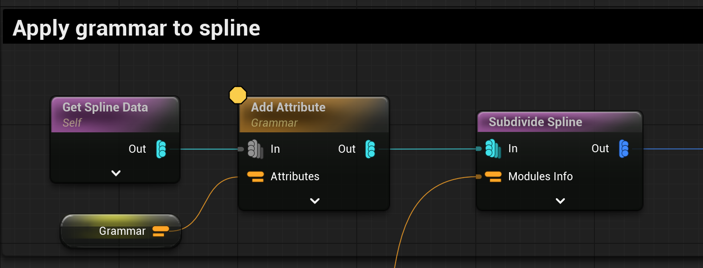{width=70%}
给样条线制定撒点规则（让参数的点根据规则分布，或者说带上“标签”），规则来自 [Grammar 字符串](#grammar-anchor)。
- 需要配置模块数据，供 Grammar 解析使用
  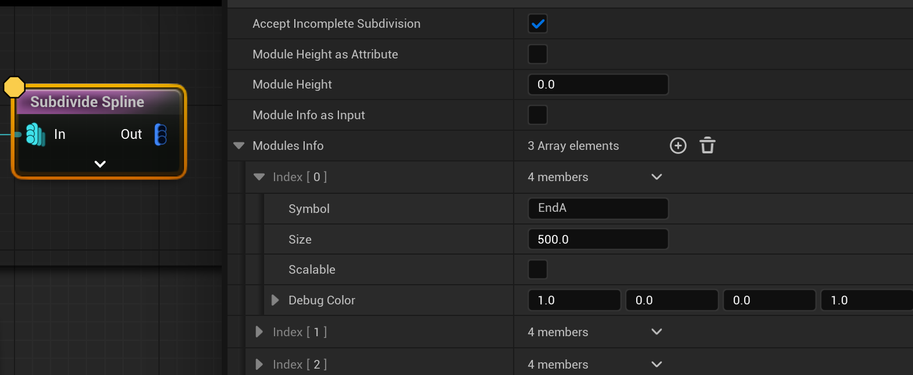{width=70%}

模块数据可以作为GraphSettings进行配置：
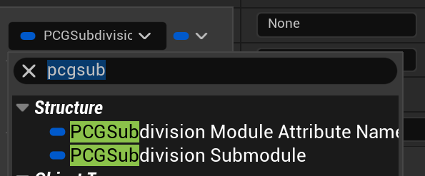  
类名是 PCGSubdivide Module 或者 PCGSubdivide SubModule, 一个是数组，一个单元素

模块数据：  
- size，点的占位大小，影响采样间隔
- Symbol， 一个key，既对应表达式的符号
- Scalable 是否拉伸去填满空隙，比如size 50,但分配给你的空间有剩余
- DebugColor 调试时的颜色, 暂时不知道有没有快速使用这个调试颜色的办法。

需要注意的是，Module里并没有Mesh相关的配置，后续需要自己根据Symbol去获取对应的Mesh。

调试颜色目前是使用 额外的Remap节点来实现：
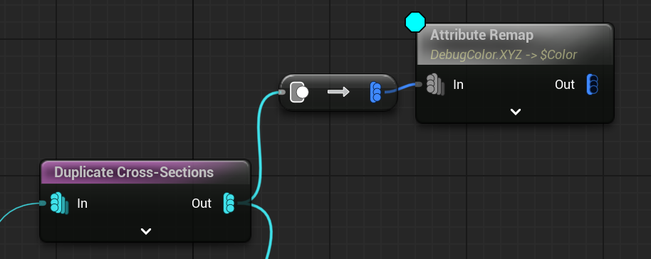{width=50%}
调试过程中发现，必须进行ToPoint操作才能正常修改颜色，不然100%引擎崩溃。

每个module都能设置调试颜色，效果如图：
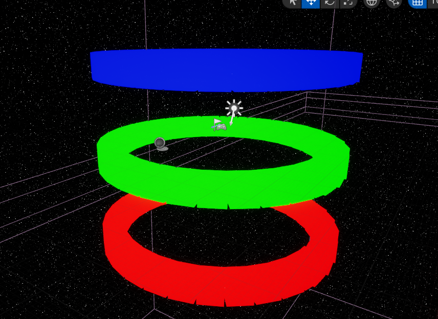{width=50%}

Subdivide Spline生成的线段，也是用点表示：
- 点的位置在线段的中心点，使用时候，通常要结合`Reset Point Center` 来将点移动到线段的起点上 
 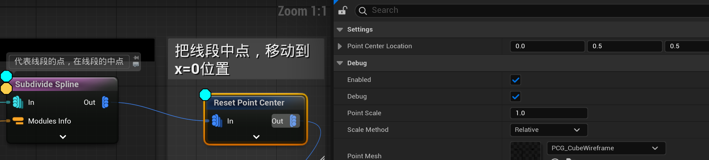
 


---

### Primitive Cross-section 图元横截面
大多数时候，拖动样条线来生成一块不规则的面积，在UE并不好操作，非常难拖出好看的形状。于是UE推出了使用基础图形，来拼图的方式来实现。（拼好面）

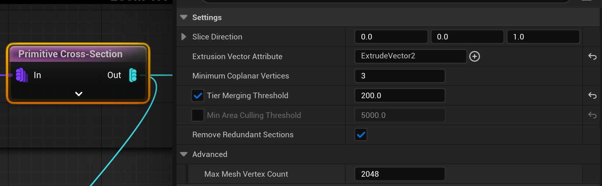{width=70%}
图元是指简单的几何体，比如最常见的长方体。主要功能是：根据特定的切割方向，构建几何体之间形成的横截面。

如图，默认沿着Z轴往上切（0，0，1），切的方向垂直于Z轴。切出来的面，就作为 横截面。对于面都一致的几何体，比如图中的圆柱体和长方体，只会切出一个“底面”作为横截面。而对于面随着Z轴变化的几何体，则切出多个横截面。测试发现并没有特别的规律来解释多个横截面的规律。
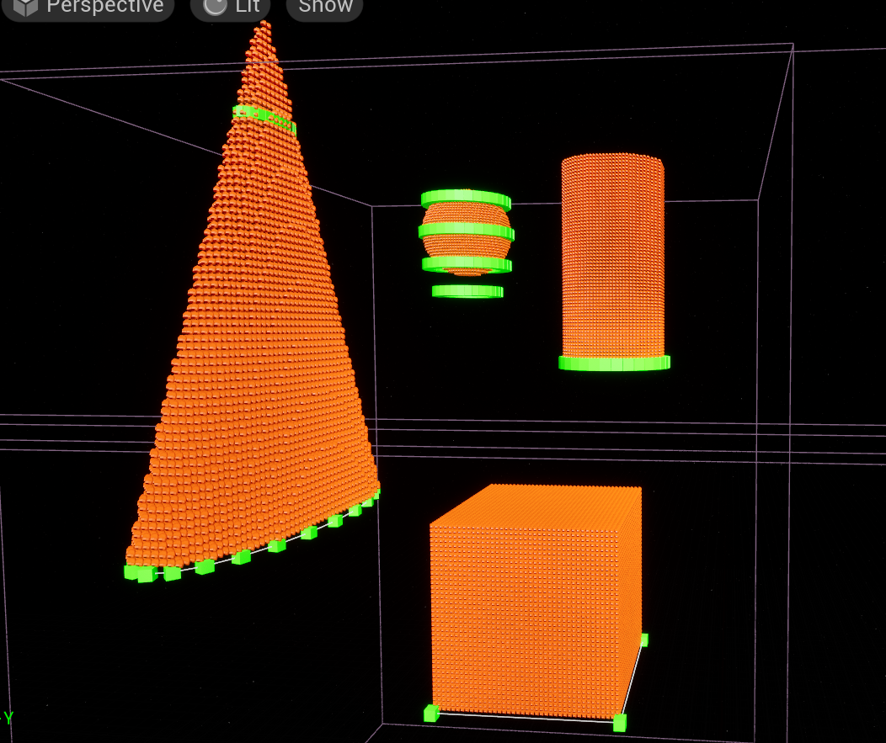{width=50%}


不过，该节点提供了调整横截面数量的办法。

#### 最小剔除面积 Min Area Culling Threshold
- 单位是 m^2

如图，默认情况下，倒立的圆锥会产生两个横截面。
{width=50%}
尖端的横截面特别小，可以 开启 Min Area Culling Threshold 来剔除，1 m^2 即可剔除它。
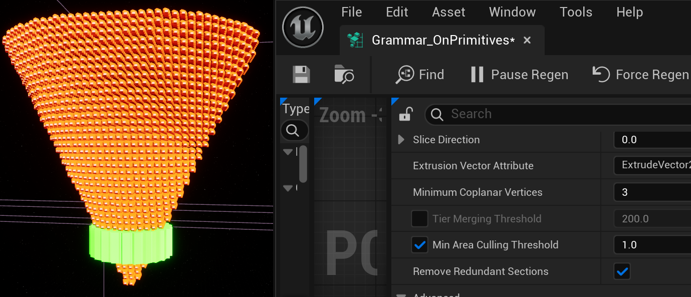{width=50%}

#### Tier 合并阈值 Tier Merge Threshold
这是另一个剔除多余横截面的方式。
- 单位是 cm

如图，球体产生的横截面，像个打开的碗
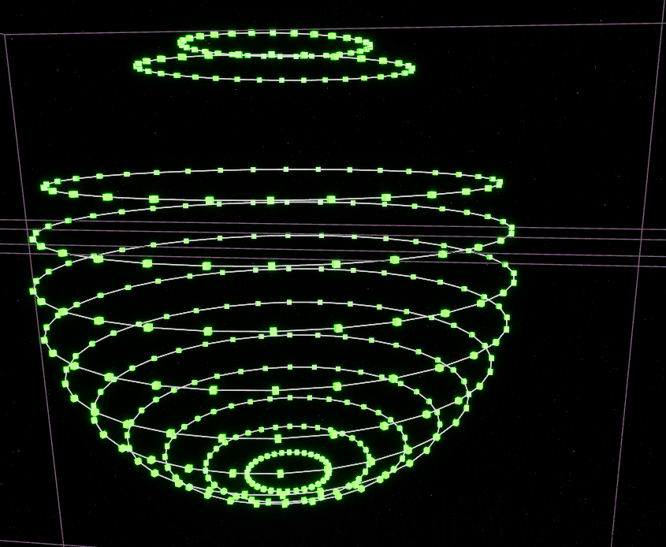{width=30%}
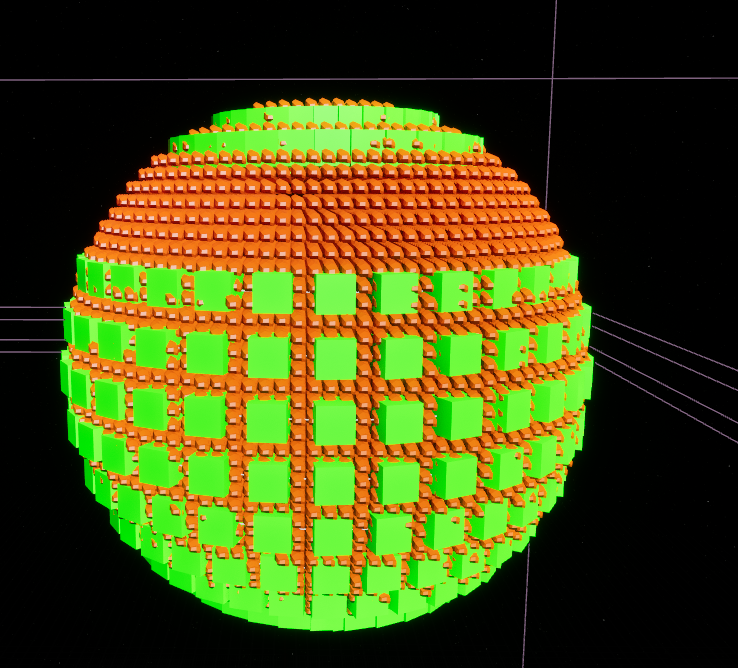{width=30%}

可以看出球体的面与面之间间距很小，更适合 Tier 合并阈值来剔除。
调整为300厘米后，成功只剩下一个横截面
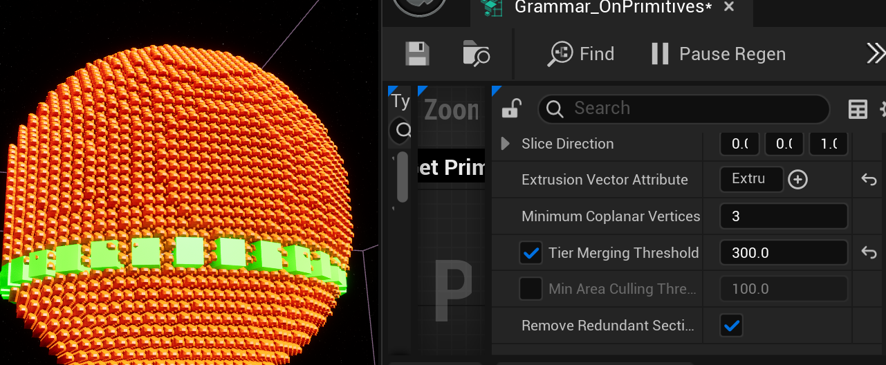{width=50%}

此时，球还是用上图的剔除配置：

让球和其他图元接触，也会立即产生新的横截面
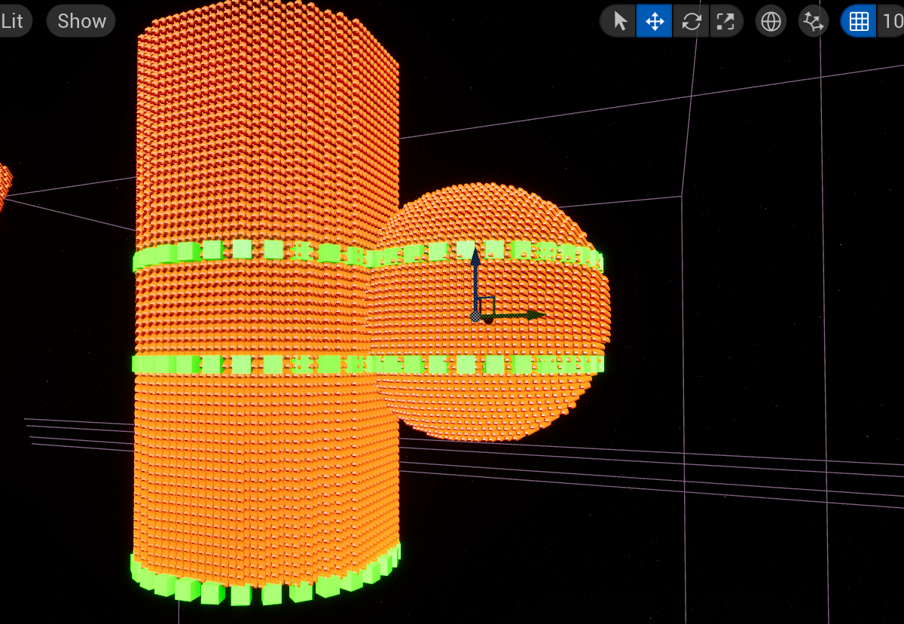{width=75%}
如上图，产生了两个横截面。（当接触面积很大，再把融合阈值调小，就会出现更多的横截面）

#### Remove Redundant Sections 

这个配置最好别开启，开启了，多图元交叉时会产生非常邻近的横截面，即使用上面的融合也不管用。
（如果没有和其他图元交叉，开启了能够移除多余的横截面。）

最好的实践方式还是让图元本身“对齐”，如图:两个长方体底部位置“平齐”，产生的横截面一定稳定。
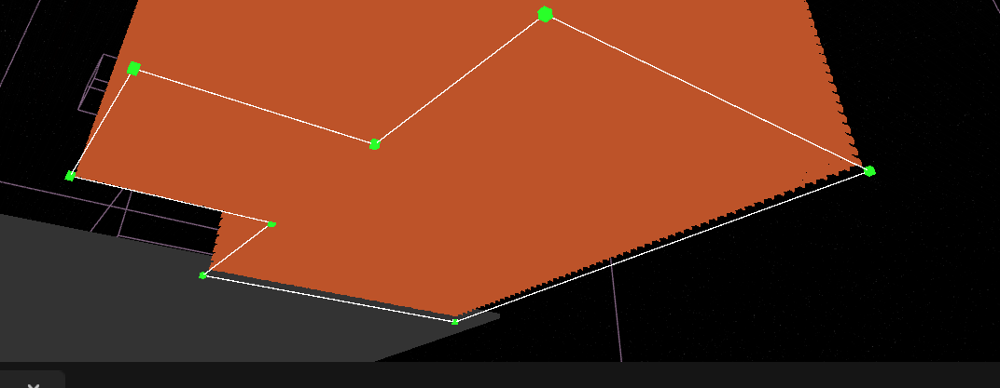{width=50%}

使用总结
- 图元互相接触的位置，大概率会产生新的横截面
- 大多数情况下，要保证只生成一个横截面，因为多个的情况对后续节点不友好（容易触发 Duplicate Cross-sections）。
- 别依赖Remove Redundant Sections，使用底部位置对齐来确保稳定
- 多图元组合产生的横截面，还是非常不稳定，编辑器经常不刷新，显示错误的结果。如果怀疑横截面有问题，点击一下图元的Mesh，或者重启UE试试。

#### Extrusion Vector Attribute 挤出向量
挤出向量是个重要属性，但本身不影响横截面的产生。是供给后续节点使用的。
- 挤出向量的大小只和自身大小有关，等于 Slice 方向 * 这个方向的长度（高度）
- 需要配置它的key，后续节点根据它查找
  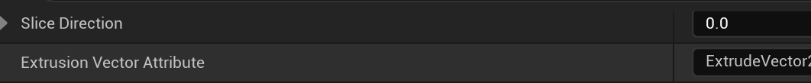{width=70%}


举例说明：
- 对于一个高度为100的正方体
- 切片方向为向上(0,0,1)
- 会在底部生成一个横截面
- ExtrusionVector 会是 (0,0,100)，表示从这个底面横截面到顶面的向量

它的作用是：给后续数据提供方向指引。

#### 其他参数
- MaxMeshVertexCount 通常图元是简单的几何体，如果太复杂可用这个限制避免卡死


:::details 代码部分
#### C++

- 数据结构
```cpp
struct FCrossSection
{
    int Tier;           // 层级编号
    double Height;      // 层高
    TArray<FVector> PointLocations; // 横截面点集
};
```
- 主要参数
```cpp
// 切片方向，默认向上
FVector SliceDirection = FVector::UpVector;

// 挤出向量属性名
FPCGAttributePropertyOutputSelector ExtrusionVectorAttribute;

// 最小共面顶点数
int32 MinimumCoplanarVertices = 3;

// 最大网格顶点数限制
int32 MaxMeshVertexCount = 2048;

// 是否启用层级合并
bool bEnableTierMerging = false;

// 层级合并阈值
double TierMergingThreshold = 1.0; // 单位：厘米(cm)
```  
- CrossSection.Height的计算

```cpp
//Height的计算过程：
const double Height = TierHeights[TierIndex + 1] - TierHeights[TierIndex];
const double RoundedHeight = FMath::RoundToDouble(Height);
CurrentTier.Height = FMath::IsNearlyEqual(Height, RoundedHeight) ? RoundedHeight : Height;
```
:::

---

### Duplicate Cross-sections 延展横截面 
（简单理解为，多层次的时候使用，比如盖房子）

该节点和`Subdivide Spline`节点，有共同父类`public UPCGSubdivisionBaseSettings`, 它们都是使用grammar来规划线段上点的生成规则。不同的是，`Duplicate Cross-sections` “通常”需要配合上面的 图元横截面`Primitive Cross-section`的一同使用。
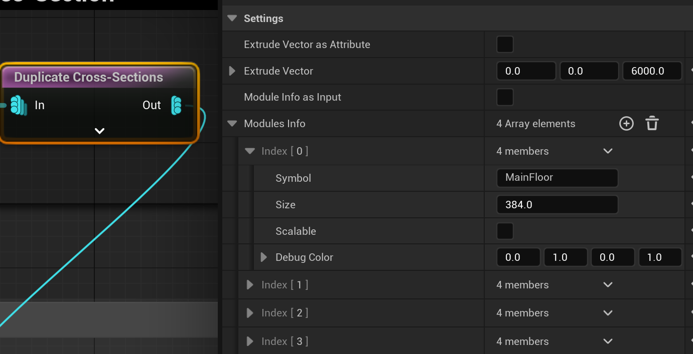{width=50%}

这里细说一下刚刚的挤出向量：

- ExtrusionVector：

它定义了横截面的"生长"方向和距离， `Duplicate Cross-sections`需要知道，新延展的横截面往哪个方向生长，以及距离多远。

如果使用了上一个节点传递过来的`ExtrusionVector`，假如是（0，0，200），但是`Duplicate Cross-sections`模块里定义的距离超过了200，就会报错。
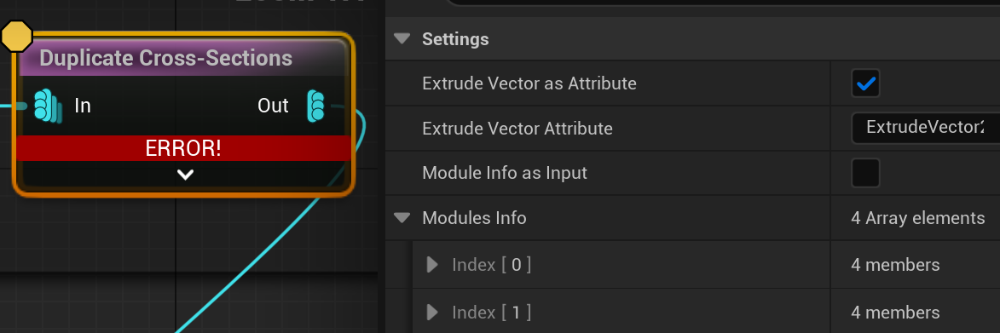{width=50%}

两种解决办法：
1. 调整图元的尺寸，让它满足`Duplicate Cross-sections`模块的需要。
2. 不使用上个节点传递过来的`ExtrusionVector`，让`Duplicate Cross-sections`自定义一个，比如（0，0，6000），可用让延展面远远超出图元的大小
  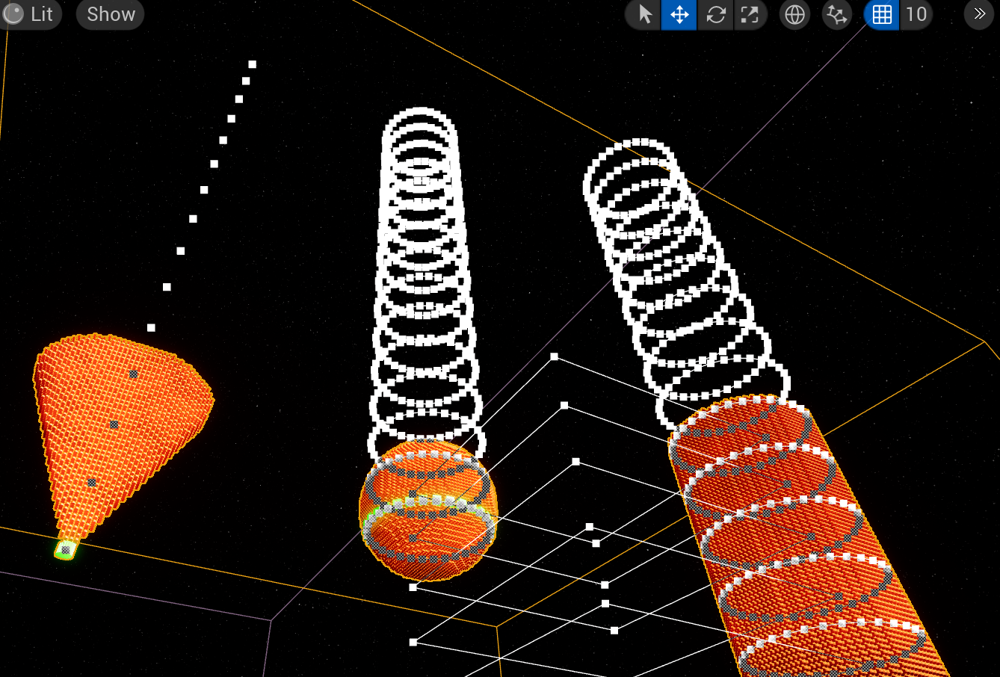{width=80%}
  （另外，球体调试的时候，不管拉伸多少，都是球体，应该是BUG，但横截面是正确的）
  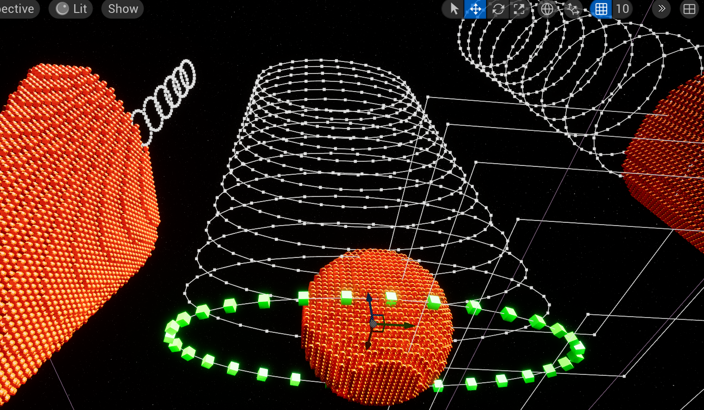{width=80%}


:::warning 精度bug
需要注意的是，挤出向量的5.5存在精度bug，不管是Primitive Cross-section还是Duplicate Cross-sections，都有这个问题。

复现过程：
- 分别往4个方向挤出100，比如(100,0,0),(-100,0,0),(0,100,0),(0,-100,0)，也就是下一个样条线的生成位置距离差是100，
- 会发现，X的反方向 总是无法正确挤出新的样条线。猜测是剩下的长度容纳不下“100”这个长度。
- 修改Module的Size为99，就能正确在4个方向挤出100。
:::

---

### Select Grammar 条件语法
通常作用于线段，对不同长度的线段使用不同的匹配语法(也可以用于选择不同的index)。比如在生成建筑时，某面墙过短，那就应该使用不包含大门的语法规则。
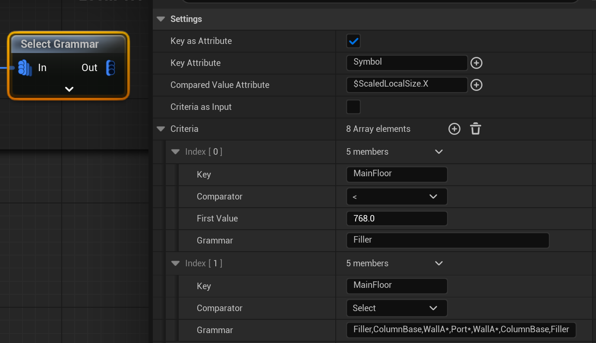{width=70%}

上面的延展样条线节点更像是复制本身，并指定每个副本的Grammar，而 Select Grammar 节点则针对线段本身。Select Grammar 的输入是Points数据，而它拥有匹配并设置数据的能力，其实不一定要用来设置Grammar，还能当做条件赋值。

#### Compared Value Attribute 匹配值

一个 Select Grammar 节点只有一个用于寻找规则的 `Compared Value Attribute`，比如基于线段长度的进行规则定制：
写法就是 `$ScaledLocalSize.X` （ 不知道这个值的含义请看前文的解释）

#### Criteria 条件标准
 
这里就可以根据线段的长度，定制各种“标准”/“规则”。

上图中，两个规则的意思是，线段长度小于768时，就使用简单的填充物规则，大于768时，就使默认的复杂规则。

输入线段一定要带有标签，和这里的key 匹配, 每个key可以定制多个规则，规则按照优先级顺序执行。

把Key当做“层”的话，Criteria就是让每一层都有定制自己的语法规则的能力。

基于线段长度定制规则的小案例：

- 使用Spline to Segment 节点将Spline分割成线段，可以看到点变成了线段，X的方向上的边界之差就是线段的长度。
  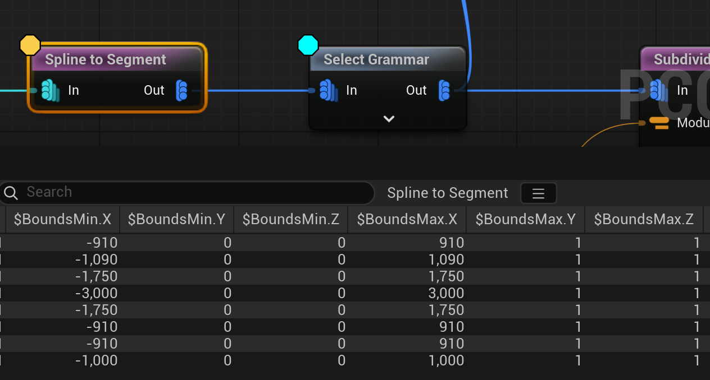{width=70%}

- 线段传入Select Grammar 节点后，开始根据条件规则，给属性附加上一个 grammar 字符串。

  为了方便调试，把它需要关注的3个值，复制到结尾，方便对比。可以看到，由于长度都超过了条件里写的768，所以都使用了默认复杂规则。
{width=70%}

- 最终，图中“Main Floor” 这一层，所有的线段，都有了自己的规则。

