# PCG 高级篇 运用案例

记录以下相关应用

## 闭合样条线判断内角外角
闭合的直线样条线，形成的凸包有时需要判断拐角使用内角还是外角，因为拐角模型也是存在“手性”的， 内外需要区别判断或者使用不同模型。这个问题可以转换为，样条线的下一个点是左拐还是右拐。左右问题，可以使用`Cross Product`来判断。
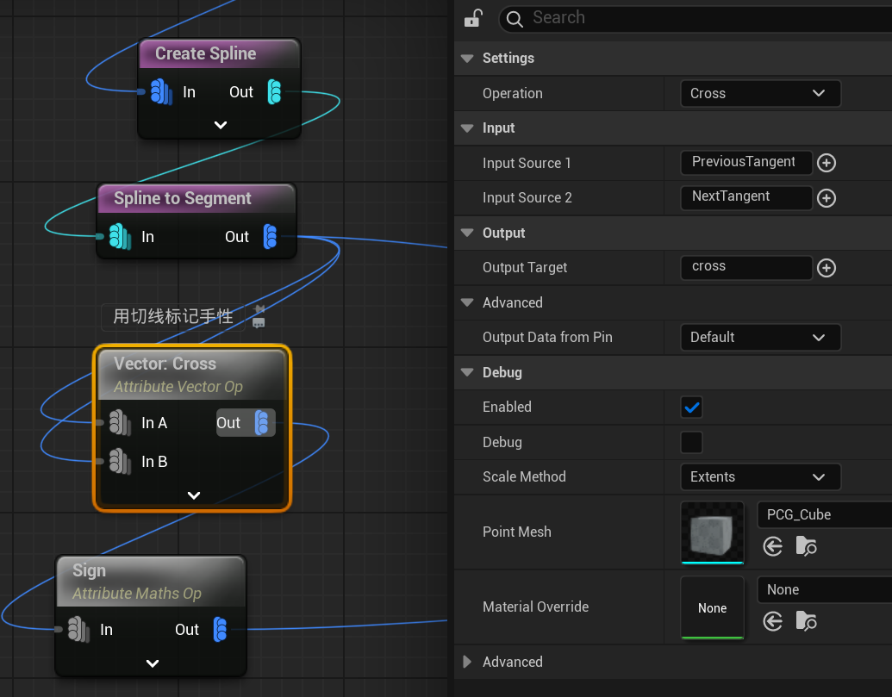


## PCG Spawn Mesh 时假装指定Pivot点
PCG Spawn Mesh的时，Mesh的的pivot点是会和PCG的Position重合。但Mesh的Pivot多种多样，有的在中心，有的在边界，有的在角落，总之乱七八糟的，重新修改Mesh又费时费力，所以应该想办法在直接在PCG中调整。

那么，只要知道Mesh的Bound 和 它当前的Pivot，只要能根据目标位置，计算出一个偏移量，就能假装调整了Mesh 的Pivot

#### 前提节点`BoundsFromMesh`
该节点可以获取到Mesh的包围盒信息，包括最小值、最大值、中心点等。有了它就能计算出Pivot点的偏移量。
 
#### Pivot 原理
默认情况下，Mesh 最原始的 Pivot点就是（0，0，0）,此时 pivot点就是包围盒的中心。假设这就是我们需要的理想状态（Pivot在BoundsBox中心）。
$$
LocalCenter = \vec{Pivot} = (0,0,0) =  (BoundsMax + BoundsMin) /2 
$$

乱七八糟的Pivot点，是通过偏移量来实现的：
$$
NewLocalCenter = Offset + Pivot(0,0,0) = PivotOffset
$$ 

所以，PCG的LocalCenter属性如果非0，就说明是被动过手脚的Pivot。

知道了原理，就可以通过减去PivotOffset来让Pivot点回到Bounds的中心，回到理想状态。

最后，因为这个偏移量是个本地向量，而PCG点的Position都是世界坐标，且都有自己的Transform属性，所以得对`PivotOffset`进行`Transform.TransformDirection`来应用方向转换。（PivotOffset是一个相对量，只需要方向变换，不需要位置变换）

#### 任意位置的Pivot居中调整
- 使用`$LocalCenter`记录Mesh的几何中心，如果是0代表没有任何偏移，如果是其他值，说明是乱七八糟的Pivot点
  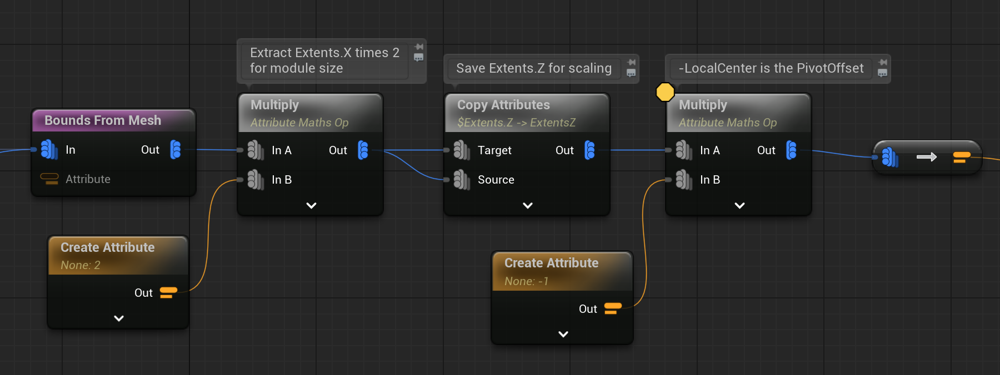

- 由于偏移量是个本地向量，而PCG点的位置是世界位置，还不能直接减去PivotOffset，先使用`Transform.TransformDirection`来换算 
  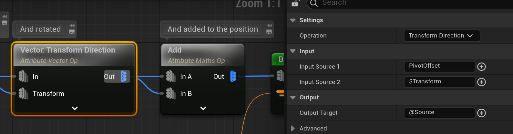

#### 任意位置的Pivot，调整到X方向最边界，Y方向居中

默认情况下，Mesh的Pivot点在包围盒中心，即LocalCenter = (0,0,0)。

如果我们想要将Pivot调整到X方向的最边界（可以是最左或最右），Y方向居中，Z方向保持原样，需要计算从当前Pivot位置到目标位置的偏移量。
既：
$$
目标向量 = ((Xmin - Xmax)/2, 0, 0) = 已有偏移量(LocalCenter) + 调整向量
$$

1. 包围盒中心到X最左边界的向量是：
   ```
   目标向量 = 左边界向量 = (Xmin - (Xmax+Xmin)/2, 0, 0) = ((Xmin - Xmax)/2, 0, 0) = -$Extents.X
   ```
2. 如果Pivot已有偏移(LocalCenter)，我们需要计算额外的调整向量：
   ```
   
   调整向量 = 目标向量 - LocalCenter
   ```
   其中，目标向量可以是左边界向量或右边界向量，取决于我们想要将Pivot调整到哪一侧。
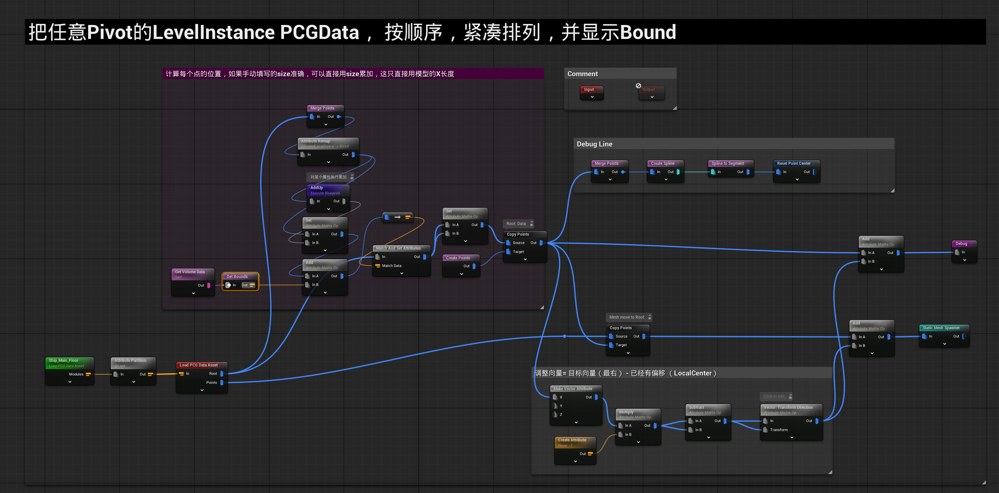{width=80%}
最终，这个调整向量是本地坐标系下的，需要使用Transform.TransformDirection转换到世界坐标系，然后`+`到PCG点的Position。


## PCG自适应铺地板
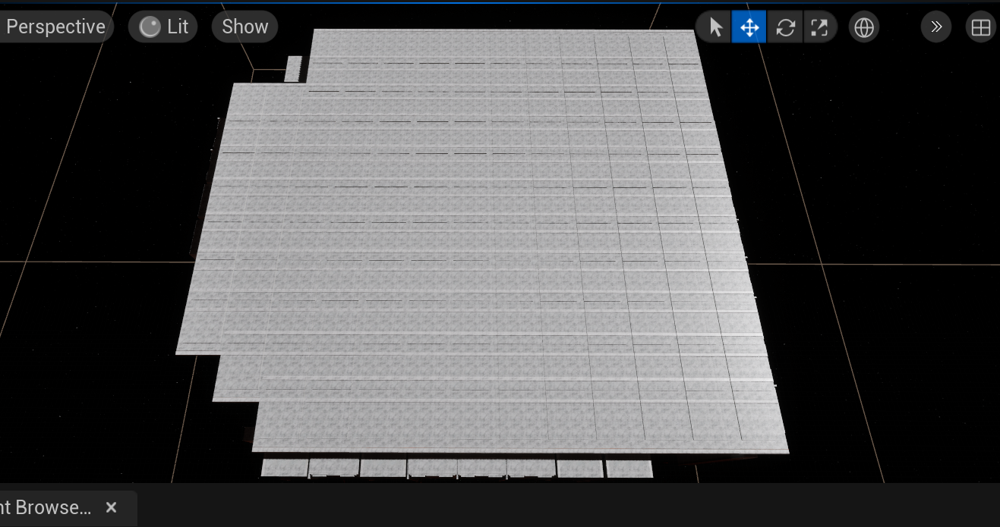
地板宽度通常是固定，所以对应输入的样条线区域，还需进行调整，有以下步骤：

#### 获取全部楼层(poly line 类型), 传入子图，在子图执行全部逻辑
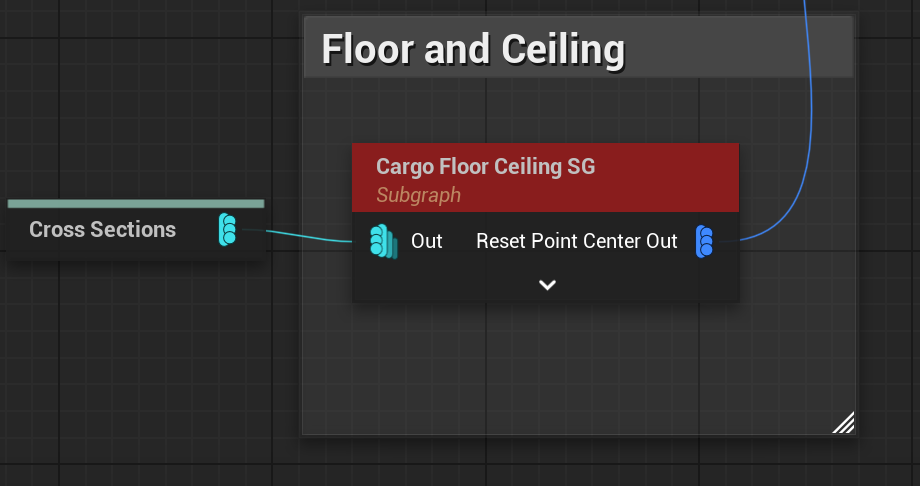{width=60%}
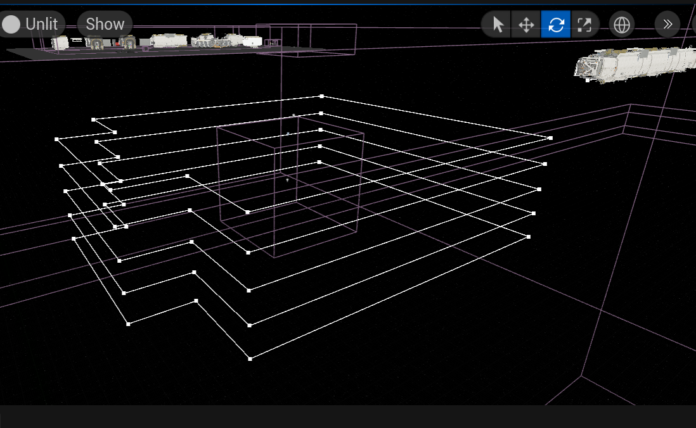{width=60%}

#### 使用 `Filter data by index` 筛选出需要地板的楼层
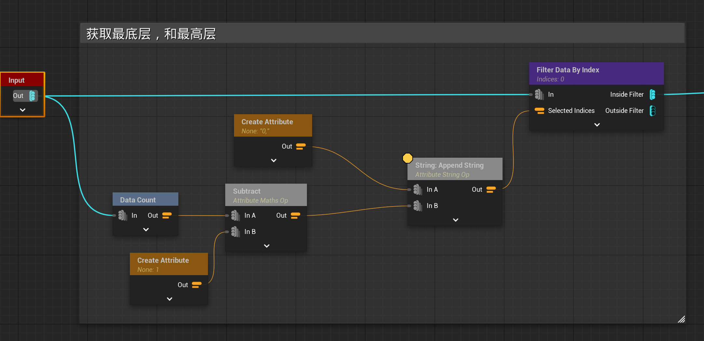{width=60%}
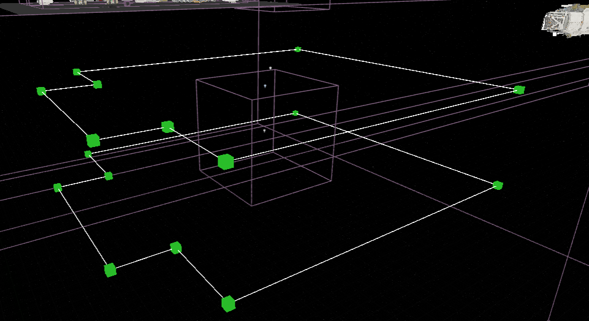{width=60%}

#### 把点映射到世界零点，方便后续计算：
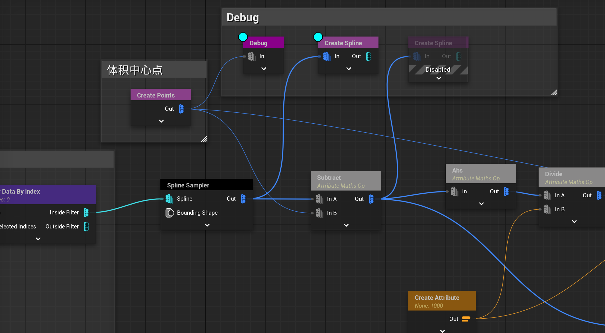{width=60%}
1. 创建一个原点
2. 每个点减去原点，就映射回世界零点。
3. 对每个点 使用 `abs` 取绝对值，全部射到第一象限。


#### 根据长度，计算地板数量
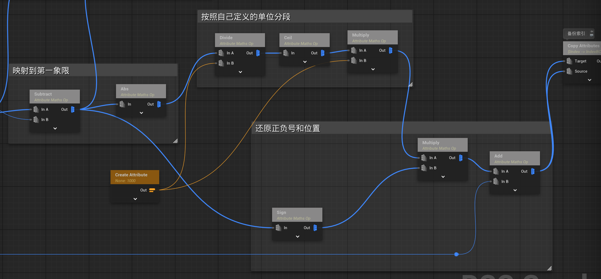{width=60%}

1. 假如地板宽度为500，那么这里的分段可以取500的倍数，这里写1000就是每段至少2个地板
2. 除出来后，如果2.3个地板，必须向上取整变成3，才能符合“容纳”的要求。
3. 还原回原点。
4. 最后一个add 把结果写入Postion，最终更新了整个样条线的大小，让其符合地板宽度的要求。


#### 输出地板数据
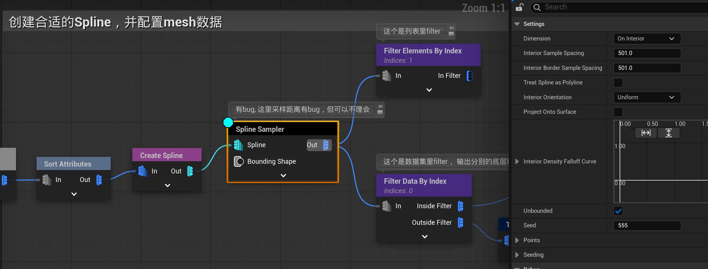{width=60%}

1. 创建新的，大小已经合适的Spline ，选择在内部模式且无边际必须打勾
2. 采样距离设置为500（会报错但不影响使用，不必理会，应该是bug）


## PCG 自动样条线Mesh
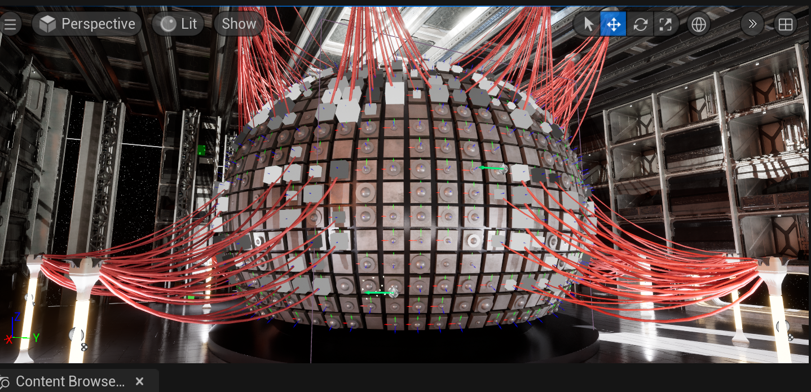
主要都是 Attract节点的用法， Attract的主要功能的搜索和关联

#### 用2个Attract 配合，创建起点和终点
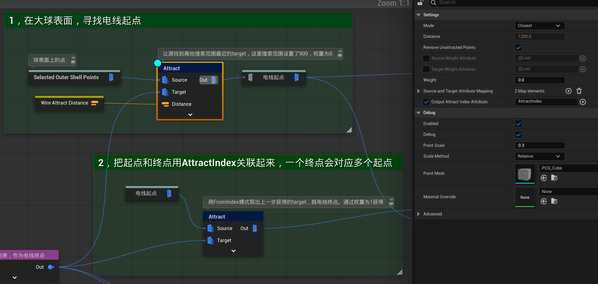{width=75%}
1. 让球面点，搜索半径1200范围内，可以关联的点，模式为 最近点
2. 能搜索到的“关联点”的球面点，会被attract节点输出，对于关联点来说，形成了1对多的关系
3. 把第一个 Attract节点的权重设置为0，输出的就是源点的位置（图里就是球面点）
4. 把第二个 Attract节点的权重设置为1，输出的就是关联点的位置（图里关联点是天花板或者地面的灯柱）
5. 第二个 Attract节点的的搜索模式，改成`from index`模式 来获取即可，不用搜索，加快速度

#### 计算指向终点的向量
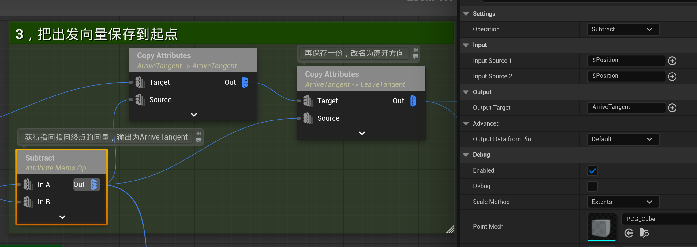{width=75%}
1. 这里的离开方向没用上，可以忽略

#### 分别计算终点和起点对应的俯仰角度
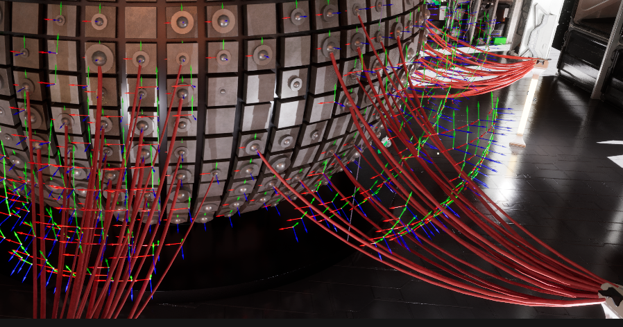{width=45%}
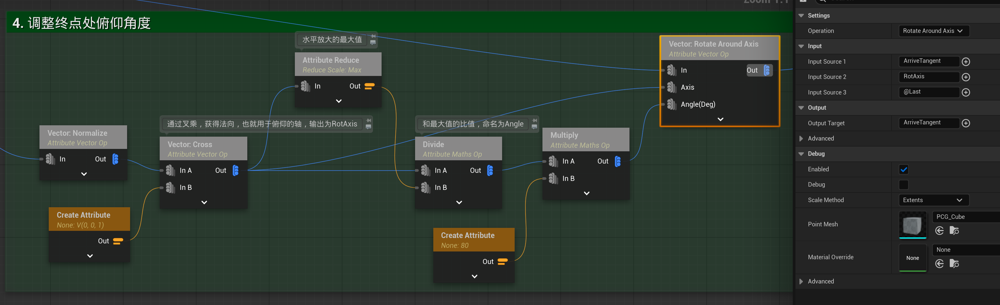{width=75%}

1. 如果某些关联点存在放大，就用reduce节点来获取放大值最大的值，作为基准。越大的点，偏转角度越大，体现“电线”越重。
2. 因此，这里的Angle 是一个比例值，在和和定义的最大角度80相乘，让每条线都有自己的偏转角度

#### 连接起点和终点，生成样条线Mesh
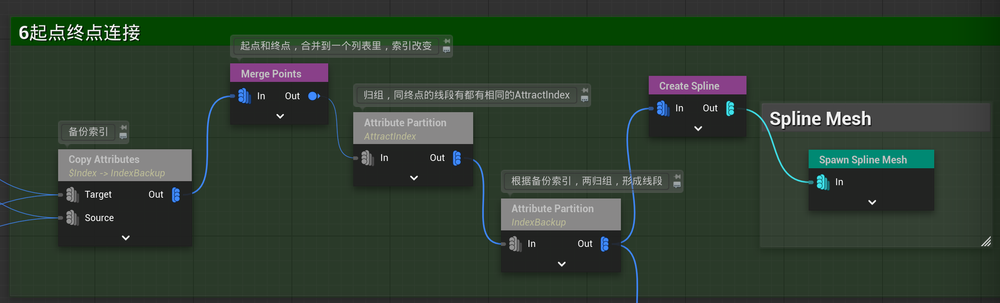{width=75%}
1. 先根据关联点归组，关联点是1对多的关系，归组后，每一列输出的就是拥有共同关联点的的球面点。
2. 由于之前合并过起点和终点，所以此时的数据，index相同的已经两两成对。（ 到了这里会发现其实第一步不需要也可以）
3. 因此，再次根据index归组，归组后面跟着另一个归组，这是一个类似flatmap的操作，把每一列的产生两两成对都输出到主序列。
5. 最后使用`Spawn Spline Mesh`节点生成样条线Mesh

:::details flatmap
```kotlin
val list = listOf("123", "45")
println(list.flatMap { it.toList() }) // [1, 2, 3, 4, 5] 
```
:::


## PCG 填坑记录

### 不生成，缓存错误，可以试试按住 Ctrl + 再点击 重新生成。
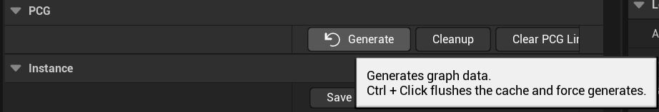

### 尽量使用PCG Stamp, 而不是PCG 原始 Actor，否则可能存在潜在的崩溃问题。
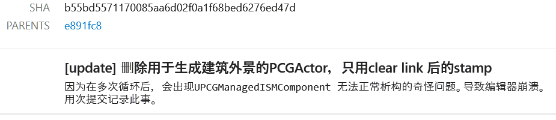

### PCG (编辑器时)回调内存泄露

官方的PCG回调，比如OnGenerated, 通过编辑器详情页面创建一个Event，是有问题的。会导致内存泄露，每次编译一次，都会创建一个新的Event，导致回调次数递增。

一种解决方案是：手动绑定Event，而不是通过编辑器详情页面创建。

### PCG 样条线采样器的一些说明
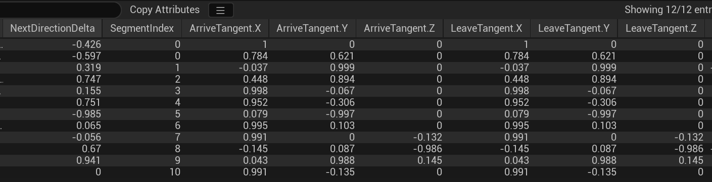{width=80%}

NextDirectionDelta： 是用当前点，来记录它的下一个点的方向变化增量，对比的轴是UpVector, 增量是用本地坐标系来对比（），增量被归一化为-1到1

-1表示 ForwardVector绕UpVector向右旋转90度 （顺时针）

0表示 ForwardVector 和下一个点方向一致

1表示 ForwardVector绕UpVector向左旋转90度 （逆时针）

（没看源码，NextDirectionDelta 极有可能是通过计算 下一个点的前进向量 (NextForwardVector) 与 当前点的左侧向量 之间的点乘得到的）

最后一个点没有下一个点，所以NextDirectionDelta为0


## Runtime PCG 

大多数情况下，只需要在编辑器模式下使用PCG来构建数据，运行时使用这些构建好的数据即可。但需要和游戏环境互动的，就需要Runtime PCG了。

比如走到哪就生成到哪，需要根据玩家位置来生成数据，或者根据场景内其他动态数据来生成数据。

但运行时PCG其实BUG很多，毕竟感觉使用的人很少，很多问题要使用后才能发现，选择运行时PCG需要谨慎。

### 一些运行时PCG遇到的问题记录

#### 1. 部分LevelStream 关卡重新加载，需要刷新PCG缓存，否则生成的数据会出错
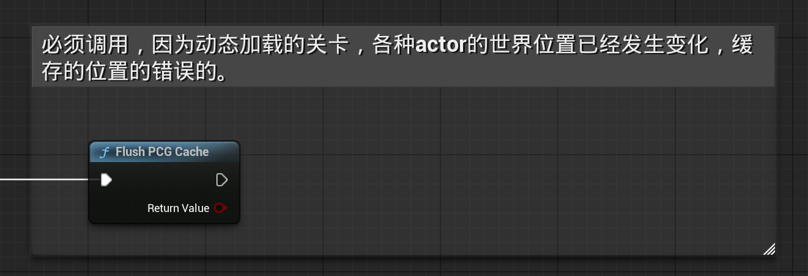

#### 2. 运行时PCG和编辑器PCG 存在不同逻辑，如运行时int32类型其实是按float类型处理的，导致精度问题。
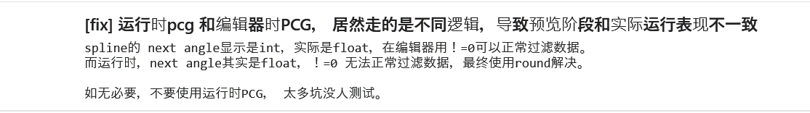

编辑器时，显示的数据，全是int32类型：
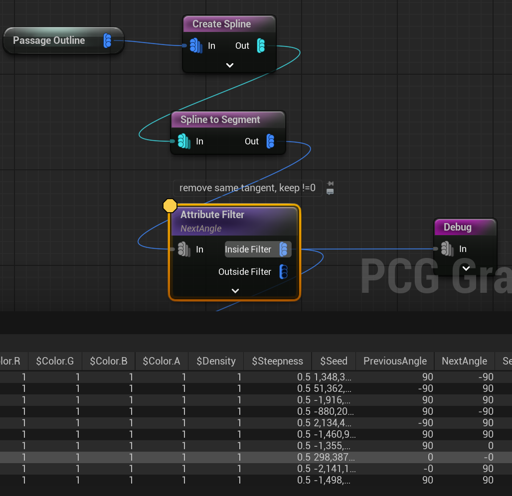

运行时，显示的数据，全是float类型，导致运行时生成结果和编辑器存在严重偏差：
 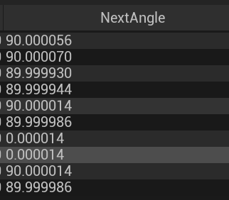

最终附加一个round节点，可以解决这个问题：
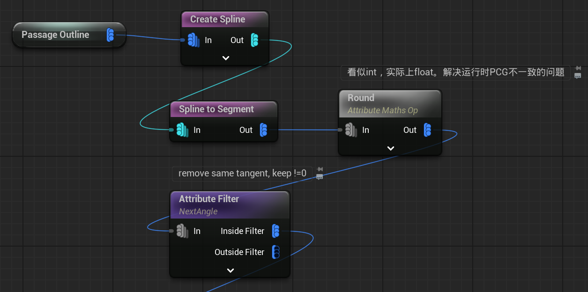