# PCG 常用节点记录

## 约定

约定一些术语表达

| 中文翻译 | 原文 | 说明 |
| --- | --- | --- |
| 属性 | Attribute | 每个输出都有自己的属性，可以理解为表头 |
| 属性行(表行) | Point Data / Metadata  | 同一个输出里都有相同的表头，但数据不一样，多个Point就有多行 |
| 属性集（表） | Attribute Set | 属性 + 全部属性行 形成的一张表格(方便表述可以简称表) |
| 集组（表组） | Attribute Sets / Attributes / Data | 属性集作为元素的数组，存放每一张完整表的数组 |

约定符号表示：

**表组**
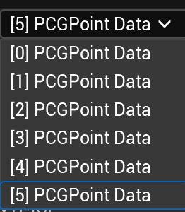{width=20%}
- 大写字母命名：`A,B,C`
- 空表组：`{}`
- 表组里3个不同表：`A:{a,b,c}`,或者直接`{a,b,c}`

**表**
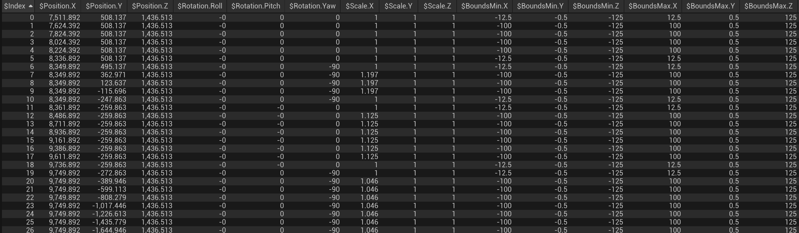{width=70%}
- 小写字母表示表：`a,b,c`
- a表里全部行：`[a...]`

**行**
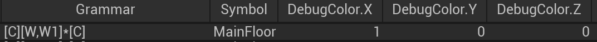{width=70%}
- 表行：`a(1)`
- 行属性：`a(1).Position`

## 基础操作

### 常量
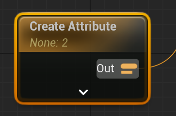{width=20%}
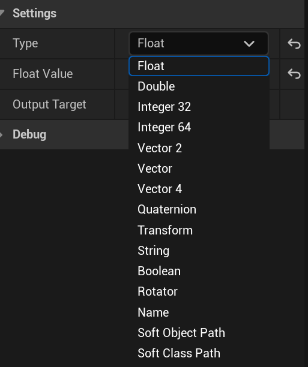{width=20%}
- 可以通过 `Create Attribute` 节点 创建一个常量
- 通过 指定`outputTarget` 来个输出命名

### 操作
PCG的操作，就是处理表，一行一行地处理。以`multiply`乘法节点为例，对于乘法来说，并不是所有属性都可以进行乘法，所以实际上只能针对某一个属性进行乘法，所以默认的操作对象是行的最后一个属性`@Last`，我把这种默认操作，叫**尾操作**。 节点里也可以手动指定其他属性。

因此，PCG的大部分操作都可以归纳为**选中表的其中一列进行操作**

归纳一些大部分的情况：

**表之间操作的局限性：必须N:N**（大部分情况下）

- 图下图，两者行数必须相等，才能实现“两两相乘”：
  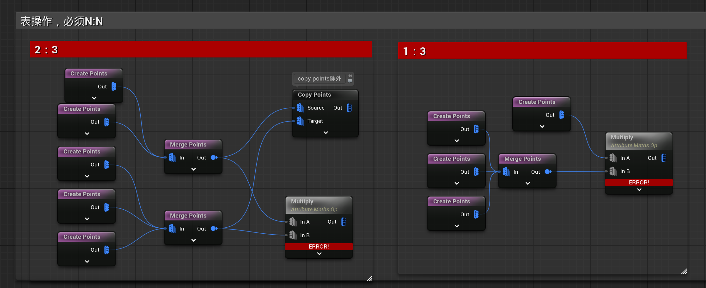{width=80%}
  图中展示行数不同的表之间进行相乘，会报错，无论是2对3，还是1对3操作，都报错。表之间数据必须一一对应。copy points是特殊实现，可以无视这个限制。详见[copy points](#copy-points)。

- 常见例外：常量可以和任意行数表操作：
  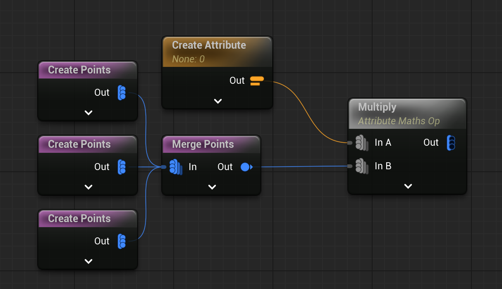{width=40%}
  每行都和该常量相乘，非常好理解。

- 常见例外：`Add Attribute`无视N:N的限制
 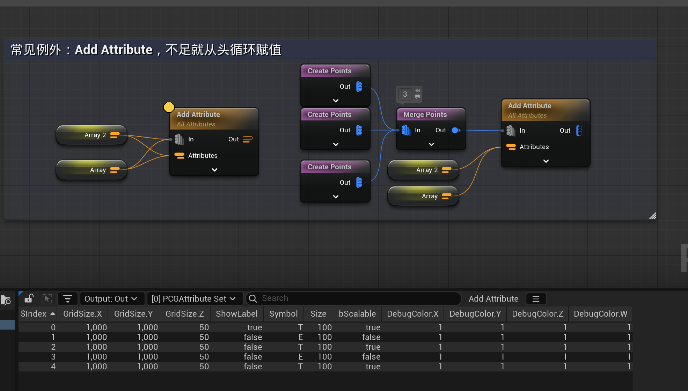{width=60%}
   Array表只有2条数据，而Array2有5条，无法一一对应，数据会在不足时重复使用，类似取余。

**表组之间的局限性：必须1:N，N:1，N:N**（大部分情况下）
- 表组数量必须相同，或者其中一方的数量为1
  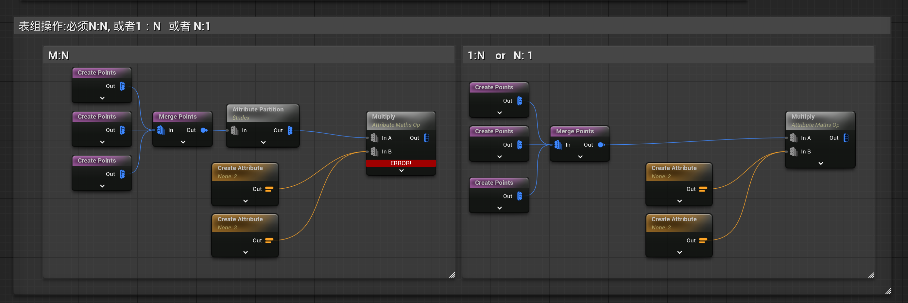{width=80%}
  如图，使用归组操作把点分成3组后，和两组表的相乘操作，就会报错。

  另外，copy points也是特殊的，但需要勾选N:M支持，否则会也报错。
  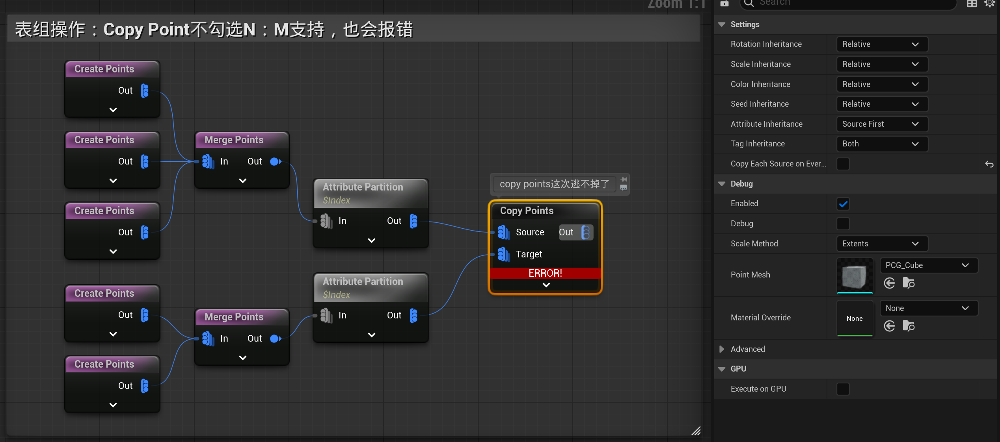{width=80%}

### 赋值

- 直接赋值：`Set`
  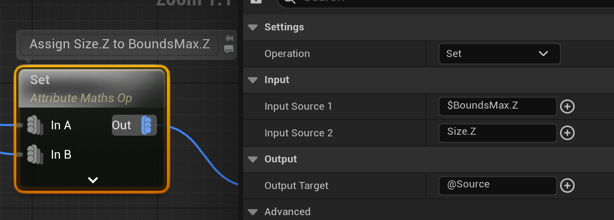
  - 需要注意的是，不是所有的属性都支持“Set”操作，比如 Rotator就不支持Set

- 写回：`@source`
  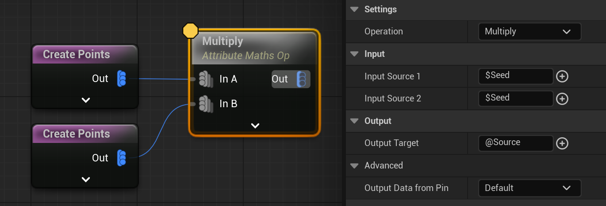{width=40%}
  除了用Set赋值，绝大部分操作(比如加减乘除)都支持写回`@source`， 则也是一种赋值方式。output target使用`@source`表示写回默认输出数据，图这里默认输出是InputA，可以修改为InputB.

- 重写: 使用`Remap`节点 
  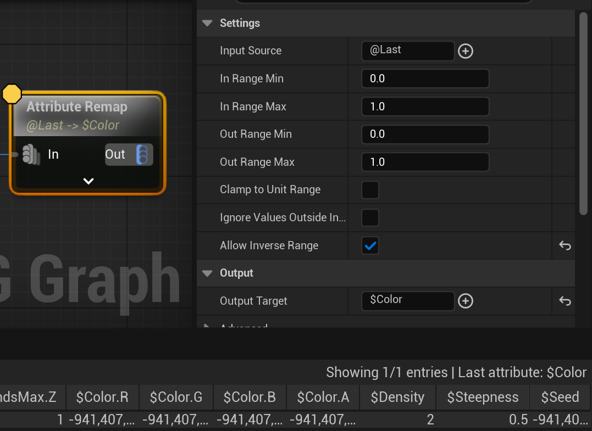{width=40%}
  图中展示用尾操作，把数据写入`@color`里面。ReMap还能随机过渡。

- 更常用的赋值：`Copy Attribute`节点
  - Set不支持的，它都能正确支持。该节点支持3种模式，可以N:N,就是Each to Each。但我在测试把属性复制到样条线数据的时候，发现它无法正确N:N，但Points数据的时候是正常的。

- 添加：显式使用`Add Attribute`节点
  {width=50%}
  上面的2种操作也能把属性添加到末尾，但这个方法更加强大，可以添加各种支持的数据，比如Texture等。  

### 读取

- 获取表的某一行：`a(2)`
  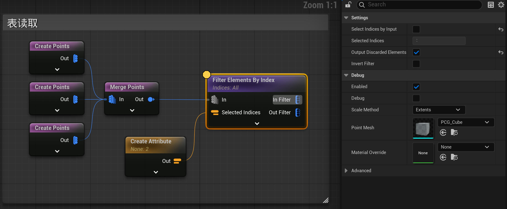{width=60%}
  

- 获取表组的某个表：`A(2)`
  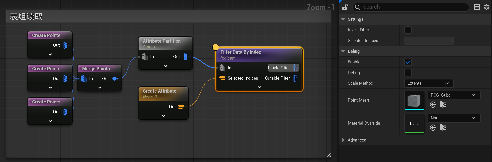{width=60%}

- 获取行的某个属性：`a(1).Color`
  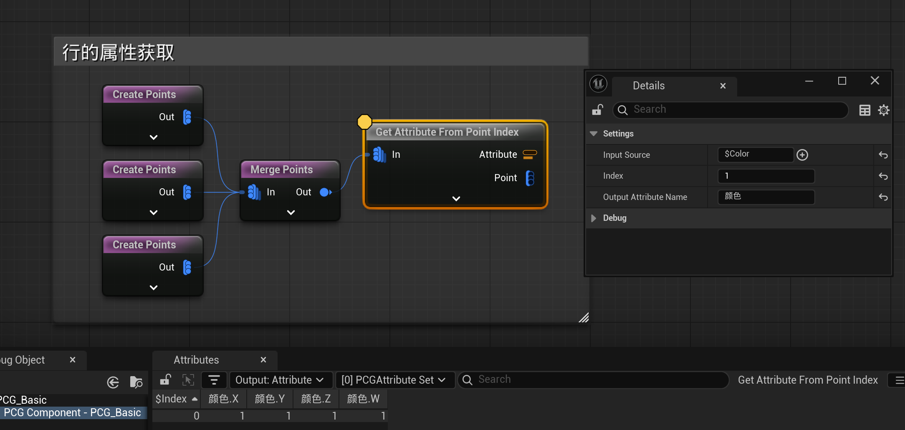{width=60%} 


### 删除
{width=60%}
没啥好说的，直接用`Delete Attribute`节点，就是 `Add Attribute`节点的反向操作。

还有个`Attribute Remove Duplicates` 删除重复的属性


### 条件控制
都是相对静态的控制，PCG本身无法修改判断值。但可以用代码，比如蓝图在运行时修改，改变数据流向来产生变化，相当于一个静态开关。
- Branch:  给数据下游提供2个分支
  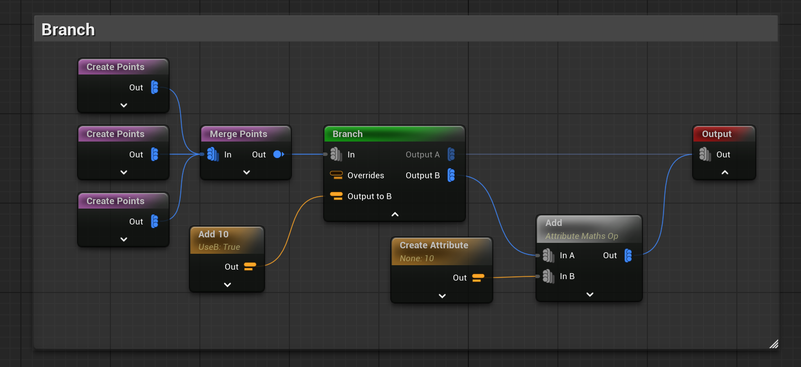{width=60%}
 

- Select:  选取其中一个上游
  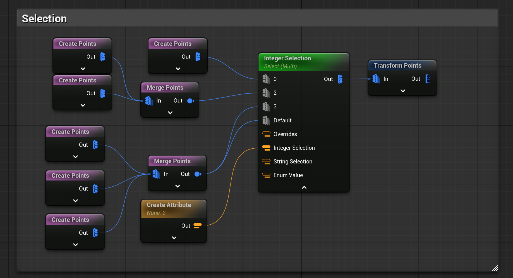{width=60%}
   
  Select相对branch更加灵活一些：
  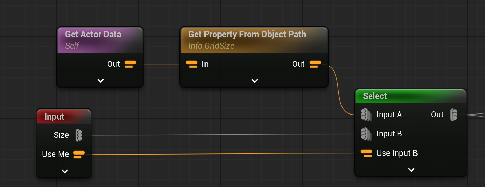{width=60%} 

### 循环

Loop 是针对表组来操作的。如果需要循环，需要向把要处理的数据，整理成表组结构。

Loop需要配置 Pin的使用类型，有3种：Normal，Loop，和 feedback
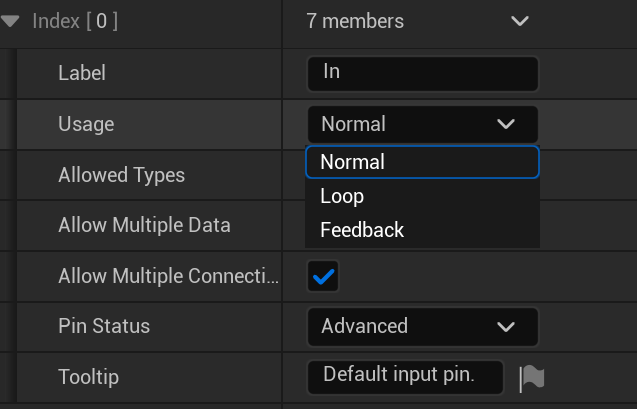{width=30%}

###### Pin 状态
- Advanced：默认会自动隐藏
- Normal：不会自动隐藏
- Required：必须连接

###### Pin使用模式：
- Normal：默认，一般用于数据处理，使用体感上和Loop没啥区别，完全可用使用它作为默认。
- Loop：结果和Normal一样，过程不太一样，如果你知道哪部分需要循环，最好使用这个模式。
- feedback：提供上一次循环的数据。如果要用上的话，输入和输出都要定义这个PIN，
- 这3使用模式只需要在输入的Pin配置好即可，而输出Pin 即使全部使用默认的Normal也可以，代码内部是会自动匹配的。


###### 和 Select结合组成更动态的判断
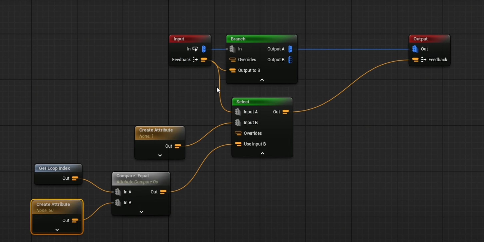

例子：

循环体：创建一个点，合并到一起再输出； 累加自定义数据Data，输出到Feedback。只配置了输入Pin的自定义数据Data为feedback，其他都是默认。
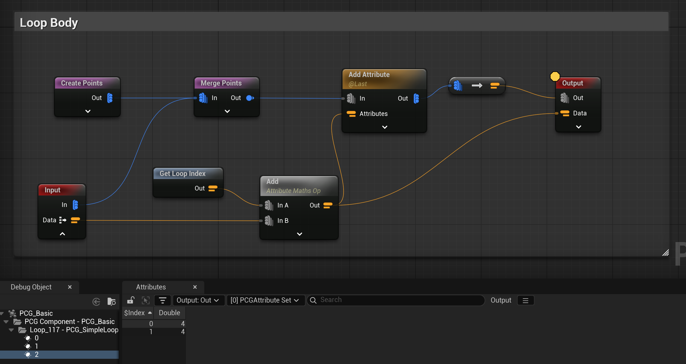{width=60%}

调用结果：每个表都多了一个行，尾部也增加了一个经过累加的自定义数据Data
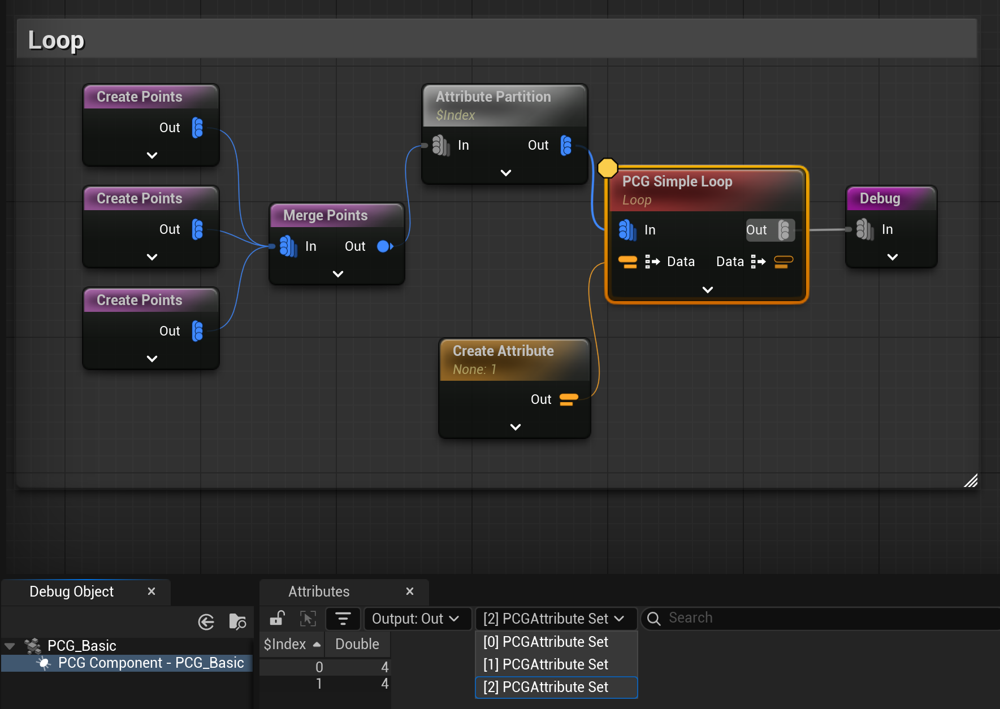{width=60%}

### 函数
PCG 并没有函数这回事，但提供了类似的一些类似的东西：

- Subgraph 可用于复用通用逻辑。和Loop没啥太大区别，都要另外创建一个文件来写节点，只是不能循环。另外创建文件感觉还是挺不方便的，希望官方能够把它做得更像函数一些。

- Custom Node，自定义节点，可以用于实现复杂的逻辑，蓝图和C++ 都能创建。

- CustomHLSL Node，可以调用GPU并行计算一些参数，SDF也是支持的，也相当于一种“函数”。


---

（以下是节点的使用）
## Merge 合并
把全部输入进来的表组，合并成**单个**大表（属性集）。
{width=30%}
```js
//伪代码
merge({a,a},{b}) = [a...,a...,b...]
```
:::warning
- 如果表头的数量不一样，表头也会进行合并：

多出来的一方，作为另一方的默认值，（谁带来的就用谁作为默认值）:

A表头`[花瓣个数，花颜色]`, B表头`[花瓣个数，花的种类]`

合并后，每一行的值：`[花瓣个数，A花颜色，B花的种类]`
:::

## Gather 收集
和Merge不同，Gather不会合并每行的数据，而是把输入的表组都合并在一起。
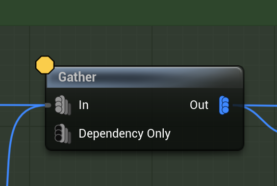{width=30%}
```js
//伪代码
gather({a,a},{b},{c}) = {a,a,b,c}
```
- Dependency Only: 该输入不会被合并到最终结果，仅作为依赖，类似异步编程里，需要等待某个流水线的也完成后，才能开始合并。


## Reduce 归约
归约支持多个模式，sum，average,max,min,Join
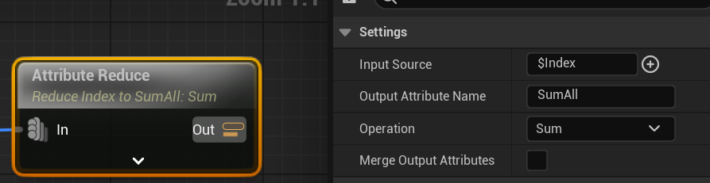{width=50%}
```js
//类似函数式编程里的reduce
reduce([a...],Math::Sum) = a1.x + a2.x + a3.x + ...
```
- Merger Output Attributes: 用于把集组合并成单一的属性集

## Copy Points
{width=70%}
这是很迷惑的名字，直面意思是复制点，实际上的意思大概是：

> Copy Points 节点是PCG系统中一个重要的点操作节点，其主要功能是将源点（Source Points）复制到目标点（Target Points）上。这个节点最常见的使用场景是：以相对位置的方式，将输入源的点附加到目标点上，其中目标点作为输入源点的轴心点（Pivot）。

详细用法参考B站Up [ZzxxH](https://space.bilibili.com/19131632/) 总结的图：
{width=70%}

::: details 详细说明
###### 点的复制模式

1. **笛卡尔积模式** (bCopyEachSourceOnEveryTarget = true)
```cpp
NumIterations = NumSources * NumTargets;
const int32 SourceIndex = i / NumTargets;
const int32 TargetIndex = i % NumTargets;
```
- 每个源点都会复制到每个目标点上
- 产生 N * M 个输出点

2. **一对一模式** (bCopyEachSourceOnEveryTarget = false)
```cpp
if (NumSources != NumTargets && NumSources != 1 && NumTargets != 1)
{
    // 报错：只支持 N:N, 1:N 和 N:1 操作
}
NumIterations = FMath::Max(NumSources, NumTargets);
```
- 支持 N:N, 1:N 和 N:1 的映射关系
- 产生 max(N, M) 个输出点

###### 元数据处理

1. **元数据继承模式**
```cpp
// 五种模式
SourceFirst  // 优先源点元数据，添加目标点独有属性
TargetFirst  // 优先目标点元数据，添加源点独有属性
SourceOnly   // 仅使用源点元数据
TargetOnly   // 仅使用目标点元数据
None         // 不使用元数据
```

2. **属性合并优化**
```cpp
// 使用并行处理来设置属性值
ParallelFor(AttributeCountInCurrentDispatch, [&](int32 WorkerIndex) {
    FPCGMetadataAttributeBase* Attribute = AttributesToSet[AttributeOffset + WorkerIndex];
    Attribute->SetValuesFromValueKeys(Values, false);
});
```
:::


## Attribute Partition 属性分组
这个其实就是 函数式编程里的 `GroupBy`, 根据输入的属性值进行归组
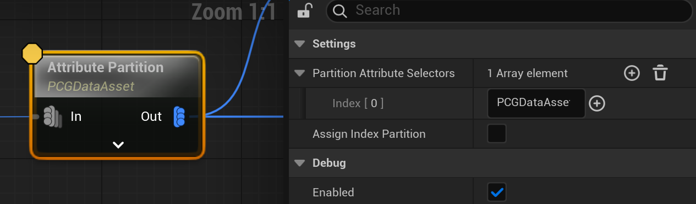{width=60%}
```js
// 类似GroupBy`操作
GroupBy([{id:1, type:"A"}, {id:2, type:"A"}, {id:3, type:"B"}], "type") = {
    "A": [{id:1, type:"A"}, {id:2, type:"A"}],
    "B": [{id:3, type:"B"}]
}
```
- Assign Index Partition : 分配一个序号


## Filter Data By Index 和 FilterElementsByIndex

Filter Data By Index节点有个输出，选中的 和 未选中的

名字里的Data是集组的意思，该节点用于在集组里面筛选出自己要的 属性集

如果要获取属性集里的点数据，可以使用 `FilterElementsByIndex`

但FilterElementsByIndex 节点只输出 选中的

区别：
- FilterDataByIndex: A(index) 这是表组
- FilterElementsByIndex: a(index) 这是表

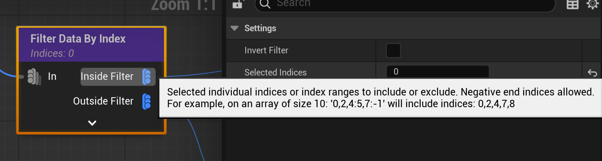{width=80%}

都支持选中语法：
- 8   （返回索引为8的值）
- 1:8  （返回索引1到7的值）  
- :8   （返回索引0到7的值）
- -1   (返回倒数第一个值)
- -8:   (返回倒数第8到倒数第1)
- 1:5,10:15   （返回索引1到5，索引10到15的值）

:::warning 5.5 的FilterElementsByIndex 存在bug 
如图，根据输入的index返回选择的点，输入3个点，选中其中3个index， 但结果只有2个点。

把其中一个重复，也就是输入4个点，才能返回我想要的3个点。
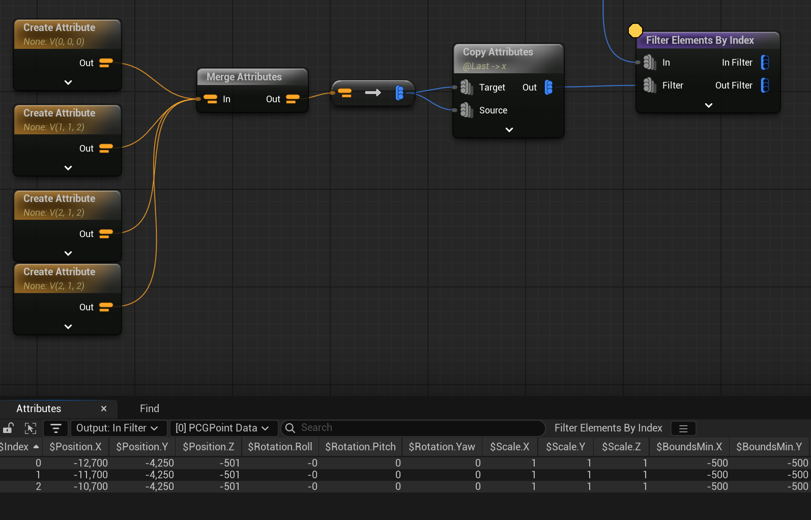
:::

## Attribute ReMap 属性重映射
这是一个修改自身属性的节点，非常常用

## Trig 三角函数节点
三角函数节点，可以用于计算正弦、余弦、正切等函数
其中atan2 非常常用。atan2(y,x) 可用计算角度。


## Grammar相关节点
[Grammar相关节点](./01PCG_Mid.md#grammar浅析)

## Attract 吸附节点
给定一个搜索距离，寻找最近或者的的远的点

[案例](./03PCG_Advanced.md#用2个attract-配合创建起点和终点)
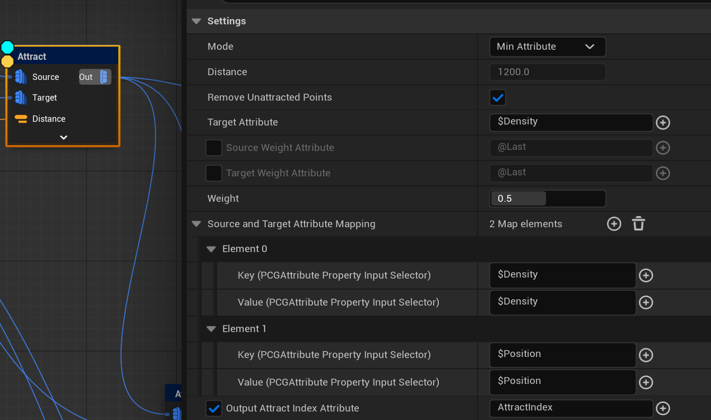{width=60%}

支持3个吸引模式：
1. Closest Mode
- 功能：将源点吸引到最近的目标点
- 实现原理：在指定搜索半径内使用点的Position（Transform.Location）计算欧几里得距离
- 使用场景：需要简单的就近吸引时使用

2. MinAttribute Mode
- 功能：吸引到属性值最小的目标点
- 实现原理：在搜索半径内比较目标点的指定属性值，选择最小值
- 支持任何可比较的属性类型
- 使用场景：例如将物体吸引到最低高度的位置

3. MaxAttribute Mode
- 功能：吸引到属性值最大的目标点
- 实现原理：在搜索半径内比较目标点的指定属性值，选择最大值
- 支持任何可比较的属性类型
- 使用场景：例如将物体吸引到密度最大的区域

（目前应该是有bug，选择MinAttribute和MaxAttribute的时候，设置了可以比大小的属性，但还是没有效果。）

所以通常还是用Closest Mode，
使用weight控制位置插值，weight越大，插值越近目标值。

源码：`OutputValue = FMath::Lerp(SourceValue, TargetValue, Alpha);` alpha 就是 weight。

使用weight的时候，这个配置不能没有：
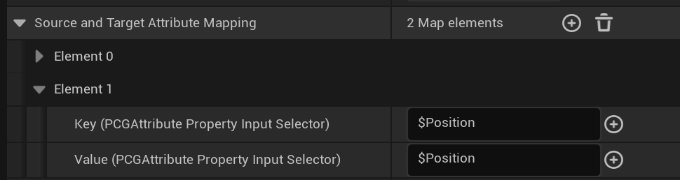{width=60%}

###### 参数
- `Distance`: 搜索半径，决定吸引的作用范围
- `Weight`: 吸引强度(0-1)
  - 0: 保持在原始位置（不吸引）
  - 1: 完全吸引到目标位置
- `bRemoveUnattractedPoints`: 是否移除未被吸引的点
- `TargetAttribute`: MinAttribute和MaxAttribute模式下用于比较的属性
- `SourceWeightAttribute`/`TargetWeightAttribute`: 源点和目标点的权重属性


## Difference 差集
[详情](./04PCGNode2_Diff.md)

## Intersection 交集
可以添加多个secondary input
{width=60%}
 
1. **主输入（Primary Input）**  
   - 主要输入 `Primary Input Pin` 是交集计算的起点，每个输入都会被单独计算。  
   - **每个主输入的数据会与所有其他输入进行交集计算**，并生成新的空间数据。  

2. **次要输入（Secondary Input）**
   - **所有次要输入数据默认会被自动联合（unioned）**，然后才与主输入进行交集计算。  
   - 例如：
     - **输入 A（主输入）**
     - **输入 B1、B2、B3（次要输入）**
     - 在计算时，B1、B2、B3 **会先合并成一个整体 B**，然后 `A ∩ (B1 ∪ B2 ∪ B3)` 进行交集计算。  
   
3. **空数据处理**  
   - **如果某个输入为空（无数据）**，默认情况下，该输入会返回空结果。  
   - 但如果勾选了 `Ignore Empty Secondary Input`，那么空的次要输入将不会影响计算，而是会跳过它们。


## BoundFromMesh 应用Mesh的边界框

该节点可以应用Mesh的边界框，但目前存在验证bug，承载Mesh信息的点本身不能有任何旋转，-0 也不行，否则无法应用。


## References

- [拆解UE5 PCG 项目《CassiniSample》(一)](https://zhuanlan.zhihu.com/p/25563585263)
 