# PCG Union And Difference

PCG 中， Union和Difference节点的密度函数是非常晦涩的部分，没有官方文档只有代码; 这里记录一下我自己的研究。

## Union

Union在中文里常见的翻译为并集，或者联合。无论中英文，名字表达的意思和它所作的事情充满了歧义和误导。并集是数学上的概念，合并两个集合，得到一个更大的集合。但PCG中的Union，由于密度函数的存在，它更像是在做“排除”，两个接入的点可能会出来1个。

如果需要“并集”，来获得合并进来全部点， 最应该使用的是ToPoints节点或者 Merge Points节点。

### Union 的真实意图是“融并”

- step1 如果两个点有重合部分（代码里是判断是否intersects）了，且两者的密度都不为零，那么密度函数就会起作用，来融并他们。否则不处理，直接返回原来的数据。

- step2 既然是融合，如两个点变成一个点，那么必然需要有优先级，来决定保存谁，舍弃谁。Union提供了两种模式：数组的左到右，和右到左这两种模式。（这也是比较晦涩难搞的地方，光看节点的连接，是看不出左右；在编辑的时候，谁先连接谁就在数组的左边，一旦编辑过后，你就会忘了到底谁先谁后，目前PCG节点是看不出的，只能规范地连接节点，在上面的代表更先连接）； 除了左右优先级，他还有个keep all模式，如果需要保留全部点，还不如用Merge Points节点。

- step3 确定了保留谁后，开始计算融并后的密度，用Union节点配置的密度函数来计算。

而密度函数有3个模式：

- Clamped Addition: 钳制加法, 就是相加，超过1设置为1
  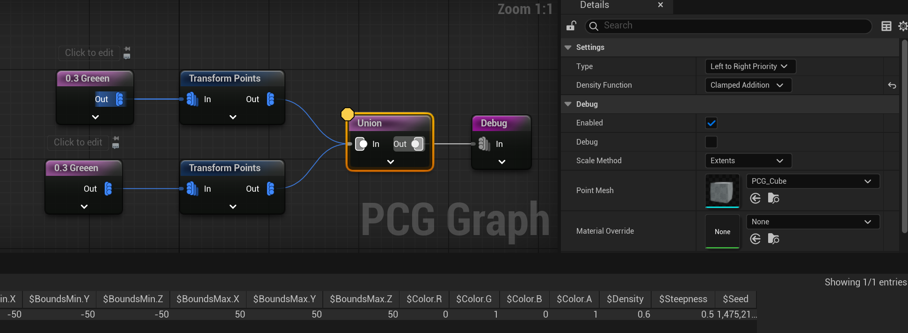
  如图，创建两个有重叠部分的点，两个点的密度都是0.3，所以最终密度为0.6；钳制加法就是把两者的密度相加，但钳制在0-1之间。公式:
  
  `FMath::Min(InDensityToUpdate + InOtherDensity, 1.0f);`

- Maximum: 取最大值
  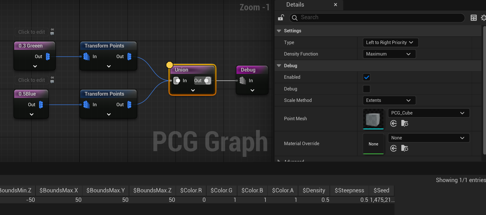
  如图，此时保留的是密度较大的点 0.5，公式:
  
  `FMath::Max(InDensityToUpdate, InOtherDensity);`

- Binary: 二进制，非黑即白
  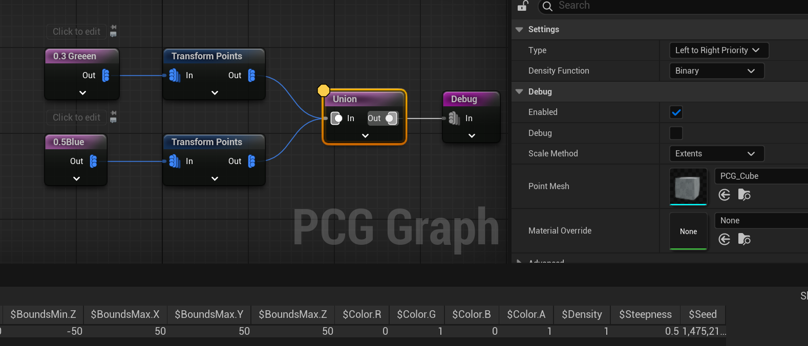
  此时，只要密度大于零，就都设置为1，否则设置为0。公式:

  `(InOtherDensity > 0) ? 1.0f : InDensityToUpdate;`

:::warning 注意1
### Binary 模式对未重叠的数据也进行修改
没有重叠部分时， Union节点的输出：
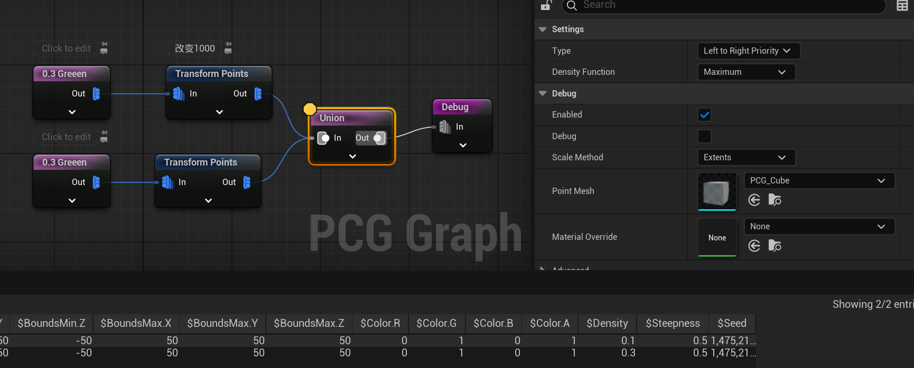
可以看到融并没有发生，数据原封不动。但此时改成 Binary 模式，数据还是会被改变的：
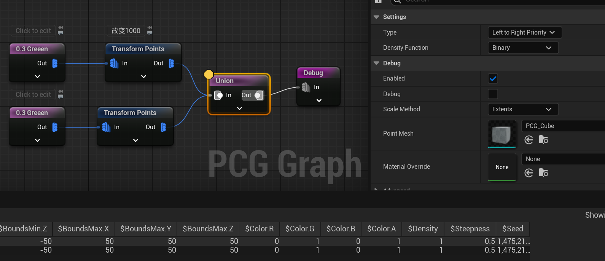  
:::

:::warning 注意2
Union 不只是修改密度，还有Color和 其他元数据（Binary 模式除外）

### 修改颜色

成功融并的数据，颜色会取最大值，进行“变亮”操作（所有模式都是这个操作，无法配置）

（Binary模式下，只取优先级高的，不会修改其他数据）

代码：

```cpp
OutPoint.Color = FVector4(
					FMath::Max(OutPoint.Color.X, PointInData.Color.X),
					FMath::Max(OutPoint.Color.Y, PointInData.Color.Y),
					FMath::Max(OutPoint.Color.Z, PointInData.Color.Z),
					FMath::Max(OutPoint.Color.W, PointInData.Color.W));
```
测试案例里蓝 + 绿 变成了 这个颜色：
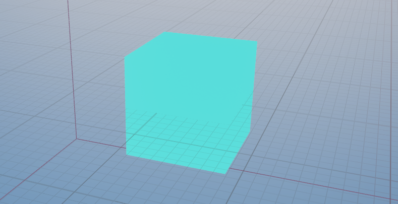

### 修改其他元数据
同样是取最大值或者直接赋值，无法配置其他操作，贴代码供参考：

```cpp
// Merge properties into OutPoint
				if (OutMetadata)
				{
					if (OutPoint.MetadataEntry != PCGInvalidEntryKey && PointInData.MetadataEntry != PCGInvalidEntryKey)
					{
						OutMetadata->MergePointAttributesSubset(OutPoint, OutMetadata, OutMetadata, PointInData, OutMetadata, DataRawPtr[DataIndex]->Metadata, OutPoint, EPCGMetadataOp::Max);
					}
					else if (PointInData.MetadataEntry != PCGInvalidEntryKey)
					{
						OutPoint.MetadataEntry = PointInData.MetadataEntry;
					}
				}
```
:::

## Difference 差异节点

要理解Difference，需要先理解Union， 因为它是在Union的基础上做进一步计算的。 默认行为是排除重叠部分，和数学上的差集A-B有点像了，但还要有非常多的细节。

### Difference 的两个PIN
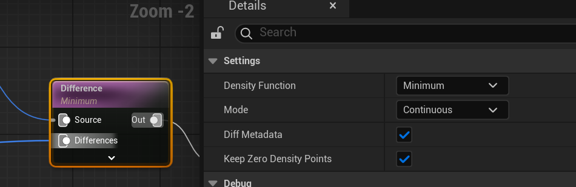{width=60%}

Source Pin 就是准备被减去的源，设为A；Difference Pin 其实就是一个内置的Union节点， 设为B。

所以，详情面板上的密度函数，主要是给该Union节点配置的。这里密度函数选中最小值，对应Union的最大值，相关代码：
```cpp 
namespace PCGDifferenceDataUtils
{
  // 密度函数模式转换
	EPCGUnionDensityFunction ToUnionDensityFunction(EPCGDifferenceDensityFunction InDensityFunction)
	{
		if (InDensityFunction == EPCGDifferenceDensityFunction::ClampedSubstraction)
		{
			return EPCGUnionDensityFunction::ClampedAddition;
		}
		else if (InDensityFunction == EPCGDifferenceDensityFunction::Binary)
		{
			return EPCGUnionDensityFunction::Binary;
		}
		else
		{
			return EPCGUnionDensityFunction::Maximum;
		}
	}
}
```

之所以要这么做，是为了应对当B存在多个点的时候（重叠的点），只选出一个真正的话事人，来和A进行比较，做差。这三个模式就是Union的3个模式，只是改了名字。

（我的项目里，我很少遇到B 存在重叠点的情况，我基本上用Binary模式就够了）

### Difference 其实是“扫雷模式”

上面的步骤只是为了选出“B”，大多数情况是B的数据里是“不融并的”，A需要和B的每个点进行比较，有重叠的点，就100%排除，密度被设为0;这里还算好理解，主要是不重叠的点，密度也会发生改变！相邻的点密度也会被“扫雷”！

看图说话：
创建一排点，作为“B”：
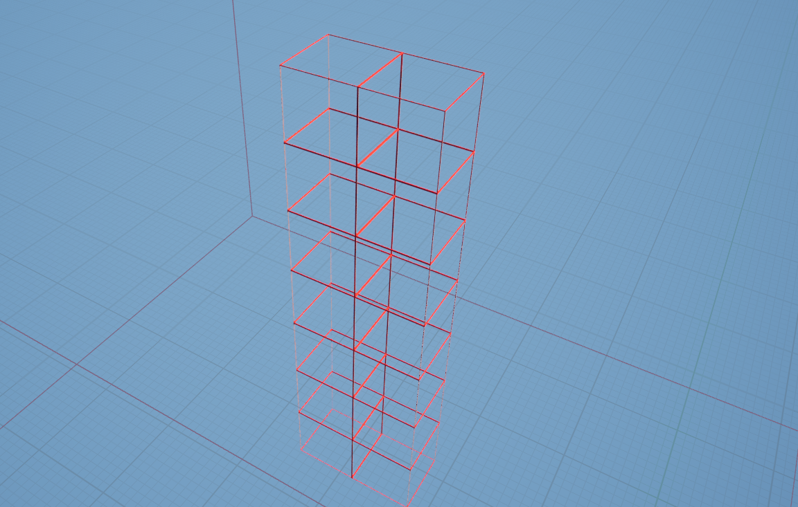{width=60%}

创建一堆点，作为源“A”， 并设置一点点噪声方便查看位置：
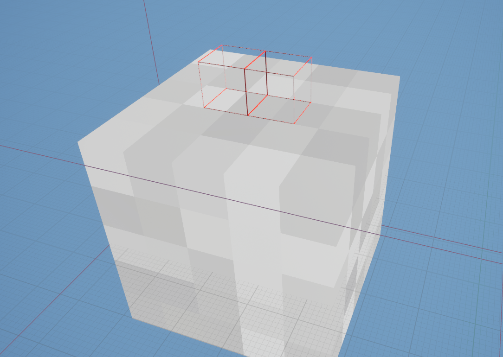{width=60%}

大致如下， 为了好查看勾选Keep Zero Density Points：
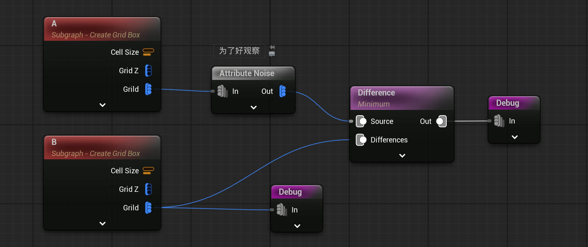{width=60%}

结果：
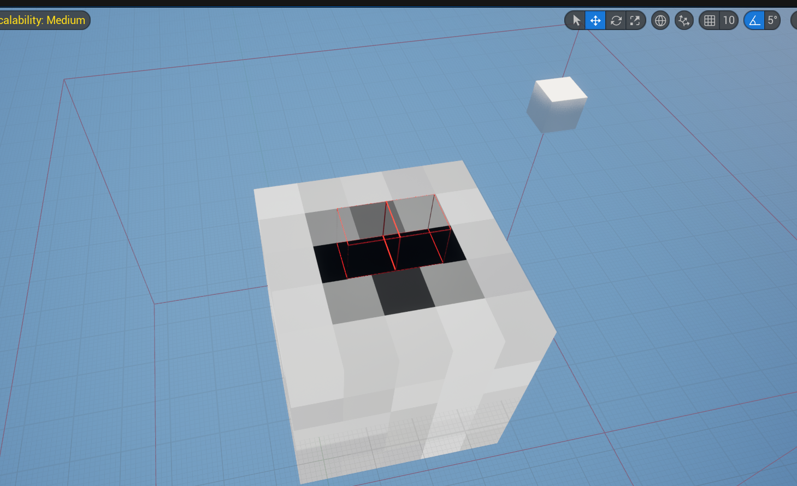{width=60%} 

可以看到，红色的部分是“雷”，灰色的程度表达出附近雷的数量，黑色的部分就是与雷直接覆盖的点，密度是0；

改变一下 雷是数量试试：
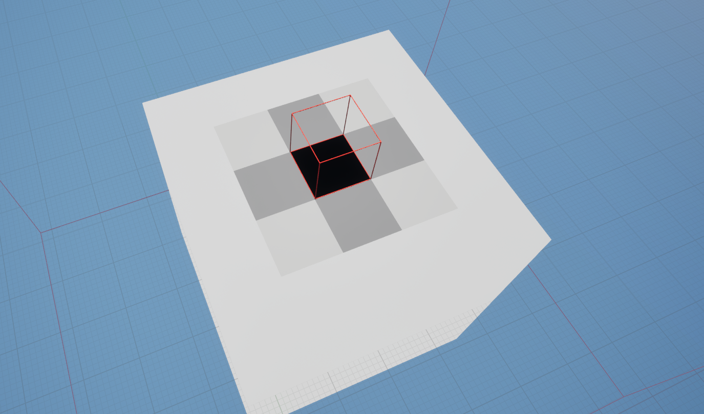{width=60%}

这样呢，为何看起来有重叠的部分，密度不是0？：
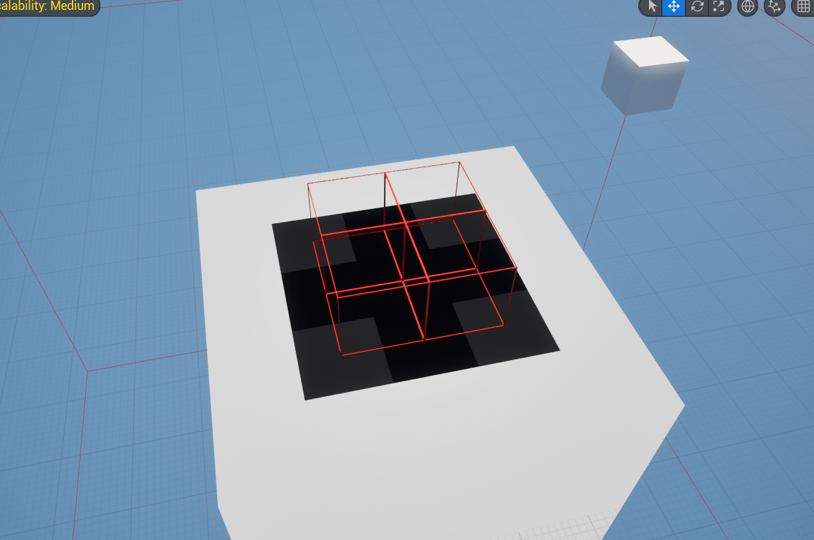{width=60%}
这里需要说明一下，最终结果是用B的质点来判断是不是在A的范围（Bounds）内，这里B的质点刚好在A的边上，所以密度不为0

### Difference 各种空间数据之间的区别

除了点与点之间差集，还有点与体积，其他空间数据类型的差集

#### Point vs Volume
找来一个体积，作为B，依附在A的表面上，A上的点没有产生任何密度变化，猜测体积是被当成了质点（没有边界）：
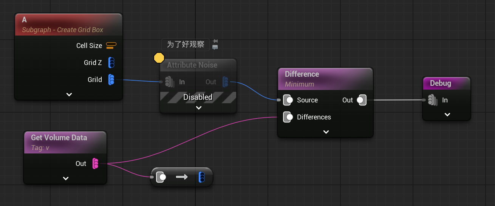{width=60%}
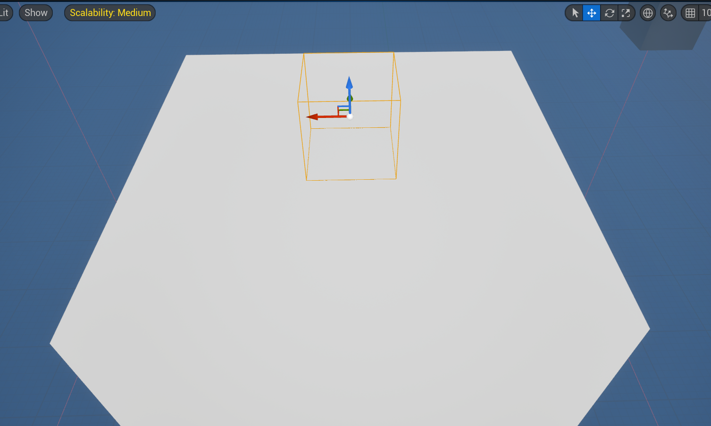{width=60%}
把体积转为点，手动调用ToPoint节点，成功引起了密度变化，类似扫雷：
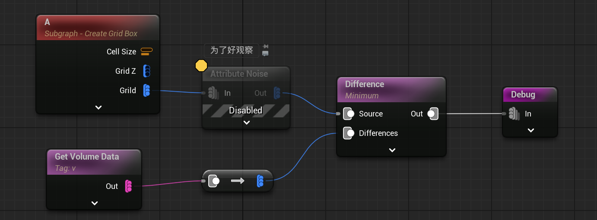{width=60%}
 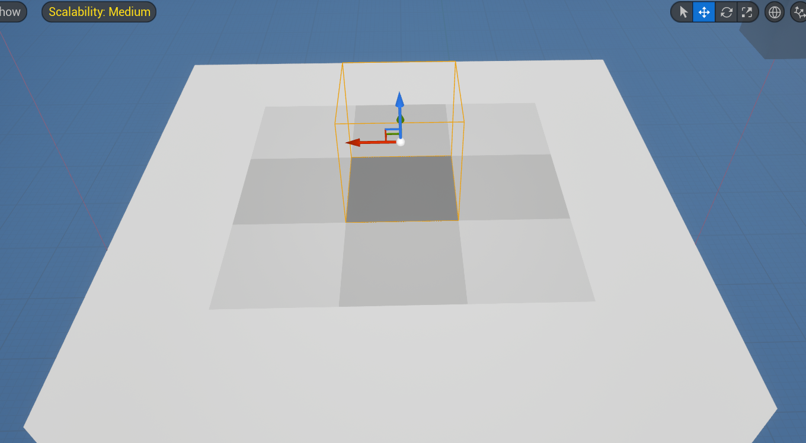{width=60%}
验证体积是否被当成了质点，把轴点沉入A里面，成功触发密度变化，且不是扫雷模式：
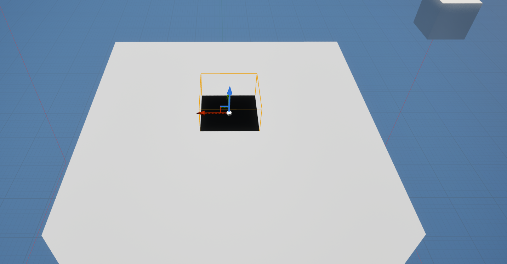{width=60%}
体积在数据上是有边界的，只是被当成质点处理了：
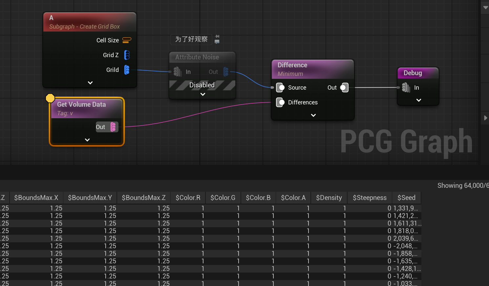{width=60%}

#### Point vs Primitive
找来一个图元，作为B，依附在A的表面上，居然染黑了全部和它有接触的点！
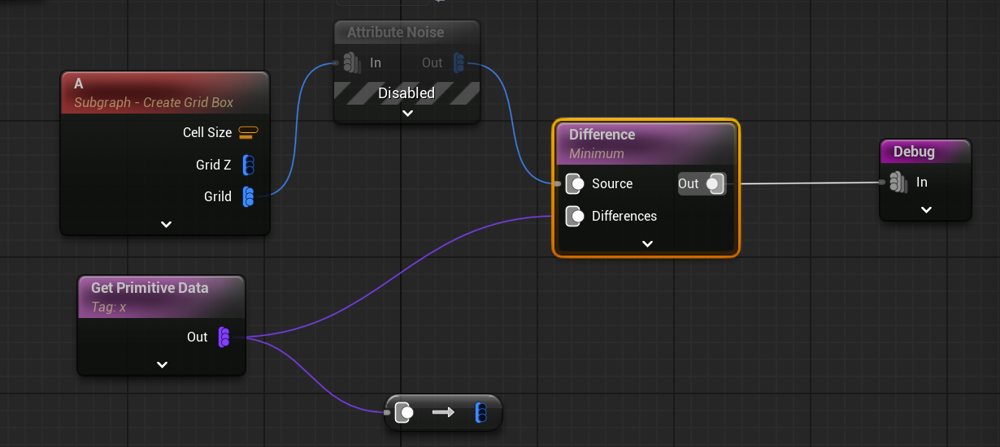{width=60%}
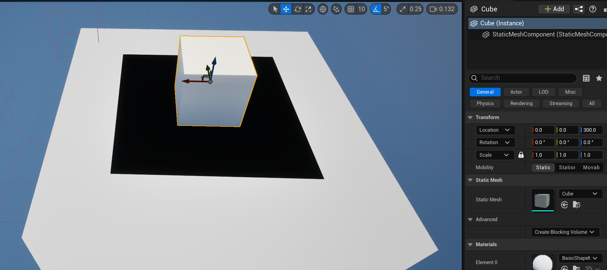{width=60%}
再试试图元的to Points会怎样，发现在正中间是正常的，和本体重合。
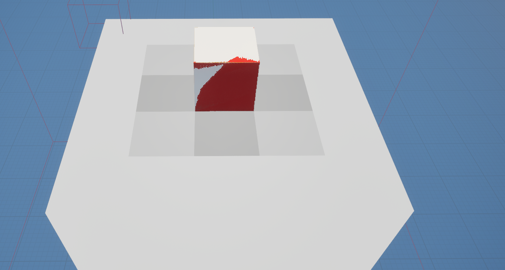{width=60%}
但不在正中间，位置和本体居然不一致！
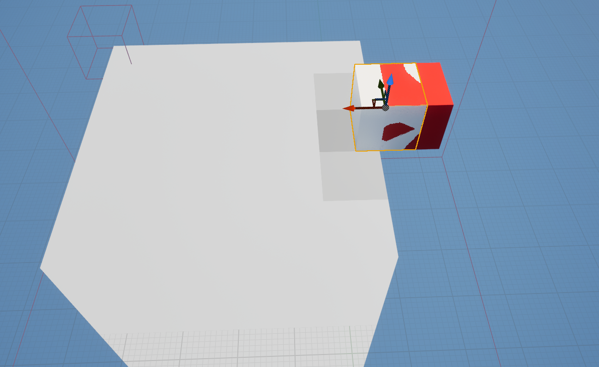{width=60%}

总之，图元的怪事挺多，小心为好。

#### Point vs Spline
Spline也是当做质点处理的，但凡偏移1个单位，密度就不为0了，即使它看起来穿过了A：
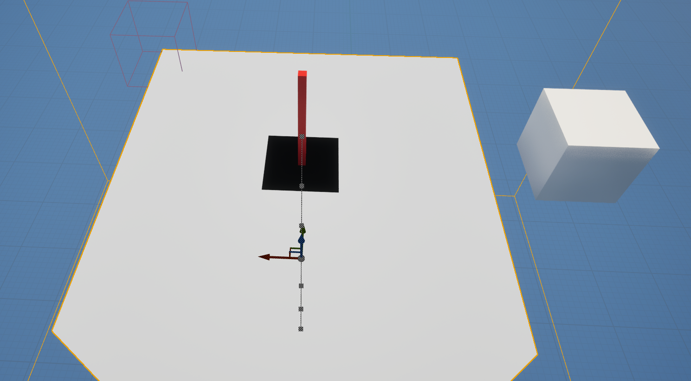{width=60%}

#### Spline vs Spline
好像没啥，都是质点，当在0-1的位置上偏移时，密度是会变化的。


### One More Thing

Difference节点还有个“Mode”选项，三个模式；这些不会影响最终结果，但是会影响计算的效率。

总来说直接选自动推断就行，因为大部分场景都是点与点之间做差异，除非你知道自己在干什么。

- 推断模式：
  自动推断，根据输入数据类型自动选择合适的在“连续”和“离散”之间选择，源码：
  ```cpp
  // 根据输入数据类型自动决定输出类型，这段代码的意思是：
  //如果使用自动推断模式且源数据和差异数据都包含点数据，则输出为点数据
  if ((Settings->Mode == EPCGDifferenceMode::Inferred && 
      bHasPointsInSource && bHasPointsInDifferences))
  {
      Output.Data = DifferenceData->ToPointData(Context);  // 转换为点数据
  }
  ```

连续模式：适合体积，没有缓存

离散模式：点与点的默认模式，性能较好，有缓存

参考：https://masonstevenson.dev/blog/unreal-pcg-difference-node-explained