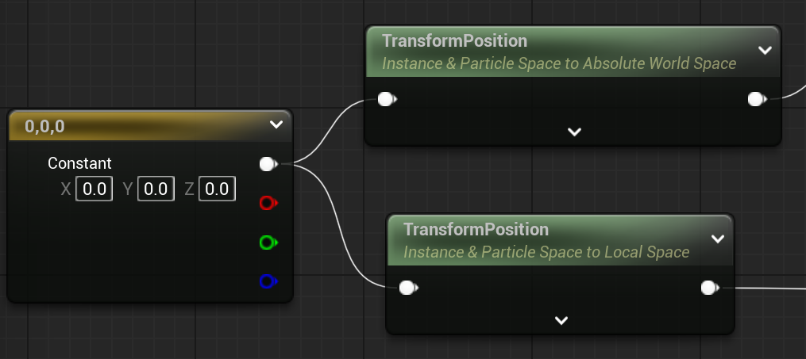
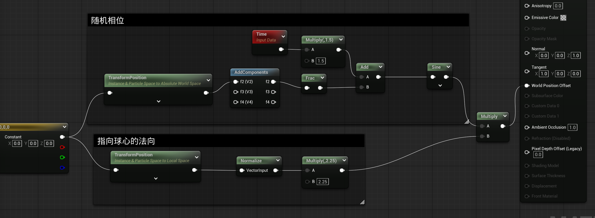
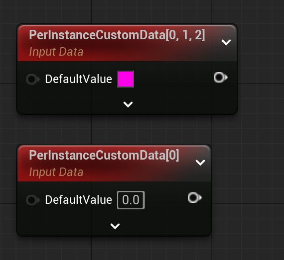
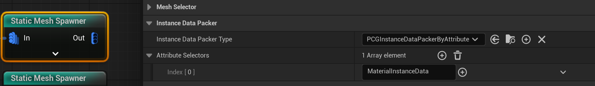

# PCG 材质相关

## TransformPosition
{width=60%}
PCG 大量使用 InstanceMesh， 所以材质里也有专门针对它的TransformPosition的设置。

- Instance & Particle Space to Absolute World Space
  实例的局部空间（Local Space）的坐标转换为 世界空间（World Space）。

- Instance & Particle Space to Local Space
  获得实例的局部空间（Local Space）的坐标

TransformPosition 的输入就是自身的原点，通常使用 0 0 0就够了，可以通过其他值它实现偏移。

利用好这两个转化，可以实现很多好玩的效果。

### 例子
- 上下起伏的球面效果
{width=90%} 
1. 利用Instance & Particle Space to Absolute World Space，和 Sine结合，构造每个实例的独特相位，xyz不同，所以每个都不同样。
2. Instance & Particle Space to Local Space 和 归一化结合，就是是 V - 0, 也就是指向球心的向量，结合上面的相位，实现错落有致的上下起伏效果。

## PerInstanceCustomData
PCG中经常需要处理大量实例化的网格体，PerInstanceCustomData是一个强大的功能，它允许为每个实例添加自定义数据。

PerInstanceCustomData 是一个在 Unreal Engine 中用于实例化静态网格的材质节点，允许开发者为每个实例设置自定义数据
而PCG的实例化网格体可以配置该属性。

PerInstanceCustomData 的一个主要优势是性能优化。通过将数据存储在实例本身而不是材质实例上，它降低了场景中重复几何体的绘制调用数量

材质里，PerInstanceCustomData有两个版本:
{width=30%}
- 1. PerInstanceCustomData 浮点数版
- 2. PerInstanceCustomData 向量版

### PCG里配置 PerInstanceCustomData
{width=60%}
两种配置模式：
- 直接从属性集里，根据名称获取，然后设置到实例里。
- Regex 从属性集里，根据正则自动设置到实例里。 

### 其他补充
- PerInstanceCustomData的数据存储在实例缓冲区(instance buffer)中
- 这些数据只能在顶点着色器(Vertex Shader)中直接访问
- 如果需要在像素着色器(Pixel Shader)中使用这些数据，需要使用VertexInterpolator节点进行转换

 