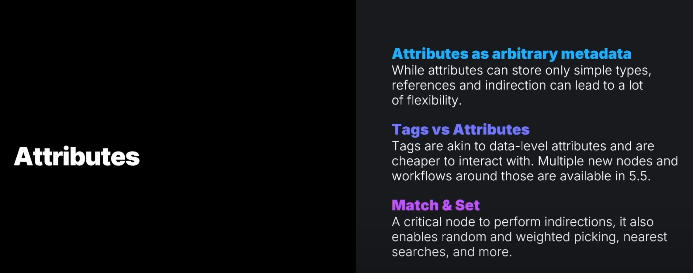
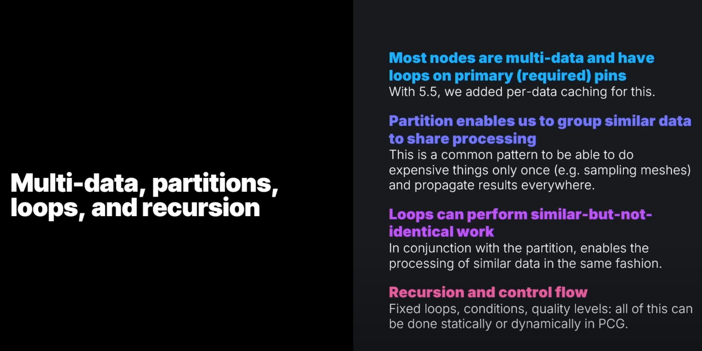
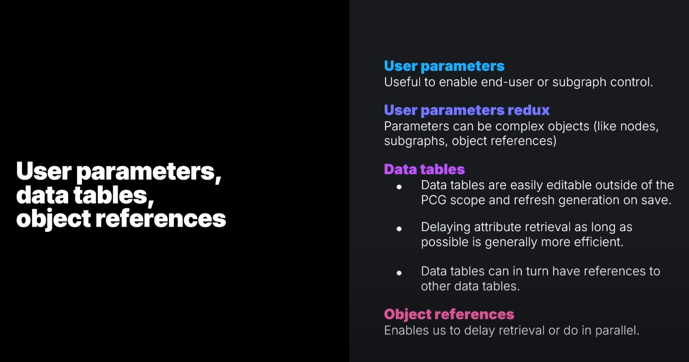
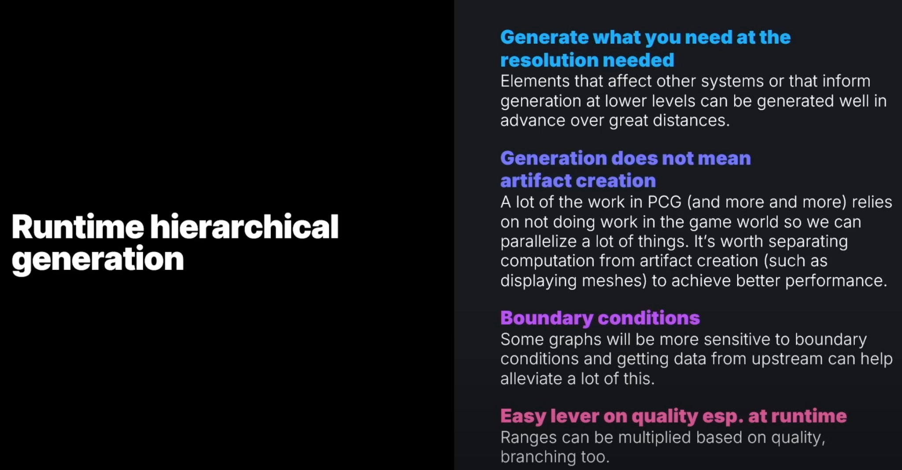
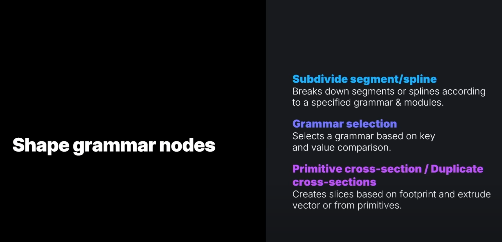
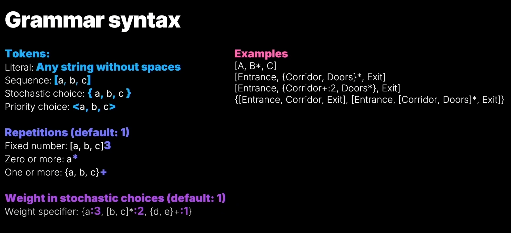
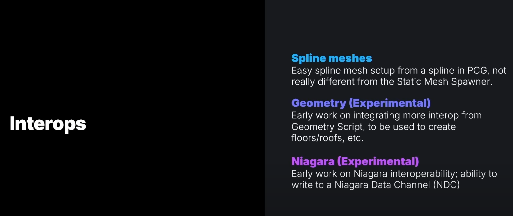
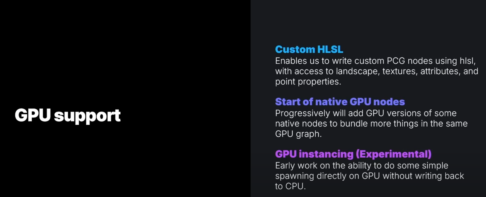
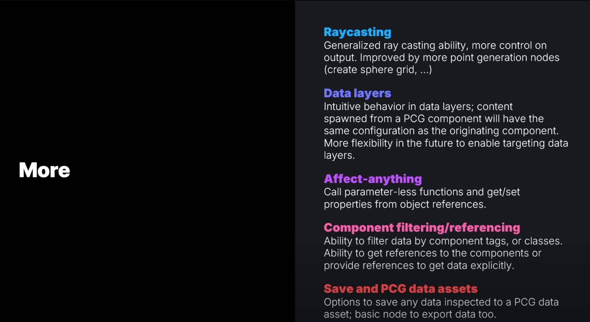

# UE 5.5 PCG新功能

source: https://www.youtube.com/watch?v=j3ke6MmcaeY

## **Attributes（属性）** 

1. **Attributes 作为任意元数据（Attributes as arbitrary metadata）**  
   - 属性可以存储简单数据类型，如整数、浮点数、字符串等。  
   - 通过引用（references）和间接访问（indirection），可以增加灵活性，意味着可以通过更复杂的数据结构或动态引用来使用属性。

2. **Tags vs Attributes（标签 vs 属性）**  
   - **Tags（标签）** 类似于数据级别的属性（data-level attributes）。  
   - 相较于一般的属性，标签的交互成本更低，处理更高效。  
   - 在 UE5.5 中，增加了多个新节点和工作流，使得标签的使用更加方便。

3. **Match & Set（匹配 & 设置）**  
   - 这是一个关键的 PCG 节点，允许执行数据的间接访问。  
   - 该节点支持 **随机选择、加权选择、最近搜索** 等功能，使得程序化内容的生成更加智能化。
 
## **多数据（Multi-data）、分区（Partitions）、循环（Loops）和递归（Recursion）** 

1. **多数据支持和主引脚循环（Multi-data & loops on primary pins）**  
   - 大多数 PCG 节点现在支持多数据输入，并且在主引脚（required pins）上具有循环能力。  
   - UE5.5 为此新增了 **每数据缓存（per-data caching）**，提高性能。

2. **分区（Partition）支持数据分组与共享处理**  
   - 允许将相似的数据分组，以便共享计算结果，避免重复计算。  
   - 例如，采样网格（sampling meshes）时，仅需计算一次，然后将结果传播到所有需要的地方。

3. **循环（Loops）可以执行类似但不完全相同的任务**  
   - 结合 **Partition**，可以对相似的数据执行相同模式的处理，减少重复计算，提高效率。

4. **递归（Recursion）与控制流（Control Flow）**  
   - 支持 **固定循环、条件判断、质量级别控制**，这些可以在 PCG 中静态或动态执行。

 

## **用户参数（User Parameters）、数据表（Data Tables）和对象引用（Object References）**
 
1. **用户参数（User Parameters）**  
   - 允许终端用户或子图（Subgraph）进行控制，提高可操作性。

2. **增强的用户参数（User Parameters Redux）**  
   - 现在参数可以是 **复杂对象**，如 **节点（Nodes）、子图（Subgraphs）、对象引用（Object References）** 等。

3. **数据表（Data Tables）**  
   - 可以 **在 PCG 作用域外轻松编辑**，并在保存时刷新生成。  
   - 延迟属性检索（Delaying Attribute Retrieval）可以提高效率。  
   - **数据表可以相互引用**，增强了数据的关联性和可复用性。

4. **对象引用（Object References）**  
   - 允许 **延迟检索（Delay Retrieval）或并行处理（Parallel Processing）**，提高运行效率。

 
## **运行时分层生成（Runtime Hierarchical Generation）**

1. **按需生成，适应所需分辨率（Generate what you need at the resolution needed）**  
   - 影响其他系统或用于较低层级生成的元素可以提前在远距离生成，优化性能。

2. **生成 ≠ 立即创建可视化内容（Generation does not mean artifact creation）**  
   - PCG 的许多工作依赖于 **避免在游戏世界中直接执行计算**，从而实现更多的并行化。  
   - 计算过程应与 **具体的内容创建（如网格显示）分开**，以提高性能。

3. **边界条件（Boundary conditions）**  
   - 一些图形（Graphs）对边界条件更敏感，**从上游获取数据** 可以减少问题。

4. **运行时的质量调节（Easy lever on quality esp. at runtime）**  
   - 质量范围可以 **根据需求动态调整**，并支持**分支（Branching）**。

## **形状语法节点（Shape Grammar Nodes）**

1. **分割段/样条线（Subdivide segment/spline）**  
   - 根据指定的 **语法（Grammar）** 和 **模块（Modules）** 对段（Segment）或样条线（Spline）进行细分。

2. **语法选择（Grammar selection）**  
   - 根据 **键值（Key）** 和 **数值比较（Value Comparison）** 选择合适的语法规则。

3. **原始截面/重复截面（Primitive cross-section / Duplicate cross-sections）**  
   - 基于**足迹（Footprint）** 创建切片，并沿指定方向拉伸（Extrude），或者从原始图元（Primitives）生成新的形状。

## **形状语法（Grammar Syntax）**

 
有点类似基础的正则表达式用法。

### **1. Tokens（标记）**
#### **基础元素**
- **Literal（字面量）**: **任何不包含空格的字符串**，例如 `Entrance, Corridor`
- **Sequence（序列）**: **按顺序排列的元素**，使用 **`[ ]`** 表示  
  **示例**: `[a, b, c]` → 必须按照 `a → b → c` 的顺序执行

#### **选择机制**
- **Stochastic choice（随机选择）**: **使用 `{ }` 选择其中一个元素**，每个元素出现的概率相等  
  **示例**: `{a, b, c}` → 可能是 `a`，也可能是 `b` 或 `c`
- **Priority choice（优先级选择）**: **使用 `< >`，按从左到右的优先级选择**  
  **示例**: `<a, b, c>` → `a` 优先，如果 `a` 不可用，则尝试 `b`，否则是 `c`
 

### **2. Repetitions（重复规则，默认 1 次）**
#### **固定次数**
- `[a, b, c]3` → `a, b, c` 按顺序重复 3 次

#### **不确定次数**
- **`Zero or more（0 次或更多）`**: `a*` → `a` 可能 **不出现**，也可能出现 **任意次数**
- **`One or more（1 次或更多）`**: `{a, b, c}+` → 至少选择一个 `a`、`b` 或 `c`
 

### **3. Weight in stochastic choices（加权随机选择，默认权重为 1）**
在 `{}` 选择时，可以给某些选项 **增加权重（更高概率被选中）**：
- **格式**: `{选项:权重}`
- **示例**:  
  `{a:3, [b, c]*:2, {d, e}+ :1}`  
  - `a` 的权重为 3（更容易被选中）
  - `[b, c]*` 的权重为 2
  - `{d, e}+` 的权重为 1（最低）
 

### **4. Examples（示例解析）**
- **`[A, B*, C]`** → `A` 开始，`B` 可能出现 **任意次数**，然后 `C` 结束
- **`[Entrance, {Corridor, Doors}*, Exit]`** →  
  **`Entrance` 开始**，中间是 **随机的 `Corridor` 或 `Doors`，可重复多次**，最后是 **`Exit`**
- **`[Entrance, {Corridor+:2, Doors*}, Exit]`** →  
  `Corridor` **至少出现 2 次**，`Doors` **可能出现 0 次或多次**
- **`{[Entrance, Corridor, Exit], [Entrance, [Corridor, Doors]*, Exit]}`** →  
  可能是 **`Entrance → Corridor → Exit`**，也可能是 **`Entrance → Corridor 或 Doors 多次 → Exit`**
 

## **Interops（交互操作）** 

 
### **1. Spline Meshes（样条网格）**
- 允许从 **PCG 生成的样条（Spline）** 创建网格对象。  
- 该功能类似于 **Static Mesh Spawner（静态网格生成器）**，但适用于 **Spline（样条曲线）**。  
- 主要用于 **道路、河流、管道** 等 **曲线形状** 的自动生成。  
 

### **2. Geometry (Experimental)（几何处理，实验功能）**
- 这是对 **Geometry Script（几何脚本）** 的早期集成，使得 PCG 可以使用更复杂的几何数据。  
- 主要用于创建 **地板、屋顶** 等 **建筑结构**。  
- 未来可能扩展更多 **程序化建模** 功能，例如 **动态地形、墙体调整等**。  
 

### **3. Niagara (Experimental)（Niagara 特效，实验功能）**
- 让 **PCG 与 Niagara 交互**，可以将数据写入 **Niagara Data Channel (NDC)**。  
- 可能实现的功能：
  - 让 PCG 生成的内容影响 **特效系统**（如烟雾、粒子、火焰）。
  - 让 Niagara 读取 PCG 数据，用于 **环境交互、风力影响** 等。  
- 目前仍处于 **早期实验阶段**，但未来可能允许 **PCG 直接控制 Niagara 特效**，适用于 **动态天气、交互式 VFX**。  
 
 

## **GPU 支持（GPU Support）** 
 
- **Custom HLSL** → 允许开发者用 HLSL **编写自定义 PCG 逻辑**，控制 **地形、纹理、点数据**。  
- **Native GPU Nodes** → 未来 **PCG 计算逐步迁移到 GPU**，减少 CPU 负担，提高生成速度。  
- **GPU Instancing (Experimental)** → **实验性 GPU 实例化**，适用于 **大规模对象生成**，如森林、建筑等。  

### **1. Custom HLSL（自定义 HLSL）**
- 允许开发者使用 **HLSL（High-Level Shader Language）** 编写 **自定义 PCG 节点**。  
- 可以访问 **地形（Landscape）、纹理（Textures）、属性（Attributes）、点数据（Point Properties）**。  
- 使 PCG **更灵活**，开发者可以直接编写 GPU 计算逻辑来优化性能，例如：
  - 计算地形适配性（Slope-based placement）。  
  - 纹理驱动的程序化分布（Texture-based spawning）。  
  - **更高效的数据处理**，减少 CPU 计算压力。  
 

### **2. Start of Native GPU Nodes（原生 GPU 节点支持）**
- **逐步增加 GPU 版本的 PCG 原生节点**，让更多的计算直接在 GPU 进行。  
- 目标是让 PCG **尽可能在 GPU 上运行**，减少 CPU 负担，提高 **大规模实例化** 和 **实时生成** 的效率。  
- 可能的优化点：
  - 直接在 GPU 进行点云计算（Point Cloud Processing）。  
  - **PCG 规则** 和 **变换计算** 迁移到 GPU，提升性能。  
  - **减少 CPU-GPU 之间的数据传输**，让整个 PCG **更高效**。  
 

### **3. GPU Instancing (Experimental)（GPU 实例化，实验功能）**
- 早期尝试在 GPU 直接进行 **实例化渲染（Instancing）**，不回写到 CPU。  
- 适用于 **大规模物体渲染**，如：
  - **森林生成（Procedural Forests）**  
  - **草地和植被（Procedural Grass & Foliage）**  
  - **城市建筑群（Procedural City Generation）**  
- 由于数据无需传回 CPU，可以减少瓶颈，提高 **动态世界生成** 的帧率。  

## More
 

- **Raycasting** → **增强光线投射**，可用于检测环境、改进点生成规则。  
- **Data Layers** → **数据层继承机制**，未来可 **更灵活地控制数据层目标**。  
- **Affect-anything** → **直接修改对象属性/调用无参数函数**，提高 PCG 交互性。  
- **Component Filtering/Referencing** → **按标签/类别筛选数据**，可获取/提供对象引用。  
- **Save and PCG Data Assets** → **允许导出和存储 PCG 生成的数据**，便于 **复用与分析**。  

### **1. Raycasting（光线投射）**
- **通用化的光线投射功能**，允许更精确地控制输出。  
- **新增点生成节点**（如 **球形网格（Sphere Grid）**），改进点分布方式。  
- 用途：
  - **检测地形表面**（确定适合放置点的位置）。  
  - **改进物体投影**（如检测光照影响、阴影计算）。  
  - **创建更复杂的 PCG 规则**，如基于射线检测的环境适配布置。  

 

### **2. Data Layers（数据层）**
- 直观的 **数据层行为**，PCG 组件生成的内容会 **继承原始组件的配置**。  
- **未来增强数据层的可控性**，支持 **针对特定数据层进行目标化操作**。  
- 用途：
  - **多层次地形管理**（如不同的生态区域）。  
  - **不同 LOD（细节层次）管理**，可以针对不同层的数据进行 **单独处理**。  
  - **动态变化场景**（如不同区域不同规则）。  
 

### **3. Affect-anything（影响任何对象）**
- 允许调用 **无参数函数（parameter-less functions）**，并**获取/设置对象属性**。  
- 使 PCG 组件 **更容易影响游戏世界中的对象**。  
- 用途：
  - **PCG 生成内容后，直接修改目标对象的状态**（如调整灯光、物理属性）。  
  - **交互性增强**（PCG 生成后触发特定事件）。  
 

### **4. Component Filtering/Referencing（组件过滤/引用）**
- **按组件标签（Tags）或类（Classes）过滤数据**，精准控制 **PCG 影响范围**。  
- **支持获取/提供组件引用**，让 PCG 逻辑更加可控。  
- 用途：
  - **按类别筛选可用对象**（如仅对“树”类对象应用 PCG 规则）。  
  - **引用特定对象**，允许更加 **精细的 PCG 影响控制**。  
 
### **5. Save and PCG Data Assets（PCG 数据存储）**
- 允许**将检查的数据存储到 PCG 资产**，并提供基础节点 **导出数据**。  
- 使 PCG 生成的 **数据资产化**，可以在不同关卡/项目中复用。  
- 用途：
  - **保存和重用 PCG 结果**（如保存程序化生成的城市布局）。  
  - **数据分析**（导出 PCG 结果进行进一步优化）。  

 