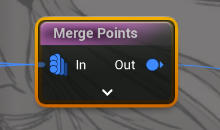
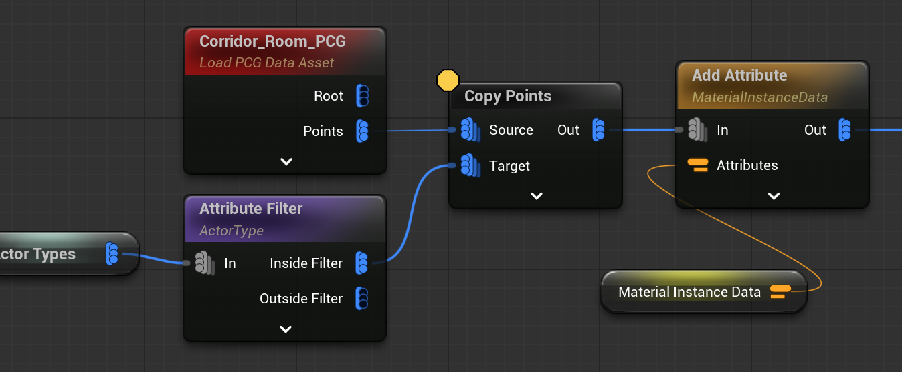
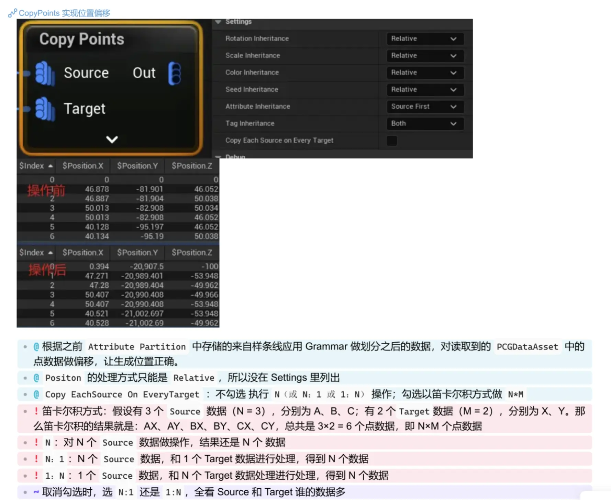
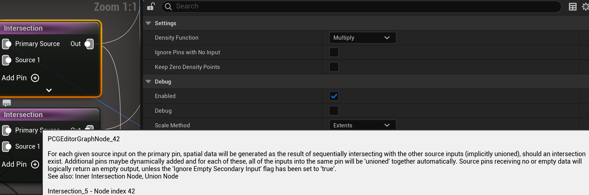

# PCG 常用节点记录

比较随意的记录。

## Merge 合并

```js
//类似数组合并
merge([a,a] ,[b]) = [a,a,b]
```

## Copy Points

这是很迷惑的名字，直面意思是复制点，实际上的意思大概是：

> Copy Points 节点是PCG系统中一个重要的点操作节点，其主要功能是将源点（Source Points）复制到目标点（Target Points）上。这个节点最常见的使用场景是：以相对位置的方式，将输入源的点附加到目标点上，其中目标点作为输入源点的轴心点（Pivot）。

详细用法参考B站Up [ZzxxH](https://space.bilibili.com/19131632/) 总结的图：


::: details 详细说明
### 点的复制模式

1. **笛卡尔积模式** (bCopyEachSourceOnEveryTarget = true)
```cpp
NumIterations = NumSources * NumTargets;
const int32 SourceIndex = i / NumTargets;
const int32 TargetIndex = i % NumTargets;
```
- 每个源点都会复制到每个目标点上
- 产生 N * M 个输出点

2. **一对一模式** (bCopyEachSourceOnEveryTarget = false)
```cpp
if (NumSources != NumTargets && NumSources != 1 && NumTargets != 1)
{
    // 报错：只支持 N:N, 1:N 和 N:1 操作
}
NumIterations = FMath::Max(NumSources, NumTargets);
```
- 支持 N:N, 1:N 和 N:1 的映射关系
- 产生 max(N, M) 个输出点

### 元数据处理

1. **元数据继承模式**
```cpp
// 五种模式
SourceFirst  // 优先源点元数据，添加目标点独有属性
TargetFirst  // 优先目标点元数据，添加源点独有属性
SourceOnly   // 仅使用源点元数据
TargetOnly   // 仅使用目标点元数据
None         // 不使用元数据
```

2. **属性合并优化**
```cpp
// 使用并行处理来设置属性值
ParallelFor(AttributeCountInCurrentDispatch, [&](int32 WorkerIndex) {
    FPCGMetadataAttributeBase* Attribute = AttributesToSet[AttributeOffset + WorkerIndex];
    Attribute->SetValuesFromValueKeys(Values, false);
});
```
:::


## Subdivide Spline 细分样条
{width=70%}
给样条线制定撒点规则（可认为是带标签的点），规则来自 [Grammar 字符串](./CassiniPCG.md#grammar-anchor)。
- 需要配置模块数据，供 Grammar 解析使用
  {width=70%}
- 数据中最终要是是模块的size，影响采样间隔


## Primitive Cross-section 图元横截面

{width=70%}
图元是指简单的几何体，比如最常见的长方体。主要功能是：根据特定的切割方向，构建几何体之间形成的横截面。

如图，默认沿着Z轴往上切（0，0，1），切的方向垂直于Z轴。切出来的面，就作为 横截面。对于面都一致的几何体，比如图中的圆柱体和长方体，只会切出一个“底面”作为横截面。而对于面随着Z轴变化的几何体，则切出多个横截面。测试发现并没有特别的规律来解释多个横截面的规律。
{width=50%}


不过，该节点提供了调整横截面数量的办法。

#### 最小剔除面积 Min Area Culling Threshold
- 单位是 m^2

如图，默认情况下，倒立的圆锥会产生两个横截面。
{width=50%}
尖端的横截面特别小，可以 开启 Min Area Culling Threshold 来剔除，1 m^2 即可剔除它。
{width=50%}

#### Tier 合并阈值 Tier Merge Threshold
这是另一个剔除多余横截面的方式。
- 单位是 cm

如图，球体产生的横截面，像个打开的碗
{width=30%}
{width=30%}

可以看出球体的面与面之间间距很小，更适合 Tier 合并阈值来剔除。
调整为300厘米后，成功只剩下一个横截面
{width=50%}

此时，球还是用上图的剔除配置：

让球和其他图元接触，也会理解产生新的横截面
{width=75%}
如上图，产生了两个横截面。（当接触面积很大，再把融合阈值调小，就会出现更多的横截面）

总结
- 图元接触的位置，大概率会产生新的横截面


#### Extrusion Vector Attribute 挤出向量
挤出向量是个重要属性，但本身不影响横截面的产生。是供给后续节点使用的。
- 挤出向量的大小只和自身大小有关，等于 Slice 方向 * 这个方向的长度（高度）
- 需要配置它的key，后续节点根据它查找
  {width=70%}

举例说明：
- 对于一个高度为100的正方体
- 切片方向为向上(0,0,1)
- 会在底部生成一个横截面
- ExtrusionVector 会是 (0,0,100)，表示从这个底面横截面到顶面的向量

它的作用是：给后续数据提供方向指引。

#### 其他参数
- MaxMeshVertexCount 通常图元是简单的几何体，如果太复杂可用这个限制避免卡死


:::details 代码部分
#### C++

- 数据结构
```cpp
struct FCrossSection
{
    int Tier;           // 层级编号
    double Height;      // 层高
    TArray<FVector> PointLocations; // 横截面点集
};
```
- 主要参数
```cpp
// 切片方向，默认向上
FVector SliceDirection = FVector::UpVector;

// 挤出向量属性名
FPCGAttributePropertyOutputSelector ExtrusionVectorAttribute;

// 最小共面顶点数
int32 MinimumCoplanarVertices = 3;

// 最大网格顶点数限制
int32 MaxMeshVertexCount = 2048;

// 是否启用层级合并
bool bEnableTierMerging = false;

// 层级合并阈值
double TierMergingThreshold = 1.0; // 单位：厘米(cm)
```  
- CrossSection.Height的计算

```cpp
//Height的计算过程：
const double Height = TierHeights[TierIndex + 1] - TierHeights[TierIndex];
const double RoundedHeight = FMath::RoundToDouble(Height);
CurrentTier.Height = FMath::IsNearlyEqual(Height, RoundedHeight) ? RoundedHeight : Height;
```
:::


## Duplicate Cross-sections 延展横截面 
该节点和`Subdivide Spline`节点，有共同父类`public UPCGSubdivisionBaseSettings`, 它们都是使用grammar来规划线段上点的生成规则。不同的是，`Duplicate Cross-sections` “通常”需要配合上面的 图元横截面`Primitive Cross-section`的一同使用。
{width=50%}

这里细说一下刚刚的挤出向量：

- ExtrusionVector：

它定义了横截面的"生长"方向和距离， `Duplicate Cross-sections`需要知道，新延展的横截面往哪个方向生长，以及距离多远。

如果使用了上一个节点传递过来的`ExtrusionVector`，假如是（0，0，200），但是`Duplicate Cross-sections`模块里定义的距离超过了200，就会报错。
{width=50%}

两种解决办法：
1. 调整图元的尺寸，让它满足`Duplicate Cross-sections`模块的需要。
2. 不使用上个节点传递过来的`ExtrusionVector`，让`Duplicate Cross-sections`自定义一个，比如（0，0，6000），可用让延展面远远超出图元的大小
  {width=80%}
  （另外，球体调试的时候，不管拉伸多少，都是球体，应该是BUG，但横截面是正确的）
  {width=80%}


## Difference 差集
[详情](./PCG_Base.md#节点分析)

## Intersection 交集
可以添加多个secondary input

 
1. **主输入（Primary Input）**  
   - 主要输入 `Primary Input Pin` 是交集计算的起点，每个输入都会被单独计算。  
   - **每个主输入的数据会与所有其他输入进行交集计算**，并生成新的空间数据。  

2. **次要输入（Secondary Input）**
   - **所有次要输入数据默认会被自动联合（unioned）**，然后才与主输入进行交集计算。  
   - 例如：
     - **输入 A（主输入）**
     - **输入 B1、B2、B3（次要输入）**
     - 在计算时，B1、B2、B3 **会先合并成一个整体 B**，然后 `A ∩ (B1 ∪ B2 ∪ B3)` 进行交集计算。  
   
3. **空数据处理**  
   - **如果某个输入为空（无数据）**，默认情况下，该输入会返回空结果。  
   - 但如果勾选了 `Ignore Empty Secondary Input`，那么空的次要输入将不会影响计算，而是会跳过它们。


## References

- [拆解UE5 PCG 项目《CassiniSample》(一)](https://zhuanlan.zhihu.com/p/25563585263)
 