# Awesome UE5 Tools
Including open source and non-open source, commercial and non-commercial.

> 是否awesome，需要根据个人需求来判断。另外，第三方工具选择需要慎重~

## Editor Tools

- [DFoundryFX](https://github.com/DarknessFX/DFoundryFX) Unreal Engine 5.6 Plugin with Dear ImGUI, customizable performance metric charts (including Shipping builds), Shader compiler monitoring and STAT commands control panel for Unreal Engine GameViewports.
  - Unreal Engine 里常用的 STAT（统计／调试）命令，比如 STAT GPU、STAT CPU、STAT Scene 等，通常是通过控制台或命令行执行，这个插件提供一个面板来控制它们，更方便在 Game Viewport 里直接切换／查看
  - 可以看到 Shader 编译过程／状态。比如什么时候 Shader 在后台编译、编译进度、是否有延迟或瓶颈

  
- [PropertyHistory](https://github.com/VoxelPlugin/PropertyHistory) Property History allows you to quickly see the history of a property. It works with most objects in Unreal: actors, material nodes, material instances... More advanced properties like arrays, map, sets and instanced structs are also supported.
  - 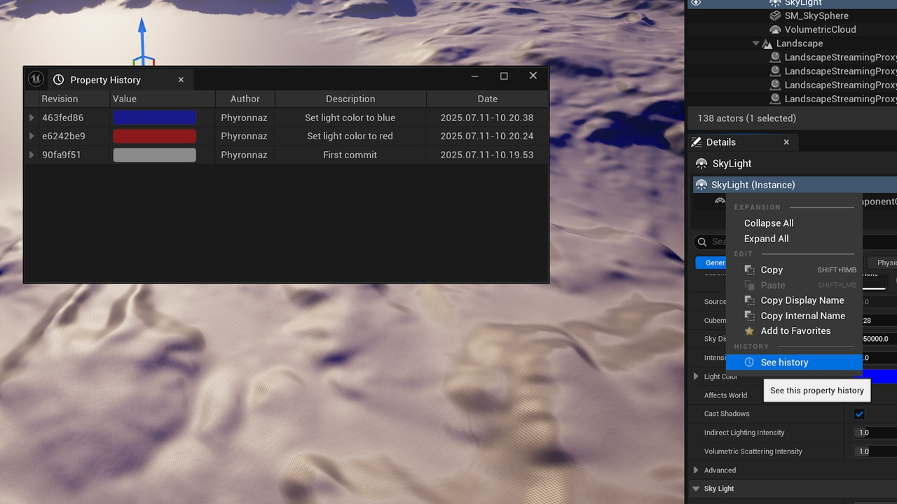{width=50%}

- [ProjectCleaner](https://github.com/ashe23/ProjectCleaner) Unreal engine plugin for managing all unused assets and empty folders in project.
  - 用于清理未使用的资源和空文件夹
  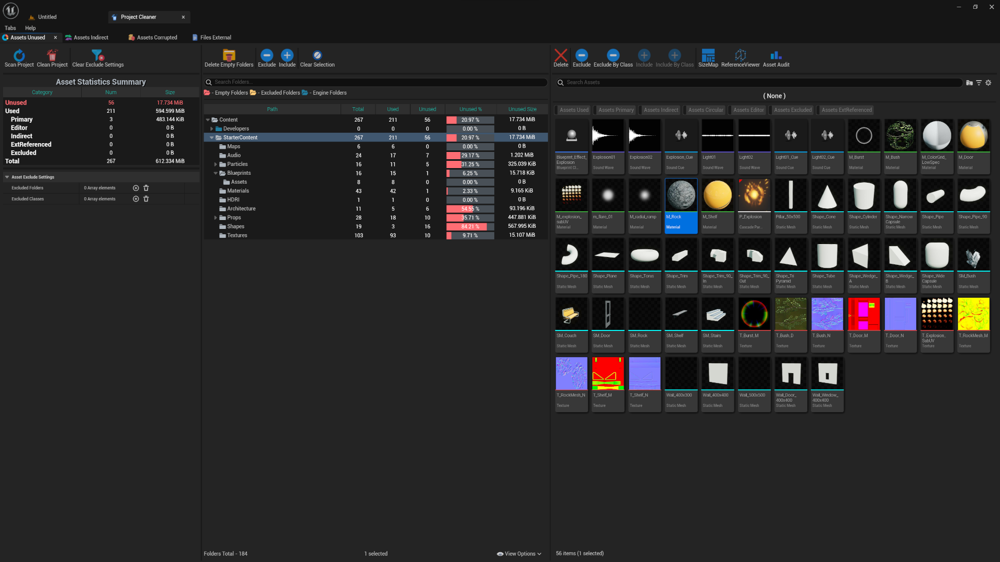


- [UEToolboxPlugin_Dev](https://github.com/gradientspace/UEToolboxPlugin_Dev) This repository contains a development setup for the Gradientspace UEToolbox plugin. The repo for that plugin only contains the plugin code, which must be built inside a UE5 project. So, this repo contains such a project, configured with some test levels and assets that are useful for checking that (eg) building and packaging works properly. Scripts for packaging the plugin for distribution on the FAB marketplace are also included.
  - https://github.com/gradientspace/UEToolboxPlugin Fab版本
  - 作者Ryan Schmidt（Gradientspace）曾在Epic Games工作，是Modeling Mode (建模模式) 和 Geometry Script (几何脚本)，以及DynamicMesh3的核心开发者
  - 该插件从闭源到开源的心路历程，值得细品：https://www.gradientspace.com/tutorials/2025/8/3/uetoolbox-parametric-assets-and-opensource
  - >不幸的是，就我个人的抱负而言，Epic Games Inc 对“运行时工具”方面并不特别感兴趣。虚幻是用于游戏的游戏引擎，让世界上一些最优秀的游戏引擎开发者也关心如何将其打造成一个用于创作工具的实时引擎，这……很有挑战性。我一直主张，这就是我们将在《堡垒之夜》创意版中构建更高级编辑工具的方式，但当 Epic 转向专注于 UEFN（堡垒之夜虚幻编辑器）时，这个方向就夭折了。这就是为什么“如何在运行时使用 ITF”只能在本网站的文章（附件 A和附件 B）中了解，而你很难在 Epic 找到任何人承认这是可能的。
  - > 在 Epic 的 Lyra 项目中，我们拼凑了一个系统，用于追踪程序化 DynamicMeshActor (DMA) 与烘焙的 StaticMesh 以及放置的 StaticMeshActors 之间的关系，并且可以“交换” DMA 来代替 StaticMesh 进行实时编辑。但 DMA 必须存在于关卡中——我们的“交换”操作将它们隐藏在地平面以下很远的地方。完全是黑客行为。此外，追踪系统存在于关卡中，不支持多用户编辑，导致了大量问题。在 Epic 内部，我发现另一种方法变得流行起来，即使用纯编辑器的 ChildActorComponent 和程序化生成器，该生成器会烘焙到父 Actor 的 StasticMesh 中。但这只适用于单个实例，并且存在自身的问题。
  - 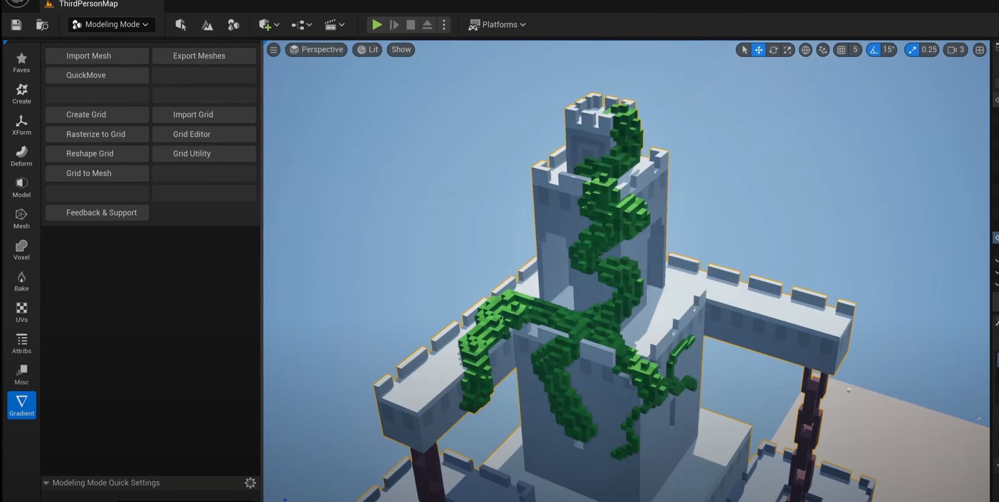


- [NodeToCode](https://github.com/protospatial/NodeToCode) Translate Unreal Engine Blueprints to C++ in seconds. Not hours.
  - Node to Code只需单击一下即可将您的虚幻引擎蓝图图表转换为简洁、结构化的 C++ 代码。无需再花费数小时进行繁琐的手动转换，无需费力解释复杂的视觉逻辑，也无需在庞大的蓝图系统中导航。无论您是要优化性能、改进协作，还是学习/教授虚幻引擎 C++ API，这款由 LLM 提供支持的插件都能帮助您轻松完成蓝图到代码的转换。
  - 

- [BlueprintRetarget](https://github.com/PipeRift/BlueprintRetarget) An small tool that allows retargeting invalid blueprints when its parent class is missing on UE4

- [RVisualNarrative](https://github.com/Srkmn/RVisualNarrative) RVisualNarrative 是一款为虚幻引擎(Unreal Engine)开发的跨版本对话状态机编辑器插件，旨在提供可视化、灵活且高效的剧情对话编辑或者状态机解决方案。

- [CrystalNodes](https://github.com/SkylakeOfficial/CrystalNodes/wiki) Crystal Nodes contains a simple module that changes your blueprint graph style. It uses custom material as slate brush and is compatible with blueprint wiring plugins. This may have little performance impact, but it's acceptable. The plugin does not tick when playing in editor or simulating.
  - 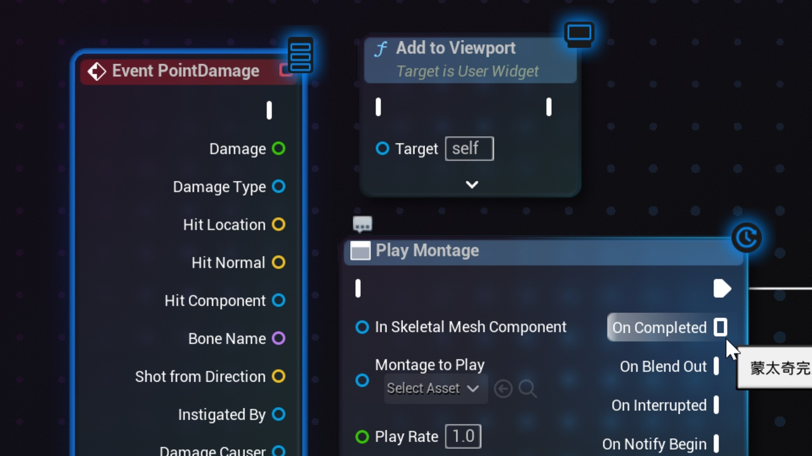{width=50%}

- [UE_TAPython](https://github.com/cgerchenhp/UE_TAPython_Plugin_Release) TAPython is an editor plugin for Unreal Engine. It provides a framework for creating python editor tools in Unreal Engine, and live Slate editing for developers, which makes creating menus and UE native Slate UI much easier and faster(without any compiling time or restart editor). The plugin also provides 200+ editor tool interfaces to use, making developing UE editor tools very simple and efficient.
  - 并非开源项目，但免费使用，看着很多增强的编辑器插件，我还没有尝试
  - 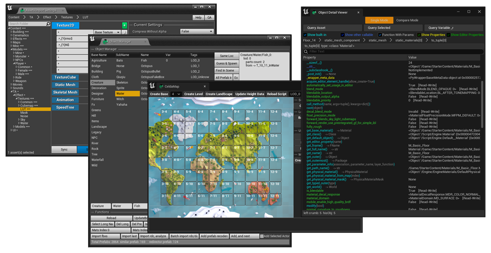{width=50%}


- [BPCorruptionFix](https://github.com/rweber89/BPCorruptionFix) Sometimes BPs get corrupted, due to Actor Component changes. Their type, their name, declaring them with the wrong properties, saving information about them inside of BPs … there are a number of ways this can happen.
  - 有用，但不常用

- [AdvancedUI](https://github.com/nikkomiu/AdvancedUI) 修改并保存UE编辑器的默认缩放比例。 Unreal Engine 5 Advanced UI Editor. it to start working This Unreal Engine Plugin allows setting a custom and persistent UI scale for the editor as well as allowing you to disable Slate UI tooltips in the editor (probably only useful for Linux).
  - 目前只有保存缩放比例的这一个功能。

- [UE-ProgramBrowser](https://github.com/SkecisAI/UE-ProgramBrowser)  Create, Build, Pakcage an Unreal Engine Standalone Program Application. 使用虚幻引擎（Unreal Engine）提供的资源创建独立应用程序（Standalone Program）而非游戏（Not Game），本插件实现了对独立应用程序从创建到打包的一键式流程管理
  - 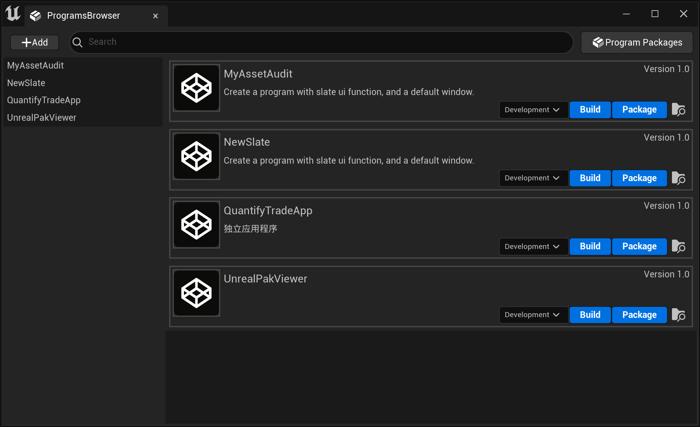{width=50%}
  - {width=50%}
  - 更多参考 [https://zhuanlan.zhihu.com/p/391228179](https://zhuanlan.zhihu.com/p/391228179)

- [UEGitPlugin](https://github.com/ProjectBorealis/UEGitPlugin) Unreal Engine Git Source Control Plugin (refactored)

- [PCG Assets](https://github.com/TimChen1383/PCGAsset.git) 大量PCG C++自定义节点资产
  - 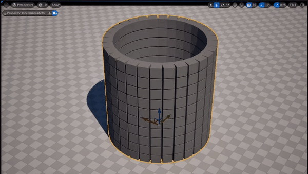

- [WFCLevelCreator](https://github.com/alwayswinder/WFCLevelCreator) UE5 WFC 算法生成地图
  - https://www.bilibili.com/video/BV1jz421C7bS/ 还可以参考他自定义slate ui 的实现，作者很有干货
  - 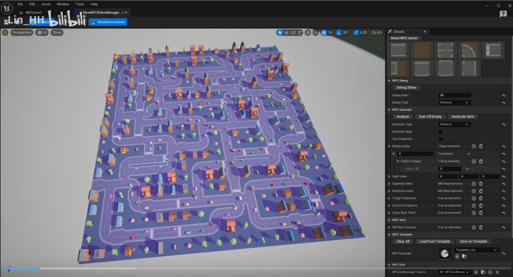{width=40%}


- [动画纹理](https://github.com/neil3d/UAnimatedTexture4) 直接把GIF作为为一种资产 This plugin allows you to import animated GIF into your Unreal Engine 4 project as a new AnimatedTexture asset type.
  - {width=50%}

- [Renom](https://github.com/UnrealisticDev/Renom) UE5改名工具 A simple tool to rename Unreal Engine projects.
  - (实测不是很好用, 可能是项目自身原因)

- [MDMetaDataEditor](https://github.com/DoubleDeez/MDMetaDataEditor) 支持使用蓝图修改、配置元数据。Unreal Engine 5.1+ plugin to enable editing meta data of Blueprint Properties, Functions, and Function and Event Parameters

- [RefreshAllNodes](https://github.com/nachomonkey/RefreshAllNodes) 该插件在编辑器中创建一个按钮，它将在所有蓝图上运行内置的“刷新所有节点”命令。Unreal Engine plugin that refreshes and compiles all of your blueprints.
  - 只有一个按钮，点击了会刷新全部蓝图文件。

- [Cog](https://github.com/arnaud-jamin/Cog) 基于Dear ImGui的UE调试工具集合。Cog is a set of debug tools for Unreal Engine built on top of Dear ImGui
  - 提供比UE原版更好用的GAS、EnhancedInput、行为树、CheatMenu等调试工具。
  - 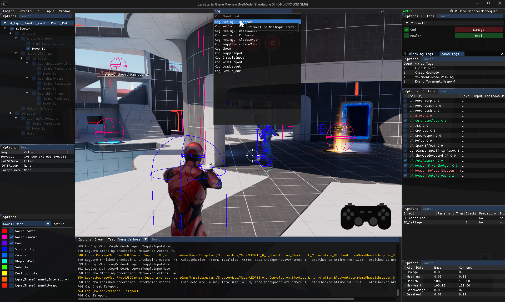{width=50%}

- [Minesweeper](https://github.com/GapingPixel/Minesweeper) Minesweeper Editor Tool. Fully made with Slate
  - Slate 实现的扫雷游戏
  - 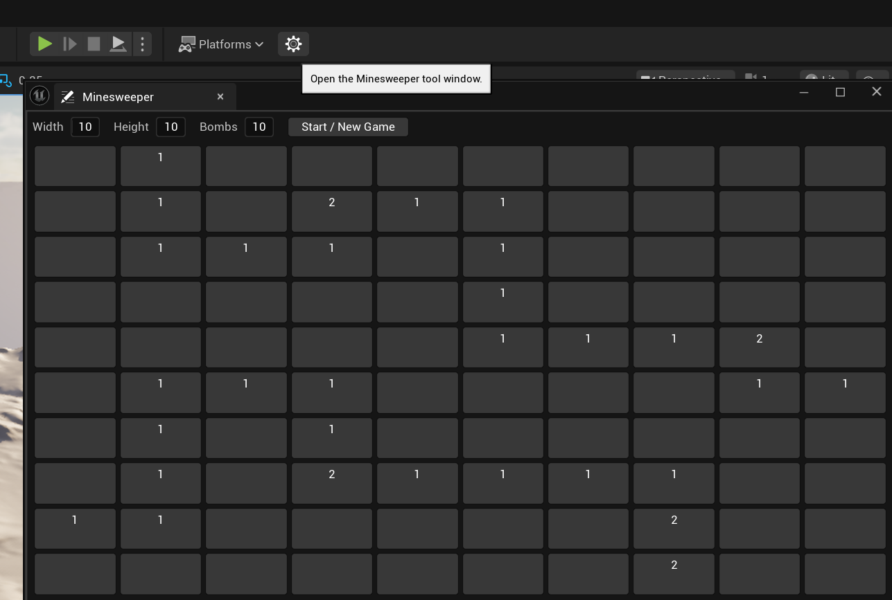{width=50%}


## Animation

- [TurboSequence](https://github.com/LukasFratzl/TurboSequence) 用GPU加速骨骼动画 Skeletal Based GPU Crowds for UE5 🚀
  - 

- [mixamo_converter](https://github.com/enziop/mixamo_converter) mixamo 根动画转换神器。 Blender addon for converting mixamo animations to Unreal 4 rootmotion

- [ALSXT](https://github.com/Voidware-Prohibited/ALSXT) Advanced Locomotion System Refactored with expanded Character States, Improved Foot Print system, Sliding, Vaulting and Wallrunning(XT)
  - 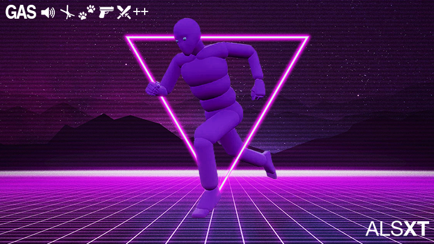

- [风动骨骼布料物理](https://github.com/SPARK-inc/SPCRJointDynamicsUE4) Real looking cloth physics engine for Unreal.
  - 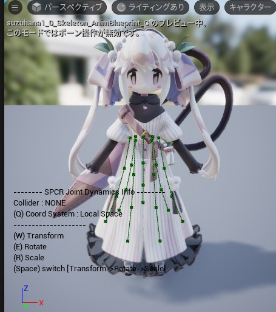

- [KawaiiPhysics ](https://github.com/pafuhana1213/KawaiiPhysics) 低计算成本物理动画模拟。Kawaii Physics is a pseudo-physics plugin for Unreal Engine 4 and 5. It allows you to create simple and cute animations for objects like hair, skirts, and breasts.
  - {width=50%}

- [ThreepeatAnimTools](https://github.com/threepeatgames/ThreepeatAnimTools) 该存储库包含 Unreal 5.4+ 曲线编辑器过滤器和经过大量修改的 MetaHuman 角色选择器，适用于 Metahuman 和基于 UE5-Mannequin 的控制装置。 This repository contains Unreal 5.4+ curve editor filters and a heavily-modified MetaHuman character picker that works for both Metahuman and UE5-Mannequin-based control rigs.
  - 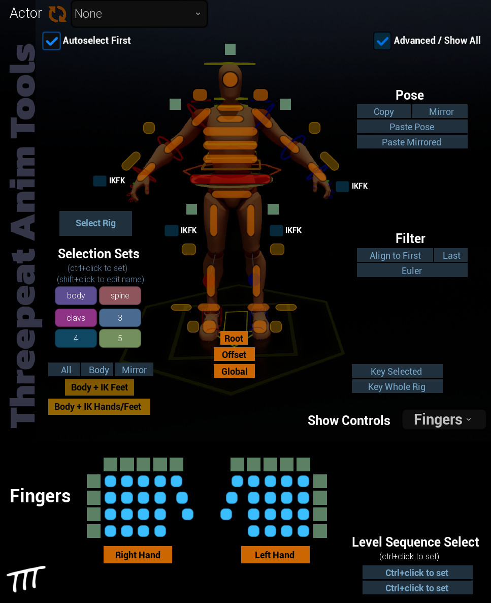{width=30%}

- [ProceduraAnim](https://github.com/alwayswinder/ProceduraAnim) UE5程序化动画例子，四足机器人演示
  - https://www.bilibili.com/video/BV1xY2NYUEau/ 林佬作品，干货很多
  - 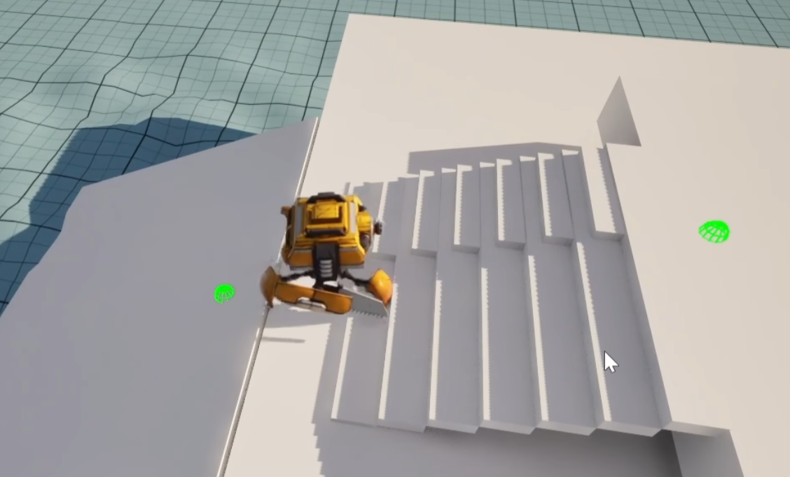{width=50%}

- [SimpleRideControl](https://github.com/alwayswinder/SimpleRideControl) 仿老头环上马动画和镜头控制
  - https://www.bilibili.com/video/BV1nw411s7fU/ 
  - 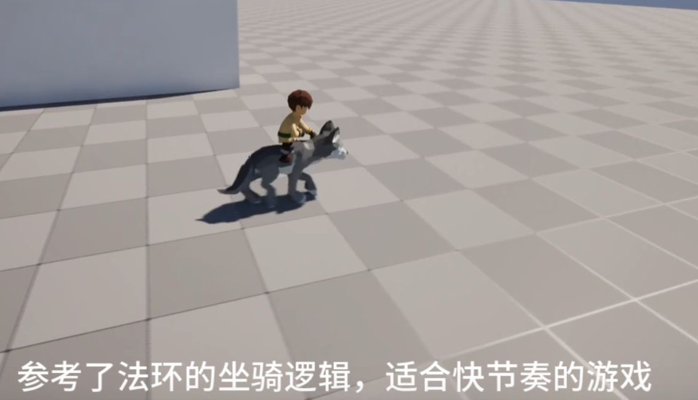{width=50%}


## Niagara
- [Niagara Destruction Driver](https://github.com/eanticev/niagara-destruction-driver) Turn CHAOS destructibles (Geometry Collection assets) into very performant GPU simulated destructible static meshes driven by Niagara particles.
  - 使用Niagara驱动chaos破坏的网格体，用GPU提高性能，非常好的学习资源
  - 

- [SpawnToNiagara](https://github.com/aggressivemastery/SpawnToNiagara) This sample provides blueprint code and levels examples on how to spawn specific textured (selected by per particle random value) particles to a single niagara system.
  - 相关项目：https://github.com/aggressivemastery/NaniteMaterialUnification 演示如何使用 PerInstanceCustomData 和 CustomPrimititiveData 在单个主材质中驱动纹理选择。这使得 Nanite 网格及其上的所有材质能够通过一次DrawCall进行渲染。


  - GameDevMicah 是GiantessPlayground的作者：https://x.com/gamedevmicah


 


## Gameplay

- [UE-Portals](https://github.com/rchaucha/UE-Portals) This plugin has been developed for the study of visual properties only. Thus, although the teleportation aspect has been implemented, it is really secondary and not much work has been put into it. Main branch works for UE-5.1 thanks to @dirtydanisreal, and there is a dedicated branch for UE-4.
  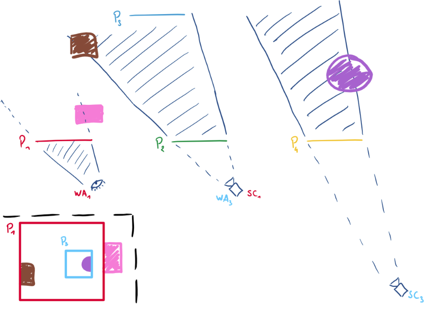


- [Array-Utils](https://github.com/pyoneerC/Array-Utils) STL utilities for Unreal Engine Arrays.
  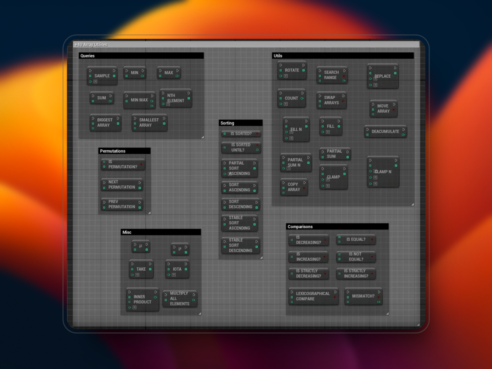


- [SharedCoolingAbility](https://github.com/hbdjzwl/SharedCoolingAbility) SharedCoolingAbility是一款简洁式开箱即用支持单机、联机的共享冷却插件，不需要你写一行代码，也不会耦合你的项目代码，只需要在自己的AbilitySystemComponent类继承一个接口和继承自共享冷却Ability即可实现公共CD。不管你是项目使用还是插件使用都非常的便捷。
  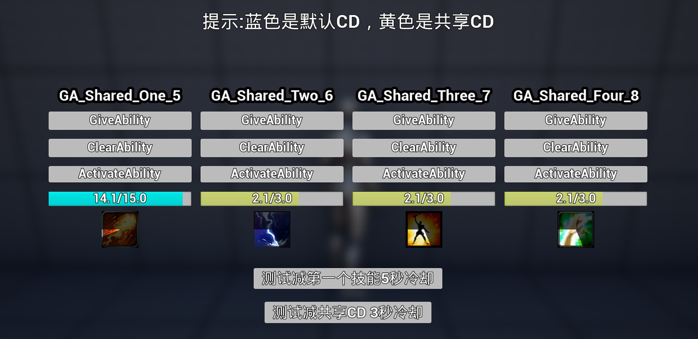


- [ue-gameplay-work-balancer](https://github.com/eanticev/ue-gameplay-work-balancer ) Unreal Engine Plugin that helps you spread work (time slice it) across multiple frames so your game maintains a stable frame rate (FPS).
  

- [VoxelPlugin](https://github.com/VoxelPlugin/VoxelCore) Open-source plugin with the Core module of Voxel Plugin
  - 虚幻引擎5的voxel插件 https://voxelplugin.com/
  - 个人免费使用，目前只开源了1.0，2.0预览版需要付费
  - 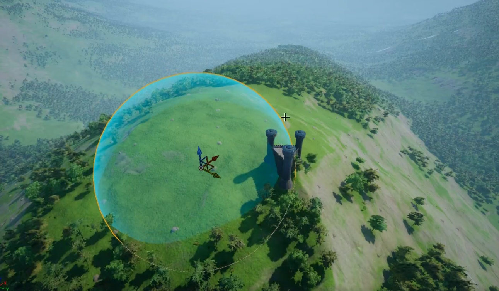


- [FutureExtensions](https://github.com/splash-damage/future-extensions) Unreal Engine plugin for async task programming


- [UE5Coro](https://github.com/landelare/ue5coro)UE5Coro 为虚幻引擎 5 实现了 C++20 协程支持，注重游戏逻辑、便利性，并提供与引擎的无缝集成。UE5Coro implements C++20 coroutine support for Unreal Engine 5 with a focus on gameplay logic, convenience, and providing seamless integration with the engine.
  - 让蓝图也支持协程函数。
  - wrap了多个module, 使用方便。
  - ```C++
        UFUNCTION(BlueprintCallable, meta = (Latent, LatentInfo = LatentInfo))
    FVoidCoroutine Example(FLatentActionInfo LatentInfo)
    {
        UE_LOGFMT(LogTemp, Display, "Before delay");
        co_await UE5Coro::Latent::Seconds(1); // Does not block the game thread!
        UE_LOGFMT(LogTemp, Display, "After delay");

        // Moving out of the game thread is as easy...
        co_await UE5Coro::Async::MoveToTask();
        UE_LOGFMT(LogTemp, Display, "In game thread: {0}", IsInGameThread());
        FString Value = TEXT("Imagine this was expensive to compute");

        // ...as moving back in:
        co_await UE5Coro::Async::MoveToGameThread();
        UE_LOGFMT(LogTemp, Display, "In game thread: {0}", IsInGameThread());
        UE_LOGFMT(LogTemp, Display, "Value: {0}", Value);
    }
    ```


- [FlowGraph](https://github.com/MothCocoon/FlowGraph) 将其作为开源项目发布的目的是让人们能够更轻松地讲述精彩的故事并构建身临其境的世界。这使我们能够丰富视频游戏的故事叙述，从而激励人们并让我们的世界变得更美好。 Design-agnostic node system for scripting game’s flow in Unreal Engine
  - 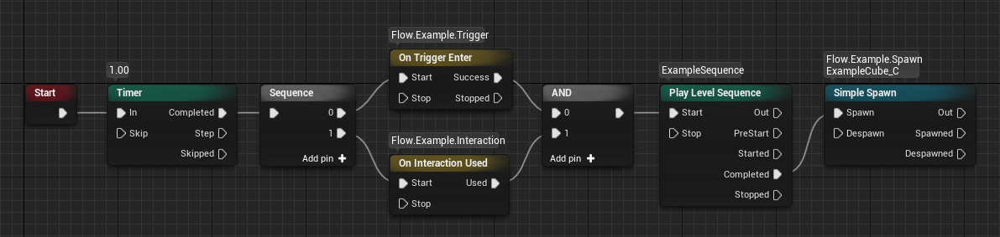

- [Dialogue Plugin](https://github.com/NotYetGames/DlgSystem) Dialogue Plugin System for Unreal Engine

- [SPUD](https://github.com/sinbad/SPUD) 易用存档系统。 SPUD is a save game and streaming level persistence solution for Unreal Engine 5.

- [stream-chat-unreal](https://github.com/GetStream/stream-chat-unreal) 聊天框架，源码值得学习。该steam不是那个steam。The Stream Chat SDK is the official Unreal SDK for Stream Chat, a service for building chat and messaging games and applications.
  - 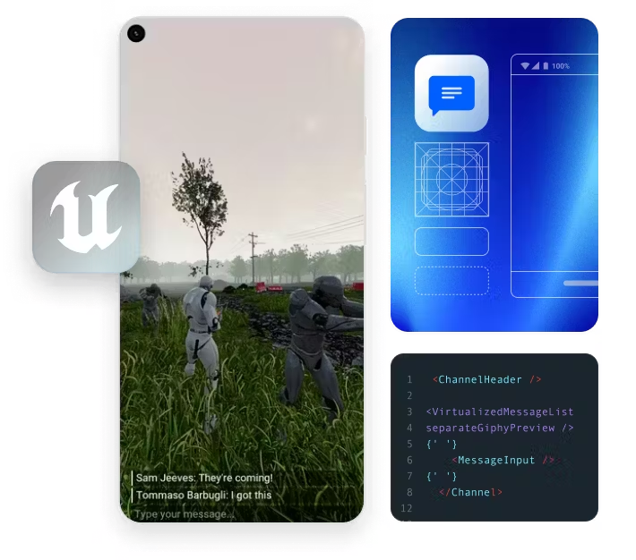{width=30%}

## Character

- [Mutable](https://github.com/anticto/Mutable-Documentation/wiki/Use-Cases) 角色自定义系统 Mutable generates skeletal meshes at runtime in your game. If your project needs content that can change dynamically, then Mutable is a good candidate to do that for you. It is always referred to as a "Character customization system", however it can generate any kind of skeletal mesh, including animls, props and weapons.
  - 


## UI

- [NiagaraUIRenderer](https://github.com/SourySK/NiagaraUIRenderer) Niagara UI Renderer | Free Plugin for Unreal Engine 
  - {width=50%}

- [MeshWidgetExample](https://github.com/dantreble/MeshWidgetExample) SMeshWidget Example

- [UINavigation](https://github.com/goncasmage1/UINavigation) 不想用CommonUI可以考虑这个。A UE4/5 plugin designed to help easily make UMG menus navigated by mouse, keyboard and gamepad

- [UE-BYGRichText](https://github.com/BraceYourselfGames/UE-BYGRichText) Rich text library supporting customizable Markdown formatting
  - | Feature | Unreal Rich Text | BYG Rich Text |
    | --- | --- | --- |
    | Nested styles					| :x:					| :heavy_check_mark:	|
    | Customizable syntax   		| :x:					| :heavy_check_mark:	|
    | Markdown-like shortcuts		| :x:					| :heavy_check_mark:	|
    | Inline images					| :heavy_check_mark:	| :heavy_check_mark:	|
    | Style-based justification		| :x: (block only)		| :heavy_check_mark:	|
    | Style-base margins			| :x: (block only)		| :heavy_check_mark:	|
    | Inline tooltips				| :heavy_check_mark:	| :heavy_check_mark:	|
    | Customizable paragraph separator | :x: | :heavy_check_mark:					|
    | XML-like syntax   			| :heavy_check_mark:	| :heavy_check_mark:	|
    | Datatable-based stylesheet	| :heavy_check_mark:	| :x:					|
    | Blueprint code support		| :heavy_check_mark:	| :x:					|

- [ElementUI-UMG-Kit](https://github.com/rdelian/ElementUI-UMG-Kit) An easy way to change the style of your elements that extends beyond the default ones the Common UI provides.
  - 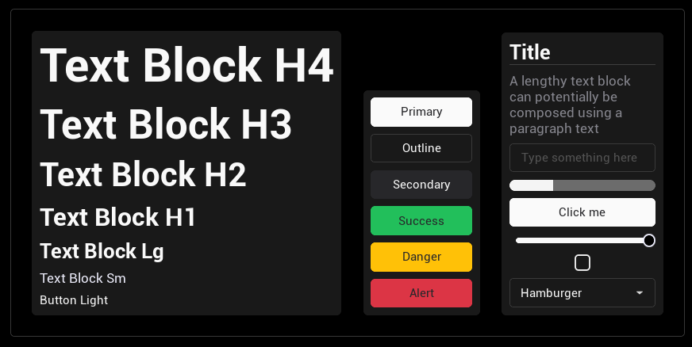

- [UI Tweening Libary for UE4/UMG](https://github.com/benui-dev/UE-BUITween) UI 补间动画方便C++ 使用。 Unreal 4 UMG UI tweening plugin in C++
  ```C++
    // Make UWidget MyWidget fade in from the left
    const float TweenDuration = 0.7f;
    const float StartDelay = 0.3f;
    UBUITween::Create( MyWidget, TweenDuration, StartDelay )
      .FromTranslation( FVector2D( -100, 0 ) )
      .FromOpacity( 0.2f )
      .ToReset()
      .Easing( EBUIEasingType::OutCubic )
      .Begin();
  ```

- [UEImgui](https://github.com/ZhuRong-HomoStation/UEImgui) IMGUI的使用，支持代码编辑器
  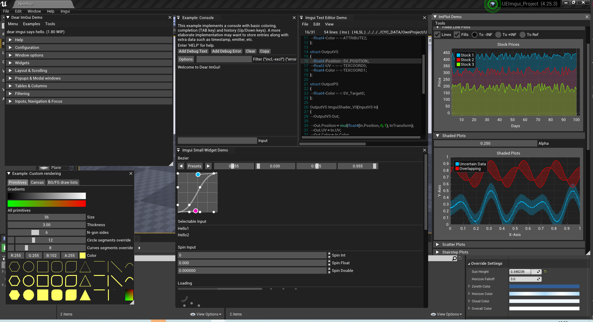

- [运行时图片加载器](https://github.com/RaiaN/RuntimeImageLoader) 支持GIF，webp 格式。 Load images and GIFs into Unreal at runtime without hitches
  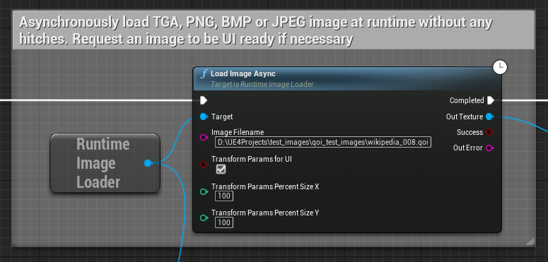


## Shader

- [UE5_Tut_5_Custom_Material_Node](https://github.com/RyanSweeney987/UE5_Tut_5_Custom_Material_Node) Tutorial code for how you can create your own material nodes for use in any material. The example is a simple Desaturate node.


- [MaterialMaker](https://github.com/RodZill4/material-maker) A procedural textures authoring and 3D model painting tool based on the Godot game engine
  - 虽然说支持 Unreal Engine，但是测试发现生成的hlsl 依然代码存在很多报错 (2025.7.30)
  - 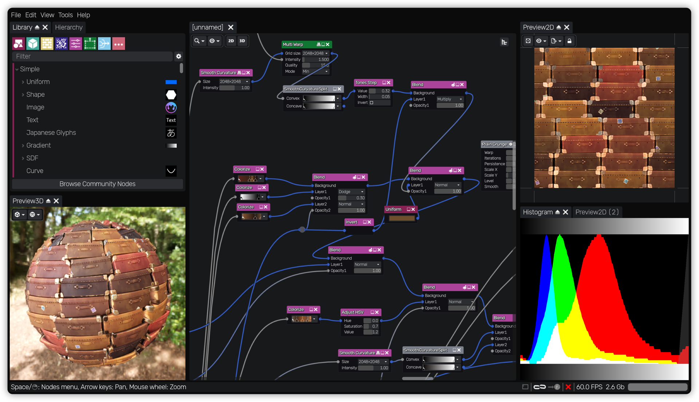


- [ProceduralDrawingMaterialSamples](https://github.com/EmbarrassingMoment/ProceduralDrawingMaterialSamples ) About
A collection of procedural drawing material samples for Unreal Engine (UE5). Useful for learning technical art and for reference in your projects.
  - 
  - 

- [DarknessFX/UEMaterials](https://github.com/DarknessFX/UEMaterials ) DarknessFX Collection of Unreal Engine Materials
  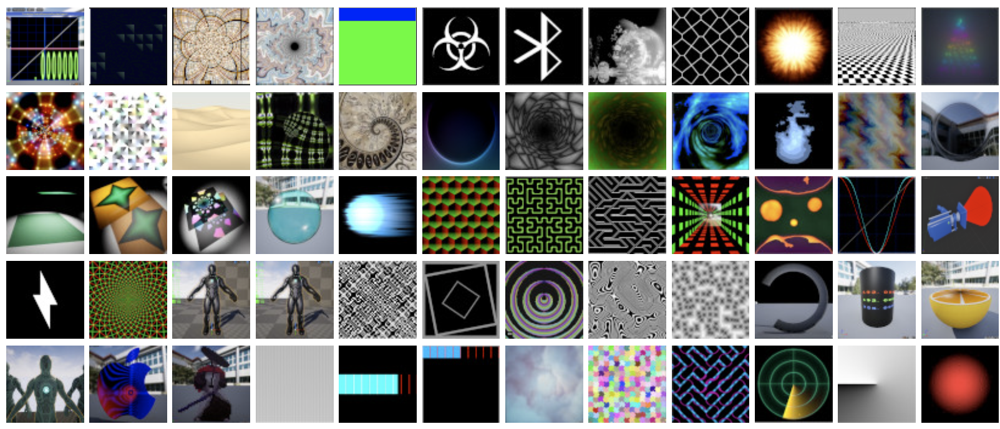


## NetWork

- [VaRest](https://github.com/ufna/VaRest) REST API plugin for Unreal Engine 4 - we love restfull backend and JSON communications!
  - 该项目作者已经停止维护， 作者推荐自己fork后使用。
  - 但fab 版本依然在更新，且免费：https://www.fab.com/listings/5b751595-fe3e-4e85-b217-9b5496ab6d3f


## Framework

- [PCGExtendedToolkit](https://github.com/Nebukam/PCGExtendedToolkit) PCGEx is a free (libre) Unreal 5 plugin that expands PCG capabilities. It offers a variety of high-performance nodes; with an edge for building relational graphs (Freeform, Delaunay, Voronoi, MST etc), advanced pathfinding; and much more.
  - 比官方PCG更强大的PCG工具，带示例项目：https://github.com/Nebukam/PCGExExampleProject
  - 文档 https://nebukam.github.io/PCGExtendedToolkit/
  - 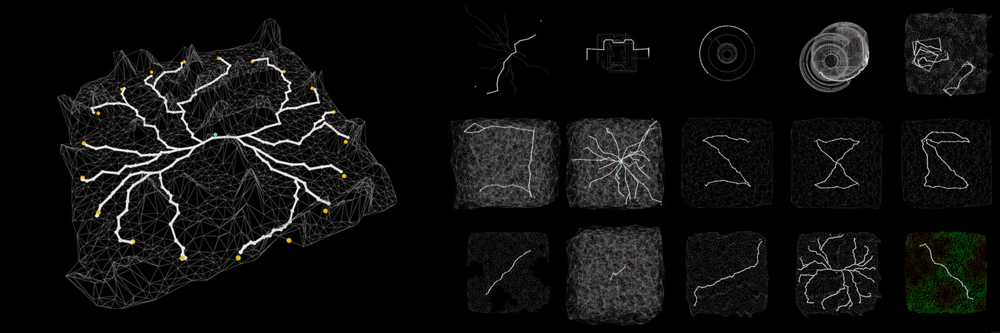

- [imgui](https://github.com/ocornut/imgui) 代码驱动的UI开发方式，无需可视化编辑器, 对程序员非常友好。 Dear ImGui: Bloat-free Graphical User interface for C++ with minimal dependencies
  - API简单直观，学习曲线平缓
  - 快速实现工具类UI，如调试面板、属性编辑器等
  - 非常适合做游戏内调试工具、编辑器扩展
  - 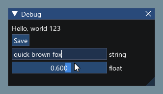

- [Taichi](https://github.com/taichi-dev/taichi) Taichi 是一个并行计算框架，适合计算密集型任务（例如写Shader、物理仿真和人工智能等任务）高度依托于并行计算 Productive, portable, and performant GPU programming in Python.
  - [相似框架对比](https://forum.taichi-lang.cn/t/topic/2621) 
  - Taichi Lang 提供了一组称为SNode (/ˈsnoʊd/) 的通用数据容器，这是一种组合分层、多维字段的有效机制。这可以涵盖数值模拟中的许多使用模式（例如空间稀疏计算）。
  - cgerchenhp表示将 Taichi 集成到虚幻引擎中非常容易。充分利用 Taichi 的高性能并行计算和 UE 对 Python 的支持（通过插件 [TAPython](https://github.com/cgerchenhp/TAPython_Taichi_StableFluid_UE5)）
  - 


- [spine-runtimes](https://github.com/EsotericSoftware/spine-runtimes) Spine 是一款针对游戏开发的 2D 骨骼动画编辑工具, 支持虚幻。

- [MassSample](https://github.com/Megafunk/MassSample) understanding of Unreal Engine 5's experimental ECS plugin with a small sample project.
  - 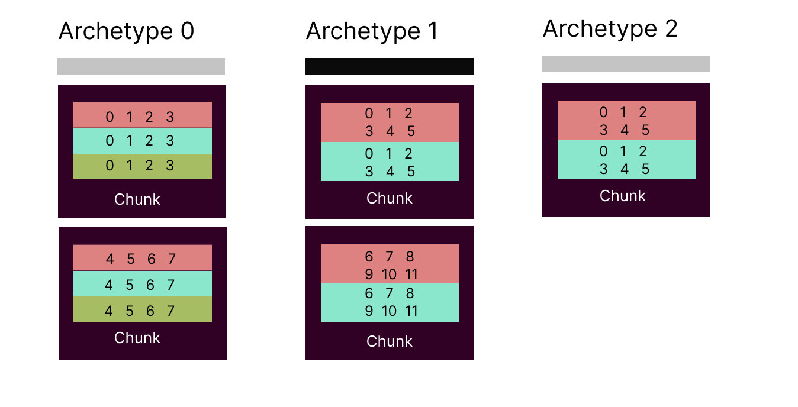

- [MassAIExample](https://github.com/Ji-Rath/MassAIExample) A project primarily used to experiment with Mass, an ECS Framework
  - 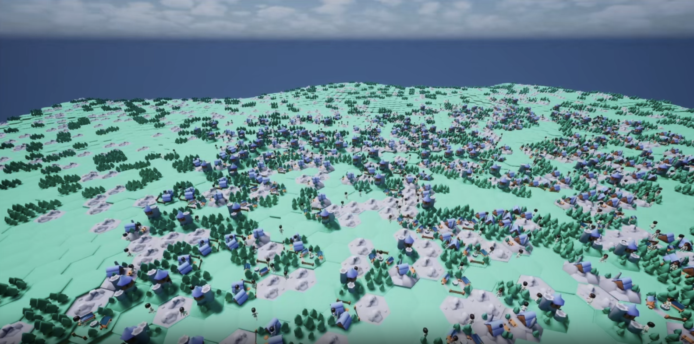
  - 

- [MaaassParticle](https://github.com/DevDingDangDong/MaaassParticle.git) A UE5 plugin that renders large-scale crowds through Niagara and can control them via state management. This is the Epic project deliverable from Krafton Game Tech Lab 1st Generation Team 2.
  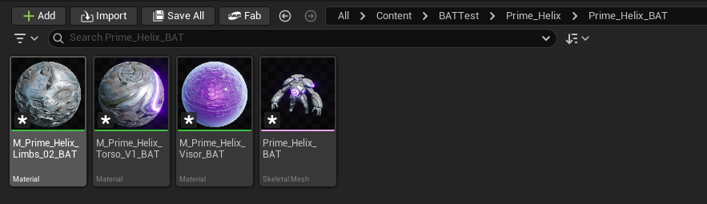


- [UnrealLibretro](https://github.com/N7Alpha/UnrealLibretro) Libretro 游戏模拟器 UnrealLibretro is a Libretro Frontend for Unreal Engine. It is a Blueprint compatible library that lets you run emulators within Unreal Engine. More Technically it allows you to run Libretro Cores.
  - https://github.com/libretro/RetroArch
  - 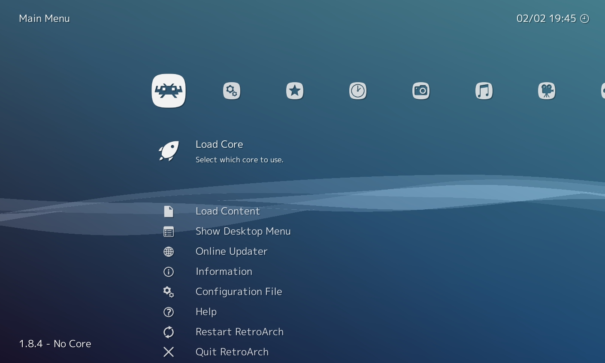

## Tools

- [UnrealAnalyzerMCP](https://github.com/ayeletstudioindia/unreal-analyzer-mcp) A Model Context Protocol (MCP) server that provides powerful source code analysis capabilities for Unreal Engine codebases. This tool enables AI assistants like Claude and Cline to deeply understand and analyze Unreal Engine source code.


- [DreamTranslatePO](https://github.com/TypeDreamMoon/DreamTranslatePO) An automated translation tool for po localization files or csv localization files
  - 虚幻引擎本地化工具，支持PO文件和CSV文件的自动翻译 接入AI
  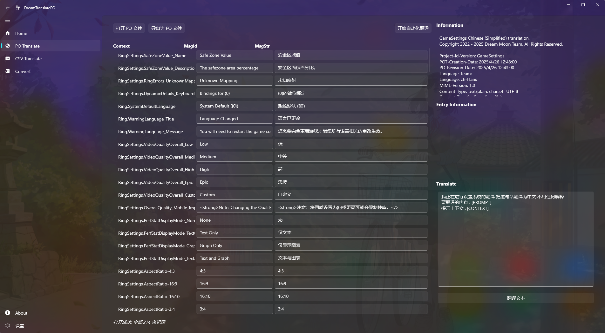


- [UnrealHeightMap](https://github.com/manticorp/unrealheightmap) Unreal Engine 16 Bit Grayscale PNG Heightmap Generator
  - 在线高度图生成工具，经测试，大部分真实地形都能获取；少部分区域只能获取低精度。
  - https://manticorp.github.io/unrealheightmap/


- [DreamUnrealManager](https://github.com/TypeDreamMoon/DreamUnrealManager) WinUI3 Unreal Engine Project / Unreal Engine Manager
  - UE引擎/项目管理器 + 可视化预编译插件批量构建工具
  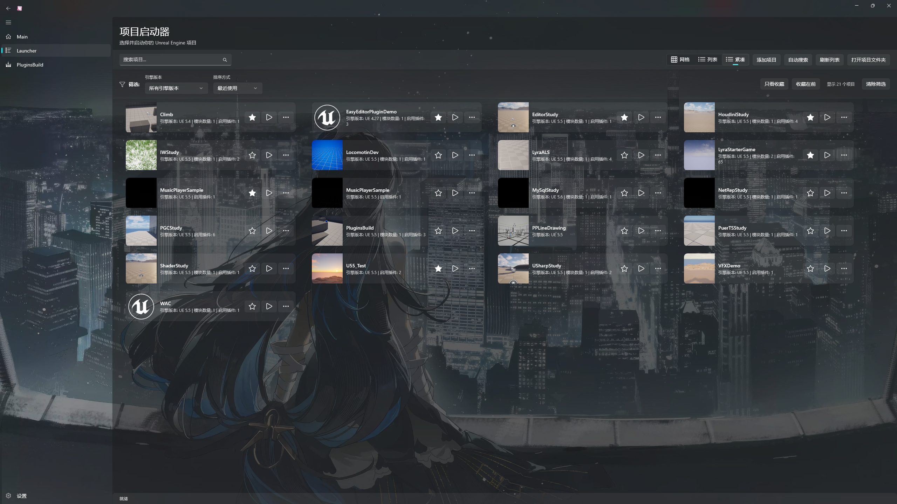


- [KeywordGacha](https://github.com/neavo/KeywordGacha) 使用 AI 能力分析 小说、游戏、字幕 等文本内容并生成术语表的次世代翻译辅助工具
  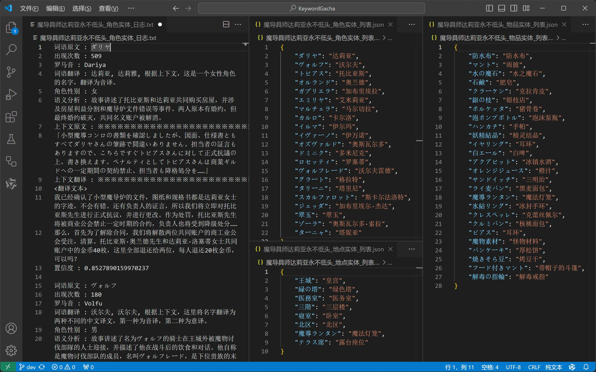{width=70%}


- [ComfyTextures](https://github.com/AlexanderDzhoganov/ComfyTextures) 用扩散模型给3d模型场景自动生成贴图。 Unreal Engine ⚔️ ComfyUI - Automatic texturing using generative diffusion models
  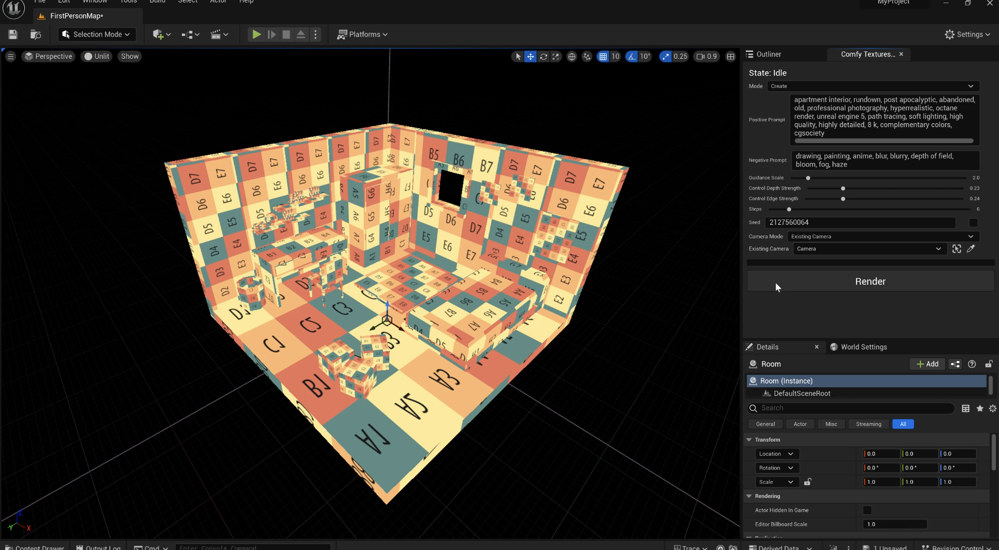

- [RGB↔X](https://github.com/zheng95z/rgbx) AI根据输入图片生成材质。 RGB↔X: Image Decomposition and Synthesis Using Material- and Lighting-aware Diffusion Models
  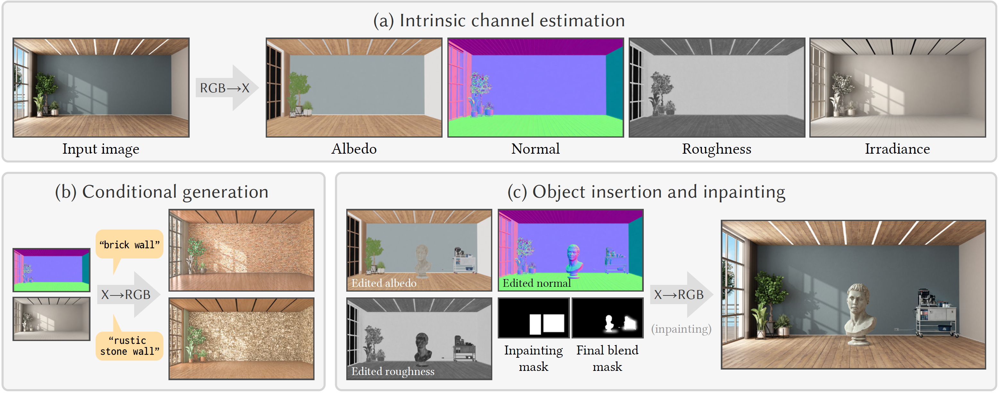

 - [Libretro Shader](https://github.com/libretro/glsl-shaders) 老电视机、老游戏 滤镜。 This repo is for glsl shaders converted by hand from libretro's common-shaders repo, since some don't play nicely with the cg2glsl script.
  

- [glslViewer](https://github.com/patriciogonzalezvivo/glslViewer) Console-based GLSL Sandbox for 2D/3D shaders
  

- [UnrealGPUSwarm](https://github.com/timdecode/UnrealGPUSwarm) 学习compute shaders的例子。 This project is a good starting point for learning how to write compute shaders in Unreal. It implements a boid simulation the GPU. It achieves 0.5 million boids at 45 fps on a GTX 1080.
  <video src="https://user-images.githubusercontent.com/980432/132757577-500416e4-5f27-4add-9c50-641889336d69.mp4" controls autoplay loop> 
    Your browser does not support the video tag.
  </video>


## Python
- [PythonSamples](https://github.com/ue4plugins/PythonSamples)  contains some python samples to script the editor in Unreal Engine.
  - 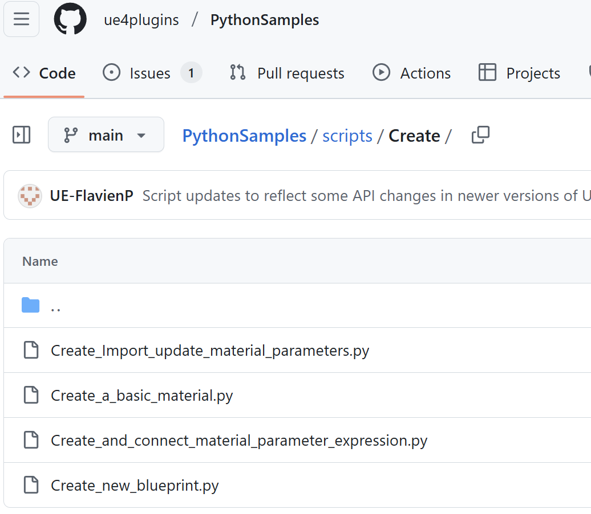{width=30%}

- [UnrealEditorPythonScripts](https://github.com/mamoniem/UnrealEditorPythonScripts) Some of my personal scripts i made to use for my own projects
  - {width=30%}


## Projects

- [AstralShipwright](https://github.com/strangergwenn/AstralShipwright) ASTRAL SHIPWRIGHT / Full game sources for Astral Shipwright, a space sim made with Unreal Engine 5
  


- [HeliumRain](https://github.com/strangergwenn/HeliumRain) HELIUM RAIN / Full sources for Helium Rain, a realistic space opera using Unreal Engine 4
  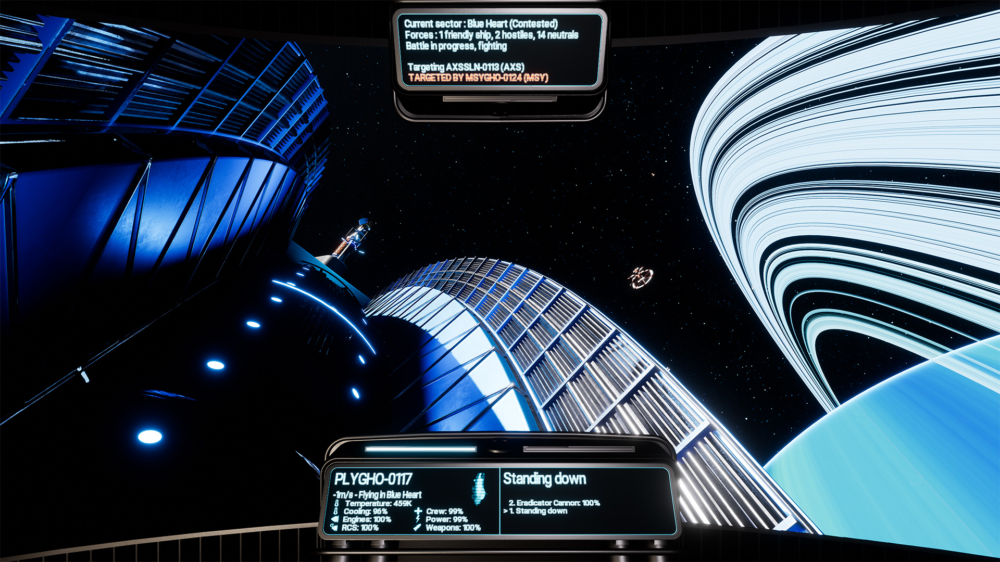

- [UE5RuntimeToolsFrameworkDemo](https://github.com/gradientspace/UE5RuntimeToolsFrameworkDemo) Sample project/code that uses the UE5 InteractiveToolsFramework to provide a small modeling app at Runtime

- [StateTreeTest](https://github.com/haktan313/StateTreeTest) Advanced AI system using Unreal's State Tree. The enemy can cast magic, switch between passive and aggressive states, and search for health potions with EQS when low on health. Includes 3 different State Tree, several custom tasks, utility selectors, and some logics adapted from my HAIPro plugin, which will support State Tree integration in future.
  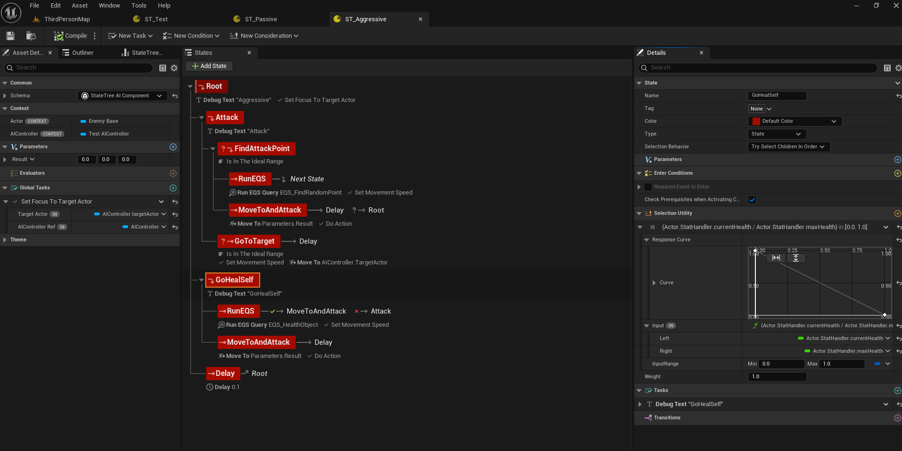

- [FlowField-RVO2](https://github.com/fukeryester/FlowField-RVO2) A FlowField+RVO2 source code finished with Cursor.
 

- [MaxQ](https://github.com/Gamergenic1/MaxQ) 演示了如果使用NASA的航天规划和分析的行业标准航天工具集（如何引入第三方C语言库）。 spaceflight Toolkit for Unreal Engine 5 
  - https://www.fab.com/listings/8b599b16-39bf-41bd-9ea5-3d1f70d45d06
  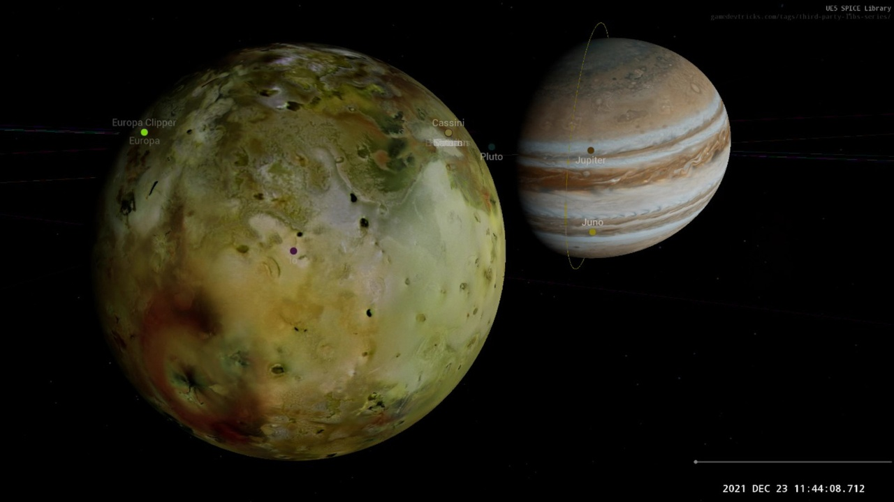

- [KittensMaze](https://github.com/ukustra/KittensMaze) 一个GAS项目。 A source code of "Kittens' Maze", a free to play game developed in Unreal Engine 4

- [OnAllFronts-Public](https://github.com/HaywireInteractive/OnAllFronts-Public) Mass Entity (ECS) framework Demo 
  - 可以作为City Sample 项目的插件使用
  - https://github.com/Leroy231/ProjectMStarter 主项目
  - 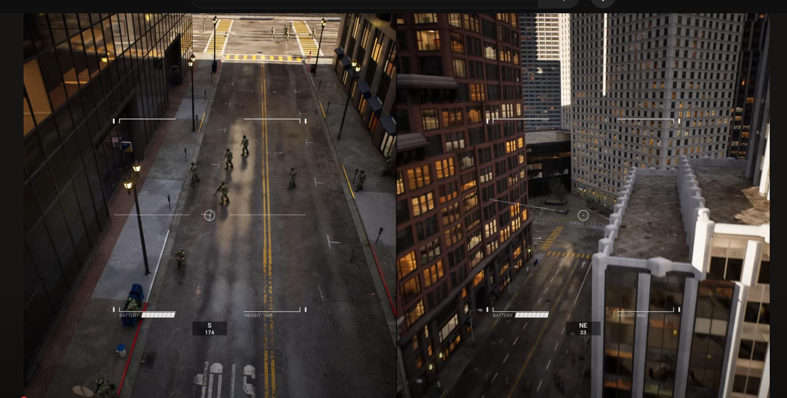

- [ParagonUIPrototyping](https://github.com/roman-dzieciol/ParagonUIPrototyping) 8年前的UE4项目，可用于学习UI构建。 Paragon UI Prototyping using UE4.11 UMG
  - 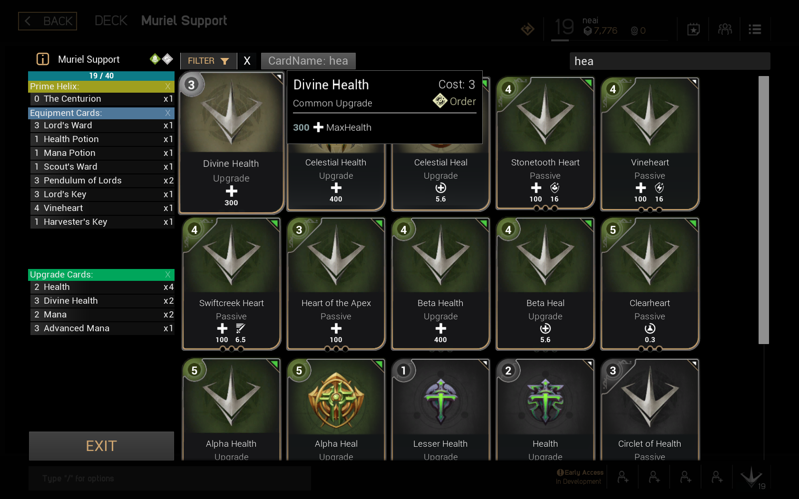

- [ActionRPG_UE53](https://github.com/vahabahmadvand/ActionRPG_UE53) 官方GAS项目升级虚幻5的版本。Action RPG sample project upgraded to the latest Unreal Engine 5.5
  - https://github.com/mirchd/ActionRPG 相似的项目
  - 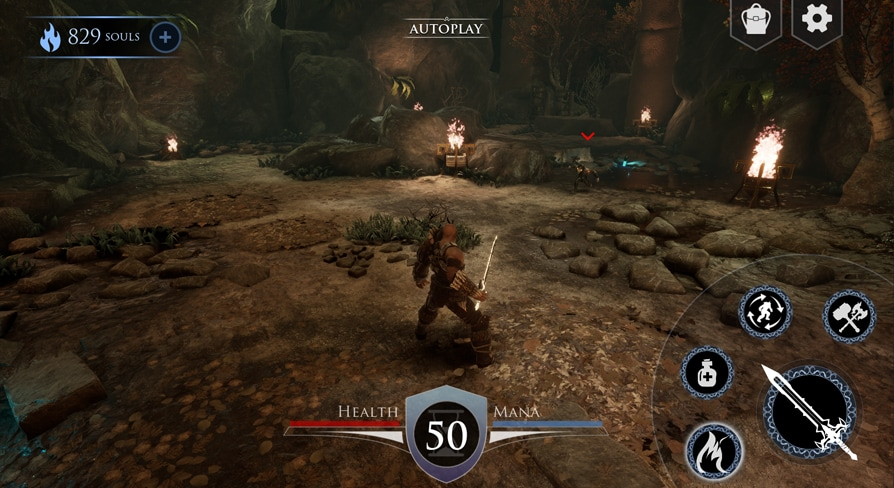

- [PixelSpiritDeck](https://github.com/patriciogonzalezvivo/PixelSpiritDeck) 大量Shader基础图形用例学习。 Each Pixel Spirit card presents a visual element together with the GLSL shader code that generates it. Ultimately, these elements can be reused and combined to compose an infinite visual language. This deck is a tool for learning, a library, and an oracle.
  - 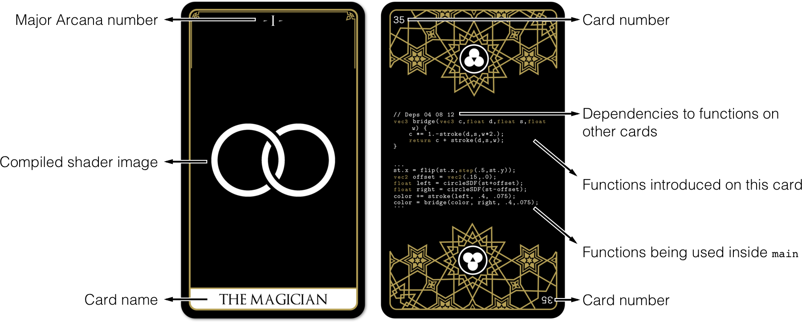

- [MeshCuttingGunSample](https://github.com/HoussineMehnik/MeshCuttingGunSample) 演示物理抓取，和对模型的切割还原。Mesh-Cutting/Restoring mechanics
  - 作者还有更多的开源项目：https://unrealengineresources.com/samples
  - 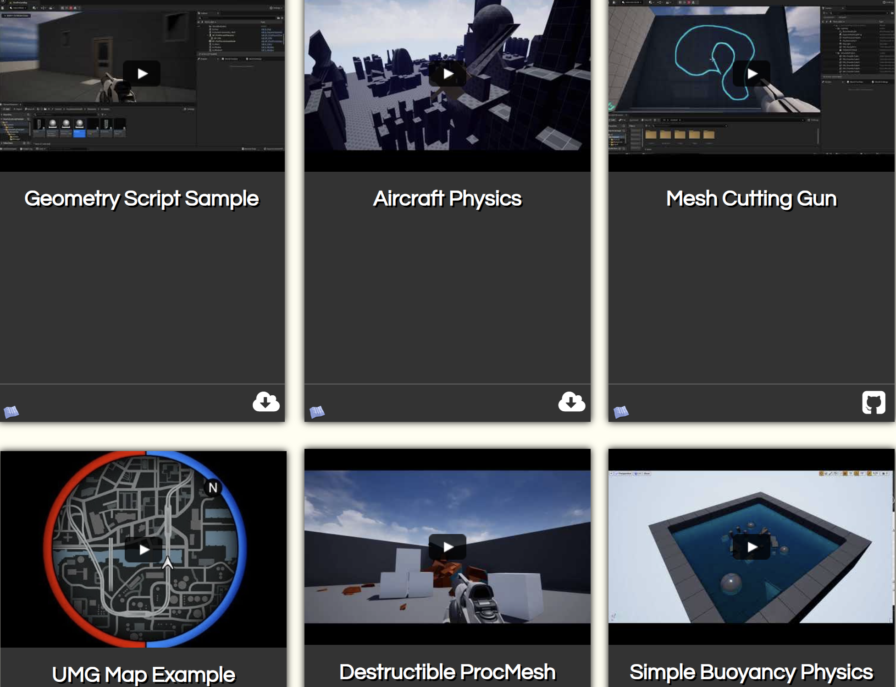

- [XFXInfinityBladeEffects](https://github.com/OurGameOrg/XFXInfinityBladeEffects) Epic Games Infinity Blade Effects as a plugin
  - https://www.unrealengine.com/en-US/blog/free-infinity-blade-collection-marketplace-release
  - 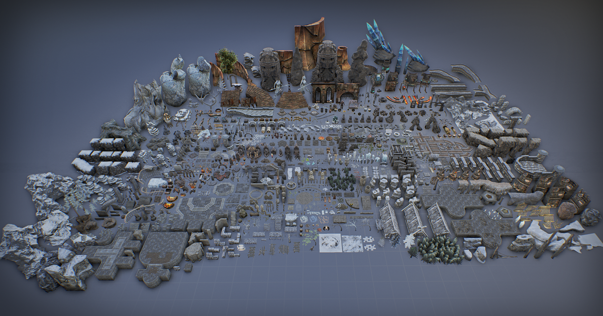


## Other
- [UnrealVerse](https://github.com/VerseMetaVerse/UnrealVerse) Information and links about Epic's Unreal Engine including Verse programming language for UEFN, Unreal, Fortnite and the Metaverse along with UE5 and the UE6 convergence

- [flecs](https://github.com/SanderMertens/flecs) A fast entity component system (ECS) for C & C++
  - Flecs 是一个快速轻量级的实体组件系统，可让您使用数百万个实体构建游戏和模拟。
  - {width=60%}
  - {width=60%}
  - 提供用于分析 ECS 性能的统计插件，以及用于监视和控制您的应用程序的基于 Web 的 UI
  - 使用 emscripten 无需修改即可在浏览器中运行

- [UE_Modding](https://github.com/Dmgvol/UE_Modding) A collection of UE4 (and 5) Modding Guides.
The perfect place for anyone new, to learn UE modding and start creating mods today.
  - 虚幻引擎第三方魔改模组开发指南

- [cheat-engine](https://github.com/cheat-engine/cheat-engine) Cheat Engine is a development environment focused on modding games and applications for personal use.
  

- [lua-bytecode-parser-ce](https://github.com/std-microblock/lua-bytecode-parser-ce) A versatile Lua 5.3 bytecode parser that supports both standard Lua bytecode and Cheat Engine modified format.

- [lazygit](https://github.com/jesseduffield/lazygit) simple terminal UI for git commands


- [avbd-demo2d](https://github.com/savant117/avbd-demo2d) Augmented Vertex Block Descent (AVBD) reference implementation
  <video src="https://graphics.cs.utah.edu/research/projects/avbd/teaser.mp4" controls autoplay loop> 
    Your browser does not support the video tag.
  </video>


- [audivis-relay](https://github.com/std-microblock/audivis-relay) Audivis Relay 是一款轻量级的麦克风串流软件，能够将物理麦克风的音频实时传输到虚拟麦克风设备，适用于远程会议、直播、语音聊天等场景。
  {width=50%}

- [Mesh2Motion](https://github.com/scottpetrovic/mesh2motion-app) Import a 3D Model and automatically assign and export animations with Mesh2Motion. This is kind of similar to a web application like Mixamo, but I would like it to be more flexible so it can support other model and skeleton types. Hopefully the open source nature means it can be expanded on and evolve more than than the closed tools have.

- [Noclip.website](https://github.com/magcius/noclip.website) A digital museum of video game levels
  - https://noclip.website/
  - [load level](https://noclip.website/#mkwii/castle_course;ShareData=AFkg2UaBz~8hs}oUG8C!VdHbcQRDYPUiNfVTdmxYV+xla9Xs0J85XnoUnEj3WP)
  - 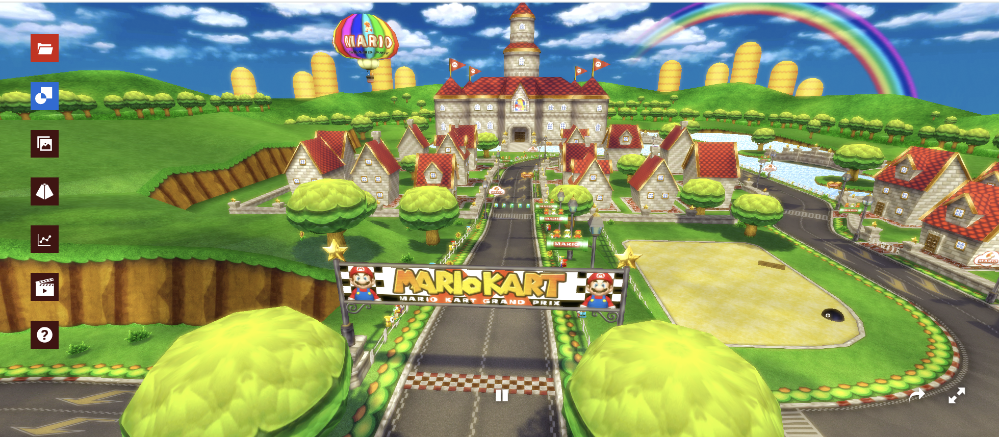{width=50%}


- [awesome-unreal](https://github.com/insthync/awesome-unreal) Some Unreal Engine  Tools

- [highway](https://github.com/google/highway) Performance-portable, length-agnostic SIMD with runtime dispatch

- [autogen](https://github.com/microsoft/autogen) AutoGen is a framework for creating multi-agent AI applications that can act autonomously or work alongside humans.

- [dify](https://github.com/langgenius/dify) Dify is an open-source LLM app development platform. Its intuitive interface combines agentic AI workflow, RAG pipeline, agent capabilities, model management, observability features and more, letting you quickly go from prototype to production.

- [airi](https://github.com/moeru-ai/airi) 💖🧸 Self hosted, you owned Grok Companion, a container of souls of waifu, cyber livings to bring them into our worlds, wishing to achieve Neuro-sama's altitude. Capable of realtime voice chat, Minecraft, Factorio playing. Web / macOS / Windows supported.
  


 
