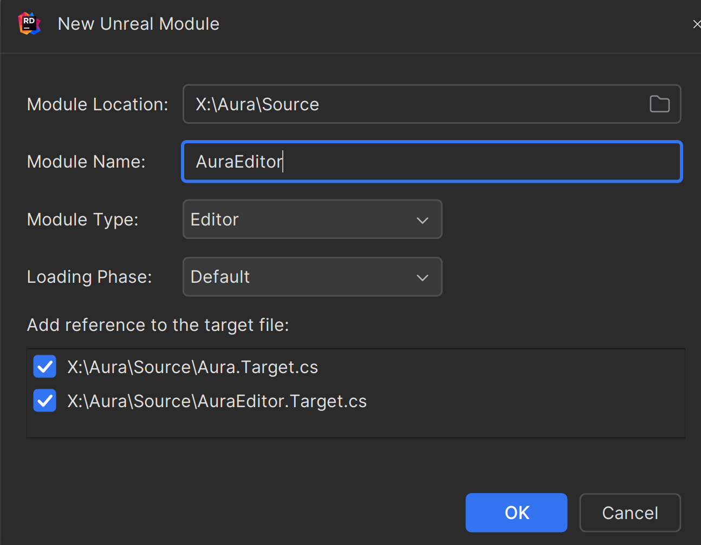

Most skill cooldowns are quite simple to configure, and I don't want to manually create a separate GE for every simple case. Therefore, I wrote an asset action to automate the creation process.

The code is about 200 lines long and can serve as a template for other actions. Throughout this process, I learned a lot, and I will provide the complete code for this tools, hoping it will help you as well.


---

### Idea

::: warning
Previous experience has shown that it's best not to [dynamically create GE at runtime](../GAS/5CooldownGE.md), so I opted to create them directly using Asset Action.
::: 

In the Gameplay Ability, define a cooldown time field, then right-click to find a custom action to automatically create a GE. In addition to creating the GE itself, a corresponding cooldown tag will also be created.

### Editor Module

Since asset operations belong to the Editor Module, we need to create the Editor Module first.

- Using Rider can greatly assist us in creating this.
  

- Add dependencies.
  

### Custom AssetDefinition
Originally, I used `UAssetDefinitionDefault` to implement the asset action, but comments indicated that this class is deprecated, and we need to use `AssetDefinition`.

At first, I directly used `UGameplayAbility`(Type) to create the AssetDefinition for it, but I found that `UGameplayAbility`(Assets Type) is actually a blueprint asset type, and blueprint assets are already implemented internally by the engine. Creating my own would override the internal implementation, which complicates things. Fortunately, I saw internal examples indicating that an AssetDefinition does not necessarily need to be implemented. You can refer to the implementation of [**GameplayAbilityAudit**].

### Custom MenuExtension_xxx

`namespace MenuExtension_YourActions`

In this namespace, you only need to implement a method called **Delayed Registration**.

`static FDelayedAutoRegisterHelper DelayedAutoRegister(EDelayedRegisterRunPhase::EndOfEngineInit, []`

### Implementation Details

There are two main details:

- Creating the GE blueprint asset.

- Creating a GameplayTag and saving it to an .ini file.

#### Creating GE
```cpp
FAssetToolsModule& AssetToolsModule = FModuleManager::GetModuleChecked<FAssetToolsModule>("AssetTools");
```

First, obtain the AssetToolsModule.

```cpp
UBlueprintFactory* BlueprintFactory = NewObject<UBlueprintFactory>();
BlueprintFactory->ParentClass = UGameplayEffect::StaticClass();
// do not use GE directly
// UGameplayEffect* NewGE = Cast<UGameplayEffect>(AssetToolsModule.Get().CreateAsset(CooldownGEName, NewGEPath, UGameplayEffect::StaticClass(), nullptr));
UObject* CreatedAsset = AssetToolsModule.Get().CreateAsset(CooldownGEName, NewGEPath, UBlueprint::StaticClass(), BlueprintFactory);
```

Create the GE blueprint asset; here, you need to use `BlueprintFactory` instead of directly using `UGameplayEffect`. Otherwise, you'll only get the default type of `UGameplayEffect` instead of its blueprint asset.

```cpp
// GE Blueprint Asset Class
UClass* GeneratedClass = GE_Blueprint->GeneratedClass;
// use the CDO, not New Object
UGameplayEffect* NewGE = Cast<UGameplayEffect>(GeneratedClass->GetDefaultObject());
```

Next, obtain the `GeneratedClass` from the blueprint and its CDO to assign values to it using code.

#### Creating GameplayTag

You need to use `IGameplayTagsEditorModule`, so you must add dependencies. The usage is quite simple:

- Check if the project allows creating GameplayTags via ini files.
    ```cpp
    const UGameplayTagsManager& Manager = UGameplayTagsManager::Get();
    // Only support adding tags via ini file
    if (Manager.ShouldImportTagsFromINI() == false)
    {
        return;
    }
    ```
- Create a GameplayTag, with the default filename temporarily set to `DefaultGameplayTags.ini`.
    ```cpp
    const TSharedPtr<FGameplayTagNode> TagNode = Manager.FindTagNode(CooldownTagName);
    if (!TagNode.IsValid())
    {
        const FString TagComment = FString::Format(TEXT("Auto Gen Cooldown Tag for {0}"), {TagName});
        IGameplayTagsEditorModule::Get().AddNewGameplayTagToINI(TagName, TagComment, DefaultTagINI);
    }
    ```

#### Complete Code
[GamePlayAbilityGenCooldownGE](https://github.com/kisspread/notes/blob/main/samplecode/CustomAssesAction/GamePlayAbilityGenCooldownGE.cpp)

### Other Attempts

#### Blueprint Editor Script


I can create a GE asset file, but I have not yet found a way to assign values. I don’t know how to use Set Editor Property; if anyone knows, please leave a comment.


