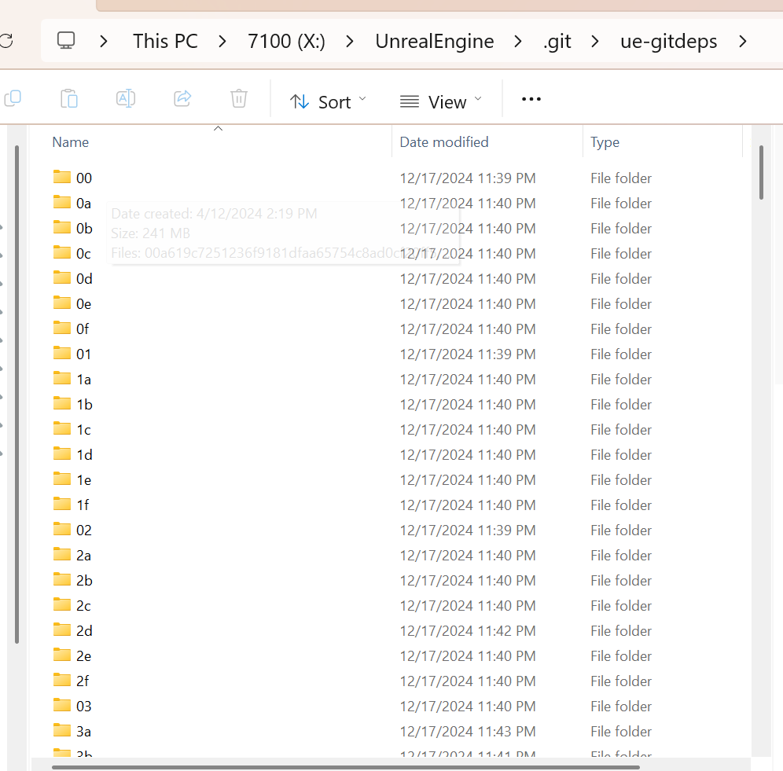

title:UE5 Git Dependences
comments:true

---
 

### 虚幻源码里的git hooks

使用git 拉取虚幻引擎源码的时候，文档还要求开发者执行Setup.bat 或者 Setup.sh来配置一些预设环境。

其中，执行一个叫做“GitDependences.exe” 的程序,并把它加入到git hooks里面。


- 这些hooks会在git checkout或merge操作后自动运行GitDependencies.exe

### 源码里的 **GitDependencies**

GitDependencies 是一个将近1600多行的.NET程序，用于从epic的cdn下载unreal engine 依赖的各种大文件资源，基于路径和文件hash匹配对应资源。

大部分文件基于 Pack/Blob 的方式打包到CDN里，减少文件数量，加速下载。被下载的文件会被缓存到本地的 `.git/ue-gitdeps` 文件夹里独立缓存。

所以，每次合并最新分支，都会自动更新大文件资源。像lyra这个项目，有变动的content内容，都会自动更新，并且是覆盖本地的。

- 基于 .NET 开发，跨平台支持（Windows、Linux、Mac）
- 支持多线程并发下载
- 智能的缓存和增量更新系统
- 保证文件的完整性和版本匹配
- 支持增量更新，只下载必要的文件 

#### GitDependences 细节

- 缓存目录:`.git/ue-gitdeps`
   
- 文件哈希表:`UnrealEngine\Engine\Build\Commit.gitdeps.xml` 高达27MB，感觉这里面有历史遗留问题，很多文件没有整合成pack.
- 哈希表格式：
  ```xml
    <DependencyManifest>
    <BaseUrl>https://your-server.com/binary-files</BaseUrl>
    <Files>
        <!-- 文件列表 -->
    </Files>
    <Packs>
        <!-- Pack 定义 -->
    </Packs>
    </DependencyManifest>
  ```

- CDN Url的格式：`Pack.Url = $"{RequiredPack.Manifest.BaseUrl}/{RequiredPack.Pack.RemotePath}/{RequiredPack.Pack.Hash}";`  
- Pack的结构：
  ```c#
  class IncomingFile {
    string[] Names;      // 目标文件路径
    string Hash;         // 文件哈希值
    long MinPackOffset;  // Pack中的起始位置
    long MaxPackOffset;  // Pack中的结束位置
  }
  ``` 
- Pack 文件是 GZip 压缩的,  使用 GZipStream 进行解压
- 使用 MinPackOffset 和 MaxPackOffset 定位每个文件的数据, 支持多文件并行提取
- 通过 offset 可以直接定位到需要的内容，不需要解包整个文件
- 文件放置流程：
  ```c#
  // 创建目标目录
    Directory.CreateDirectory(Path.GetDirectoryName(CurrentFile.Names[0]));

    // 先写入临时文件（带后缀）
    OutputStreams[Idx] = File.Open(CurrentFile.Names[0] + IncomingFileSuffix, FileMode.Create);

    // 验证成功后移动到最终位置
    File.Move(CurrentFile.Names[0] + IncomingFileSuffix, CurrentFile.Names[0]);
  ```

#### 使用GitDependences
- epic是使用 perforce 作为大文件版本控制，理论上每次release的时候就会把这些文件上传到CDN用于分发，同时更新git 里面的文件hash表。
- 可以学习epic这套工作流，release的时候把文件打包上传到自己的存储服务（如 S3、Azure Blob Storage），只需配置文件哈希表即可，BaseUrl是可以自定义的。
- 构建一个上传到CDN的工作流，（git commit前更新文件哈希表），完全可以取代 git lfs。
- 内部命令：
  
- 命令行测试:
  ```bash
  Engine\Binaries\DotNET\GitDependencies\win-x64\GitDependencies.exe --help
  Engine\Binaries\DotNET\GitDependencies\win-x64\GitDependencies.exe --dry-run
  Engine\Binaries\DotNET\GitDependencies\win-x64\GitDependencies.exe --prompt
  Engine\Binaries\DotNET\GitDependencies\win-x64\GitDependencies.exe --proxy=name:password@url
  ```  
