title: EnhancedInput 和 commonUI 配合的数据配置
comments:true

!!! warning 
    本篇是记录向，没做阅读优化，排版的时间顺序有点乱，慎看，仅供参考。

---

## EnhancedInput
蓝图里注册的EnhancedInput，默认情况下只在 InputMode 包含 “Game Mode” 时生效，如图：


如蓝图提示，当InputMode 设置Menu时，上述EnhancedInput将不会调用，直到InputMode 重新包含 “Game”。
利用这个特性，就可以在菜单显示的时候，并屏蔽掉默认的游戏 Input。
被屏蔽，是为了更好地支持 CommonUI 对EnhancedInput，CommonUI 通过一类叫做RegisterUIActionBinding的方法来绑定输入。

!!! note 
    不过，这个行为，在CommonUI加入进来，是可以修改的！即使是Menu模式，依然触发输入


## InputAction
每个InputAction的配置里，有一项Player Mappable Key Setting. 这是提供给CommonUI修改配置的地方。


这里可以配置Metadata，作为输入的“元数据”

默认的“元数据” 只有两个字段，NavBarPriority 和 bIsGenericInputAction
```cpp
class COMMONUI_API UCommonInputMetadata : public UObject
{
	GENERATED_BODY()

public:

	/** Priority in nav-bar */
	UPROPERTY(EditAnywhere, BlueprintReadOnly, Category = "CommonInput")
	int32 NavBarPriority = 0;

	/** 
	 * Generic actions like accept or face button top will be subscribed to by multiple
	 * UI elements. These actions will not broadcast enhanced input action delegates
	 * such as "Triggered, Ongoing, Canceled, or Completed." Since those delegates
	 * would be fired by multiple UI elements.
	 * 
	 * Non-generic input actions will fire Enhanced Input events. However they will 
	 * not fire CommonUI action bindings (Since those can be manually fired in BP).
	 */
	UPROPERTY(EditAnywhere, BlueprintReadOnly, Category = "CommonInput")
	bool bIsGenericInputAction = true;
};
```

### 默认metadata的作用
- NavBarPriority 用于ActionBar的排序，Router会收集所有活动的Action，然后通知`UCommonBoundActionBar::HandleDeferredDisplayUpdate()`进行更新
  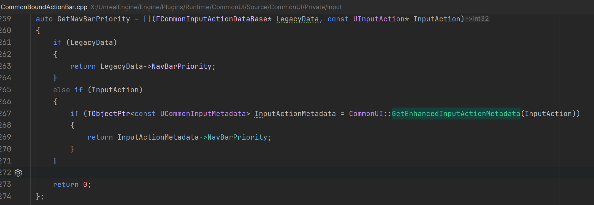 
- bIsGenericInputAction 如果是通用输入，则不会注入 普通enhanced input的逻辑，具体代码在 `auto TryConsumeInput = [&](const FKey& InKey, const UInputAction* InInputAction)`
    
    也就是widget里 自定义的enhanced input action不会被系统触发。
    

- 这里还有配置全局的默认值，也是非常重要不指定的话，就会采用默认值的设定：
  

综上，使用ActionBar 和 EnhancedInput 配置上面这两个字段还是非常重要的。 
bIsGenericInputAction默认值是true，会导致widget里普通的enhanced input 不绑定。

## 结合CommonUI 使用
知道了Metadata的作用，尝试和commonUI结合。
### UI优先级更高
先试试我比较在意的一种情况，同一个InputAction，都设置绑定的情况下，谁的优先级高？于是我准备这个例子：

 - 一个是CommonBaseButton的（代表Menu模式，可配置覆盖）
 - 一个是直接蓝图里的绑定，代表Game模式。 

把全局bIsGenericInputAction设置为false：


测试结果如图，即使是当前输入模式是Menu模式，因为该action的绑定没有“启用”，不会执行，当它会把控制权交给game模式执行，让原本game模式下的事件绑定，得到执行的机会。

**而如果是“启用”，并且是All模式或者Menu，那么UI优先，而Game那个绑定被忽略**。所以在All模式下，其实也可用把这里的“UI启用”，理解为“**UI占用**”。
（上面的调试信息，是通过控制台打开的。这两个都要设置为true）

保持默认行为，不要单独配置按钮的模式如下图。保持默认行为好理解，不然一套规则的排列组合下来，还是挺烦人的。


所以我的建议是“启用”默认还是打勾好，并且**遵从默认行为**：

 - 将直接在蓝图或者C++ 里绑定的Input Action，都视为Game Input
 - 将通过CommonUI 注册的 Input Action，都是视为Menu Input
 - 把默认HUD设置为ALL，让UI按键和游戏都能响应输入事件
 - 各种弹出菜单后，输入模式设置为Menu，屏蔽掉game输入。

### 占用问题
不同InputAction 可绑定相同的按键（KEY），Enhanced Input默认是不会占用的，都会执行：
例子,这两个IA都绑定了E 键：


它们都能输出。

但是，**一旦CommonUI注册了，就会直接占用该“KEY”**，假如此时新增一个IA_E2,也绑定“E”，并注册到一个按钮里，那么ALL模式下，这“E”键，就被UI完全占用了。

即使是bIsGenericInputAction没有启用, 也会完全占用“E”键。

即使是bIsGenericInputAction没有启用, 也会完全占用“E”键。 

即使是bIsGenericInputAction没有启用, 也会完全占用“E”键。

此时虽然绑定了三个不同的IA，但按下E，什么都不会发生，就像E键被扣掉了一样。  


---
部分源码研究 

## FActivatableTreeNode
> Activatable Widgets are abstracted as nodes in a tree using FActivatableRootNode. Nodes are arranged in a hierarchy based on the hierarchy of Activatable Widgets in the UI's widget tree. Parent nodes act as root nodes, while their children are considered child or leaf nodes. Refer to the CommonUI Overview for more information.

根据官方描述，所有Activatable Widgets会被抽象为树结构，进行节点排列。

相关继承关系如下：
`FActivatableTreeRoot -> FActivatableTreeNode -> FActionRouterBindingCollection`

### 创建节点
UCommonActivatableWidget 的任意一个子widget，只要调用的RegisterUIActionBinding，就会查找FActivatableTreeNode，把action绑定进该node, 并让UCommonActivatableWidget持有这个节点的引用。 RegisterUIActionBinding是利用这个树结构查找node
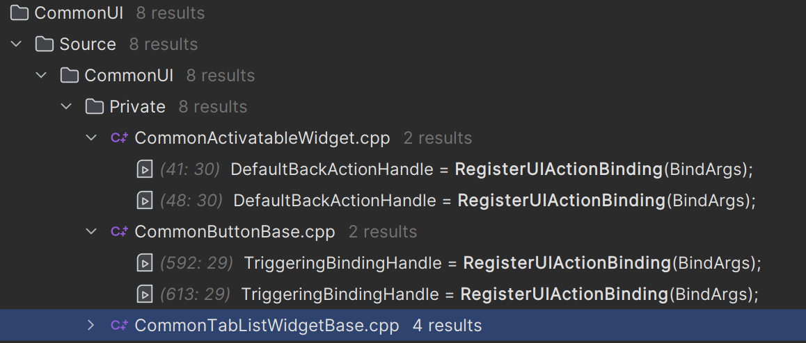
那么这些Node是何时创建的？
是在ProcessRebuiltWidgets里创建的，没有创建的，会在下一帧创建：

`UCommonUIActionRouterBase::ProcessRebuiltWidgets()`

- tree 根构造
  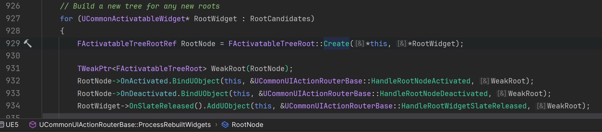


- tree添加子节点
  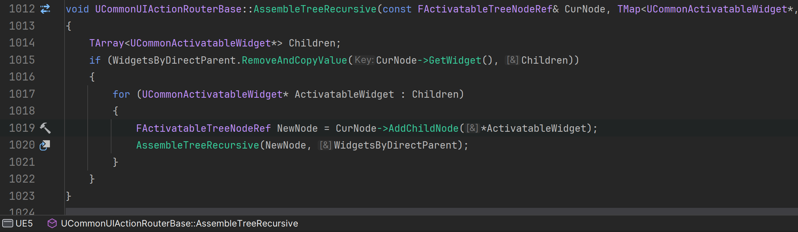
 
### LeafmostNode 最叶节点

   从代码上看，最叶节点，可以是本身（没有child），也可以是最边缘的节点。在视觉和逻辑层次上最靠近叶子节点的节点。通过 GetLastPaintLayer 来判断节点的层次，层次越大表示越靠近叶子节点   
     

根据Node改变FUIInputConfig,node 的input config 在这里切换


## Process Input
处理输入，就是通过节点树来处理的，只有激活的才有资格处理。
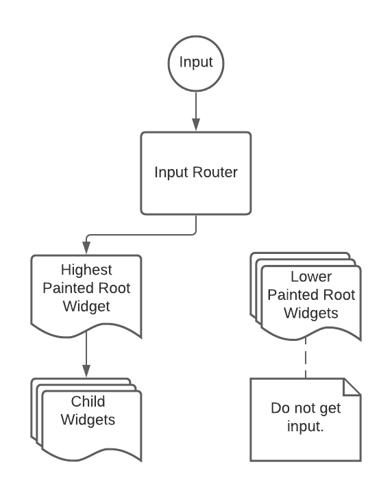
上面提到的TryConsumeInput是`FActionRouterBindingCollection::ProcessNormalInput`的临时内部函数，这里的处理比较复杂，尝试记录一下我的理解
### Input 的来源

Enhanced 默认调用链：

完全不同，UI事件注册的：
- 键盘输入：从application 一路去到 GameViewPort Client, 最终由 ActionRouter 进行最后的分发
  
- 鼠标输入：大致相同
  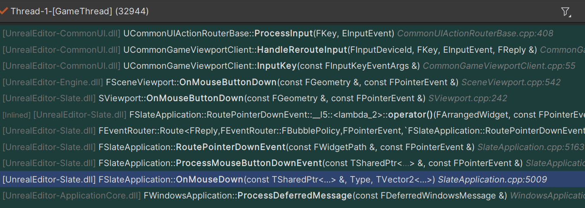
- 手柄输入：
  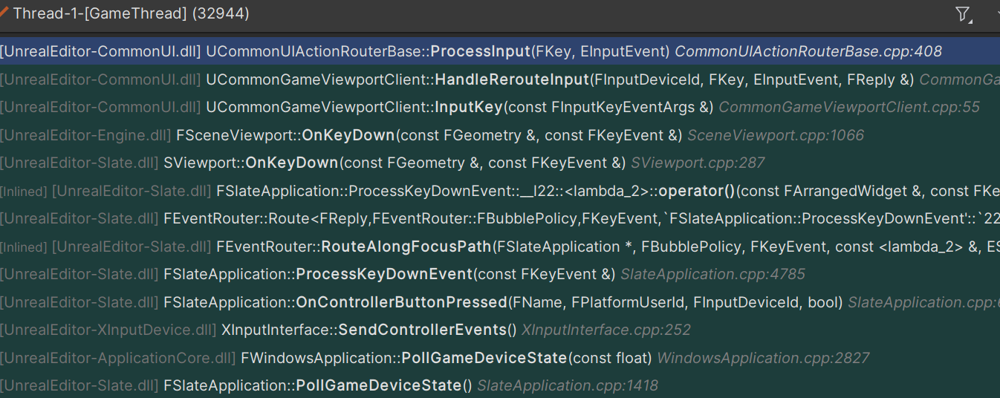

  参考官方图，简化流程：
  

## 输入预处理器
发现AnalogCursor的预处理权限很高，比如在Input Mode是Game的时候，手柄点击A按钮，会触发模拟的鼠标左键效果。这在TopDown类型的Game里面，非常没有必要。最好是只有InputMode是Menu是的时候，才模拟左键点击，才是合理的。

盲猜预处理各种Handle，返回true就是消费该事件，方法false就是让下一个预处理接管。


### AnalogCursor
默认的注册priority 是 2，在Project->Plugin-> CommonUI -> Analog 可用修改


### EnhancedInput 
hard coding -1， 这个是EnhancedInputWorldSubsystem，我的测试里，它没有调用。


### CommonInput 
hard coding 0，CommonInput内部会通过`Collection.InitializeDependency<UEnhancedInputLocalPlayerSubsystem>();`来初始化EnhancedInput，但EnhancedInput似乎并没有预处理器。
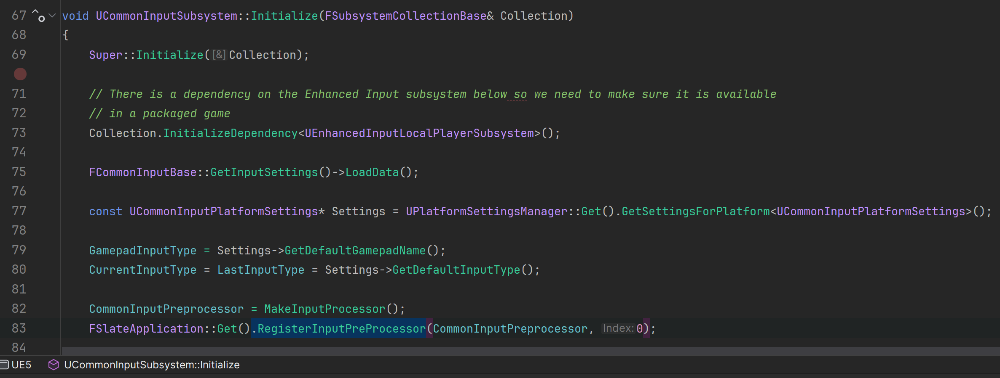

### AnalogCursor 自定义
发现确实AnalogCursor接管了 手柄的A按键。看样子，只能重写这个函数：

```cpp title='FCommonAnalogCursor.cpp'
bool FCommonAnalogCursor::IsRelevantInput(const FKeyEvent& KeyEvent) const
{
	return IsUsingGamepad() && FAnalogCursor::IsRelevantInput(KeyEvent) && (IsGameViewportInFocusPathWithoutCapture() || (KeyEvent.GetKey() == EKeys::Virtual_Accept && CanReleaseMouseCapture()));
}
```
篇幅太长，[详见](./07CustomAnalogCursor.md)

---

### 开始处理

系统传给ActionRouter 的input是 KEY 值 和 InputEvent类型（按下，释放）， ActionRouter会结合当前的 ActiveMode（输入模式）进行处理。输入模式目前定义了3+1 种。

```cpp
enum class ECommonInputMode : uint8
{
	Menu	UMETA(Tooltip = "Input is received by the UI only"),
	Game	UMETA(Tooltip = "Input is received by the Game only"),
	All		UMETA(Tooltip = "Input is received by UI and the Game"),

	MAX UMETA(Hidden)
};
```

ActivatableWidget（通常是各种菜单的最外层）可以对InputConfig进行配置：这里配置的InputMode就是ECommonInputMode，从而影响 ActionRouter对事件的分发。参考[最叶节点](#leafmostnode-最叶节点)
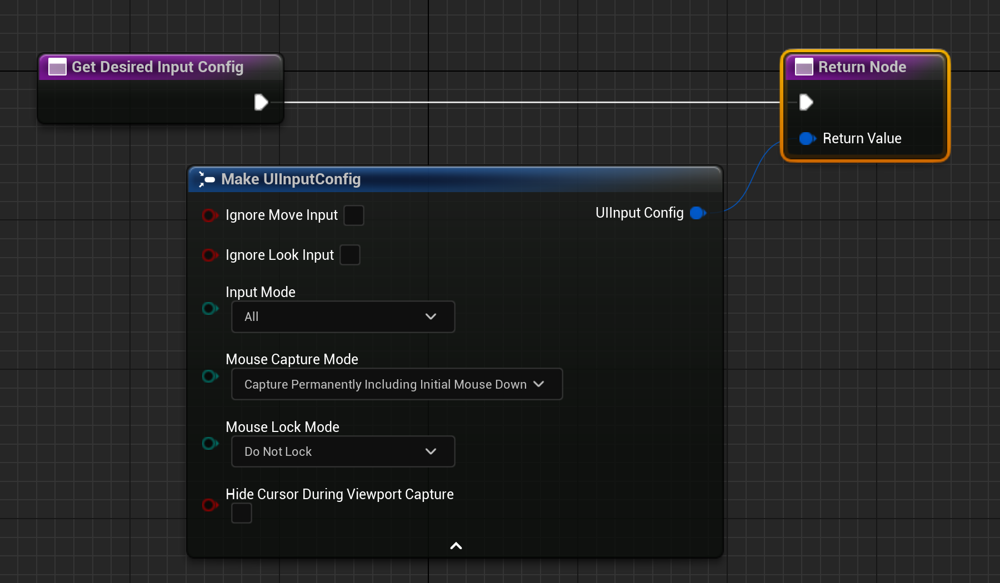

另外，CommonBaseButton 可以对自身绑定的InputMode进行覆盖


可以看到，处理输入时，是根据当前InputMode是否匹配，才会进行处理。如果输入不起作用，很可能是Mode没有设置正确。

```cpp
EProcessHoldActionResult FActionRouterBindingCollection::ProcessHoldInput(ECommonInputMode ActiveInputMode, FKey Key, EInputEvent InputEvent) const
{
	for (FUIActionBindingHandle BindingHandle : ActionBindings)
	{
		if (TSharedPtr<FUIActionBinding> Binding = FUIActionBinding::FindBinding(BindingHandle))
		{
			if (ActiveInputMode == ECommonInputMode::All || ActiveInputMode == Binding->InputMode)

```
每当 ActionRouter Tick的时候，会判断是否有pending Widget 需要注册事件。支持 CommonInputAction的widget 都会在创建的时候，注册需要绑定的事件, 供ActionRouter在tick的时候进行绑定。
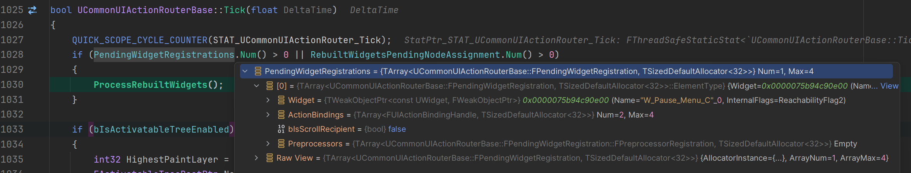
按下按键的时候，由ViewPort接受事件，调用ActionRouter进行处理 `UCommonGameViewportClient::HandleRerouteInput`

绑定的事件，最终在Process Input细分，优先处理HoldInput，然后才是normal Input， 逐层handle，逐层消费。
PersistentActions的处理优先级最高，然后才是ActiveRootNode（它是一个FActivatableTreeNode : public FActionRouterBindingCollection）,接着是domain，这个不是enhanced input，不讨论。


 Press和 Release的Input Action 大体上相同，只是入口不一样，下图是Pressed 和 Relased最开始的地方。调用ProcessKeyDownEvent 和 ProcessKeyUpEvent 分别处理。

不同之处在于，Release阶段 还有后续处理，依旧是用ProcessInput 细分处理。
`ActionRouter.ProcessInput(InKeyEvent.GetKey(), IE_Released) == ERouteUIInputResult::Handled`。如果结果是没有任何widget handle action，就会调用`FAnalogCursor::HandleKeyUpEvent(SlateApp, InKeyEvent);`构建虚拟鼠标事件。

### Hold Threshold
按住有个最小时间的设定，是写死的，默认是四分之一秒,否则就会要求下一步生成一个Press 事件

``` cpp
static const float PressToHoldThreshold = 0.25f;
if (SecondsHeld <= PressToHoldThreshold && SecondsHeld < HoldMapping.HoldTime)
{
    ProcessResult = EProcessHoldActionResult::GeneratePress;
}

```
### Hold Support
目前的代码，并不支持 Enhanced Input的Hold Action，
我这里进行的额外的[支持](./03Hold%20Support%20For%20Enhnaced%20Input.md)


### AnalogCursor 处理
这是一个模拟鼠标点击的工具
``` cpp
bool FCommonAnalogCursor::HandleKeyUpEvent(FSlateApplication& SlateApp, const FKeyEvent& InKeyEvent)

//最终通过
SlateApp.ProcessMouseButtonUpEvent(MouseEvent); //模拟

```
## 默认KEY

```cpp
/** Remap a given key to something else if necessary. */
	FORCEINLINE static FKey RemapKey(FKey Key) { return Key; }

	static FKey GetGamepadAcceptKey()
	{
		return EKeys::Gamepad_FaceButton_Bottom;
	}

	static FKey GetGamepadBackKey()
	{
		return EKeys::Gamepad_FaceButton_Right;
	}

	static FKey GetPlatformDeleteKey()
	{
		return EKeys::Delete;
	}
```
经过上面的分析得知，当Input（抬起key）没有任何 Widget 去Care的时候，会执行默认行为：
其中box手柄的 face button Bottom ，也就是A按钮，会构造一个鼠标左键行为（按下或者按住）。

所以，如果想要屏蔽默认的A键点击动作，有两个办法
- 处理这个A键，绑定它
- 改个isRepeat = true给它。
- 看起来可以 remap key, 但还没实现，知道的大佬分享一下：
    ``` cpp
    /** Remap a given key to something else if necessary. */
    FORCEINLINE static FKey RemapKey(FKey Key) { return Key; }
    ```

## 疑问 1
- 为什么修改了Enhance default Click Action ，只有图标改变，Action 还是 Faceb Button Bottom ? 
  
  因为 首先默认 GetGamepadAcceptKey 是写死的A，其次并没有显式注册  default Click Action
- 为什么图标更新了？这不是说明能拿到 default Click Action吗？
  因为 图标是CommonActionWidget 设置的，在CommonBaseButton Hovered的时候，会获取`HoverEnhancedInputAction = ICommonInputModule::GetSettings().GetEnhancedInputClickAction();`
  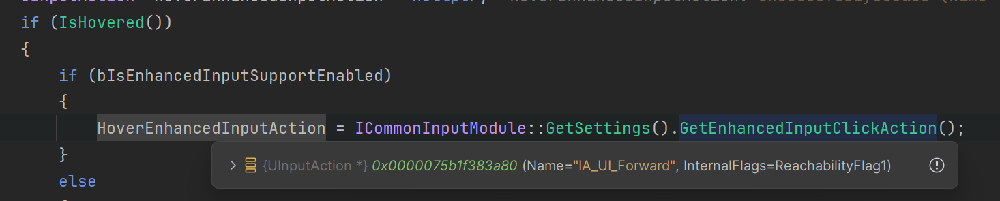
  这里只是为了设置Icon，并没有把绑定事件给Button

    BaseButton代码显示，它是通过判断IsHovered，来决定是否创建HoverEnhancedInputAction
    ```cpp
    UInputAction* HoverEnhancedInputAction = nullptr;
                if (IsHovered())
                {
                    if (bIsEnhancedInputSupportEnabled)
                    {
                        HoverEnhancedInputAction = ICommonInputModule::GetSettings().GetEnhancedInputClickAction();
                    }
                    else
                    {
                        HoverStateHandle = ICommonInputModule::GetSettings().GetDefaultClickAction();
                    }
                }
                //并设置给Icon Widget
                if (bIsEnhancedInputSupportEnabled)
                {
                    InputActionWidget->SetEnhancedInputAction(HoverEnhancedInputAction);
                }

    ```

    变通解法就是，在OnHovered 和 UnHoverd 获取 Action widget 的Enhanced Input，适当的时候手动绑定。和取消绑定。

## 疑问 2

- 为什么Enhanced Input 作为 Trigger Action的时候，Hold 无法正确生效？
    
    因为缺少HoldMapping，这里必须有HoldMapping，才会执行到for内部
    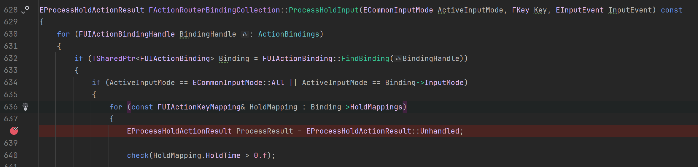
    
    然而在处理HoldMapping的时候，偏偏不处理Enhanced Input的。注释说，不在这里处理HoldMapping，但我没发现其他地方有给它设置。全局搜索都搜不到。
    ``` cpp title='UIActionRouterTypes.cpp'
    else if (CommonUI::IsEnhancedInputSupportEnabled() && BindArgs.InputAction.IsValid())
        {
            // Nothing else to do if we have an enhanced input action,
            // the input action itself will be queried against for keys later
        }
    ```
    一种解法是：用UIActionTag来解决，因为代码里会给有Tag的Action进行HoldMapping绑定。但Action要定义在这图里的设置里。而且根本不是enhanced input。
    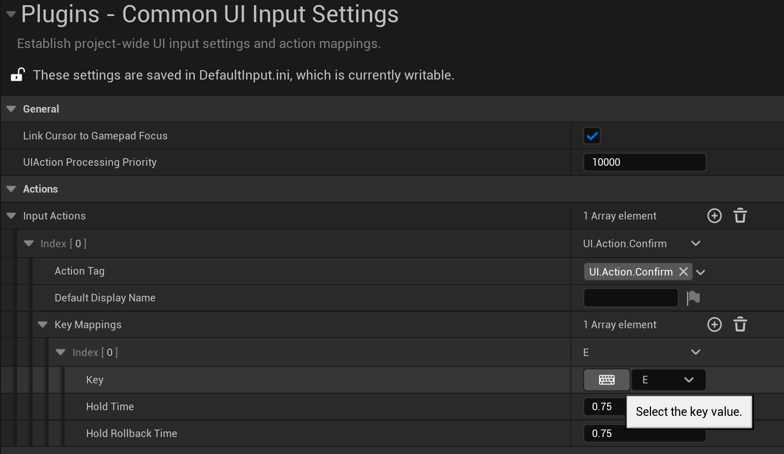

     我看到有人依旧提交了相关[Pull Request](https://github.com/EpicGames/UnrealEngine/pull/11985), 他的改动很多，感觉官方没那么快合并。

     我实现了一种不用修改源码的办法, [click here](./Hold%20Support%20For%20Enhnaced%20Input.md)
    
    前提是保证InputSystem->GetAllPlayerMappableActionKeyMappings() 已经有值，调用顺序不能错。
  
## 疑问 3

- 为什么 Enhanced trigger 的Pressed和 BaseButton 的 Pressed没有关联？ 也就是键盘 按下的时候，界面里 Button的 Pressed 并没有出现按下的状态？(默认点击按钮除外，face Button A 是构建虚拟鼠标按下)

    因为 它们不是双向关联的，目前的单向的。 我们给界面按钮 设置一个 Enhanced Trigger，我们把这个trigger当作一种快捷键的话，那么这个按钮在构建的时候，就会去绑定绑定这个快捷键的事件。但快捷键按下的时候，激活自身的点击事件。但这个点击事件，并不会激活stale 原始点击。猜测如果激活，可能导致死循环，因为原始点击事件 是用来 触发 按钮自身的点击事件的。
    目前没有好的办法，一种做法是 在 CommonBaseButton 的子类里，自己实现按住和抬起的 style 切换，比较麻烦。


