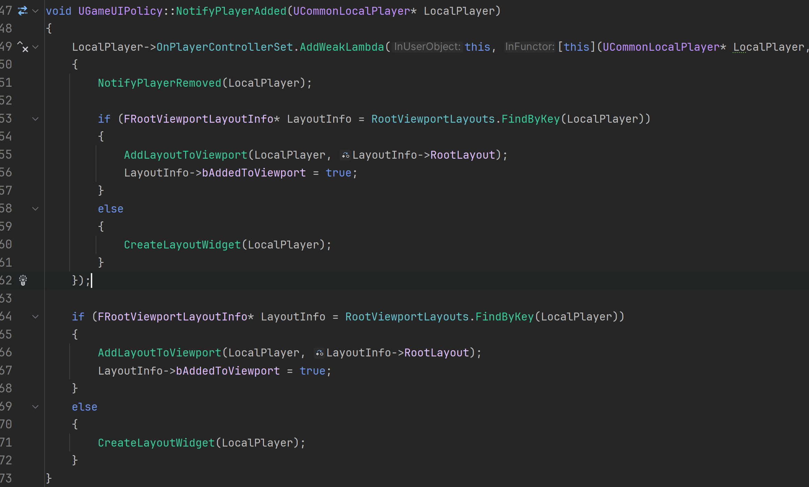
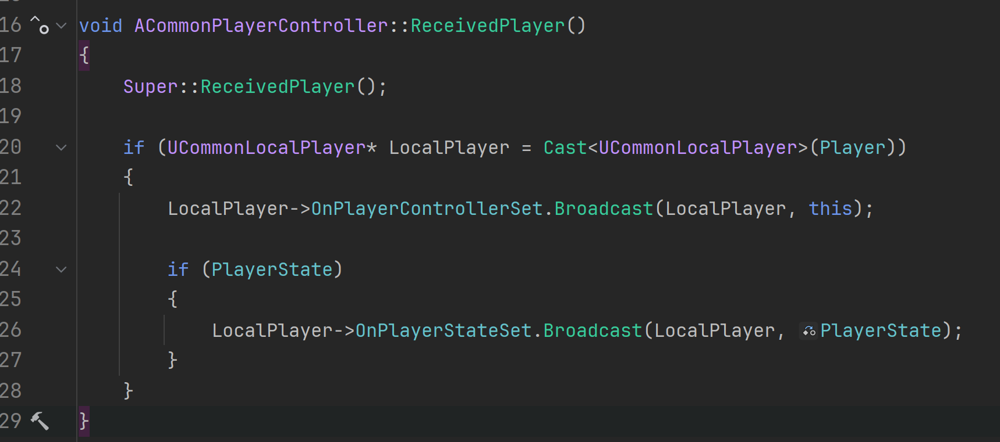
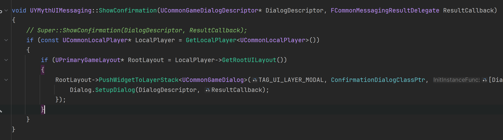

title:UE5 Lyra Dialog
comments:true

---


## Lyra Common Game Dialog

Lyra Game Dialog 的代码设计上看，它是一个为多人同屏设计的，类似双人成行那种同个屏幕，双人游玩。

大部分代码来自CommonGame 模块，而CommonGame 又需要引用CommonUser 模块 和 ModularGameplayActors 模块。

所以使用Lyra的Dialog，需要引用CommonGame，CommonUser，ModularGameplayActors这三个模块。

## 根布局添加过程

### 1. UCommonGameInstance

- 通过CommonGame 的 CommonGameInstance 通知新LocalPlayer 加入
  
- 告知 UGameUIManagerSubsystem  

### 2. UGameUIManagerSubsystem

这个类目前在我看来，有些鸡肋。可能需要一个管理全部布局的“层”做准备。

- UGameUIManagerSubsystem 用于管理 新的 LocalPlayer 的 UI
  
- 但它只负责管理，不负责实现，具体功能都在 UGameUIPolicy 里面。
- 需要配置 UGameUIPolicy 的蓝图子类。

### 3. UGameUIPolicy

- UGameUIPolicy 会给 LocalPlayer 注册一个OnPlayerControllerSet监听
  
- NotifyPlayerAdded 的意思是，新的LocalPlayer 加入，会去RootViewportLayouts数组里查找，没有就创建一个。
- FindByKey的原理是：`bool operator==(const ULocalPlayer* OtherLocalPlayer) const { return LocalPlayer == OtherLocalPlayer; }`
- PlayerController 接收到控制器时：
  
- 最终，创建的Widget一定是`UPrimaryGameLayout`的子类，这里的LayoutClass是需要配置的项。
  

### 4. UPrimaryGameLayout

PrimaryGameLayout 就是每个本地玩家的根布局，它提供Stack, 至于用多少层Stack,由开发者自己决定。关于Stack, 详见[这里](./CommonUI/00How%20to%20setup%20CommonUI%20in%20UE5.4.2.zh.md)

自此，每个本地玩家都会有一个RootLayout

### 5.Lyra的 UGameUIManagerSubsystem

Lyra的 UGameUIManagerSubsystem 子类还做了一件事，每次tick 都检查要不要隐藏根布局。这里大概就是告诉开发者，用它可以做最顶层UI的事情。

---

## 弹出对话框

### 1. UAsyncAction_ShowConfirmation

Lyra 的弹窗是通过异步Action 来进行的。。

这个异步本质上是查找本地玩家并获得它的消息系统，并不是实现弹窗。

- Lyra 弹窗采取的是异步操作，UAsyncAction_ShowConfirmation继承UBlueprintAsyncActionBase
- 这个异步里，会用各种方式尝试获得对应的LocalPlayer
- 然后通过LocalPlayer获得UCommonMessagingSubsystem
- 最终调用UCommonMessagingSubsystem的ShowConfirmation
  

### 2. UCommonMessagingSubsystem

这是个子系统，实际上是个接口，它提供了ShowConfirmation这类方法的空实现。具体实现需要开发者继承它。其中`FCommonMessagingResultDelegate` 这个回调也被传递进来， 用于告知异步操作的结果。该消息子系统也不是弹出的具体实现位置，它只负责创建布局。先获得对应的根布局，也就是之前创建的`UPrimaryGameLayout`，然后实例化弹窗的Widget，把它push到根布局的Stack里面。

- 子系统是最外层自动实例化的，所以不需要手动实例化。
- 需要开发者配置 弹窗的Widget的class，必须继承于`UCommonGameDialog`.
- 获取根布局，并传入Dialog构造器`UCommonGameDialogDescriptor`和委托：
  


### 3. UCommonGameDialogDescriptor

弹窗构造器，包含Header,Body 还有Action数组(也就是按钮数组)。

- FConfirmationDialogAction，定义按钮类型是确定还是取消，还用按钮的Label
- 默认提供了4个弹窗类型构造方法。

### 4. UCommonGameDialog

弹窗的真正实现，`SetupDialog`用于准备整个弹窗的UI。SetupDialog上面提到的`UCommonMessagingSubsystem`来调用。

- Lyra 的实现例子：`ULyraConfirmationScreen`

    ```cpp
    void ULyraConfirmationScreen::SetupDialog(UCommonGameDialogDescriptor* Descriptor, FCommonMessagingResultDelegate ResultCallback)
    {
        Super::SetupDialog(Descriptor, ResultCallback);

        Text_Title->SetText(Descriptor->Header);
        RichText_Description->SetText(Descriptor->Body);

        EntryBox_Buttons->Reset<ULyraButtonBase>([](ULyraButtonBase& Button)
        {
            Button.OnClicked().Clear();
        });

        for (const FConfirmationDialogAction& Action : Descriptor->ButtonActions)
        {
            FDataTableRowHandle ActionRow;

            switch(Action.Result)
            {
                case ECommonMessagingResult::Confirmed:
                    ActionRow = ICommonInputModule::GetSettings().GetDefaultClickAction();
                    break;
                case ECommonMessagingResult::Declined:
                    ActionRow = ICommonInputModule::GetSettings().GetDefaultBackAction();
                    break;
                case ECommonMessagingResult::Cancelled:
                    ActionRow = CancelAction;
                    break;
                default:
                    ensure(false);
                    continue;
            }

            ULyraButtonBase* Button = EntryBox_Buttons->CreateEntry<ULyraButtonBase>();
            Button->SetTriggeringInputAction(ActionRow);
            Button->OnClicked().AddUObject(this, &ThisClass::CloseConfirmationWindow, Action.Result);
            Button->SetButtonText(Action.OptionalDisplayText);
        }

        OnResultCallback = ResultCallback;
    }
    ```
- Lyra动态创建了全部按钮，然后设置了委托并都绑定了同一个`CloseConfirmationWindow`关闭弹窗。
- 最后，蓝图可以根据`CloseConfirmationWindow`传递过来的`ECommonMessagingResult`来做相应的处理。