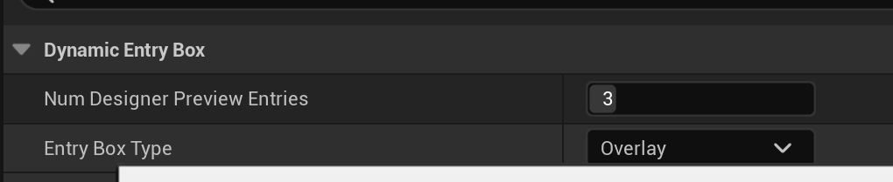
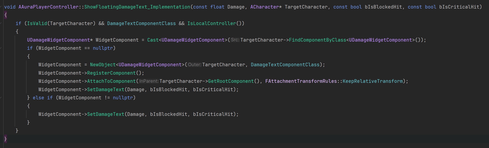

title: Using Engine built-in Widget Pool
comments:true

!!! note 
    this post is base on Aura GAS Course
    
---

 

I found a built-in widget pool in the UE source code, so I think we can use it for the **Aura Damage Floating Tex**. Because in some scenarios, characters may create a lot of floating widgets and then just remove them, which could cause a slight performance loss.

（Widget pool may offer minimal performance improvement, making it challenging to provide a quantitative comparison. Please carefully consider whether you need to utilize it.）

### Scenario
Too many floating texts are being created and destroyed at the same time.
 


### Main Functions
DynamicEntryBox(5.2-5.4)

``` cpp
UUserWidget* NewEntryWidget = EntryWidgetPool.GetOrCreateInstance(InEntryClass);

```

This is a piece of code from UDynamicEntryBox, showing us how to use a widget pool. We can use UDynamicEntryBox in Blueprint directly, without writing any C++. UDynamicEntryBox provides these two main functions to create and release widget entities:

- BP_CreateEntry: Retrieves or creates a widget entity.
    ``` cpp
        UFUNCTION(BlueprintCallable, Category = DynamicEntryBox, meta = (DisplayName = "Create Entry", AllowPrivateAccess = true))
        UMG_API UUserWidget* BP_CreateEntry();

    ```
- RemoveEntry: Releases the entity when not in use, removes it from the parent, but caches it for re-use.
    ``` cpp
        UFUNCTION(BlueprintCallable, Category = DynamicEntryBox)
        UMG_API void RemoveEntry(UUserWidget* EntryWidget);

    ```
    
### Blueprint
- create a UserWdiget, place a DynamicEntryWidget


- set the box type to overlay

- set the aura floating text widget class


### CPP
- Update AuraPlayerController, Update AuraPlayerController, no need to create and remove WidgetComponent anymore.


- Since it's difficult to notify DynamicBox to release the widget after the animation ends in Blueprint, I tried but found it challenging, so I switched to implementing it in C++ . I **Update UDamageTextComponent** like so:
 
  Make sure the log doesn't keep increasing in size. If it does, then the configuration is correct. Otherwise, it means new entries are being created continuously.

- Attention, the instances of DynamicBox will be automatically destroyed when the reference count drops to 0 upon the death of the character. If you have other references to the floating widget elsewhere, you may need to manually clean them up.


### Usage
  

### Other
The DynamicBox has some other interesting features, such as radial.

