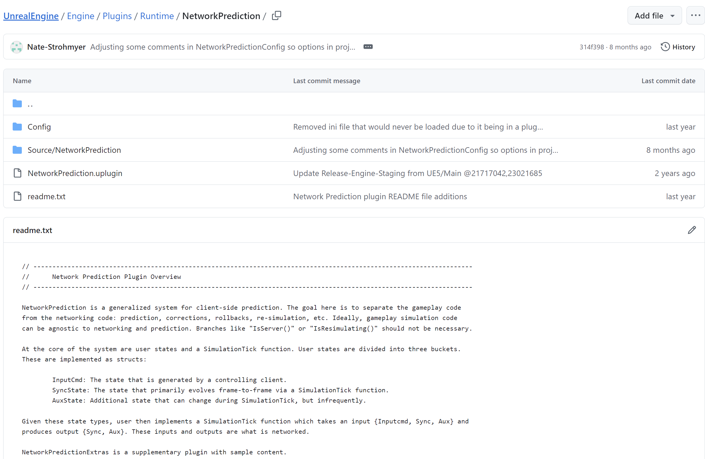

title: Replication
comments:true

### Network Prediction plugin

从提交记录上看，该插件2021年已经停更，后面的都是小改动。主程序员(Dave Ratti)已经离职epic.

NP插件需要和Mover 2.0 配合使用会比较好。

GAS  和 CMC 都和 NP 不太兼容，必须考虑 NP 插件中存在的缓冲时间。如果不这样做，所有 CMC/GAS 功能的执行速度都会比 NP 代码更快，并且您将看到明显的执行延迟。

The Network Prediction plugin (which can also be found in Engine/Plugins/Runtime/NetworkPrediction) – Sign up here if you don’t have Git access – is available in a default Unreal Engine installation but is still experimental at the time of writing this article and progress has been halted due to the main programmer (Dave Ratti) no longer working at Epic. Through personal extensive testing it is in a good state to be used though and solves a few of the issues mentioned here such as packet buffering/ordering, client/server frame syncing and desync/reconciling tools along with providing some other nice to have features. Epic have mentioned on UDN that they’re still working on a version of the Character Movement Component which is compatible with the NP plugin but it is yet to be announced (It might be the Mover 2.0 component?). It’s also worth mentioning that if you’re using the Gameplay Ability System in your project it will also not be compatible and you’ll have to create your own alternative using the NP plugin if you want accurate results.

Note: If you do try to use this plugin alongside GAS or CMC you’ll have to account for the buffer time which exists in the NP plugin. If you don’t all CMC/GAS functionality will execute sooner than NP code and you’ll see a visible delay in execution.

[source](https://www.kierannewland.co.uk/the-problems-with-unreal-engines-default-networking/)

[Using The Network Prediction Plugin In Unreal
](https://www.kierannewland.co.uk/using-the-network-prediction-plugin/)

### Iris

Iris 复制系统对比旧复制系统，性能更好，拓展性更强，维护更容易。

在大量玩家的游戏里，他对服务端更加友好，内存占用减少，能支持更多的玩家。

官方建议尽可能避免创建自定义序列化程序，因为未来的Iris版本可能会提供更详细的属性来描述如何复制属性，包括要使用的序列化程序、该序列化程序的参数以及复制条件。

It is recommended to avoid creating custom serializers when possible. A planned feature for Iris is to provide more detailed attributes to describe how properties are replicated, including which serializer to use, parameters for that serializer, and replication conditions. The goal is to give projects greater control over their replicated data without the need to write custom serializers, as well as allowing for features such as delta compression to be automatically supported.

[source](https://dev.epicgames.com/community/learning/tutorials/z08b/unreal-engine-iris-faq)

### GAS Prediction

Dave Ratti 在2019年回答了GAS存在的一些问题，这里是第8个提问和回答。他认为GAS已经非常稳定，当前版本的GAS不会有大改动。长远地看，如果有V2版本将会统一客户端预测，比如CMC；支持GE移除的预测，支持延迟高延迟的GE重新对账；优化RPC网络数据，把堡垒之夜中进行了大量优化带给UE。

21年左右Dave Ratti已经离职。

目前的情况，现在还有2个月就2025了，Mover 2.0 应该是新的CMC，还是实验性；NP插件是beta 版本。
Iris 在5.4 中仍将标记为实验性。GAS没啥新的动静，估计等待上面这些大哥稳定，才会有有改动吧。

What is Epic’s roadmap for the GameplayAbilitySystem plugin? Which features does
Epic plan to add in 2019 and beyond?

>We feel that overall the system is pretty stable at this point and we don’t have anyone working
on major new features. Bug fixes and small improvements occasionally are made for Fortnite or
from UDN/pull requests, but that is it right now.
Longer term, I think we will eventually do a “V2” or some big changes. We learned a lot from
writing this system and feel we got a lot right and a lot wrong. I would love a chance to correct
those mistakes and improve some of the fatal flaws that were pointed out above.
If a V2 was to ever come, providing an upgrade path would be of utmost importance. We would
never make a V2 and leave Fortnite on V1 forever: there would be some path or procedures
that would automatically migrate as much as possible, though there would still almost certainly
be some manual remaking required.
The high priority fixes would be:
● Better interoperability with the character movement system. Unifying client prediction.
● GE removal prediction (question #4)
● GE latency reconciliation (question #8)
● Generalized network optimizations such as batching RPCs and proxy structures. Mostly
the stuff that we’ve done for Fortnite but find ways to break it down into more
generalized form, at least so that games can write their own game specific optimizations
more easily.
The more general refactor type of changes I would consider making:
● I would like to look at fundamentally moving away from having GEs reference
spreadsheet values directly, instead they would be able to emit parameters and those
parameters could be filled by some higher level object that is bound to spreadsheet
values. The problem with the current model is that GEs become unsharable due to their
tight coupling with the curve table rows. I think a generalized system for
parameterization could be written and be the underpinning of a V2 system.
● Reduce number of “policies” on UGameplayAbility. I would remove ReplicationPolicy
InstancingPolicy. Replication is, imo, almost never actually needed and causes
confusion. InstancingPolicy should be replaced instead by making
FGameplayAbilitySpec a UObject that can be subclassed. This should have been the
“non instantiated ability object” that has events and is blueprintable. The
UGameplayAbility should be the “instanced per execution” object. It could be optional if
you need to actually instantiate: instead “non instanced” abilities would be implemented
via the new UGameplayAbilitySpec object.
● The system should provide more “middle level” constructs such as “filtered GE
application container” (data drive what GEs to apply to which actors with higher level
gameplay logic), “Overlapping volume support” (apply the “Filtered GE application
container” based on collision primitive overlap events), etc.These are building blocks that
every project ends up implementing in their own way. Getting them right is non trivial so I
think we should do a better job providing some basic implementations.
● In general, reducing boilerplate needed to get your project up and running. Possibly a
separate module “Ex library” or whatever that could provide things like passive abilities
or basic hitscan weapons out of the box. This module would be optional but would get
you up and running quickly.
● I would like to move GameplayCues to a separate module that is not coupled with the
ability system. I think there are a lot of improvements that could be made here.
This is only my personal opinion and not a commitment from anyone. I think the most realistic
course of action will be as new engine tech initiatives come through, the ability system will need
to be updated and that will be a time to do this sort of thing. These initiatives could be related to
scripting, networking, or physics/character movement. This is all very far looking ahead though
so I cannot give commitments or estimates on timelines.